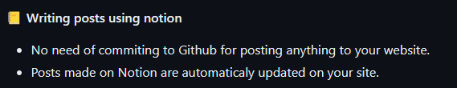

---
tags:
  - Blogging
  - Hobby
update: "2024-01-31"
date: "2023-08-18"
상태: "Ready"
title: "MORETHAN-LOG 설치"
---
개발자로서 어엿한 블로그 하나는 있어야 하지 않을까, 생각을 항상 하곤 했다.  

하지만 블로그라는게 여간 귀찮은 일이 아니다.  공부한 내용을 노션에 적어두기 시작한지 좀 됐는데, 티스토리나 velog나 여러 방법을 시도한적이 있었지만 노션에 적은 내용을 거기로 옮기는게 얼마나 귀찮은지, 시작은 해도 도무지 꾸준히 이어할 수가 없었다. 

그냥 언젠가 노션에 쓰기만 하면 블로그가 되는게 없나 그냥 가끔 검색만 하는 정도였는데, 어느샌가 나온 것이다. 그런 천지개벽할 물건이. 



커밋할 필요도, 포스트 할 필요도 없다. 단지 노션에 글을 적으면 바로 포스팅 된다. 

게다가 Readme에 설치방법이 10단계로 스크린샷까지 동봉되어서 너무나 친절하게 나와있다. 

[https://github.com/morethanmin/morethan-log#readme](https://github.com/morethanmin/morethan-log#readme)


블로그로 대성하겠다, 이런 마음가짐은 없기 때문에 심플한 구성과 간단한 기능이 너무 마음에 들었다. 누구나 따라할 수 있을 만큼 쉽게 되어있기 때문에 그대로 그대로 따라하는데,

```javascript
Failed to compile.
./src/routes/Detail/PostDetail/CommentBox/Utterances.tsx:28:11
Type error: Type '{ repo: string | undefined; "issue-term": string; label: string; }' is not assignable to type '{ [key: string]: string; }'.
  Property 'repo' is incompatible with index signature.
    Type 'string | undefined' is not assignable to type 'string'.
      Type 'undefined' is not assignable to type 'string'.
  26 |     script.setAttribute("issue-term", issueTerm)
  27 |     script.setAttribute("theme", theme)
> 28 |     const config: { [key: string]: string } = CONFIG.utterances.config
     |           ^
  29 |     Object.keys(config).forEach((key) => {
  30 |       script.setAttribute(key, config[key])
  31 |     })
error Command failed with exit code 1.
info Visit https://yarnpkg.com/en/docs/cli/run for documentation about this command.
Error: Command "yarn run build" exited with 1
```

글쎄 대체 나만 Deploy가 안되는것이다. 

ISSUE에 나와 같은 오류를 겪은 외국인이 한 명 더 있었는데, 다른 플랫폼으로 갈아탄 모양인지 해결방법은 적혀있지 않았다. 

타입스크립트, 리액트는 처음이었기 때문에 정확히 알 수 없었는데, site.config.js 의 utterances-config 의 값을 가져올 때 오류가 나는 것이라고 짐작을 할 수 있었기 때문에 해당 부분을 챗지피티의 도움을 받아 코드를 수정했다. 

```typescript
const config: { [key: string]: string } = Object.entries(CONFIG.utterances.config)
  .filter(([_, value]) => value !== undefined)
  .reduce((acc, [key, value]) => ({ ...acc, [key]: value }), {});
```

이렇게 하여, 무사히 deploy를 마치고 블로그 포스팅에 성공한것이다. 


문제는 여기서 끝나지 않았는데 노션에 글을 써도 도무지 블로그에 새로운 글이 포스팅되지 않았다. 

이것 때문에 잠도 못자고 설쳐가면서 새벽에 새로고침을 해보기도 했는데 자고 일어나도 되어있지 않았다. 


결론부터 이야기하자면, 아무것도 오류는 아니었다. 

[https://vercel.com/docs/functions/serverless-functions](https://vercel.com/docs/functions/serverless-functions)

vercel의 Serverless Functions 기능은 모든 plan에서 이용가능하며, 이 기능을 이용해서 Notion API를 활용해서 글 내용을 불러오도록 되어있었다. 

site.config.js를 확인하면 revalidateTime 변수가 있는데 처음에는 이 값이 42시간(!)으로 설정되어있었으므로, 이를 임의로 1시간으로 수정해주었다. 

성격이 급해서 1시간 단위로 갱신되게 해두었는데, 지금 와서 생각해보면 굳이 1시간일 필요도 없다는 생각이 든다. 

