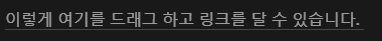

---
tags:
  - Blogging
  - Typescript
  - Hobby
  - Notion-API
description: "내실 다지기 - 유지보수 내역 기록"
series: "GitHub Pages와 Notion API 연동"
update: "2024-01-31"
date: "2024-01-29"
상태: "Ready"
title: "NotionAPI를 활용한 자동 포스팅(6)"
---
기능 구현이 거의 다 되었기 때문에, 오늘은 일단 짜잘짜잘한 오류 수정을 진행했다. 

## 유지보수 내역

### Front Matter-프로퍼티 연계 수정

프로퍼티가 Front Matter에 추가되는데, 값이 빈 것도 추가되어서 제대로 필터링 되지 않는 문제가 있었다. 값이 존재하는 프로퍼티만 Front Matter에 추가되도록 수정해주었다. 

추가로, 프로퍼티가 고정값이 아니라 커스텀에 따라서 유연하게 대응해 Front Matter에 추가되도록 해주었다. 

### 줄바꿈 주의!

마크다운은 기본적으로 엔터를 두 번씩 쳐야 줄바꿈이 되는 모양이다. 리스트 컨버터 일부에 줄바꿈이 하나만 들어가있던 것을 두 개가 들어가도록 수정해주었다. 

### 이미지 다운로드 안되는 현상

분명 동기적으로 작동하게끔 짜놓았는데도 불구하고 이미지가 제대로 들어가지 않는 현상이 있었다.  axios 재시도 패키지를 설치하고, 재시도 로직을 추가하고 타임아웃 10초 설정도 해주었다. 뭐가 문제였는지는 정확히 파악이 안됐는데, (오류 로그조차 없었다) 일단 이 이후로는 이미지 다운로드에 실패하는 현상은 없다. 

추가로, 이미지 다운로드 시에도 디렉토리가 없다면 만들도록 해주었다. 

### 스타일이 두 개 적용된 경우 

스타일이 두 개가 적용된 경우는 더 띄어쓰기에 민감했다. 

```plain text
*~~안녕하세요 ~~*
```

처럼 애매하게 띄어쓰기가 들어가면 하나만 적용된다. 

그래서 스타일이 있는 경우에는 공백을 제거 한 후에, 스타일을 붙이고 다시 스타일 뒤로 공백을 붙여서 자연스럽게 포맷이 유지되도록 수정해주었다. 

### ImageCounter 변수 수정

이미지가 디렉토리가 변경되어도 숫자가 계속 늘어나는 현상을 겪었는데… 멍청하게 내가 이미지 카운터를 static 변수로 선언해서 모든 인스턴스가 값을 공유하고 있는 것 뿐이었다. 바로 인스턴스 변수로 변경 해주었다. 

### 멘션 링크 이후 줄바꿈 문제 해결

멘션 링크를 북마크로 바꿔주는 메소드에 줄바꿈이 고정되어있어서, paragraph 안에 들어가 있는 멘션의 경우에도 줄바꿈이 들어가버렸다. 번거롭지만, 메소드를 수정해서 리스트로 처리되는 경우에만 줄바꿈이 들어가도록 수정해주었다. 

### notion url만 주어지는 경우

노션의 페이지 링크를 따온 다음에, 아무 글자 또는 문장을 드래그 하고 붙여넣기 하면 해당 글자 또는 문장에 페이지 링크로 연결되는 북마크가 생성된다. 


근데 애석하게도 이 링크는 단순히 32자리 문자열만 가지고 있다. (페이지의 아이디가 아니다). 따라서 해당 경우에는 북마크를 연결할 수가 없었다… 

인 줄 알았는데, 32자리인게 이상해서 혹시나 해서 UUID 형식으로 변환해봤더니 그게 내부 페이지의 아이디였다. 그러니까, 각 블록의 아이디가 UUID로 주어지는데 거기에서 하이픈만 제외하고 내부 URL로 사용중이었던 것이다. 

얼씨구나~ 하고 바로 해당 케이스도 북마크 기능으로 연결해주었다. 

### URL 형식 변경

예를 들어 `노션 소개 페이지` 라는 타이틀을 `노션소개페이지` 로 변환해서 URL로 사용하고 있었는데, 공백을 완전히 제거하는 대신 하이픈을 넣도록 수정해주었다. 

## 다음 단계는? 

이제 다음 단계는 자동화가 목적이다. 어느정도 기능 구현은 90프로 이상 됐다고 생각하고, 당장 내가 블로그 글을 쓰는데 큰 문제가 없어보인다. 이제 github.io와 합쳐서 실질적인 사용이 가능하도록 해보려고 한다!

