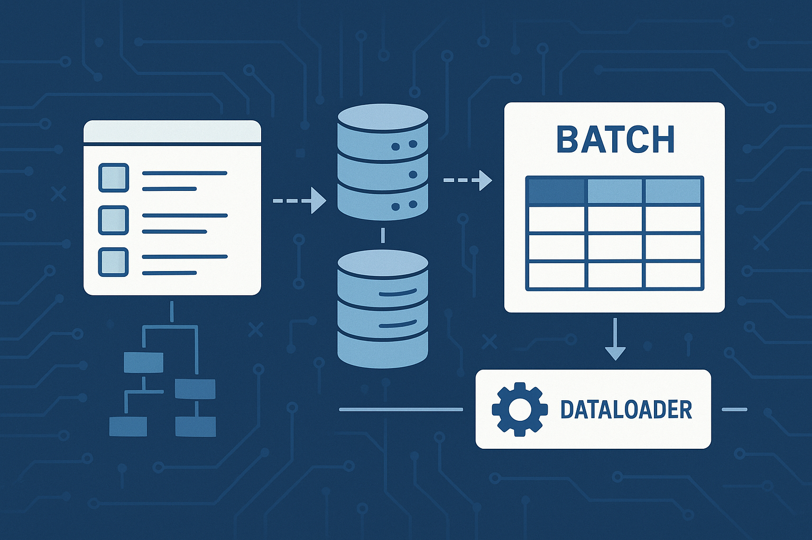

## 서론

Django와 GraphQL을 함께 사용하면서 성능 문제를 마주했습니다. Contract 모델의 리스트를 조회할 때, 각 Contract의 @property들이 개별적으로 데이터베이스 쿼리를 실행하면서 전형적인 N+1 문제가 발생했습니다. 이 문제를 해결하기 위한 여정과, 그 끝에서 발견한 표준 해결책을 공유하고자 합니다.

## **문제 상황**

다음과 같은 Contract 모델이 있습니다.

```python
class Contract(models.Model):
    id = models.UUIDField(primary_key=True, default=uuid.uuid4)
    contract_number = models.CharField(max_length=20)
    user = models.ForeignKey(User, on_delete=models.CASCADE)

    @cached_property
    def last_order(self) -> str | None:
        # 데이터베이스 쿼리 발생
        try:
            return serialize_model_to_json(self.contract_orders.latest("created_at"))
        except:
            return None

    @cached_property
    def first_order(self) -> str | None:
        # 데이터베이스 쿼리 발생
        events = Event.objects.filter(account_alias=self.account_alias)
        if events.exists():
            return json.dumps(serialize_model_to_dict(events.earliest("created_at")))
        return None
```

이를 호출하기 위한 GraphQL 쿼리는 다음과 같습니다.

```graphql
query {
  contracts {
    results {
      id
      contractNumber
      lastOrder     # N+1 문제 발생
      firstOrder    # N+1 문제 발생
    }
    totalCount
  }
}
```

### **문제점**

100개의 Contract를 조회하면 1 + 100 + 100 = 201개의 쿼리가 실행됩니다.

## **내 아이디어: “시점 제어를 통한 Prefetch”**

N+1 문제의 핵심은 개별 resolver가 실행되는 시점에 있다고 생각했습니다.

GraphQL의 실행 순서를 분석해보니,

1. contracts resolver 실행 → Contract 리스트 생성

1. 각 Contract 인스턴스의 property resolver들이 개별 실행

    - contract1.last\_order → DB 쿼리 (1)

    - contract2.last\_order → DB 쿼리 (2)

    - contract3.last\_order → DB 쿼리 (3)

    - …

### **핵심 아이디어 및 구현**


        Contract 리스트가 결정되는 시점과 각 property resolver가 실행되는 시점 사이에서 모든 관련 데이터를 미리 가져오자!

#### **구현**

```python
def contracts_resolver(self, info, **kwargs):
    contracts = Contract.objects.all()[:100]

    contract_ids = [c.id for c in contracts]
    prefetch_data = batch_prefetch_contract_data(contract_ids)

    info.context.prefetch_cache = prefetch_data
    return contracts

def batch_prefetch_contract_data(contract_ids):
    data = {}

    orders = Order.objects.filter(
        order_item__id__in=contract_ids
    ).order_by('-created_at')

    data['orders'] = defaultdict(list)
    for order in orders:
        data['orders'][order.order_item.id].append(order)

    events = Event.objects.filter(
        account_alias__id__in=contract_ids
    ).order_by('created_at')

    data['events'] = defaultdict(list)
    for event in events:
        data['events'][event.account_alias.id].append(event)

    return data
```

@cached\_property에서 context의 prefetch 캐시를 활용합니다. 

```python
@cached_property
def last_order(self) -> str | None:
    if hasattr(info.context, 'prefetch_cache'):
        orders = info.context.prefetch_cache['orders'].get(self.id, [])
        if orders:
            return serialize_model_to_json(orders[0])

    return serialize_model_to_json(self.contract_orders.latest("created_at"))
```

이 방식으로 201개 쿼리를 3개 쿼리로 줄일 수 있습니다!

## **표준 해결책 조사: DataLoader**

저는 항상 필요다하면 이미 만들어져있다고 생각합니다. 이번에도 제 아이디어가 유효한지 확인하기 위해 표준 해결책을 조사했습니다. Facebook에서 만든 [DataLoader](https://github.com/graphql/dataloader) 가 정확히 같은 아이디어를 구현한 라이브러리였습니다.

### **DataLoader의 핵심 개념**

1. 키 수집 (Batching): 여러 요청의 키들을 자동 수집

1. 배치 로딩: 모은 키들로 한번에 데이터 조회

1. 캐싱: 같은 요청은 캐시에서 반환

### **내 아이디어 vs DataLoader**

| **항목** | **내 아이디어** | **DataLoader** |
| --- | --- | --- |
| 키 수집 | Contract 리스트에서 수동 수집 | Event loop에서 자동 수집 |
| 배치 로딩 | batch_prefetch_contract_data() | batch_load_fn() |
| 캐싱 | Context에 수동 저장 | 자동 캐싱 |
| 실행 시점 제어 | 즉시 실행 | 지연 실행 (deferred batching) |

핵심 아이디어는 동일하지만, DataLoader가 더 완성도가 높고 확장성 높은 방식이었습니다. 무엇보다 표준 방식이 있다면 제 아이디어를 쓸 이유가 없습니다. 이미 추가로 필요한 부분도 구현되어 있을 것이며, 공통된 라이브러리를 사용하는게 협업에 있어서 비교할수도 없이 효율적이기 때문입니다. 

## **DataLoader 구현 예제**

### **1. DataLoader 클래스 정의**

```python
from promise.dataloader import DataLoader
from collections import defaultdict

class ContractOrdersLoader(DataLoader):
    def batch_load_fn(self, contract_ids):
        orders_by_contract = defaultdict(list)

        orders = Order.objects.filter(
            order_item__id__in=contract_ids
        ).select_related('order_item').order_by('-created_at')

        for order in orders:
            orders_by_contract[order.order_item.id].append(order)

        return Promise.resolve([
            orders_by_contract.get(contract_id, [])
            for contract_id in contract_ids
        ])

class ContractEventsLoader(DataLoader):
    def batch_load_fn(self, contract_ids):
        events_by_contract = defaultdict(list)

        events = Event.objects.filter(
            account_alias__id__in=contract_ids
        ).select_related('account_alias').order_by('created_at')

        for event in events:
            events_by_contract[event.account_alias.id].append(event)

        return Promise.resolve([
            events_by_contract.get(contract_id, [])
            for contract_id in contract_ids
        ])
```

### **2. GraphQL Context에 DataLoader 주입**

```python
from django.utils.functional import cached_property
from graphene_django.views import GraphQLView

class GraphQLContext:
    def __init__(self, request):
        self.request = request

    @cached_property
    def contract_orders_loader(self):
        return ContractOrdersLoader()

    @cached_property
    def contract_events_loader(self):
        return ContractEventsLoader()

class CustomGraphQLView(GraphQLView):
    def get_context(self, request):
        return GraphQLContext(request)

# urls.py
urlpatterns = [
    path('graphql/', CustomGraphQLView.as_view(graphiql=True)),
]
```

### **3. GraphQL 타입에서 DataLoader 사용**

```python
import graphene
from graphene_django import DjangoObjectType

class ContractType(DjangoObjectType):
    last_order = graphene.String()
    first_order = graphene.String()

    class Meta:
        model = Contract

    def resolve_last_order(self, info):
        return info.context.contract_orders_loader.load(self.id).then(
            lambda orders: serialize_model_to_json(orders[0]) if orders else None
        )

    def resolve_first_order(self, info):
        return info.context.contract_events_loader.load(self.id).then(
            lambda events: json.dumps(serialize_model_to_dict(events[0])) if events else None
        )
```

### **성능 비교**

#### **Before (N+1 문제)**

201개의 쿼리

```sql
SELECT * FROM contracts LIMIT 100;
SELECT * FROM orders WHERE contract_id = 1;
SELECT * FROM orders WHERE contract_id = 2;
...
SELECT * FROM events WHERE contract_id = 1;
SELECT * FROM events WHERE contract_id = 2;
...
```

#### **After (DataLoader 적용)**

3개의 쿼리

```sql
SELECT * FROM contracts LIMIT 100;
SELECT * FROM orders WHERE contract_id IN (1,2,...,100);
SELECT * FROM events WHERE contract_id IN (1,2,...,100);
```

쿼리 수 201 → 3 (98.5% 감소)

## **마무리**

이번 경험을 통해 다음과 같은 교훈을 얻었습니다:

1. 문제의 본질 파악

    - N+1 문제의 핵심은 “실행 시점”에 있습니다.

1. 아이디어의 검증

    - 내가 직접 생각해낸 방식이 표준 라이브러리로 존재한다는 건, 방향이 올바르다는 의미입니다.

1. 바퀴를 다시 발명하지 말기

    - DataLoader는 단순한 배치 처리 이상으로, 캐싱, 중복 제거, 에러 처리 등 다양한 최적화가 내장되어 있습니다.

1. 표준의 중요성

    - 검증된 표준 라이브러리를 사용하면 협업 시 이해도와 유지보수성이 크게 향상됩니다.

