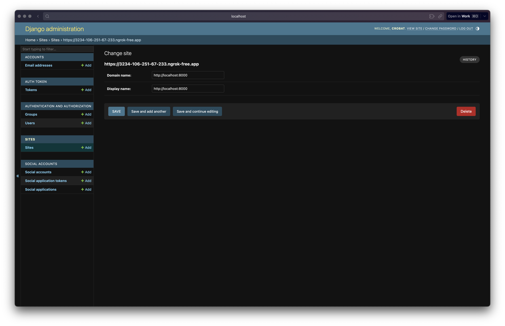
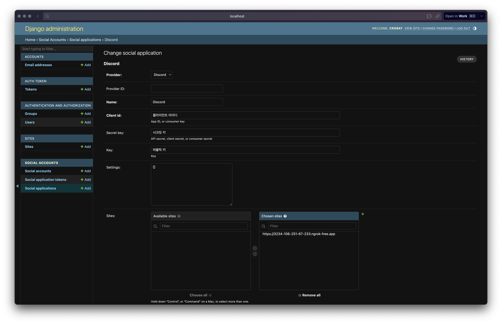
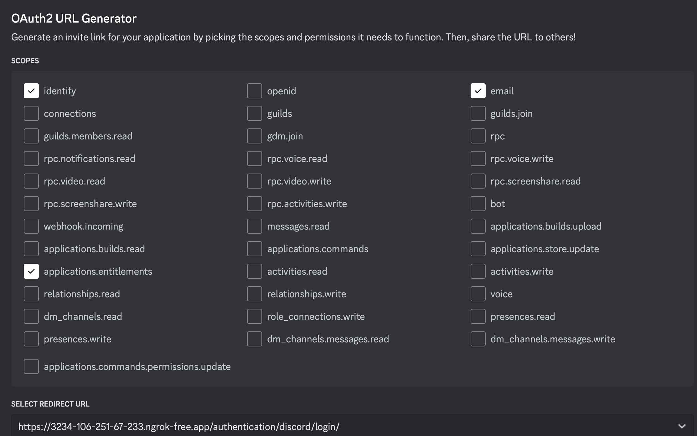
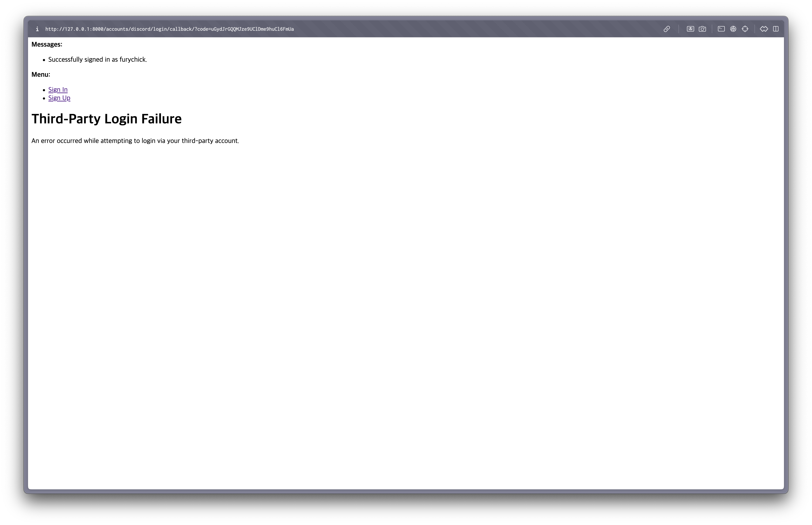
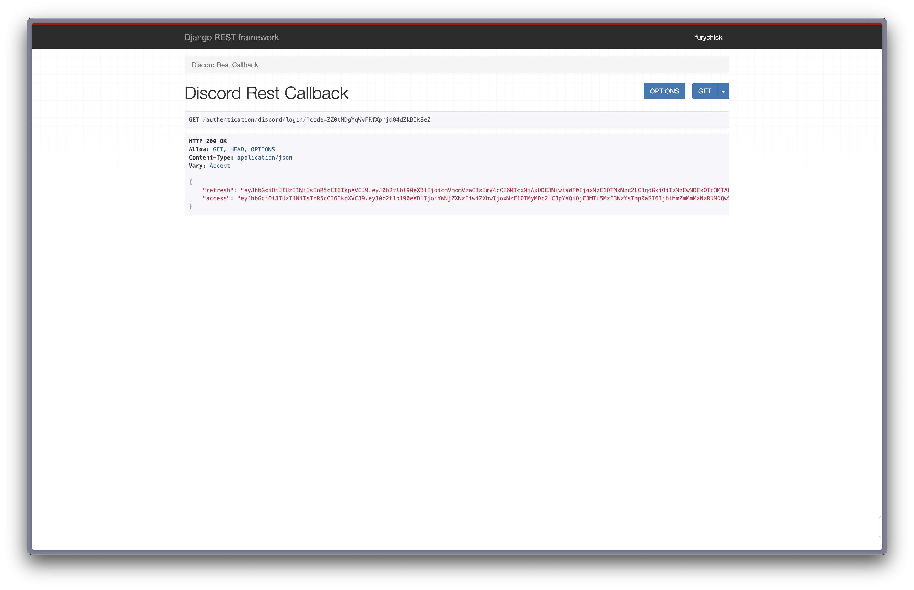

[지난 시간](https://sharknia.github.io/docker-compose를-활용한-postgresql과-django-커넥션-만들기)에는 django를 설치하고 DB 세팅까지 완료했습니다. 이번에는 소셜 로그인 기능을 붙여보겠습니다. 

## django-allauth vs dj-rest-auth

`django-allauth`와 `dj-rest-auth`는 모두 Django 애플리케이션에서 인증 및 사용자 관리를 쉽게 할 수 있도록 도와주는 패키지입니다. 하지만 이 두 패키지는 약간 다른 목적과 사용 사례를 가지고 있습니다. 둘을 비교해보면 다음과 같습니다.

## Discord 세팅

[Discord Developer Portal](https://discord.com/developers/applications)에서 Application을 생성합니다. 

첫 페이지에서 APPLICATION ID, PUBLIC KEY를 기록합니다. 

좌측의 OAuth2 메뉴로 이동합니다. 

CLIENT SECRET을 얻고 기록합니다. 

일단 여기까지만 먼저 해두겠습니다. 

## 설치

### 패키지 설치 

먼저 패키지를 설치합니다.  위에서 언급한 두 패키지 이외에도 `allauth`는 jwt 토큰은 생성해주지 않기 때문에 `djangorestframework-simplejwt` 라이브리러도 필요합니다. 

```bash
poetry add django-allauth djangorestframework-simplejwt
```

패키지를 설치한 후엔 반드시 이미지를 다시 빌드해줍니다. 

### settings.py

`settings.py` 파일을 열고, 다음의 내용을 추가합니다. 

```bash
INSTALLED_APPS = [
    ...
    "allauth",
    "allauth.account",
    "allauth.socialaccount",
    "allauth.socialaccount.providers.discord",  # 디스코드 소셜 로그인 추가
    "rest_framework",
    "rest_framework.authtoken",
    "dj_rest_auth",
    "dj_rest_auth.registration",
    "django.contrib.sites",
    ...
]

SITE_ID = 1

AUTHENTICATION_BACKENDS = [
    'django.contrib.auth.backends.ModelBackend',
    'allauth.account.auth_backends.AuthenticationBackend',
]

REST_FRAMEWORK = {
    'DEFAULT_AUTHENTICATION_CLASSES': [
        'rest_framework.authentication.TokenAuthentication',
        'rest_framework.authentication.SessionAuthentication',
    ],
}

# 이메일 인증 설정
ACCOUNT_EMAIL_VERIFICATION = "none"  # 이메일 확인 비활성화
ACCOUNT_EMAIL_REQUIRED = True  # 회원가입 시 이메일 주소 필수

# 로그인 후 리디렉션 URL
LOGIN_REDIRECT_URL = "/"

MIDDLEWARE = [
    ...
    "allauth.account.middleware.AccountMiddleware",  # 이 줄을 추가
    ...
]

```

### 마이그레이션 적용

여기까지 마친 후 마이그레이션을 진행합니다. 

```bash
docker-compose exec web python manage.py migrate
```

### urls.py

urls.py를 열어 urlpattern에 다음의 endpoint를 추가합니다. 

```python

urlpatterns = [
		...
    path("accounts/", include("allauth.urls")),  # allauth URL 패턴 추가
]
```

이제 로그인을 위한 Callback URL을 Discord에 정의할 수 있습니다. Callback URL은 `/accounts/discord/login/callback/` 입니다. 

Discord의 Redirects에 해당 주소를 추가합니다. [http://127.0.0.1:8000/accounts/discord/login/callback/](http://127.0.0.1:8000/accounts/discord/login/callback/)로 적어주어도 좋고, 저는 ngrok을 이용중이므로 해당 주소를 입력해주었습니다. 

### 관리자 페이지 접속

[관리자 페이지](http://localhost:8000/admin)에 Social Application을 생성해줘야 합니다. 해당 페이지에 접속하여 로그인합니다. 계정이 없다면 다음의 명령어를 사용하여 계정을 생성합니다. 

```bash
docker-compose -f docker/docker-compose.yml exec web python manage.py createsuperuser
```

#### Sites 추가

먼저 Sites를 추가해야 합니다. Sites-sites에서 추가를 해주면 되는데, [localhost](http://localhost/) 또는 ngrok 주소 중 사용하는 것을 입력해줍니다. 


#### Social Application 추가

여기까지 완료해야 Social Application을 추가할 수 있습니다. 

Social Accounts 메뉴의 Social Application를 선택하고, `ADD SOCIAL APPLICATION` 버튼을 눌러 추가합니다. 


사이트는 여러개 등록해둘 수 있지만 일단 하나만 추가해줍니다. 아까 기록해두었던 키 들을 적절한 곳에 입력하면 됩니다. 

### 로그인 테스트

이제 로그인을 테스트 해볼 수 있습니다. Discord의 OAuth2 메뉴에 가서 OAuth2 URL Generator에서


위와 같이 선택을 하고 Redirect URL을 선택하면 GENERATED URL이 생성됩니다. 

해당 URL로 접속 후, Discord로 로그인을 하면 


이렇게 로그인이 된 화면을 확인할 수 있습니다. Third-Party Login Failure라고 나오지만, 가장 위쪽의 Message에 주목하면 됩니다. 로그인이 잘 된 것이 맞습니다. ~~(여기서 100년 헤맸습니다. 누군가 왜 이런 화면이 나오는지 아시는 분 계신가요)~~

이 화면을 보고 나면 관리자 페이지에서 User 또는 Social Users를 확인하면 제대로 가입이 된 것을 볼 수 있습니다. 성공 여부는 해당 페이지에서 확인하시면 됩니다. 

## Restful한 로그인을 위한 API 구현

짠! 완료입니다! 면 좋겠지만 사실은 그렇지 않습니다. 위에서 짧게 언급했듯이 allauth는 JWT TOKEN 발급까지는 해주지 않습니다. 클라이언트와의 협의에 따라 달라지겠지만 REST한 JWT 토큰 생성을 위한 별도의 API가 필요합니다. 

### 모듈 생성

authentication 이라는 모듈을 만들어서 해당 앱에서 로그인을 관리하겠습니다. 

```bash
docker-compose -f docker/docker-compose.yml exec web python manage.py startapp authentication
```

### Settings.py

생성한 앱을 추가해줍니다. 

```python
INSTALLED_APPS = [
    ...
    "authentication", # 인증 관련 모듈
    ...
]
```

### views.py

authetication의 views.py에 다음의 내용을 작성합니다. 

```python
import os

import requests
from allauth.socialaccount.helpers import complete_social_login
from allauth.socialaccount.models import SocialLogin, SocialToken
from allauth.socialaccount.providers.discord.views import DiscordOAuth2Adapter
from rest_framework import status
from rest_framework.response import Response
from rest_framework.views import APIView
from rest_framework_simplejwt.tokens import RefreshToken


class DiscordRestCallback(APIView):
    def get(self, request, *args, **kwargs):
        code = request.GET.get("code")
        if not code:
            return Response(
                {"error": "No code provided"}, status=status.HTTP_400_BAD_REQUEST
            )
        access_token = self.get_access_token(code)
        user_info = self.get_user_info(access_token)
        jwt_tokens = self.perform_login(request, access_token, user_info)
        return Response(jwt_tokens, status=status.HTTP_200_OK)

    def perform_login(self, request, access_token, user_info):
        adapter = DiscordOAuth2Adapter(request)
        provider = adapter.get_provider()
        app = provider.app
        token = SocialToken(app=app, token=access_token)

        # 유저 정보를 사용하여 소셜 로그인 객체를 생성
        login = adapter.complete_login(request, app, token, response=user_info)
        login.token = token
        login.state = SocialLogin.state_from_request(request)
        complete_social_login(request, login)

        if not login.is_existing:
            login.save(request, connect=True)

        # JWT 토큰 생성
        user = login.account.user
        refresh = RefreshToken.for_user(user)
        return {
            "refresh": str(refresh),
            "access": str(refresh.access_token),
        }

    def get_access_token(self, code):
        API_ENDPOINT = "https://discord.com/api/v10"
        CLIENT_ID = os.getenv("DISCORD_CLIENT_ID")
        CLIENT_SECRET = os.getenv("DISCORD_CLIENT_SECRET")
        REDIRECT_URI = os.getenv("DISCORD_REDIRECT_URI")

        data = {
            "grant_type": "authorization_code",
            "code": code,
            "redirect_uri": REDIRECT_URI,
        }
        headers = {"Content-Type": "application/x-www-form-urlencoded"}
        r = requests.post(
            f"{API_ENDPOINT}/oauth2/token",
            data=data,
            headers=headers,
            auth=(CLIENT_ID, CLIENT_SECRET),
        )
        r.raise_for_status()
        access_token = r.json().get("access_token")
        return access_token

    def get_user_info(self, access_token):
        API_ENDPOINT = "https://discord.com/api/v10"
        headers = {
            "Authorization": f"Bearer {access_token}",
        }
        r = requests.get(f"{API_ENDPOINT}/users/@me", headers=headers)
        r.raise_for_status()
        return r.json()
```

Discord의 API들을 활용해 access token을 얻고, 해당 access\_token을 사용해서 유저 정보를 Discord로부터 받아옵니다. 그리고 해당 정보들을 이용해 로그인(회원가입)을 한 후 jwt token을 만들어 클라이언트에게 응답합니다. 

### urls.py

소셜 로그인 관련 URL을 추가해야 합니다. authentication 안에 urls.py를 생성하고 다음의 코드를 입력합니다. 

```python
from django.urls import path

from .views import DiscordRestCallback

urlpatterns = [
    path(
        "discord/login/",
        DiscordRestCallback.as_view(),
        name="discord_rest_callback",
    ),
]

# JWT 토큰 설정
SIMPLE_JWT = {
    "ACCESS_TOKEN_LIFETIME": timedelta(minutes=5),
    "REFRESH_TOKEN_LIFETIME": timedelta(days=1),
    "ROTATE_REFRESH_TOKENS": False,
    "BLACKLIST_AFTER_ROTATION": True,
    "UPDATE_LAST_LOGIN": False,
    "ALGORITHM": "HS256",
    "SIGNING_KEY": SECRET_KEY,
    "VERIFYING_KEY": None,
    "AUDIENCE": None,
    "ISSUER": None,
    "AUTH_HEADER_TYPES": ("Bearer",),
    "AUTH_HEADER_NAME": "HTTP_AUTHORIZATION",
    "USER_ID_FIELD": "id",
    "USER_ID_CLAIM": "user_id",
    "AUTH_TOKEN_CLASSES": ("rest_framework_simplejwt.tokens.AccessToken",),
    "TOKEN_TYPE_CLAIM": "token_type",
    "JTI_CLAIM": "jti",
    "SLIDING_TOKEN_REFRESH_EXP_CLAIM": "refresh_exp",
    "SLIDING_TOKEN_LIFETIME": timedelta(minutes=5),
    "SLIDING_TOKEN_REFRESH_LIFETIME": timedelta(days=1),
}
```

그리고 프로젝트 메인의 urls.py를 넣어 authentication의 url을 추가해줍니다. 

```python

urlpatterns = [
		...
    path("authentication/", include("authentication.urls")),
	  ...
]

```

이제 Discord OAuth2 페이지로 이동해서 Callback URL을 `/authentication/discord/login/`로 교체합니다. 

그 후 로그인을 시도하면,


아까처럼 로그인 성공 화면이 아니라 JWT 토큰을 발급 받을 수 있습니다. 

## 참조

[https://discord.com/developers/docs/topics/oauth2](https://discord.com/developers/docs/topics/oauth2)

[https://docs.allauth.org/en/latest/introduction/index.html](https://docs.allauth.org/en/latest/introduction/index.html)

