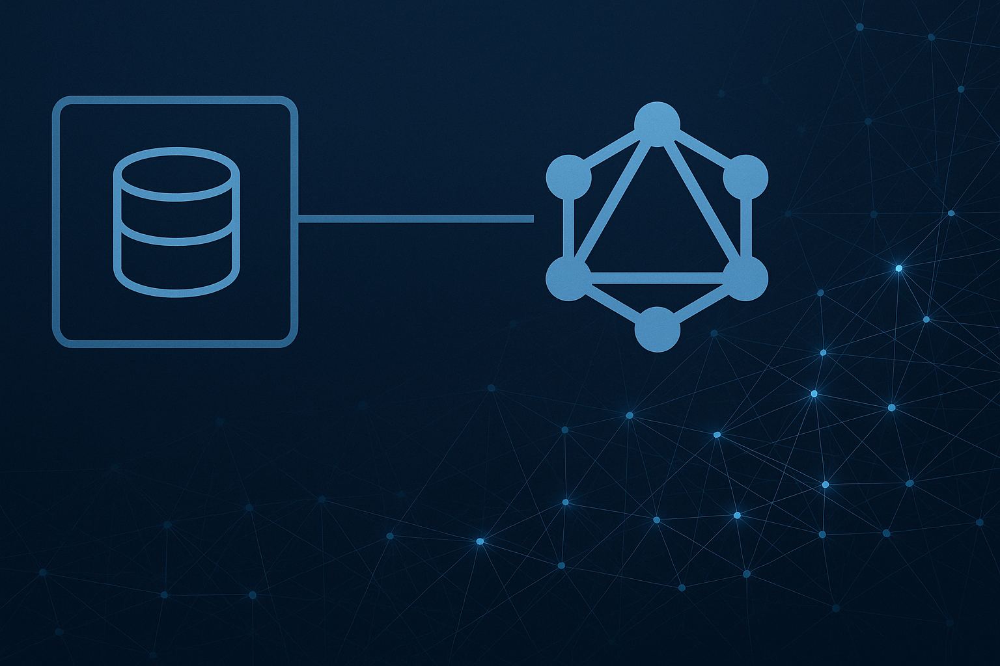

## 서론

대규모 마이크로서비스 환경에서 수백 개의 Django 모델을 GraphQL API로 노출해야 하는 상황을 마주한 적이 있나요? 저는 프로젝트에서 이런 도전에 직면했고, 개발 생산성을 획기적으로 향상시킬 수 있는 자동화 도구를 개발했습니다.

블로그 정리를 미루고 있다가 이제서야 업로드 합니다. 

## **문제 상황**

### 배경 및 문제 정의

제가 합류했던 프로젝트는 여러 마이크로서비스(MSA)의 데이터를 통합하여 관리자 기능을 제공하는 중앙 API 서버를 개발하는 것이었습니다. 당면한 주요 과제는 다음과 같았습니다.

1. 관리 대상 모델의 방대한 규모: 수백 개에 달하는 Django 모델을 GraphQL API로 노출해야 했습니다. 이 모델들은 MSA의 여러 서비스에 걸쳐 분산되어 있었습니다.

1. 유지보수성의 한계: 각 모델에 대해 수동으로 GraphQL 타입(`ObjectType`), 쿼리 필드, 리졸버를 정의하는 것은 엄청난 초기 개발 비용뿐만 아니라, 모델 변경 시마다 스키마를 추적하고 업데이트해야 하는 심각한 유지보수 문제를 야기했습니다.

1. 레거시 시스템 제약: 일부 마이크로서비스는 오래된 버전의 Django를 사용하고 있어 최신 라이브러리(예: GraphQL Federation 관련 도구) 도입이 불가능했습니다. 또한, `managed = False`로 정의된 모델이 많아 Django ORM의 관계 자동 처리 기능을 온전히 활용하기 어려웠습니다.

1. 제한된 시간 및 리소스: 빠르게 변화하는 요구사항 속에서 제한된 시간 안에 안정적이고 유지보수가 용이한 API를 구축해야 했습니다.

이러한 상황에서 수동 스키마 정의 및 관리는 현실적으로 불가능했으며, 유지보수 가능한 시스템 구축을 위해서는 자동화가 필수적이라고 판단했습니다.

## 해결 방안 및 설계

Django 모델 정의를 기반으로 GraphQL 스키마(쿼리, 타입, 리졸버)를 자동으로 생성하는 유틸리티 함수 `create_schema` 및 관련 헬퍼 함수들을 개발했습니다 (`common/graphql/auto_schema.py`).


        핵심 아이디어: 개발자는 GraphQL에 노출할 모델 목록(`model_config`)만 정의하면, `auto_schema`가 나머지를 처리하여 반복 작업을 최소화하고 일관성을 확보한다.

### **당면한 과제**

- 130+ Django 모델을 GraphQL API로 노출 필요

- 여러 마이크로서비스에 분산된 도메인 모델들

- 레거시 시스템 제약: managed = False 모델들의 관계 처리

- 제한된 개발 리소스와 타이트한 일정

### **기존 방식의 한계**

```python
# 전통적인 GraphQL 스키마 정의 방식
class UserType(DjangoObjectType):
    class Meta:
        model = User
        
class UserResultType(graphene.ObjectType):
    results = graphene.List(UserType)
    total_count = graphene.Int()

class Query(graphene.ObjectType):
    users = graphene.Field(
        UserResultType,
        offset=graphene.Int(),
        limit=graphene.Int(),
        # ... 각종 필터 필드들
    )
    
    def resolve_users(self, info, offset=None, limit=None, **kwargs):
        # 필터링 로직 구현...
        pass
```

문제점:

- 모델당 평균 90분의 반복 작업

- 모델 변경 시 스키마 동기화 필요

- 일관성 유지의 어려움

- 휴먼 에러 발생 가능성

### **해결 방안: Auto Schema 설계**

아래처럼 개발자는 MODEL\_CONFIG에 노출할 모델만 정의하고, 나머지는 모두 자동화해서 자동으로 GraphQL 응답이 만들어지게끔 설계했습니다.

```python
# 목표하는 개발자 경험
from common.graphql.auto_schema import create_schema
from .models import User, Product, Order

MODEL_CONFIG = {
    "users": User,
    "products": Product, 
    "orders": Order
}

schema = create_schema(MODEL_CONFIG)  # 끝!
```

## **핵심 구현 내용**

### **동적 타입 매핑 시스템**

```python
from typing import Optional, get_args, get_origin
import graphene

def get_graphene_field_from_type(type_hint, as_instance=True):
    """
    Python 타입 힌트를 GraphQL 필드로 자동 변환
    """
    origin = get_origin(type_hint)
    
    if origin is list:
        args = get_args(type_hint)
        if args:
            inner_type = get_graphene_field_from_type(args[0], as_instance=False)
            return graphene.List(inner_type)
        return graphene.List(graphene.String)
    
    elif origin is dict or type_hint is dict:
        return graphene.JSONString() if as_instance else graphene.JSONString
    
    # 기본 타입 매핑
    mapping = {
        bool: graphene.Boolean,
        int: graphene.Int,
        str: graphene.String,
        float: graphene.Float,
        Optional[dict]: graphene.JSONString,
    }
    
    if type_hint in mapping:
        field_type = mapping[type_hint]
        return field_type() if as_instance else field_type
    
    # 기본값: String
    return graphene.String() if as_instance else graphene.String
```

### **모델 속성 분석 및 동적 타입 생성**

```python
import inspect
import uuid
from django.utils.functional import cached_property
from graphene_django import DjangoObjectType

def create_model_type(model_name, model_class):
    """
    Django 모델을 분석하여 GraphQL ObjectType을 동적 생성
    """
    custom_properties = {}
    custom_resolvers = {}
    
    # @property와 @cached_property 자동 감지
    for attr_name, attr in inspect.getmembers(model_class):
        if isinstance(attr, (property, cached_property)):
            # 타입 힌트에서 GraphQL 필드 타입 추론
            return_type = getattr(attr.fget, '__annotations__', {}).get('return')
            
            if return_type:
                field = get_graphene_field_from_type(return_type)
            else:
                field = graphene.String()
                
            custom_properties[attr_name] = field
            custom_resolvers[f"resolve_{attr_name}"] = create_property_resolver(attr_name)
    
    # 충돌 방지를 위한 고유 타입명 생성
    unique_id = str(uuid.uuid4().hex)
    
    # 동적 타입 생성
    model_type = type(
        f"{model_name}Type",
        (DjangoObjectType,),
        {
            "Meta": type("Meta", (), {
                "model": model_class,
                "name": f"{model_name}Type_{unique_id}",
            }),
            **custom_properties,
            **custom_resolvers,
        },
    )
    
    return model_type, model_class
```

### **N+1 문제 해결을 위한 DataLoader 통합**

```python
from promise.dataloader import DataLoader

class DataLoaderRegistry:
    """DataLoader 클래스들을 중앙에서 관리"""
    _loaders = {}
    
    @classmethod
    def register_loader(cls, name: str, loader_class: type[DataLoader]):
        cls._loaders[name] = loader_class
    
    @classmethod
    def create_loader_context(cls):
        return DataLoaderContext(cls._loaders)

class PropertyResolverRegistry:
    """모델별 최적화된 Property Resolver 관리"""
    _resolvers = {}
    
    @classmethod
    def register_model(cls, model_name: str, resolver_func):
        cls._resolvers[model_name] = resolver_func
    
    @classmethod  
    def resolve_property(cls, instance, info, field_name, ret_type):
        model_name = instance._meta.model.__name__
        resolver = cls._resolvers.get(model_name)
        
        if resolver:
            # 등록된 DataLoader resolver 사용
            return resolver(instance, info, field_name, ret_type)
        
        # 기본 처리 방식
        return getattr(instance, field_name)
```

DataLoader 기능은 상당히 나중에 추가됐습니다. 이는 단순히 모델의 조회 역할만 하는 이 서버에 대해 유지보수 포인트를 늘리고 싶지 않았기 때문입니다. 

### **완전한 스키마 자동 생성**

```python
def create_schema(model_config):
    """
    모델 설정에서 완전한 GraphQL 스키마 생성
    """
    query_attrs = {}
    
    for graphql_name, model_class in model_config.items():
        # 1. 모델 타입 생성
        ModelType, model = create_model_type(graphql_name, model_class)
        
        # 2. 결과 타입 생성 (results + total_count)
        ResultType = type(f"{graphql_name}Result", (graphene.ObjectType,), {
            "results": graphene.List(ModelType),
            "total_count": graphene.Int(),
        })
        
        # 3. 쿼리 필드 및 resolver 생성
        field_kwargs = {
            "offset": graphene.Int(),
            "limit": graphene.Int(),
            # 모델 필드 기반 필터 자동 생성
            **get_model_filter_fields(model)
        }
        
        query_attrs[graphql_name] = graphene.Field(ResultType, **field_kwargs)
        query_attrs[f"resolve_{graphql_name}"] = create_field_resolver(model, ResultType)
    
    # 동적 Query 클래스 생성
    DynamicQuery = type("DynamicQuery", (graphene.ObjectType,), query_attrs)
    return graphene.Schema(query=DynamicQuery)
```

## **성과 및 결과**

### 코드레벨

#### 프로젝트 적용 결과

```python
# 7개 마이크로서비스의 실제 스키마 파일들

# services/user_management/schema.py
MODEL_CONFIG = {
    "users": User,
    "profiles": Profile,
    "permissions": Permission,
    "groups": Group,
    "audit_logs": AuditLog,
}
schema = create_schema(MODEL_CONFIG)  # 5개 모델 = 5분

# services/product_catalog/schema.py  
MODEL_CONFIG = {
    "products": Product,
    "categories": Category,
    "brands": Brand,
    "reviews": Review,
    "inventory": Inventory,
    "price_histories": PriceHistory,
}
schema = create_schema(MODEL_CONFIG)  # 6개 모델 = 6분

# services/order_management/schema.py
MODEL_CONFIG = {
    "orders": Order,
    "order_items": OrderItem,
    "payments": Payment,
    "shipments": Shipment,
    "invoices": Invoice,
    "refunds": Refund,
    "coupons": Coupon,
}
schema = create_schema(MODEL_CONFIG)  # 7개 모델 = 7분

# services/analytics/schema.py
MODEL_CONFIG = {
    "daily_sales": DailySales,
    "user_activities": UserActivity,
    "product_views": ProductView,
    "conversion_funnels": ConversionFunnel,
}
schema = create_schema(MODEL_CONFIG)  # 4개 모델 = 4분

# ... 총 130+ 모델이 이런 식으로 관리됨
```

#### 새 기능 추가 시나리오

```python
# 요구사항: "상품 위시리스트 기능 추가"

# 1. 모델 생성 (기존과 동일)
class Wishlist(models.Model):
    user = models.ForeignKey(User, on_delete=models.CASCADE)
    product = models.ForeignKey(Product, on_delete=models.CASCADE)
    created_at = models.DateTimeField(auto_now_add=True)
    
    @property 
    def product_name(self) -> str:
        return self.product.name
    
    @property
    def product_price(self) -> float:
        return float(self.product.price)

# 2. GraphQL 노출 (Auto Schema)
MODEL_CONFIG = {
    "users": User,
    "products": Product,
    "orders": Order,
    "categories": Category,
    "wishlists": Wishlist,  # 이 한 줄만 추가!
}

# 끝! GraphQL API 자동 생성됨
# - WishlistType 자동 생성
# - wishlists 쿼리 필드 자동 생성  
# - 필터링 옵션 자동 생성
# - 페이징 자동 처리
```

#### **N+1 문제 해결 사례**

```python
# DataLoader를 활용한 성능 최적화도 자동화

# 1. DataLoader 정의
class ProductCategoryLoader(DataLoader):
    def batch_load_fn(self, product_ids):
        categories_by_product = defaultdict(list)
        # 배치로 카테고리 정보 로딩
        products = Product.objects.filter(id__in=product_ids).select_related('category')
        for product in products:
            categories_by_product[product.id] = product.category
        return Promise.resolve([categories_by_product.get(pid) for pid in product_ids])

# 2. Registry에 등록
DataLoaderRegistry.register_loader("product_category", ProductCategoryLoader)

# 3. 커스텀 resolver 등록 (필요시에만)
def resolve_product_property(product, info, field_name, ret_type):
    if field_name == "category_detail":
        return info.context.data_loaders.product_category.load(product.id).get()
    # 기본 처리는 자동으로...

PropertyResolverRegistry.register_model("Product", resolve_product_property)

# 결과: N+1 문제 없이 고성능 GraphQL API 완성!
```

### **정량적 성과**

- 개발 시간: 196시간 → 31시간 (84% 단축)

- 노출 모델 수: 130+ 모델 자동 처리

- 코드 라인 수: 수천 라인 → 수십 라인 (95% 감소)

- 유지보수 시간: 거의 제로화

### **정성적 성과**

- 일관된 API 스펙: 모든 엔드포인트가 동일한 구조

- 휴먼 에러 제거: 수동 스키마 정의 실수 방지

- 개발자 경험 향상: 모델 추가 = 2분 작업

- N+1 문제 해결: DataLoader 통합으로 성능 최적화

## **기술적 학습 포인트**

#### **1.** 메타프로그래밍의 실용적 활용

- Python의 inspect 모듈과 type() 함수를 활용한 동적 클래스 생성

- 타입 힌트를 런타임에서 활용하는 방법

#### **2. GraphQL 고급 패턴**

- DataLoader 패턴을 통한 N+1 문제 해결

- Promise 기반 비동기 배치 로딩

#### **3. 아키텍처 설계 원칙**

- Registry 패턴을 통한 순환 import 해결

- 관심사 분리와 단일 책임 원칙 적용

## **향후 발전 방향**

#### **단기 개선 사항**

- 타입 안전성 강화: 컴파일 타임 검증 추가

- 성능 모니터링: DataLoader 메트릭 수집

- 에러 핸들링: 더 명확한 오류 메시지

#### 장기 발전 계획

- 설정 외부화: YAML/JSON 기반 설정 파일 지원

## **결론**

대규모 Django 프로젝트에서 GraphQL API를 효율적으로 관리하는 것은 쉽지 않은 도전입니다. 하지만 적절한 자동화 도구를 통해 개발 생산성을 획기적으로 향상시킬 수 있음을 경험했습니다.

핵심은 "반복되는 패턴을 찾아 자동화하되, 복잡한 비즈니스 로직은 적절히 분리하는 것"입니다. 이를 통해 개발자는 반복 작업에서 벗어나 더 가치 있는 비즈니스 로직 구현에 집중할 수 있습니다.


