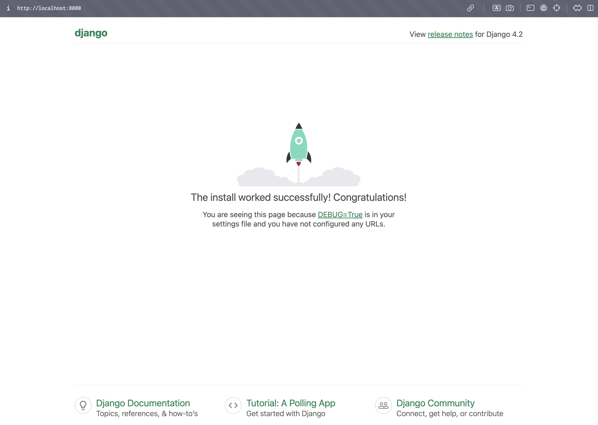

## 설치할 버전의 선택

오늘 날짜(2024년 5월 10일) 기준 [Django 4.2 버전](https://docs.djangoproject.com/en/5.0/releases/4.2/)이 가장 최신의 LTS 버전이며, 해당 Django 버전에서는 4.2.8 버전부터 파이썬 3.12를 지원하며 그 미만 버전은 파이썬 3.11까지 지원합니다. 

따라서 저는 파이썬 3.11, Django 4.2.13 버전을 설치하겠습니다. 

## 파이썬 설치

장고를 설치할 디렉토리로 이동한 다음, [Pyenv](https://sharknia.github.io/Apple-Silicon과-pyenv)를 사용해서 파이썬을 설치하겠습니다. 

```shell
pyenv install 3.11.8
pyenv local 3.11.8
```

위의 명령어를 사용해 파이썬 3.11.8 버전을 설치 및 세팅합니다. 

만약 python 버전이 바뀌지 않았다면 [이 링크](https://sharknia.github.io/Pyenv-local-실행을-했는데-파이썬-버전이-바뀌지-않는다)를 참고합니다. 

```shell
user@MacBook-Pro django % python --version
Python 3.11.8
```

파이썬이 설치되었습니다. 

## Django 설치

[poetry](https://sharknia.github.io/Poetry)를 사용해 설치합니다. 

poetry에서 pyenv에서 설치된 파이썬 3.11을 사용한 가상환경을 만들도록 해야 합니다. 

```shell
poetry env use $(pyenv which python3.11)
```

다음의 명령어를 사용해 poetry init 후 django를 설치합니다. 

```shell
poetry init
poetry add django^4.2.13
```

그 다음 poetry 가상 환경을 시작합니다. 

```typescript
poetry shell
```

다음과 같이 확인할 수 있습니다. 

```shell
(django-example-py3.11) user@MacBook-Pro django % python --version 
Python 3.11.8
(django-example-py3.11) user@MacBook-Pro django % python -m django --version
4.2.13
```

정상적으로 원하는 버전이 설치된 것을 확인할 수 있습니다. 

이제 기본 django 프로젝트를 세팅합니다. 

```shell
django-admin startproject project .
```

## 기타 라이브러리 설치

Postgresql을 사용할 것이므로, `psycopg2-binary`를 설치합니다. 또한 `gunicorn`도 설치합니다. 

```shell
poetry add psycopg2-binary gunicorn
```

## Docker 이미지 및 컨테이너 생성과 실행

여기까지만 해도 로컬에서 Django 프로젝트를 구동할 수 있습니다. 하지만 저는 일관된 개발 환경을 위해 Docker를 사용하려고 합니다. 

다음과 같이 Dockerfile을 작성합니다. 

```docker
# 베이스 이미지를 Python 3.11로 설정
FROM python:3.11-slim

# 시스템 의존성 패키지 설치
RUN apt-get update && apt-get install -y \
    build-essential \
    libpq-dev \
    && apt-get clean

# 환경 변수 설정
ENV PYTHONUNBUFFERED=1

# 작업 디렉토리 설정
WORKDIR /app

# Poetry 설치
RUN pip install --upgrade pip && pip install poetry

# Poetry 설정 (가상환경을 컨테이너 외부로 생성하지 않도록)
RUN poetry config virtualenvs.create false

# 프로젝트 파일 복사
COPY pyproject.toml poetry.lock /app/

# 의존성 설치
RUN poetry install --no-root

# 나머지 프로젝트 파일 복사
COPY . /app/

# 장고 애플리케이션 실행
CMD ["python", "manage.py", "runserver", "0.0.0.0:8000"]

```

이미지를 빌드합니다. 

```docker
docker build -t my-django-app .
```

컨테이너를 실행합니다. 

```docker
docker run -d -p 8000:8000 my-django-app
```

이제 [http://localhost:8000](http://localhost:8000/) 에서 장고 프로젝트가 실행된 것을 확인할 수 있습니다. 


## **Docker Compose**

짠! 하고 글이 종료됐다면 좋았겠지만 그렇지 않습니다. 

### Docker Compose란? 

Docker Compose는 멀티 컨테이너 Docker 애플리케이션을 정의하고 실행하기 위한 도구입니다. 각 서비스의 컨테이너 설정을 하나의 YAML 파일 (`docker-compose.yml`)에 정의하고, 단일 명령어로 모든 컨테이너를 쉽게 시작, 중지 및 관리할 수 있습니다.

### 왜 사용하나요? 

환경의 일관성을 위해 컨테이너를 통해 서비스를 실행하게 되는데, 이렇게 하면 로컬에서 코드를 수정하고 테스트 할 때마다 이미지를 다시 말고 컨테이너를 다시 실행해야 하는 번거로움이 발생합니다. 

이를 방지하기 위해 docker-compose의 volumes 옵션으로 프로젝트 디렉토리를 마운트해 로컬의 코드 변경 사항이 컨테이너에 즉시 반영되도록 할 수 있습니다. 

### 개발 환경을 위한 docker-compose

#### docker-compose.yml 파일 작성

루트 디렉토리에 docker-compose.yml 파일을 생성하고 다음의 내용을 작성합니다. 

```yaml
version: '3.8'

services:
    web:
        build: .
        command: gunicorn project.wsgi:application --bind 0.0.0.0:8000 --reload
        volumes:
            - .:/app
        ports:
            - '8000:8000'

```

- `volumes`의 `.:/app` 설정은 로컬 디렉토리 `.`(현재 디렉토리)를 컨테이너의 `/app` 디렉토리로 마운트합니다. 이렇게 하면 로컬 코드 변경 사항이 컨테이너 내부에서도 반영됩니다.

- `gunicorn project.wsgi:application` 명령을 통해 애플리케이션 서버가 실행되며, 코드를 변경하면 해당 변경 사항이 컨테이너에 즉시 적용됩니다.

- Note: 하지만 Gunicorn은 자체적으로 코드 변경 사항을 감지하고 다시 시작하지 않으므로, 개발 환경에서는 Gunicorn 대신 `runserver`를 사용하거나 Gunicorn에 `-reload` 옵션을 추가할 수 있습니다.

#### **Docker Compose 실행**

여기까지 완료되면 다음의 명령어를 사용해 서비스를 실행합니다. 위에서 테스트를 위해 실행했던 컨테이너는 중지해야 합니다. 

```bash
# 빌드와 서비스 시작
docker-compose up --build -d

# 서비스 상태 확인
docker-compose ps

# 로그 확인
docker-compose logs

# 모든 서비스 중지
docker-compose down
```

[http://localhost:8000](http://localhost:8000/) 에서 장고 프로젝트가 실행된 것을 확인할 수 있습니다. 

#### 코드 즉시 반영 테스트

코드가 즉시 반영 되는지 테스트를 하기 위해 `project` 디렉토리 내에 `views.py` 파일을 생성하고 다음과 같이 내용을 작성합니다. 

```python
# project/views.py
from django.http import HttpResponse


def hello_world(request):
    return HttpResponse("helloworld")
```

`project/urls.py` 을 다음과 같이 수정합니다. 

```python
# project/urls.py
from django.contrib import admin
from django.urls import path
from . import views

urlpatterns = [
    path('admin/', admin.site.urls),
    path('hello/', views.hello_world),  # /hello로 요청 시 helloworld 출력
]
```

이후 바로 `http://localhost:8000/hello`로 접근하면 `helloworld`라는 메시지가 출력됩니다. 별도의 과정 없이 코드가 바로 반영됨을 확인할 수 있습니다. 


