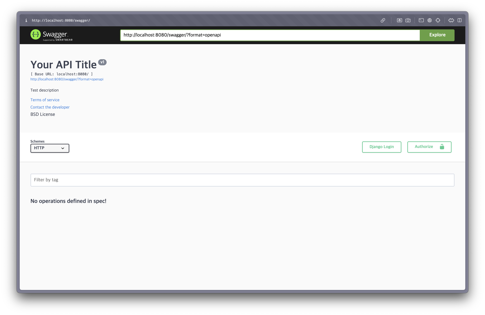

## 소개

### Swagger란?

Swagger는 RESTful API를 설계, 빌드, 문서화 및 소비하는 데 사용되는 오픈 소스 도구 모음입니다. Swagger는 API를 시각적으로 확인하고 테스트할 수 있는 인터페이스를 제공하여 개발자와 사용자 간의 소통을 용이하게 합니다.

Swagger의 주요 기능:

1. API 문서화: 자동으로 API 문서를 생성하여 API 사용법을 쉽게 이해할 수 있도록 합니다.

1. API 테스트: 제공된 인터페이스를 통해 API 요청을 직접 테스트할 수 있습니다.

1. 호환성: 다양한 언어와 프레임워크에서 사용 가능합니다.

### drf-yasg란?

`drf-yasg`(Django REST framework - Yet Another Swagger Generator)는 Django REST Framework(DRF)를 위한 자동 Swagger/OpenAPI 문서 생성을 제공하는 도구입니다. `drf-yasg`를 사용하면 API 엔드포인트를 자동으로 문서화할 수 있으며, Swagger UI와 ReDoc을 통해 웹에서 쉽게 볼 수 있는 인터페이스를 제공합니다.

이를 통해 개발자는 API 개발 및 유지 보수를 보다 효율적으로 수행할 수 있습니다.

## 설치

drf-yasg를 설치합니다. 

```bash
poetry add drf-yasg
```

## settings.py

`settings.py` 파일에 `INSTALLED_APPS`에 `drf_yasg`를 추가합니다.

```python
INSTALLED_APPS = [
    # 기존 앱들
    'rest_framework',
    'drf_yasg',
]
```

static 파일 관련 내용을 설정해야 합니다. 

`STATIC_URL` 및 `STATICFILES_DIRS`, `STATIC_ROOT`를 설정합니다.

```python
BASE_DIR = Path(__file__).resolve().parent.parent

# Static files (CSS, JavaScript, Images)
STATIC_URL = '/static/'
STATICFILES_DIRS = [
    os.path.join(BASE_DIR, 'static'),
]
STATIC_ROOT = os.path.join(BASE_DIR, 'staticfiles')
```

## urls.py

`urls.py` 파일을 수정하여 Swagger UI 및 ReDoc을 위한 URL 패턴을 추가합니다.

```python
from django.contrib import admin
from django.urls import path, re_path
from rest_framework import permissions
from drf_yasg.views import get_schema_view
from drf_yasg import openapi

schema_view = get_schema_view(
   openapi.Info(
      title="Your API Title",
      default_version='v1',
      description="Test description",
      terms_of_service="https://www.google.com/policies/terms/",
      contact=openapi.Contact(email="contact@yourapi.local"),
      license=openapi.License(name="BSD License"),
   ),
   public=True,
   permission_classes=(permissions.AllowAny,),
)

urlpatterns = [
		... 추가되는 내용
    re_path(r'^swagger(?P<format>\.json|\.yaml)$', schema_view.without_ui(cache_timeout=0), name='schema-json'),
    path('swagger/', schema_view.with_ui('swagger', cache_timeout=0), name='schema-swagger-ui'),
    path('redoc/', schema_view.with_ui('redoc', cache_timeout=0), name='schema-redoc'),
	  ... 추가되는 내용 끝
]

if settings.DEBUG:
    urlpatterns += static(settings.STATIC_URL, document_root=settings.STATIC_ROOT)


```

## 정적 파일 수집

다음 명령어를 실행하여 정적 파일을 모읍니다. 이 명령어는 모든 앱의 정적 파일을 `STATIC_ROOT` 디렉터리에 복사합니다.

```python
python manage.py collectstatic --noinput
```

## 확인

이제 `/swagger` endpoint로 접속해보면 


이 화면을 확인할 수 있습니다. 

