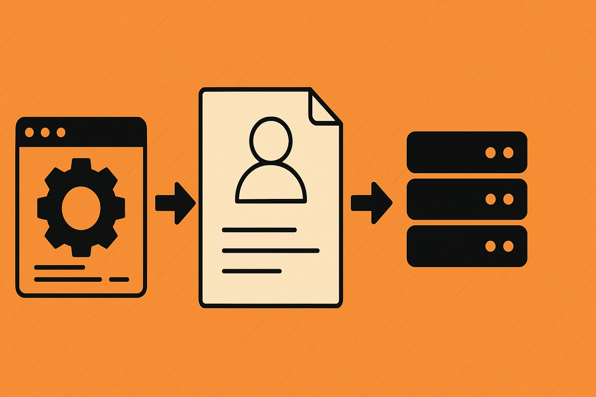

## 서론

최근 Django 1.11 기반의 오래된 프로젝트를 대체하는 신규 프로젝트의 아키텍처를 설계를 하고 있습니다. 새로운 시작인 만큼, 과거의 기술 부채를 답습하지 않고 더 나은 구조를 만들고 싶다는 욕심이 있습니다.

Django Rest Framework(DRF)를 사용한 일반적인 서비스 패턴에서는 서비스 레이어가 비즈니스 로직을 처리한 후 `dict`를 반환하고, `ViewSet`이 이를 받아 `Response`를 만듭니다. 이 패턴은 잘 작동하지만, 프로젝트가 복잡해질수록 몇 가지 아쉬운 점이 드러납니다.

1. ViewSet의 비대화: `ViewSet`이 단순히 로직 호출뿐만 아니라, 응답 형태를 만들기 위한 `dict` 조립, 데이터 가공 등의 부가적인 책임을 지게 되어 코드가 길어지고 복잡해집니다.

1. 불분명한 계약: 서비스 레이어와 뷰 레이어 간에 오가는 `dict`의 구조는 코드상에서 명시적으로 드러나지 않습니다. 어떤 키와 값이 오고 가는지 정확히 알려면 내부 코드를 자세히 들여다봐야만 하는 암묵적인 약속에 가깝습니다. 자동완성도 되지 않을 뿐더러, 급하게 이뤄지는 유지보수 작업에서 이로 인해 실수를 한 적이 한 두 번이 아니었습니다.

이러한 문제를 해결하기 위해, 두 레이어 간의 데이터 구조를 명확히 정의하는 DTO(Data Transfer Object) 패턴을 도입하기로 결정했습니다.

## 첫 번째 후보: Pydantic

Python 생태계에서 DTO를 이야기할 때 가장 먼저 떠오르는 후보는 단연 Pydantic입니다. 강력한 데이터 유효성 검사 기능과 풍부한 생태계를 바탕으로 FastAPI와 같은 현대적인 프레임워크의 핵심을 이루고 있습니다. 저 역시 FastAPI에서 Pydantic을 DTO로 사용하고 있었으며, 명확하고 안전한 데이터 구조를 만들 수 있을 것이라 기대했습니다.

하지만 신중한 검토 끝에, 저는 Pydantic을 최종적으로 선택하지 않았습니다.

### Pydantic을 선택하지 않은 이유

제가 Pydantic 도입을 망설인 이유는 의존성의 무게나 성능 같은 문제가 아니었습니다. 그보다는 아키텍처의 일관성과 팀의 협업 방식에 대한 고민이 더 컸습니다.

#### DRF Serializer와의 기능적 중복

가장 큰 이유는 Pydantic의 핵심 기능인 '유효성 검사'가 DRF의 `Serializer`와 기능적으로 너무 많이 겹친다는 점이었습니다. DRF의 `Serializer`는 외부로부터 들어오는 데이터(request)를 검증하고, 내부의 데이터를 외부로 나가는 형식(response)으로 변환하는 강력한 도구입니다.

여기에 Pydantic을 DTO로 도입하면, 저희 프로젝트에는 두 개의 강력한 유효성 검사 시스템이 공존하게 됩니다.

- `DRF Serializer`: 외부 I/O 경계에서의 유효성 검사

- `Pydantic Model`: 애플리케이션 내부 레이어 간 데이터 구조 검증

이는 "어느 레이어에서 어떤 데이터를 검증해야 하는가?"라는 혼란을 야기할 수 있습니다. 물론 역할 분리를 할 수도 있겠지만, 유사한 목적의 도구가 두 개 존재한다는 사실 자체가 프로젝트의 복잡도를 높이고, 아키텍처의 단순성과 일관성을 해친다고 판단했습니다. 또한 DRF 생태계에서 Pydantic을 DTO로 사용하는 것이 아직은 일반적인 선택지로 보이지 않았습니다.

### Django Ninja와 협업의 문제

Pydantic을 Django에서 더 자연스럽게 쓰는 방법으로 Django Ninja라는 프레임워크도 검토했습니다. Django Ninja는 FastAPI처럼 Pydantic 모델을 기반으로 작동하여 매우 깔끔하고 현대적인 코드를 작성할 수 있게 해줍니다.

하지만 이 역시 선택하지 않았는데, 두 가지 이유가 있었습니다.

첫째, 아직 Django 생태계에서 Django Ninja가 DRF만큼 대중적인 선택지라고 보기는 어려웠습니다. 이는 커뮤니티의 지원이나 레퍼런스를 찾는 데 장기적으로 불리할 수 있습니다.

둘째, 더 중요한 이유로, Django Ninja는 DRF와는 코드의 모양이 상당히 다른 새로운 추상화 계층을 도입합니다. 저 개인적으로는 이 방식이 흥미롭지만, 기존 DRF 방식에 익숙한 팀원들에게는 상당한 학습 곡선을 요구할 것이 분명했습니다. 새로운 아키텍처의 도입이 팀의 생산성을 저해해서는 안 된다고 생각했습니다.

## `dataclass`

이러한 고민 끝에 제가 선택한 대안은 Python 표준 라이브러리에 포함된 `dataclass`였습니다. `dataclass`는 Pydantic에 비해 기능은 소박하지만, 저희의 문제 상황에는 가장 적합한 도구였습니다.

- 가벼운 역할: `dataclass`는 순수한 '데이터 컨테이너'의 역할에만 충실합니다. 자체적인 유효성 검사 로직이 없기 때문에 DRF `Serializer`의 역할을 전혀 침범하지 않습니다.

- 표준 라이브러리: 별도의 의존성을 추가하지 않으며, Python 개발자라면 누구나 쉽게 이해하고 사용할 수 있습니다.

- 명확한 보완 관계: `dataclass`는 애플리케이션 내부의 데이터 구조를 명시적으로 만드는 역할을 하고, `Serializer`는 이 구조를 외부와 소통하는 형식으로 변환하는 역할에 집중하게 됩니다. 두 도구가 서로의 영역을 침범하지 않고 완벽하게 협력하는 그림이 만들어졌습니다.

## 실제 적용 사례

아래는 `dataclass` DTO를 적용하여 개선한 로그인 API의 일부입니다.

### **1.** `dataclass` **DTO 정의**

```python
# services.py
from dataclasses import dataclass
from users.models import User

@dataclass
class LoginResultDTO:
    user: User
    access_token: str
    refresh_token: str

```

서비스가 반환할 데이터의 구조를 명확하게 정의합니다.

### **2. Service와 Serializer 수정**

```python
# services.py
class AuthenticationService:
    @staticmethod
    def login_user(...) -> LoginResultDTO:
        # ... 로그인 및 토큰 생성 로직 ...
        return LoginResultDTO(
            user=user,
            access_token=access_token,
            refresh_token=refresh_token
        )

# serializers.py
class LoginResponseSerializer(serializers.Serializer):
    user = UserSerializer()
    access_token = serializers.CharField()
    refresh_token = serializers.CharField()

```

서비스는 `LoginResultDTO` 인스턴스를 반환하고, `Serializer`는 이 DTO 객체를 입력받아 직렬화할 준비를 합니다.

### **3. ViewSet 적용**

```python
# views.py
class UserLoginTokenViewSet(viewsets.GenericViewSet):
    # ...
    def create(self, request, *args, **kwargs):
        # ... 입력 데이터 검증 로직 ...

        # 서비스 호출
        login_result_dto = AuthenticationService.login_user(...)

        # DTO를 Serializer에 전달하여 응답 생성
        response_serializer = LoginResponseSerializer(login_result_dto)

        return Response(response_serializer.data)

```

ViewSet은 서비스로부터 DTO를 전달받아 `Serializer`에 넘기기만 하면 됩니다. 응답의 형태를 만들기 위해 `dict`를 조립하던 코드가 사라지고, 그 역할이 `Serializer`에 명확하게 위임되어 코드가 훨씬 간결해졌습니다.

## 결론

기술 선택에는 정답이 없다고 생각합니다. Pydantic과 Django Ninja는 그 자체로 매우 훌륭한 도구이며, 다른 상황에서는 최적의 선택이 될 수 있습니다. 한 때는 (그렇게 오래 되지도 않았지만) 가장 좋은 최신의 기술만을 선택하던 때도 있었습니다. 

하지만 'DRF 기반의 프로젝트에서 팀의 협업과 아키텍처의 일관성을 중시하는' 상황에서는, `dataclass`가 가장 실용적이고 균형 잡힌 해답이라고 믿고 있습니다. 이는 가장 화려한 기술이 아니라, 당면한 문제를 가장 깔끔하게 해결하고 장기적인 유지보수성을 높이는 선택이었습니다.

물론 서비스 레이어를 분리하고 `dataclass`를 도입하는 것이 Django의 빠른 개발 속도라는 장점을 일부 희생하고 코드의 양을 늘리는 것처럼 보일 수 있습니다. 하지만 저는 이를 '비용'이 아닌 장기적인 안정성을 위한 '투자'로 판단했습니다. 암묵적인 `dict`에 의존할 때 발생하는 휴먼 에러를 원천적으로 방지하고, 명확하게 분리된 레이어는 이번 프로젝트의 핵심 목표 중 하나인 테스트 코드 작성을 훨씬 용이하게 만들어주기 때문입니다.


