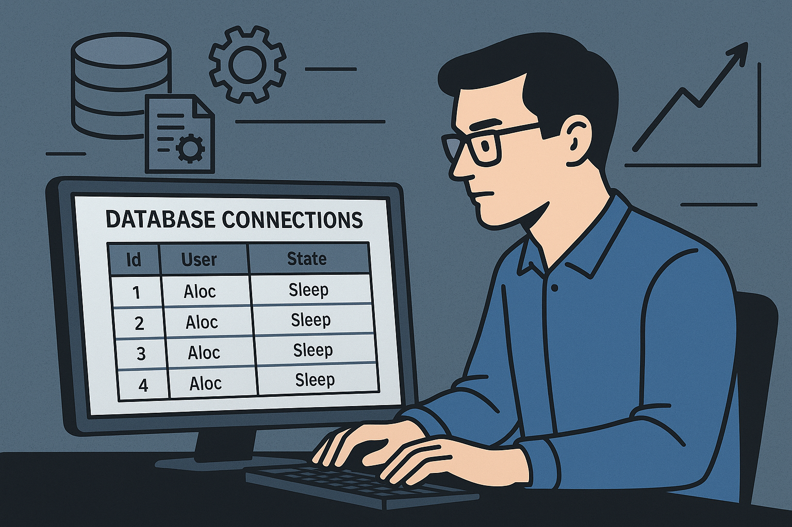

#### 1. 현재 상황 파악

- 주기적으로 DB 커넥션이 `Sleep` 상태로 장시간 유지되면서 간헐적으로 서버 응답이 지연되는 현상이 존재합니다.

- 현재는 해당 현상 발생 시 `Sleep` 상태의 DB 프로세스를 수동으로 정리하며 대응하고 있습니다.

- 관련 설정 값을 확인한 결과, 아래와 같이 서비스 안정성에 중점을 둔 기본 설정이 적용되어 있었습니다.

    - DB (MySQL) Timeout 설정:

        - `wait_timeout`: `28800` (8시간)

        - `interactive_timeout`: `28800` (8시간)

    - Application (Django) `CONN_MAX_AGE`: 설정 없음 (기본값 `0`으로 동작)

#### 2. 현상 분석 및 개선 포인트

문제의 핵심은 애플리케이션(Django)의 커넥션 관리 정책과 데이터베이스(MySQL)의 유휴 커넥션 정리 정책 간의 불일치에 있습니다.

- MySQL의 `wait_timeout` 역할: DB 서버가 자체적으로 유휴(idle) 상태의 커넥션을 정리하는 기준 시간입니다. 현재 8시간으로 설정되어 있어, 한 번 맺어진 커넥션이 아무런 요청 없이 8시간 동안 유지된 후에야 DB 서버가 해당 연결을 일방적으로 종료시킵니다. `Sleep` 상태의 프로세스가 장시간 누적되는 직접적인 원인입니다.

- Django의 `CONN_MAX_AGE` 역할: Django가 DB 커넥션을 얼마나 오랫동안 재사용할지를 결정하는 설정입니다.

    - 현재 (`0`초): 매 요청마다 DB 커넥션을 새로 생성하고 요청이 끝나면 즉시 해제합니다. 안전하지만, 매번 연결을 맺는 비용 때문에 성능 저하를 유발합니다.

    - `CONN_MAX_AGE`를 설정하면: 설정된 시간만큼 커넥션을 닫지 않고 유지하여 다음 요청에 재사용함으로써 성능을 향상시킵니다.

- 문제 발생 메커니즘: `CONN_MAX_AGE`를 `wait_timeout`보다 길게 설정하면, Django는 커넥션이 유효하다고 판단하여 재사용하려 하지만, DB 서버는 이미 해당 커넥션을 끊어버린 상태일 수 있습니다. 이 때 `MySQL server has gone away`와 같은 치명적인 오류가 발생합니다. 지금의 `Sleep` 누수 문제는 이 메커니즘의 전조 현상으로, 커넥션이 정리되지 않고 쌓이다가 결국 장애로 이어지게 됩니다.

- 슬로우 쿼리 발생 시의 취약점 및 개선 효과:

    - 현재 구조의 취약점: 현재 시스템은 `Sleep` 상태의 커넥션이 많이 누적되어 DB의 가용 커넥션 풀이 이미 상당 부분 소진된 상태와 같습니다. 이 상황에서 긴 슬로우 쿼리가 발생하면, 해당 쿼리가 실행되는 동안 활성(Active) 커넥션을 추가로 점유하게 됩니다. 이는 가용 커넥션을 급격히 고갈시켜, 단 몇 개의 슬로우 쿼리만으로도 전체 서비스가 응답 불능(Hang)에 빠지는 매우 치명적인 상황을 유발합니다.

    - 개선 방안의 효과: 제안된 설정을 적용하면 불필요한 `Sleep` 커넥션이 정리되어 DB 커넥션 풀에 충분한 여유 공간이 확보됩니다. 이렇게 확보된 여유 공간 덕분에, 예기치 않은 슬로우 쿼리가 발생하더라도 시스템이 즉시 장애 상태에 빠지지 않고 버틸 수 있는 체력을 갖추게 됩니다. 이는 슬로우 쿼리 자체를 해결하지는 않지만, 슬로우 쿼리가 서비스 전체 장애로 확산되는 것을 막아주는 중요한 안정성 장치가 됩니다.

#### 3. 해결 방법 제안

시스템 레벨에서 커넥션을 보다 효율적으로 관리하기 위해, 아래와 같이 DB와 애플리케이션의 설정을 함께 최적화하는 방안을 제안합니다. 핵심은 Django가 DB보다 먼저 커넥션을 관리하도록 만드는 것입니다.

1. DB 설정 변경 (`my.cnf`)

    - `wait_timeout` 값을 `28800` (8시간)에서 **`300` (5분)**으로 변경.

    - `interactive_timeout` 값도 관리의 일관성을 위해 **`300` (5분)**으로 함께 변경.

    - **기대 효과**: 유휴 커넥션을 보다 신속하게 회수하여 DB 서버 자원을 효율적으로 관리하고, 커넥션 누적으로 인한 지연 가능성을 사전에 방지합니다.

1. Django 설정 추가 (`settings.py`)

    - `CONN_MAX_AGE` 값을 `wait_timeout`보다 짧은 **`280`*으로 설정.

        - `CONN_MAX_AGE`를 `wait_timeout`보다 약간 짧게 설정하는 것이 중요합니다. 이는 네트워크 지연 시간 등을 고려한 조치로, DB 서버가 타임아웃으로 연결을 일방적으로 끊기 전에 Django가 먼저 커넥션의 유효 기간이 만료되었음을 인지하고 안전하게 재연결을 시도하도록 만들기 위함입니다. 이를 통해 'MySQL server has gone away'와 같은 예측 불가능한 커넥션 에러를 원천적으로 방지합니다.

    - **기대 효과**: 커넥션 재사용을 통해 불필요한 오버헤드를 줄여 응답 속도를 개선하고, DB가 일방적으로 연결을 끊기 전에 Django가 먼저 커넥션을 갱신하도록 만들어 안정적인 커넥션 풀을 운영합니다.

#### 4. 진행 시 고려사항

- 테스트 환경 선 적용: 실제 서비스에 반영하기에 앞서, 개발/스테이징 환경에 먼저 적용하여 충분한 테스트를 통해 동작의 안정성을 검증하는 것이 좋겠습니다.

- 적용 후 모니터링: 설정 변경 후에는 DB 커넥션 수, 애플리케이션 응답 시간 등 관련 지표를 함께 모니터링하여, 최적화가 의도한 대로 긍정적인 효과를 내는지 확인하는 과정이 필요합니다.

- 롤백 계획: 만일의 경우를 대비해, 이전 설정으로 안전하게 되돌릴 수 있는 간단한 롤백 계획을 미리 준비해두면 더 안정적으로 작업을 진행할 수 있습니다.

