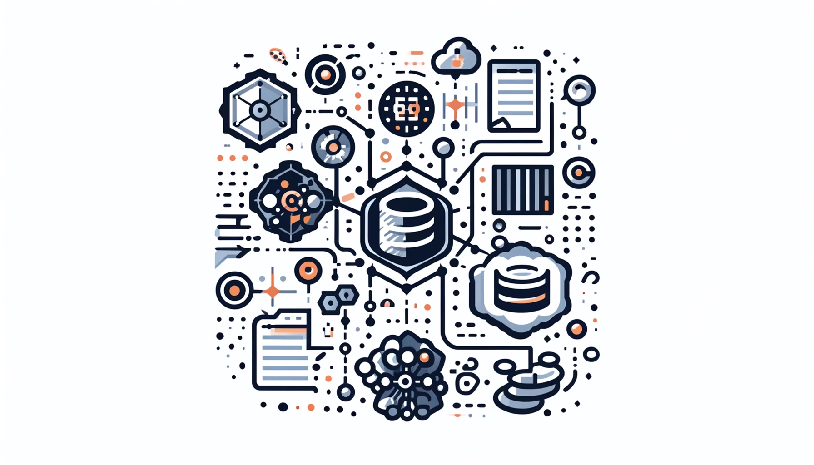

## Serializers란?

serializers는 DRF(Django REST Framwork)의 일부입니다. serializers는 Django 모델 인스턴스나 쿼리셋을 JSON과 같은 네이티브 데이터 타입으로 변환해주고(직렬화), 역으로 JSON 데이터를 Django 모델 인스턴스로 변환(역직렬화)하는 역할을 합니다.

## 왜 사용하나요? 

serializers는 클라이언트와 서버 간의 데이터 교환을 쉽게 해줍니다. 

1. 데이터 직렬화: Django 모델 인스턴스나 쿼리셋을 JSON 등으로 변환하여 클라이언트에게 전송할 수 있습니다.

1. 데이터 역직렬화: 클라이언트로부터 JSON 데이터를 받아 Django 모델 인스턴스로 변환하여 데이터베이스에 저장할 수 있습니다.

1. 데이터 검증: 클라이언트로부터 받은 데이터를 저장하기 전에 검증하여 올바른 데이터만 데이터베이스에 저장하도록 합니다.

## Serializers의 종류와 사용법

### Serializer

가장 기본적인 형태로, 필드와 메서드를 통해 직접 정의할 수 있습니다.

각 필드를 명시적으로 정의하므로 데이터 구조가 매우 유연하지만, 코드의 양이 많아질 수 있습니다.

```python
from rest_framework import serializers

class UserSerializer(serializers.Serializer):
    id = serializers.IntegerField(read_only=True)
    email = serializers.EmailField()
    dob = serializers.DateField()
    gender = serializers.ChoiceField(choices=[(1, 'Male'), (2, 'Female')])
    nickname = serializers.CharField(max_length=100)
```

### ModelSerializer

Django 모델과 자동으로 매핑되므로, 필드를 일일이 정의할 필요가 없습니다. 이를 통해 코드의 양을 줄이고, 가독성을 높일 수 있습니다. 모델의 모든 필드를 직렬화하고 싶다면,

```python
from rest_framework import serializers
from .models import User

class UserProfileSerializer(serializers.ModelSerializer):
    class Meta:
        model = User
        fields = "__all__"
```

이렇게 하면 모델에 정의된 모든 필드가 직렬화에 포함됩니다. 이 방법은 특히 모델의 필드가 자주 변경되거나 많은 필드를 포함하고 있을 때 유용합니다.

물론 필드를 직접 지정해서 사용할 수도 있습니다. 

```python
from rest_framework import serializers
from .models import User

class UserProfileSerializer(serializers.ModelSerializer):
    class Meta:
        model = User
        fields = ["id", "email", "dob", "gender", "nickname"]
```

### HyperlinkedModelSerializer

`HyperlinkedModelSerializer`는 객체에 대한 하이퍼링크를 생성하여 응답에 포함시켜 리스트를 자동으로 생성해주는 역할을 할 수 있습니다. `ViewSet`과 `Router`를 함께 사용하면, Django REST Framework는 자동으로 API 엔드포인트를 생성해주며, 이를 통해 각 객체에 대한 하이퍼링크를 포함하는 JSON 응답을 만들 수 있습니다.

#### Models.py

먼저 다음과 같은 User Model이 있다고 합시다. 

```python
from django.db import models

class User(models.Model):
    email = models.EmailField(unique=True)
    dob = models.DateField()
    gender = models.IntegerField(choices=[(1, 'Male'), (2, 'Female')])
    nickname = models.CharField(max_length=100)
```

#### **serializers.py**

`HyperlinkedModelSerializer`를 사용하여 Serializer를 정의합니다.

```python
from rest_framework import serializers
from .models import User

class UserProfileHyperlinkedSerializer(serializers.HyperlinkedModelSerializer):
    class Meta:
        model = User
        fields = ["url", "email", "dob", "gender", "nickname"]
        extra_kwargs = {
            'url': {'view_name': 'user-detail', 'lookup_field': 'pk'}
        }
```

여기서 `url` 필드는 각 `User` 객체를 참조하는 하이퍼링크를 포함합니다. `extra_kwargs`를 사용하여 `view_name`과 `lookup_field`를 지정할 수 있습니다. `view_name`은 이 URL이 참조하는 뷰의 이름을 지정하고, `lookup_field`는 URL을 생성할 때 사용할 필드를 지정합니다. 또한 `lookup_field`는 생략이 가능합니다. 

#### **views.py**

`User` 모델에 대한 뷰셋을 정의합니다.

```python
from rest_framework import viewsets
from .models import User
from .serializers import UserProfileHyperlinkedSerializer

class UserViewSet(viewsets.ModelViewSet):
    queryset = User.objects.all()
    serializer_class = UserProfileHyperlinkedSerializer
```

#### **urls.py**

적절한 URL 패턴을 설정합니다.

```python
from django.urls import path, include
from rest_framework.routers import DefaultRouter
from .views import UserViewSet

router = DefaultRouter()
router.register(r'users', UserViewSet)

urlpatterns = [
    path('', include(router.urls)),
]
```

#### 결과

이제 API를 시작하고 `http://example.com/users/`로 접속하면 다음과 같은 사용자 목록을 하이퍼링크로 포함한 JSON 응답을 받을 수 있습니다.

```json
[
    {
        "url": "http://example.com/users/1/",
        "email": "example1@example.com",
        "dob": "1990-01-01",
        "gender": 1,
        "nickname": "example_user1"
    },
    {
        "url": "http://example.com/users/2/",
        "email": "example2@example.com",
        "dob": "1992-02-02",
        "gender": 2,
        "nickname": "example_user2"
    }
]
```

`http://example.com/users/1/`로 GET 요청을 보내면 다음과 같은 JSON 응답을 받습니다.

```json
{
    "url": "http://example.com/users/1/",
    "email": "example1@example.com",
    "dob": "1990-01-01",
    "gender": 1,
    "nickname": "example_user1"
}
```

이렇게 HyperlinkedModelSerializer를 활용해서 간단하게 리스트-상세페이지를 구현할 수 있습니다. 

## 다양한 관계 다루기

먼저 모델을 미리 정의하겠습니다. 

```python
from django.db import models

class User(models.Model):
    email = models.EmailField(unique=True)
    dob = models.DateField()
    gender = models.IntegerField(choices=[(1, 'Male'), (2, 'Female')])
    nickname = models.CharField(max_length=100)

class UserProfile(models.Model):
    user = models.OneToOneField(User, on_delete=models.CASCADE, related_name='profile')
    bio = models.TextField()
    website = models.URLField()
    
class Post(models.Model):
    user = models.ForeignKey(User, related_name='posts', on_delete=models.CASCADE)
    title = models.CharField(max_length=100)
    content = models.TextField()
    
class Group(models.Model):
    name = models.CharField(max_length=100)
    members = models.ManyToManyField(User, related_name='groups')
```

User와 UserProfile은 1:1관계입니다. 

User와 Post는 1:N 관계입니다. 

User와 Group은 N:N 관계입니다. 

### 1:1 관계

이는 다음과 같이 직렬화 할 수 있습니다. 

```python
from rest_framework import serializers
from .models import User, UserProfile

class UserProfileSerializer(serializers.ModelSerializer):
    class Meta:
        model = UserProfile
        fields = ["bio", "website"]

class UserSerializer(serializers.ModelSerializer):
    profile = UserProfileSerializer(read_only=True)

    class Meta:
        model = User
        fields = ["id", "email", "dob", "gender", "nickname", "profile"]
```

`User`와 연결된 `UserProfile`이 있는 상황에서 `UserSerializer`를 사용하여 직렬화된 JSON 데이터는 다음과 같습니다:

```json
{
    "id": 1,
    "email": "example@example.com",
    "dob": "1990-01-01",
    "gender": 1,
    "nickname": "example_user",
    "profile": {
        "bio": "This is an example bio.",
        "website": "https://example.com"
    }
}
```

### 1:N 관계

```python
class PostSerializer(serializers.ModelSerializer):
    class Meta:
        model = Post
        fields = ["id", "title", "content"]

class UserSerializer(serializers.ModelSerializer):
    posts = PostSerializer(many=True, read_only=True)

    class Meta:
        model = User
        fields = ["id", "email", "dob", "gender", "nickname", "posts"]
```

`Post` 모델과 `User` 모델이 1:N 관계를 가지고 있는 경우, `User`가 여러 `Post`를 가지고 있을 때 직렬화된 JSON의 예시는 다음과 같습니다.

```json
{
    "id": 1,
    "email": "example@example.com",
    "dob": "1990-01-01",
    "gender": 1,
    "nickname": "example_user",
    "posts": [
        {
            "id": 1,
            "title": "First Post",
            "content": "This is the content of the first post."
        },
        {
            "id": 2,
            "title": "Second Post",
            "content": "This is the content of the second post."
        }
    ]
}
```

### N:N 관계

```python
class GroupSerializer(serializers.ModelSerializer):
    members = serializers.PrimaryKeyRelatedField(many=True, read_only=True)

    class Meta:
        model = Group
        fields = ["id", "name", "members"]

class UserSerializer(serializers.ModelSerializer):
    groups = GroupSerializer(many=True, read_only=True)

    class Meta:
        model = User
        fields = ["id", "email", "dob", "gender", "nickname", "groups"]
```

`Group` 모델과 `User` 모델이 N:N 관계를 가지고 있는 경우, `User`가 여러 `Group`에 속해 있을 때 직렬화된 JSON의 예시는 다음과 같습니다.

```json
{
    "id": 1,
    "email": "example@example.com",
    "dob": "1990-01-01",
    "gender": 1,
    "nickname": "example_user",
    "groups": [
        {
            "id": 1,
            "name": "Group One",
            "members": [1, 2, 3]
        },
        {
            "id": 2,
            "name": "Group Two",
            "members": [1, 4, 5]
        }
    ]
}
```

### 결론

이를 한 번에 정의하면 다음과 같습니다. 

```python
from rest_framework import serializers
from .models import User, UserProfile, Post, Group

class UserProfileSerializer(serializers.ModelSerializer):
    class Meta:
        model = UserProfile
        fields = ["bio", "website"]

class PostSerializer(serializers.ModelSerializer):
    class Meta:
        model = Post
        fields = ["id", "title", "content"]

class GroupSerializer(serializers.ModelSerializer):
    members = serializers.PrimaryKeyRelatedField(many=True, read_only=True)

    class Meta:
        model = Group
        fields = ["id", "name", "members"]

class UserSerializer(serializers.ModelSerializer):
    profile = UserProfileSerializer(read_only=True)
    posts = PostSerializer(many=True, read_only=True)
    groups = GroupSerializer(many=True, read_only=True)

    class Meta:
        model = User
        fields = ["id", "email", "dob", "gender", "nickname", "profile", "posts", "groups"]
```

## **Depth 옵션을 활용한 중첩된 관계 직렬화**

  `depth` 옵션을 통해 직렬화할 때 중첩된 관계의 깊이를 설정할 수 있습니다. `depth` 옵션은 기본적으로 외래 키(ForeignKey), 일대일 관계(OneToOneField), 다대다 관계(ManyToManyField) 등을 직렬화할 때 사용되며, 이를 통해 직렬화된 데이터에서 중첩된 객체의 필드를 포함할 수 있습니다.

### 사용법

`depth` 옵션은 `ModelSerializer`의 `Meta` 클래스 내에 설정할 수 있으며, 설정된 깊이만큼 중첩된 관계를 자동으로 직렬화합니다.

```python
from rest_framework import serializers
from .models import User, UserProfile, Post, Group

class UserProfileSerializer(serializers.ModelSerializer):
    class Meta:
        model = UserProfile
        fields = ["bio", "website"]

class PostSerializer(serializers.ModelSerializer):
    class Meta:
        model = Post
        fields = ["id", "title", "content"]

class GroupSerializer(serializers.ModelSerializer):
    members = serializers.PrimaryKeyRelatedField(many=True, read_only=True)

    class Meta:
        model = Group
        fields = ["id", "name", "members"]

class UserSerializer(serializers.ModelSerializer):
    profile = UserProfileSerializer(read_only=True)
    posts = PostSerializer(many=True, read_only=True)
    groups = GroupSerializer(many=True, read_only=True)

    class Meta:
        model = User
        fields = ["id", "email", "dob", "gender", "nickname", "profile", "posts", "groups"]
        depth = 1  # 여기서 depth 옵션을 설정합니다.

```

예를 들어, `depth`를 1로 설정하면 `UserSerializer`는 다음과 같은 JSON 응답을 생성합니다.

```json
{
    "id": 1,
    "email": "example@example.com",
    "dob": "1990-01-01",
    "gender": 1,
    "nickname": "example_user",
    "profile": {
        "bio": "This is an example bio.",
        "website": "https://example.com"
    },
    "posts": [
        {
            "id": 1,
            "title": "First Post",
            "content": "This is the content of the first post."
        },
        {
            "id": 2,
            "title": "Second Post",
            "content": "This is the content of the second post."
        }
    ],
    "groups": [
        {
            "id": 1,
            "name": "Group One",
            "members": [1, 2, 3]
        },
        {
            "id": 2,
            "name": "Group Two",
            "members": [1, 4, 5]
        }
    ]
}

```

이 JSON 응답에서 볼 수 있듯이, `profile`, `posts`, `groups` 필드에 대한 중첩된 관계가 자동으로 직렬화되었습니다. `depth` 옵션을 더 큰 값으로 설정하면 더 깊이 중첩된 관계까지 직렬화할 수 있습니다.

예를 들어 다음과 같이 depth를 2로 설정하면,

```python

class UserSerializer(serializers.ModelSerializer):
    profile = UserProfileSerializer(read_only=True)
    posts = PostSerializer(many=True, read_only=True)
    groups = GroupSerializer(many=True, read_only=True)

    class Meta:
        model = User
        fields = ["id", "email", "dob", "gender", "nickname", "profile", "posts", "groups"]
        depth = 2  # depth 옵션을 2로 설정합니다.
```

다음과 같은 응답을 받을 수 있습니다. 

```json
{
    "id": 1,
    "email": "example@example.com",
    "dob": "1990-01-01",
    "gender": 1,
    "nickname": "example_user",
    "profile": {
        "bio": "This is an example bio.",
        "website": "https://example.com",
        "user": {
            "id": 1,
            "email": "example@example.com",
            "dob": "1990-01-01",
            "gender": 1,
            "nickname": "example_user"
        }
    },
    "posts": [
        {
            "id": 1,
            "title": "First Post",
            "content": "This is the content of the first post.",
            "user": {
                "id": 1,
                "email": "example@example.com",
                "dob": "1990-01-01",
                "gender": 1,
                "nickname": "example_user"
            }
        },
        {
            "id": 2,
            "title": "Second Post",
            "content": "This is the content of the second post.",
            "user": {
                "id": 1,
                "email": "example@example.com",
                "dob": "1990-01-01",
                "gender": 1,
                "nickname": "example_user"
            }
        }
    ],
    "groups": [
        {
            "id": 1,
            "name": "Group One",
            "members": [
                {
                    "id": 1,
                    "email": "example@example.com",
                    "dob": "1990-01-01",
                    "gender": 1,
                    "nickname": "example_user"
                },
                {
                    "id": 2,
                    "email": "example2@example.com",
                    "dob": "1992-02-02",
                    "gender": 2,
                    "nickname": "example_user2"
                }
            ]
        },
        {
            "id": 2,
            "name": "Group Two",
            "members": [
                {
                    "id": 1,
                    "email": "example@example.com",
                    "dob": "1990-01-01",
                    "gender": 1,
                    "nickname": "example_user"
                },
                {
                    "id": 3,
                    "email": "example3@example.com",
                    "dob": "1993-03-03",
                    "gender": 1,
                    "nickname": "example_user3"
                }
            ]
        }
    ]
}

```

위의 예제 응답에서 볼 수 있듯이, `depth` 옵션이 2로 설정되면 `profile`, `posts`, `groups` 필드에 연결된 객체들 뿐만 아니라, 그 객체들과 연결된 다른 객체들까지도 직렬화됩니다. 이는 중첩된 관계를 더욱 깊이 직렬화하여 더 많은 관련 정보를 포함할 수 있게 합니다.

이처럼 `depth` 옵션을 통해 중첩된 관계의 깊이를 조절하여 직렬화된 JSON 응답에 포함되는 데이터를 세밀하게 조정할 수 있습니다.

### 주의

`depth` 옵션을 사용할 때 몇 가지 주의할 점이 있습니다:

- 퍼포먼스: 너무 깊은 depth를 설정하면 직렬화 과정에서 성능 저하가 발생할 수 있습니다. 필요 이상의 깊이를 설정하지 않는 것이 좋습니다.

- 상호 참조: 깊은 관계에서 상호 참조가 발생할 경우 순환 참조 문제가 생길 수 있습니다. 이를 방지하기 위해서는 depth 값을 신중하게 설정해야 합니다.

이처럼 `depth` 옵션을 통해 중첩된 관계를 직렬화할 때 깊이를 조절할 수 있으며, 이를 통해 간단하고 직관적으로 중첩된 데이터를 다룰 수 있습니다.

## Pydantic과의 차이점? 

FastAPI를 사용하면서 [Pydantic Model](https://sharknia.github.io/Pydantic-모델)을 적극 사용한 적이 있습니다. 

### 공통점

- 직렬화 및 역직렬화: 둘 다 데이터 직렬화와 역직렬화를 지원합니다.

- 데이터 검증: 입력 데이터의 유효성을 검사하는 기능을 제공합니다.

- 필드 정의: 각 필드의 타입과 제약 조건을 정의할 수 있습니다.

### 차이점

- 프레임워크 의존성:

    - DRF serializers는 Django와 강하게 결합되어 있으며, Django ORM과의 통합을 염두에 두고 설계되었습니다.

    - Pydantic은 특정 프레임워크에 의존하지 않으며, 다양한 환경에서 사용할 수 있습니다.

- 타입 힌팅:

    - Pydantic은 Python의 타입 힌팅을 적극 활용하여 더 직관적이고 명시적인 데이터 검증을 제공합니다.

    - DRF serializers는 Django 폼 스타일의 검증을 따릅니다.

- 유연성 및 사용 범위:

    - DRF serializers는 주로 Django 애플리케이션 내에서 사용됩니다.

    - Pydantic은 FastAPI뿐만 아니라, 별도의 데이터 검증 라이브러리로도 사용할 수 있습니다.

    

결론적으로, Django REST Framework를 사용하는 경우 DRF serializers를 사용하는 것이 자연스럽고 편리합니다. 

