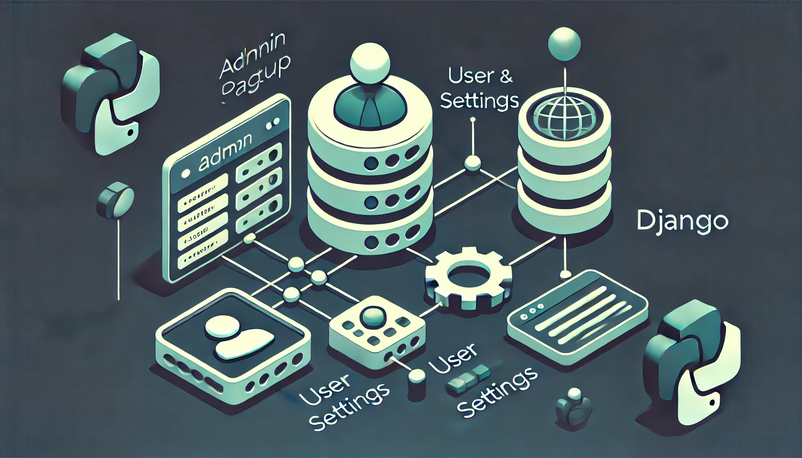
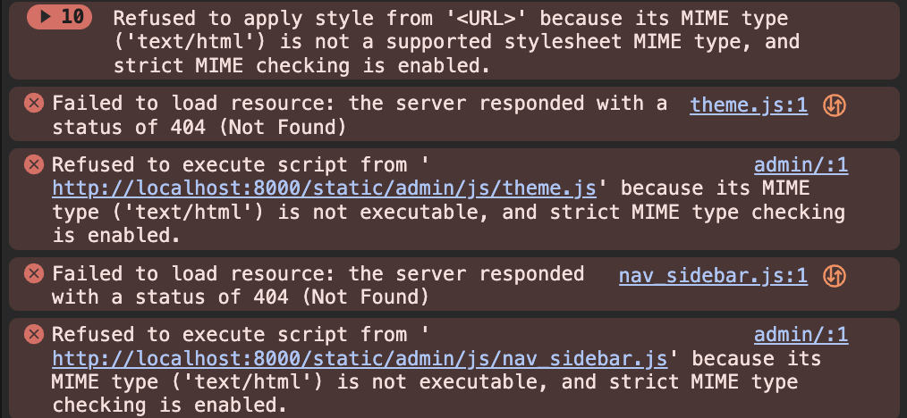

## 서론

Django의 설치가 끝났고 DB 연결까지 완료됐다면 Django의 관리자 페이지를 활성화 할 수 있습니다. 

### Django 관리자 페이지 소개 

Django 관리자 페이지는 웹 애플리케이션에서 데이터를 손쉽게 관리할 수 있도록 제공되는 **자동화된 백오피스**입니다. Django에서 기본적으로 제공하며, 별도의 코딩 없이도 **모델 데이터를 추가, 수정, 삭제**할 수 있는 UI를 제공합니다. 이 페이지는 개발자와 관리자가 데이터베이스를 직접 접근하지 않아도 웹 상에서 데이터 관리를 효율적으로 할 수 있도록 돕습니다.

### Django 관리자 페이지의 주요 기능

- 모델 관리: 데이터베이스에 정의된 모델 데이터를 관리할 수 있습니다.

- 사용자 관리: 관리자, 스태프 등의 사용자 권한을 설정하고 관리할 수 있습니다.

- 보안 기능: Django의 인증 및 권한 관리 기능과 연동되어 보안이 보장됩니다.

- 확장성: 커스터마이징이 가능해 필요한 기능을 추가하여 쉽게 확장할 수 있습니다.

Django 관리자 페이지는 기본적으로 제공되기 때문에, 간단한 설정만으로도 바로 사용할 수 있어 개발 속도를 높이고 데이터 관리의 효율성을 극대화할 수 있는 장점이 있습니다.

## 관리자 페이지 설정

관리자 페이지를 사용하기 위해서는 슈퍼유저를 생성해야 합니다. 슈퍼유저를 생성하기 위해서는 슈퍼유저 관리를 위한 기본 인증 테이블이 DB에 존재해야 합니다. 

만약 인증 테이블이 생성되지 않은 상태에서 createsuperuser를 실행한다면 

```bash
django.db.utils.ProgrammingError: relation "auth_user" does not exist
LINE 1: ...user"."is_active", "auth_user"."date_joined" FROM "auth_user...
```

의 오류가 발생합니다. 

따라서 `createsuperuser` 명령을 실행하기 전에 반드시 `migrate` 명령을 먼저 실행해 기본 테이블을 생성해줘야 합니다.

### 마이그레이션 적용

docker compse 환경에서의 명령어입니다. 

```bash
docker-compose -f {docker-compose yml 파일 경로} run web python manage.py migrate
```

### Superuser 설정

```bash
docker-compose -f {docker-compose yml 파일 경로} run web python manage.py createsuperuser
```

명령을 실행하면, 아래와 같이 관리자 계정에 필요한 정보를 입력하라는 메시지가 표시됩니다.

- 사용자명: 관리자 페이지에 로그인할 때 사용할 사용자명입니다.

- 이메일 주소: 계정과 연결할 이메일 주소입니다.

- 비밀번호: 로그인 시 사용할 비밀번호입니다. 두 번 입력하여 확인합니다.

각 정보를 입력한 후, 성공 메시지가 나타나면 슈퍼유저 생성이 완료된 것입니다.

## 관리자 페이지 접속

여기까지 마치면 생성한 계정을 통해 [http://localhost:8000/admin/](http://localhost:8000/admin/) 에 접속해서 로그인 할 수 있습니다. 

## 관리자 페이지의 깨짐

로그인은 되는데, 페이지 모양이 완전히 깨져서 나옵니다. 개발자 도구를 켜서 확인해보니 아래와 같은 오류들이 잔뜩 떠있습니다. 


이는 정적파일(static files)이 올바르게 수집되지 않아서 발생하는 문제입니다. 

### 정적 파일 수집 및 설정

Django는 기본적으로 관리자 페이지에 필요한 JavaScript와 CSS 같은 정적 파일을 서빙하기 위해 collectstatic 명령을 사용합니다. 이 명령어를 통해 모든 정적 파일을 프로젝트의 STATIC\_ROOT 디렉토리에 모으고, 웹 서버가 이를 제공할 수 있도록 합니다.

#### STATIC\_ROOT 설정 확인

`settings.py`에서 `STATIC_ROOT`가 다음과 같이 설정되어 있는지 확인합니다. 이 경로로 모든 정적 파일이 모입니다.

```python
import os
BASE_DIR = os.path.dirname(os.path.dirname(os.path.abspath(__file__)))

STATIC_URL = '/static/'
STATIC_ROOT = os.path.join(BASE_DIR, 'staticfiles')
```

#### 정적 파일 수집

아래의 명령어를 사용해 정적 파일을 수집합니다. 

```bash
docker-compose -f ./docker/docker-compose.local.yml run web python manage.py collectstatic --noinput
```

#### urls.py 설정

개발 환경에서는 Django가 `/static/` 경로의 파일들을 직접 제공하도록 `urls.py`에 정적 파일 URL을 추가할 수도 있습니다.

```python

from django.conf import settings
from django.conf.urls.static import static
from django.contrib import admin
from django.urls import path

urlpatterns = [
    path("admin/", admin.site.urls),
]

if settings.DEBUG:
    urlpatterns += static(settings.STATIC_URL, document_root=settings.STATIC_ROOT)

```

위 설정이 완료되면 Django가 개발 모드에서 `/static/` 경로에 있는 파일들을 서빙할 수 있게 됩니다.

DEBUG == True 일때에만 작동하게 되어있음을 확인할 수 있습니다. 

Django에서 `urls.py` 설정을 개발 환경에서만 사용하는 이유는 정적 파일 서빙은 일반적으로 프로덕션 환경의 웹 서버(예: Nginx, Apache)가 담당하기 때문입니다. Django는 웹 애플리케이션을 제공하는 데 최적화되어 있으며, 정적 파일을 효율적으로 서빙하는 데는 적합하지 않습니다. 따라서, 개발 환경이 아닌 프로덕션 환경에서는 Django가 아닌 웹 서버가 정적 파일을 제공하도록 구성하는 것이 성능 면에서 더 효율적입니다.


