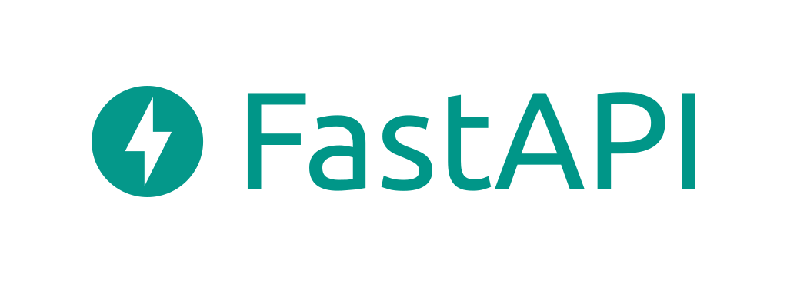

## 서론

FastAPI-Python을 새로운 프로젝트의 백엔드 언어로 선정하였습니다. 프로젝트 초기화 과정을 기록합니다. 

[poetry](https://sharknia.github.io/Poetry) 환경 구성은 이미 끝났다고 가정하고, 해당 라이브러리를 활용하여 환경을 꾸미겠습니다. 

## 필수라고 생각되는 라이브러리 설치

### FastAPI

FastAPI를 웹 프레임워크로 선정하였으니, 이를 먼저 설치해줍니다. 

```bash
poetry add fastapi
```

### Uvicorn

ASGI 서버로 FastAPI 애플리케이션을 호스팅하는 데 사용됩니다. FastAPI 공식 문서에서도 Uvicorn을 사용하는 것을 권장하고 있습니다.

```bash
poetry add uvicorn
```

### SQLAlchemy 2.0

이미 직전 회사에서 많은 일을 함께 겪었던 ~~(^^)~~ 든든한 동지네요. 이번에도 2.0을 설치는 하지만, 비동기 엔진은 절대 사용하지 않을 예정입니다. 아무튼 설치해줍니다. 

```bash
poetry add sqlalchemy@^2.0
```

### Alembic

SQLAlchemy를 위한 데이터베이스 마이그레이션 도구입니다. 데이터베이스 스키마 변경을 버전 관리할 수 있게 해줍니다. 지난 회사에서는 이 부분을 적용하지 못했었는데, 이번에는 잘 해보려고 합니다. 

```bash
poetry add alembic
```

### HTTPX

비동기 HTTP 클라이언트 라이브러리입니다. FastAPI 애플리케이션 내부에서 비동기적으로 외부 API 호출을 수행할 때 사용할 수 있습니다.

```bash
poetry add httpx
```

### Passlib & python-jose

보안 및 인증을 위한 라이브러리입니다. Passlib는 비밀번호 해싱을, python-jose는 JWT(JSON Web Tokens) 생성 및 검증을 위해 사용됩니다. 기본적으로 JWT 토큰을 사용하게 될 것 같으므로 설치해줍니다. Zsh가 괄호 `[]`를 특별한 패턴으로 해석하기 때문에 위와는 설치 명령어가 조금 다릅니다. 

```bash
poetry add 'passlib[bcrypt]' 'python-jose[cryptography]'
```

## 테스트 코드를 위한 라이브러리 설치

이번에도 프로젝트 작업시간이 굉장히 빡빡한데, 가능하면 TDD를 지켜보고 싶습니다. 가능할지 모르겠지만, 일단 라이브러리 설치는 해두려고 합니다. 해당 라이브러리들은 실서버 환경에서는 필요하지 않으므로 `--dev` 옵션을 붙여주겠습니다. 

### pytest

Python에서 가장 널리 사용되는 테스트 프레임워크 중 하나로, 강력한 기능과 플러그인 시스템을 제공합니다. 

```bash
poetry add --dev pytest
```

### pytest-asyncio

비동기 코드를 위한 pytest 플러그인으로, asyncio를 사용하는 비동기 함수를 테스트할 수 있게 해줍니다. FastAPI는 비동기 프레임워크이므로, 이 플러그인은 비동기 요청 및 비동기 데이터베이스 작업을 테스트하는 데 유용합니다.

```bash
poetry add --dev pytest-asyncio
```

### pytest-cov

코드 커버리지를 측정하기 위한 pytest 플러그인입니다. 테스트가 얼마나 많은 코드를 실행하는지를 분석하고, 테스트가 누락된 영역을 식별하는 데 도움을 줍니다.

```bash
poetry add --dev pytest-cov
```


