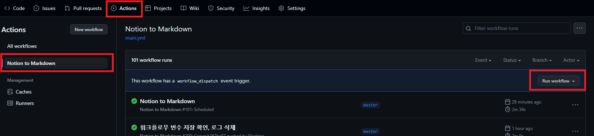

## 왜 필요한가?

깃허브 액션 워크플로우를 로컬에서 테스트하기가 쉽지 않습니다. 결국 깃허브 콘솔 또는 깃허브 CLI를 이용해서 테스트 하게 되는 경우가 대부분입니다. 

단순히 Re-Run을 실행하면, 레포에 변경된 내용이 반영되지 않고 그 당시 환경에 대해서만 재실행이 되어 정상적인 테스트가 불가능합니다. 

결국 트리거에 Push 조건을 걸어놓고, 변경 사항을 만들어서 Push를 해서 워크플로우를 테스트 하고 있었습니다. 

그런데, 수동으로 깃허브 웹 콘솔에서 수동으로 워크플로우를 테스트 할 수 있게 해주는 방법이 있습니다. 

## 워크플로우 파일 수정

트리거에 `workflow_dispatch` 이벤트를 추가해줍니다. 

```yaml
on:
    workflow_dispatch:
```

## 수동으로 워크플로우 수동으로 실행

위의 이벤트를 트리거에 추가해주고, 웹 콘솔에서 다음의 화면으로 이동합니다. 


Actions 탭 - 수정된 워크플로우로 이동하면 Run Workflow 버튼이 생긴 것을 볼 수 있습니다. 

특이사항으로, 혹시 워크플로우를 비활성화 한다면 해당 버튼도 활성화되지 않습니다. 

## 참조

[https://docs.github.com/ko/actions/using-workflows/manually-running-a-workflow?tool=webui](https://docs.github.com/ko/actions/using-workflows/manually-running-a-workflow?tool=webui)

