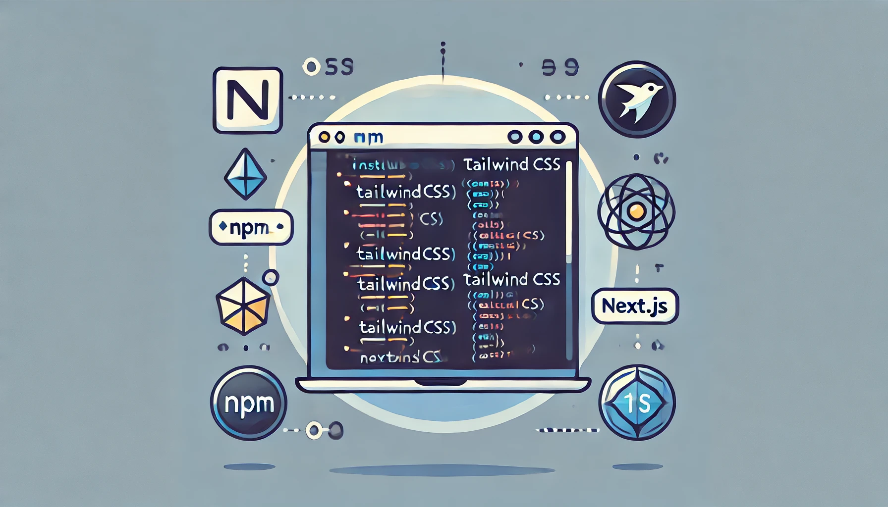

## Tailwind CSS 소개

Tailwind CSS는 유틸리티 기반의 CSS 프레임워크로, 미리 정의된 클래스를 사용하여 빠르고 쉽게 스타일링할 수 있게 해줍니다. 전통적인 CSS 프레임워크와 달리, Tailwind는 사용자가 CSS를 작성하는 방식에 혁신을 가져왔습니다. 각 클래스는 단일 속성과 값을 가지고 있어, 더 나은 유지보수성과 높은 재사용성을 제공합니다.

#### 장점

1. 빠른 개발 속도: 미리 정의된 유틸리티 클래스를 사용하여 빠르게 스타일링할 수 있습니다.

1. 작은 파일 크기: 사용되지 않는 CSS를 제거하여 최종 CSS 파일 크기를 최소화합니다.

1. 일관성: 클래스 이름이 직관적이고 일관성이 있어 코드를 쉽게 읽고 이해할 수 있습니다.

#### 단점

1. 초기 학습 곡선: Tailwind의 유틸리티 클래스 시스템에 익숙해지기까지 시간이 걸릴 수 있습니다.

1. HTML 코드의 가독성 저하: 많은 클래스를 사용할 경우 HTML 코드가 복잡해질 수 있습니다.

## Tailwind UI

Tailwind UI는 Tailwind CSS를 기반으로 구축된 고급 UI 컴포넌트 라이브러리입니다. Tailwind UI는 다양한 범주의 컴포넌트를 제공하여, 개발자가 빠르고 쉽게 아름다운 사용자 인터페이스를 만들 수 있도록 돕습니다. Tailwind UI는 유료 라이브러리지만, 시간과 비용을 절약할 수 있는 강력한 도구입니다.

#### 장점

1. 디자인 품질: 고품질의 디자인을 제공하여, 디자이너 없이도 아름다운 UI를 만들 수 있습니다.

1. 생산성 향상: 미리 준비된 컴포넌트를 사용하여 개발 시간을 단축할 수 있습니다.

1. 커스터마이징 가능: Tailwind CSS의 모든 유틸리티 클래스를 사용하여 쉽게 커스터마이징할 수 있습니다.

#### 단점

1. 비용: Tailwind UI는 유료 라이브러리입니다.

1. 의존성: Tailwind CSS에 대한 의존성이 있어, Tailwind를 사용하지 않는 프로젝트에서는 사용이 어렵습니다.

## Tailwind CSS 설치

Tailwind CSS를 Next.js 프로젝트에 설치하려면 다음 명령어를 사용합니다.

```shell
npm install -D tailwindcss postcss autoprefixer
```

그런 다음 Tailwind CSS와 PostCSS의 초기 설정을 수행합니다.

```shell
npx tailwindcss init -p
```

### PostCSS?

PostCSS는 CSS를 변환하기 위한 도구로, 다양한 플러그인을 통해 CSS 코드의 처리를 자동화할 수 있습니다. Tailwind CSS는 PostCSS 플러그인을 통해 CSS 파일을 처리하고, 필요한 유틸리티 클래스들을 생성합니다. Tailwind CSS는 PostCSS를 사용하여 컴파일 타임에 유틸리티 클래스들을 자동으로 생성하고, 사용되지 않는 CSS를 제거하는 등 여러 작업을 수행합니다.

### Autoprefixer?

Autoprefixer는 PostCSS 플러그인 중 하나로, CSS에 자동으로 공급 업체 접두사를 추가하여 브라우저 간의 호환성을 보장합니다. 예를 들어, CSS에서 `display: flex`를 사용하면 Autoprefixer가 이를 다양한 브라우저에 맞게 `webkit-` 또는 `ms-`와 같은 접두사를 추가하여 변환해줍니다.

### globals.css 수정

Next.js에서 globals.css 파일은 전역 스타일을 정의하는 데 사용됩니다. 이 파일에 작성된 CSS는 Next.js 애플리케이션의 모든 페이지와 컴포넌트에 적용됩니다. 주로 기본적인 스타일 설정, 공통 레이아웃, 기본 타이포그래피, 공통 유틸리티 클래스 등을 정의하는 데 사용됩니다.

Tailwind CSS를 사용하기 위해 `globals.css` 파일에 다음 내용을 추가합니다.

```css
@tailwind base;
@tailwind components;
@tailwind utilities;
```

### `tailwind.config.js`  수정

또한 `tailwind.config.js` 파일을 수정하여 Tailwind가 CSS 클래스 생성을 위해 검색할 파일 경로를 지정합니다.

```javascript
/** @type {import('tailwindcss').Config} */
module.exports = {
  content: [
    "./app/**/*.{js,ts,jsx,tsx,mdx}",
    "./pages/**/*.{js,ts,jsx,tsx,mdx}",
    "./components/**/*.{js,ts,jsx,tsx,mdx}",

    // Or if using `src` directory:
    "./src/**/*.{js,ts,jsx,tsx,mdx}",
  ],
  theme: {
    extend: {},
  },
  plugins: [],
}
```

## VS Code 확장 설치

프로젝트 개발을 더 편리하게 하기 위해 다음 VS Code 확장을 설치합니다:

- PostCSS Language Support: PostCSS 파일을 편집할 때 문법 강조와 같은 기능을 제공합니다.

- Tailwind CSS IntelliSense: Tailwind CSS 클래스 이름 자동 완성 및 툴팁을 제공합니다.

## 참조

[https://tailwindcss.com/docs/guides/nextjs](https://tailwindcss.com/docs/guides/nextjs)


