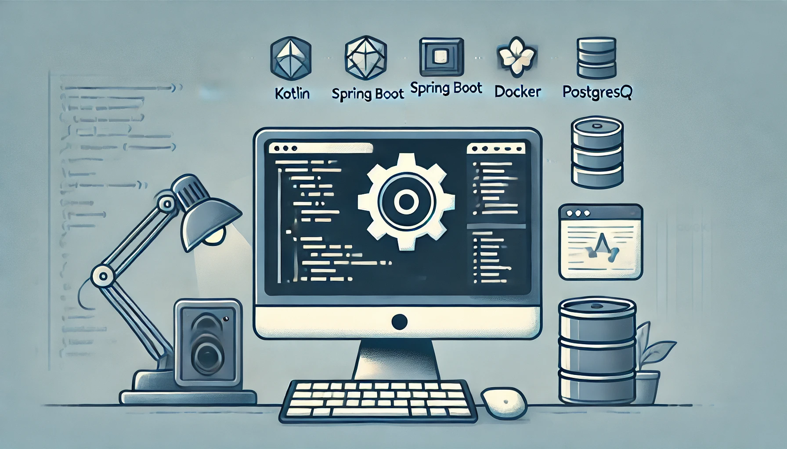
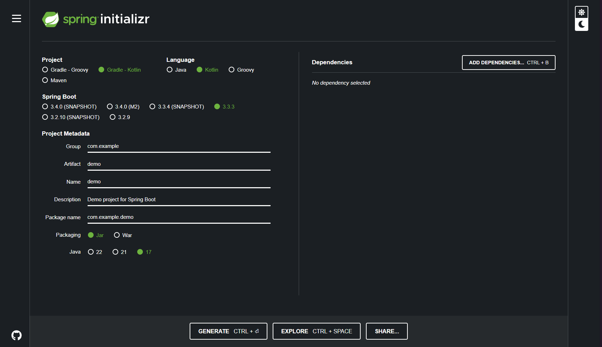

## 서론

한국에서 자바와 스프링은 대세중의 대세입니다. 

구인풀도 넓고, 자료도 많고, 검증된 안정성으로 다른 언어로 시작한 회사들도 스프링 기반으로 백엔드 서버를 바꾸는 일도 많습니다. 

처음에 자바는 뭔가 C랑 다르게 생기고 그래서 거부감도 많았었는데, 최근 이것저것 다른 언어나 프레임워크를 써보다 보니 상대적으로 낯을 덜 가리게 되어서 한 번 그냥 써볼까 합니다. 

또 코틀린이 자바보다 현대적이고 간결하다 하니, 굳이 묘한 거부감에서 여태까지 부리던 고집을 유지할 필요가 없을 것 같습니다. 

그래서 이번 프로젝트는 정말 끝내는걸 목표로! 코틀린-스프링으로 진행해보려고 합니다. 

## 프로젝트 초기화

스프링 부트(Sprint Boot)는 빠르게 프로젝트를 설정할 수 있는 다양한 방법을 제공합니다. 가장 쉬운 방법은 Spring Initializr를 사용하는 것입니다. 다음은 Spring Initializr를 사용하여 코틀린 프로젝트를 설정하는 방법입니다. 

### Spring Initializr


[Spring Initializr](https://start.spring.io/)는 스프링 부트 프로젝트를 생성할 수 있는 웹 도구입니다. 여기서 필요한 의존성과 설정을 선택하면, 프로젝트가 자동으로 생성됩니다.

### 각 항목에 대한 설명

#### Project

- Gradle - Groovy: Gradle는 빌드 도구로, Groovy는 그 빌드 스크립트를 작성하는 언어입니다. Groovy 기반의 Gradle은 전통적인 방식으로 널리 사용됩니다.

- Gradle - Kotlin: Gradle을 사용하는데, 빌드 스크립트를 Kotlin 언어로 작성합니다. Kotlin DSL은 타입 안전성과 더 나은 IDE 지원을 제공합니다.

- Maven: 또 다른 빌드 도구로, XML 기반의 설정 파일을 사용합니다. Maven은 오랫동안 Java 프로젝트에서 널리 사용되어 왔으며, 설정이 직관적이라는 장점이 있습니다.

#### Language

- Java: 가장 널리 사용되는 JVM 언어로, Spring Boot 프로젝트에서 기본적으로 사용됩니다.

- Kotlin: JetBrains에서 개발한 현대적인 JVM 언어로, 간결하고 강력한 기능을 제공합니다. Spring Boot는 Kotlin과도 잘 통합되어 있으며, Kotlin의 간결한 문법을 활용할 수 있습니다.

- Groovy: 동적 타이핑을 지원하는 JVM 언어로, Gradle의 기본 스크립트 언어입니다. 코드가 간결하고 유연하며, 스크립팅 및 간단한 애플리케이션에 자주 사용됩니다.

#### Spring Boot Version

- 3.4.0 (SNAPSHOT): 최신 개발 중인 버전으로, 아직 안정화되지 않은 기능이 포함될 수 있습니다. 최신 기능을 테스트하거나 개발 단계에서 사용할 수 있습니다.

- 3.4.0 (M2): 마일스톤(Milestone) 버전으로, 안정화가 진행 중인 버전입니다. 새로운 기능이 도입될 예정이지만, 여전히 테스트와 피드백이 필요한 단계입니다.

- 3.3.4 (SNAPSHOT): 3.3.x 라인의 최신 개발 버전입니다. 마찬가지로 새로운 기능을 포함하지만, 아직 안정화되지 않았습니다.

- 3.3.3: 3.3.x 라인의 최신 안정 릴리스입니다. 버그 수정 및 안정화된 기능들이 포함되어 있습니다.

- 3.2.10 (SNAPSHOT): 3.2.x 라인의 최신 개발 버전으로, 3.2.x 라인에 대한 최신 기능을 포함하고 있지만, 안정화가 이루어지지 않았습니다.

- 3.2.9: 3.2.x 라인의 안정 릴리스로, 안정성과 신뢰성을 바탕으로 한 기능들이 포함되어 있습니다.


        안정된 개발을 원한다면 안정 릴리스(예: 3.2.9, 3.3.3)를 선택하는 것이 좋습니다.

    최신 기능을 테스트하고 싶다면 SNAPSHOT이나 Milestone 버전을 선택할 수 있습니다. 하지만 이러한 버전은 불안정할 수 있으므로, 프로덕션 환경에는 권장되지 않습니다.

#### Group

- Group ID는 프로젝트의 고유 식별자로, 주로 도메인 이름을 역순으로 사용합니다. 예를 들어, 도메인이 `example.com`이라면 `com.example`와 같이 설정됩니다. 이 값은 Maven 또는 Gradle에서 프로젝트를 식별하는 데 사용됩니다.

#### Artifact

- Artifact ID는 생성된 프로젝트의 이름입니다. 이 이름은 빌드된 결과물(JAR 파일 등)의 이름이 됩니다. 보통 프로젝트의 이름으로 설정하며, 고유해야 합니다.

#### Name

- 프로젝트의 이름을 설정하는 항목으로, 일반적으로 Artifact와 동일하게 설정합니다. IDE나 빌드 도구에서 프로젝트 이름으로 표시됩니다.

#### Description

- 프로젝트에 대한 간단한 설명을 작성하는 곳입니다. 이 설명은 주로 프로젝트의 목적이나 내용을 요약합니다.

#### Package Name

- 패키지 이름은 Java/Kotlin 파일의 기본 패키지 경로를 지정합니다. 보통 Group과 Artifact를 결합하여 만듭니다. 예를 들어, `com.example.demo`와 같이 설정합니다. 모든 소스 파일이 이 패키지 하위에 생성됩니다.

#### Packaging

프로젝트의 결과물 형식을 선택하는 항목입니다.

- Jar: 대부분의 스프링 부트 프로젝트에서 사용되는 기본 형식으로, 애플리케이션을 실행 가능한 단일 JAR 파일로 패키징합니다.

- War: 기존의 서블릿 컨테이너(예: Tomcat, Jetty)에 배포하기 위한 웹 애플리케이션 아카이브(WAR) 파일 형식입니다.

#### **Java Version**

- 프로젝트에서 사용할 자바의 버전을 선택하는 항목입니다. 최신 자바 기능을 사용하거나 기존 호환성을 유지하기 위해 버전을 선택합니다. Spring Boot 3.x 이상에서는 자바 17 이상이 요구됩니다.

- 17버전을 사용하겠습니다. 

### **Dependencies**

Dependencies는 프로젝트에서 필요로 하는 외부 라이브러리나 프레임워크를 의미합니다. 프로젝트가 의존하는 모든 외부 코드를 관리하고, 해당 의존성들이 올바르게 설치되고 사용될 수 있도록 돕습니다. 이것은 NPM(Node Package Manager)에서 JavaScript 라이브러리를 설치하고 관리하는 것과 매우 유사합니다.
일단 저는 다음의 의존성을 설치하려고 합니다. 

#### Spring Web

RESTful API 개발을 위한 기본적인 웹 기능을 제공합니다. 이 의존성을 추가하면 Spring MVC와 함께 HTTP 요청을 처리할 수 있습니다.

#### Spring Data JPA

데이터베이스 접근을 쉽게 할 수 있도록 도와줍니다. JPA를 사용해 객체 지향적으로 데이터베이스를 다룰 수 있으며, 이와 함께 추가적으로 사용할 데이터베이스 드라이버가 필요합니다.

#### PostgreSQL Driver

PostgreSQL 데이터베이스와 연결하기 위한 드라이버입니다. Spring Data JPA와 함께 사용되어 데이터베이스 연동이 가능합니다.

<hr style="border: none; height: 1px; background-color: #e0e0e0; margin: 16px 0;" />
추가로 다음의 JWT 인증을 사용할 예정이므로 다음의 의존성을 설치합니다. 

#### Spring Security

애플리케이션에 보안 기능을 추가하고자 할 때 유용합니다. 기본적인 인증 및 권한 부여 기능을 손쉽게 설정할 수 있습니다.

#### Jackson Module Kotlin

JSON을 코틀린 데이터 클래스에 매핑할 때 유용한 라이브러리입니다. 코틀린에서 JSON 데이터를 처리할 때 직렬화/역직렬화 작업을 쉽게 할 수 있습니다.

해당 의존성은 Spring Initializr에서는 기본적으로 표시되지 않으므로, 추후 `build.gradle.kts` 에서 추가하겠습니다. 

### 의존성 관리

Spring Initializr를 통해 프로젝트를 생성할 때, 위의 의존성을 선택하여 프로젝트를 생성하면 자동으로 `build.gradle.kts`에 해당 의존성들이 추가됩니다. 또는, 이미 생성된 프로젝트에 의존성을 추가하고 싶다면, `build.gradle.kts` 파일에 다음과 같이 추가할 수 있습니다.

```kotlin
dependencies {
    implementation("org.springframework.boot:spring-boot-starter-web")
    implementation("org.springframework.boot:spring-boot-starter-data-jpa")
    implementation("org.postgresql:postgresql")
    implementation("com.fasterxml.jackson.module:jackson-module-kotlin")
    developmentOnly("org.springframework.boot:spring-boot-devtools")
    testImplementation("org.springframework.boot:spring-boot-starter-test")
}
```

### 생성 및 프로젝트 구조 확인

GENERATE를 누르면 파일이 다운로드됩니다. 

VS Code에서 프로젝트를 열면 다음과 같은 기본 폴더와 파일들이 있습니다. 

- `src/main/kotlin/`: 이 폴더 아래에 Kotlin 소스 코드가 위치합니다.

- `src/main/resources/`: 설정 파일 및 리소스 파일들이 위치합니다.

- `build.gradle.kts`: 프로젝트의 빌드 설정을 관리하는 파일입니다.

- `application.properties` 또는 `application.yml`: 애플리케이션 설정을 관리하는 파일입니다.

## 서버 실행

로컬에 JVM을 설치하지 않고 도커와 `docker-compose`를 활용하여 스프링 부트 서버와 PostgreSQL 데이터베이스를 컨테이너로 실행해보려고 합니다. 

이렇게 하면 애플리케이션을 완전 격리된 환경에서 실행할 수 있어 이로 인해 개발, 테스트, 배포 환경 간의 일관성을 유지할 수 있으며, "내 로컬에서는 잘 되는데 서버에서는 왜 안 될까?" 같은 문제를 줄일 수 있습니다.

다만, 이렇게 할 경우에는 애플리케이션 디버깅이 좀 더 어려워지는 문제가 생길 수 있는데, 일단 이렇게 해보려고 합니다. 

### 환경 변수 설정

#### .env 파일

환경 변수 관리를 위해 .env 파일을 사용하겠습니다. 

```makefile
POSTGRES_DB=yourdbname
POSTGRES_USER=yourusername
POSTGRES_PASSWORD=yourpassword

DB_URL=jdbc:postgresql://db:5432/${POSTGRES_DB}
DB_USER=${POSTGRES_USER}
DB_PASSWORD=${POSTGRES_PASSWORD}
```

#### application.properties 파일

application.properties에 DB 연결을 위한 다음의 내용을 추가합니다. 

```bash
# 데이터베이스 연결 설정
spring.datasource.url=${DB_URL}
spring.datasource.username=${DB_USER}
spring.datasource.password=${DB_PASSWORD}
spring.datasource.driver-class-name=org.postgresql.Driver
```

### Dockerfile 작성

스프링 부트 애플리케이션을 도커 이미지로 빌드할 수 있도록 Dockerfile을 작성합니다.

```docker
# Gradle 빌드 단계
FROM gradle:7.6.1-jdk17 as build
WORKDIR /app
COPY . /app
RUN gradle bootJar

# 런타임 단계
FROM openjdk:17-slim
WORKDIR /app
COPY --from=build /app/build/libs/*.jar app.jar
ENTRYPOINT ["java", "-jar", "app.jar"]
```

이 Dockerfile은 두 가지 단계로 구성됩니다:

- 빌드 단계: Gradle을 사용하여 애플리케이션을 빌드합니다.

- 런타임 단계: 빌드된 JAR 파일을 경량의 OpenJDK 이미지에서 실행합니다.

#### openjdk:17-alpine과 맥북

`openjdk:17-alpine` 를 사용할 경우 애플 실리콘 기반의 맥북에서 docker-compose build를 실행할 경우 

```bash
failed to solve: openjdk:21-alpine: docker.io/library/openjdk:21-alpine: not found
```

오류가 발생합니다. 이는 `alpine`의 특성으로 `alpine` 기반 이미지는 특히 경량화되어 있어, 특정 아키텍처에 맞춘 바이너리만 포함하고 있을 수 있습니다. 따라서 ARM 기반 시스템에서 `alpine` 이미지를 사용할 때 호환성 문제가 발생할 수 있습니다.

따라서 `slim` 이미지로 교체 해주었습니다. `slim` 이미지는 `alpine`보다 약간 더 크지만, 다양한 플랫폼에서의 호환성이 더 좋습니다.

### docker-compose.yml 작성

`docker-compose.yml` 파일을 사용하여 스프링 부트 애플리케이션과 PostgreSQL을 각각 컨테이너로 실행합니다.

```yaml
version: '3.8'

services:
    app:
        build: .
        ports:
            - '3000:8080'
        env_file:
            - .env
        depends_on:
            - db

    db:
        image: postgres:15
        env_file:
            - .env
        ports:
            - '5432:5432'
        volumes:
            - db_data:/var/lib/postgresql/data

volumes:
    db_data:

```

이 파일은 두 개의 서비스를 정의합니다:

- app: 스프링 부트 애플리케이션을 실행하는 컨테이너

- db: PostgreSQL 데이터베이스를 실행하는 컨테이너

## 컨테이너 실행 및 테스트

