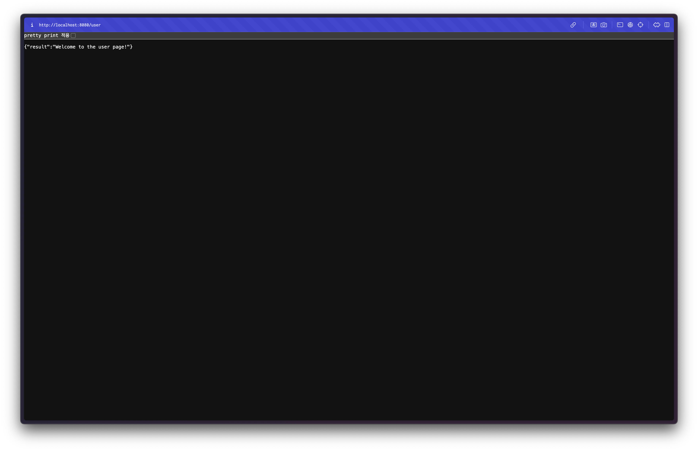

## 서론

해당 프로젝트의 역할은 Rest API Backend 서버입니다. 본연의 역할을 위해 먼저 간단하게 Get 메소드에 대한 요청을 처리하는 컨트롤러를 정의해보겠습니다. 

## user 컨트롤러

프로젝트 구조는 [DDD](https://sharknia.github.io/FastAPI와-DDD)를 따라 정의할 예정입니다. 따라서 먼저 user 패키지를 정의하고, 그 안에 `Controller.kt` 파일을 생성해주고 다음과 같이 GET 요청을 처리할 컨트롤러를 작성했습니다. 

```kotlin
package world.nolog.nolog_world.user

import org.springframework.web.bind.annotation.GetMapping
import org.springframework.web.bind.annotation.RequestMapping
import org.springframework.web.bind.annotation.RestController

data class HelloResponse(val result: String)

@RestController
@RequestMapping("/user")  // 공통 경로 설정
class HelloController {
    // /user 경로를 처리
    @GetMapping
    fun userRoot(): HelloResponse {
        return HelloResponse(result = "Welcome to the user page!")
    }

    // /user/hello 경로를 처리
    @GetMapping("/hello")
    fun hello(): HelloResponse {
        return HelloResponse(result = "hello world!~~")
    }

}
```

### 코드 분석

```kotlin
package world.nolog.nolog_world.user

import org.springframework.web.bind.annotation.GetMapping
import org.springframework.web.bind.annotation.RequestMapping
import org.springframework.web.bind.annotation.RestController
```

- `package world.nolog.nolog_world.user`: `HelloController` 클래스가 속해 있는 패키지 경로를 정의합니다. 일반적으로 프로젝트 구조에 따라 패키지가 설정됩니다.

- `import` 구문: 스프링 웹 어노테이션인 `@GetMapping`, `@RequestMapping`, `@RestController`를 가져옵니다. 이는 HTTP 요청을 처리하기 위한 스프링 웹의 주요 어노테이션입니다.

<hr style="border: none; height: 1px; background-color: #e0e0e0; margin: 16px 0;" />
```kotlin
data class HelloResponse(val result: String)
```

- `data class HelloResponse`: JSON 응답으로 반환될 데이터를 담는 간단한 코틀린 데이터 클래스입니다. `result`라는 이름의 문자열 필드 하나를 가집니다. 스프링 부트는 이 `data class`를 자동으로 JSON 형식으로 변환하여 클라이언트에게 반환합니다.

<hr style="border: none; height: 1px; background-color: #e0e0e0; margin: 16px 0;" />
```kotlin
@RestController
@RequestMapping("/user")  // 공통 경로 설정
class HelloController {
```

- `@RestController`: 이 클래스가 스프링의 RESTful 웹 API를 처리하는 컨트롤러임을 명시합니다.

- `@RequestMapping("/user")`: `/user` 경로로 들어오는 HTTP 요청을 이 컨트롤러가 처리하게 합니다. 즉, 이 컨트롤러 내의 모든 메소드가 기본적으로 `/user` 경로를 가집니다.

<hr style="border: none; height: 1px; background-color: #e0e0e0; margin: 16px 0;" />
```kotlin
    // /user 경로를 처리
    @GetMapping
    fun userRoot(): HelloResponse {
        return HelloResponse(result = "Welcome to the user page!")
    }
```

- `@GetMapping`: 경로를 명시하지 않으면 기본 경로인 `/user`로 들어오는 GET 요청을 처리합니다.

- `userRoot`: 함수 이름은 임의로 지정된 이름입니다. 이 함수가 `/user` 경로로 들어오는 요청을 처리하며, `HelloResponse` 객체를 반환합니다.

- `return HelloResponse(result = "Welcome to the user page!")`: `"Welcome to the user page!"`라는 값을 담은 `HelloResponse` 객체를 반환하여, 이를 JSON 응답으로 반환합니다.

<hr style="border: none; height: 1px; background-color: #e0e0e0; margin: 16px 0;" />
```kotlin
    // /user/hello 경로를 처리
    @GetMapping("/hello")
    fun hello(): HelloResponse {
        return HelloResponse(result = "hello world")
    }
```

- `@GetMapping("/hello")`: `/user/hello` 경로로 들어오는 GET 요청을 처리합니다.

- `hello`: 마찬가지로 함수 이름은 임의로 지정되었습니다. 이 함수가 `/user/hello` 경로로 들어오는 요청을 처리하며, `HelloResponse` 객체를 반환합니다.

- `return HelloResponse(result = "hello world!~~")`: `"hello world"`라는 값을 담은 `HelloResponse` 객체를 반환하여, 클라이언트에게 JSON 응답으로 보냅니다.

## API 테스트

`/user` 경로로 접속하면 다음과 같은 화면을 볼 수 있습니다. 


## Springdoc OpenAPI

API 문서는 협업때도 그렇고, 테스트를 위해서도 중요한 작업입니다. Django를 할 때에는 Swagger를 사용해서 API를 구현하면 자동으로 문서화가 되는 기능을 사용했었는데, Spring에도 비슷한 게 있습니다. Springdoc OpenAPI 입니다. 

### 소개

Springdoc OpenAPI는 Swagger/OpenAPI 3.0 사양을 지원하는 라이브러리로, 스프링 부트 애플리케이션과 잘 통합됩니다.
설정이 매우 간단하고, 최신 OpenAPI 3.0 사양을 사용할 수 있습니다.
REST API 문서와 UI를 자동으로 생성해 주며, API 테스트도 가능합니다.

### 설치

다음의 의존성을 추가합니다. 

```kotlin
dependencies {
		implementation("org.springdoc:springdoc-openapi-starter-webmvc-ui:2.0.2")
}
```

그리고 다음의 설정 클래스를 선언합니다. config 패키지를 생성해서 그 안에 넣어주었습니다. 

```kotlin
package world.nolog.package.config

import io.swagger.v3.oas.models.Components
import io.swagger.v3.oas.models.OpenAPI
import io.swagger.v3.oas.models.info.Info
import org.springframework.context.annotation.Bean
import org.springframework.context.annotation.Configuration


@Configuration
class SwaggerConfig {
    @Bean
    fun openAPI(): OpenAPI {
        return OpenAPI()
            .components(Components())
            .info(apiInfo())
    }

    private fun apiInfo(): Info {
        return Info()
            .title("Springdoc 테스트")
            .description("Springdoc을 사용한 Swagger UI 테스트")
            .version("1.0.0")
    }
}
```

이후  [http://localhost:8080/swagger-ui/index.html](http://localhost:8080/swagger-ui/index.html) 경로에서 Swagger UI로 API를 확인할 수 있습니다.


### 작동 원리

Springdoc OpenAPI는 Spring Web MVC 또는 Spring WebFlux와 통합되어, 컨트롤러 클래스와 그 안의 메서드에 있는 어노테이션을 기준으로 API 엔드포인트를 수집합니다. 이를 통해, 정의된 API 명세서를 자동으로 생성하고 Swagger UI에 보여줄 수 있습니다.

다음은 Springdoc OpenAPI가 API 엔드포인트를 수집하는 기준입니다. 기본적으로 모든 컨트롤러 클래스와 매핑된 모든 메서드가 자동으로 API 문서에 포함됩니다. 특정 API를 문서화에서 제외하고 싶다면, `@Hidden` 어노테이션을 사용하여 OpenAPI 명세에서 해당 엔드포인트를 숨길 수 있습니다.

#### 스프링 컨트롤러 클래스 (`@RestController`, `@Controller`)

- `@RestController` 또는 `@Controller` 어노테이션이 붙은 클래스에서 API 엔드포인트를 수집합니다.

- 일반적으로 이 클래스에서 HTTP 요청 경로를 정의하는 메서드를 찾습니다.

#### HTTP 요청 매핑 어노테이션

- `@GetMapping`, `@PostMapping`, `@PutMapping`, `@DeleteMapping`, `@PatchMapping`, `@RequestMapping`과 같은 스프링의 HTTP 요청 매핑 어노테이션이 있는 메서드를 API로 수집합니다.

- **이 어노테이션들에 의해 정의된 HTTP 메서드와 경로 정보가 OpenAPI 문서로 변환됩니다.**

### 더 상세한 문서 만들기

이렇게만 해도 정의된 REST API들을 수집하여 자동으로 문서화합니다. 그러나 원활한 협업을 위해서는 더 자세한 문서를 작성해야 하는 경우가 많습니다. 다음은 그 문서를 작성하는 방법입니다. Springdoc OpenAPI에서 제공하는 대표적인 어노테이션들은 다음과 같습니다. 

#### `@Operation` 어노테이션

API 엔드포인트에 대한 핵심 정보를 문서화하는 데 사용됩니다. 각 엔드포인트에 대한 간단한 설명(summary)과 자세한 설명(description)을 추가할 수 있으며, 이 설명은 Swagger UI에 표시되어 API 사용자를 위한 안내로 제공됩니다.

- `summary`: API 엔드포인트의 간략한 설명을 제공.

- `description`: API의 상세 설명을 제공하여 어떤 용도로 사용되는지 안내.

- `tags`: API를 그룹화할 수 있는 태그를 설정. 이 태그를 이용해 API 문서를 논리적으로 분리할 수 있습니다.

#### `@ApiResponse` 어노테이션

API의 응답 결과에 대해 상세히 설명하는 데 사용됩니다. 각 API가 어떤 응답 코드와 응답 메시지를 반환하는지 문서화할 수 있습니다. 이 정보는 성공 시 응답뿐만 아니라 오류 응답도 함께 정의하여, API 사용자가 오류 상황에 대한 정보를 명확히 알 수 있게 해줍니다.

- `responseCode`: 응답 코드 (HTTP 상태 코드)를 명시.

- `description`: 해당 응답 코드에 대한 설명을 제공.

- `content`: 반환되는 데이터의 타입이나 스키마를 정의할 수 있습니다.

#### `@Parameter` 어노테이션

API 메서드의 파라미터를 문서화할 때 사용됩니다. 주로 URL 경로에 포함된 경로 변수나 쿼리 파라미터, 요청 본문에서 사용하는 데이터를 더 명확히 설명하는 데 유용합니다. 이를 통해 API 사용자는 각 파라미터가 어떤 역할을 하는지, 필수인지 여부를 쉽게 이해할 수 있습니다.

- `name`: 파라미터의 이름을 명시.

- `description`: 파라미터에 대한 설명을 제공.

- `required`: 필수 여부를 정의.

- `example`: 파라미터의 예시값을 설정하여 문서에 추가.

#### `@Schema`

DTO 클래스나 특정 필드의 구조를 문서화할 때 사용합니다. 이 어노테이션을 사용하면 각 필드에 대해 설명을 추가할 수 있으며, 데이터 타입이나 예시값을 명시할 수 있습니다.

- `description`: 각 필드의 의미를 설명.

- `example`: 필드의 예시값을 제공하여 API 사용자가 쉽게 이해할 수 있도록 합니다.

#### `@``RequestBody`

요청 본문에 포함되는 데이터를 설명하는 데 사용됩니다.

- `description`: 각 필드의 의미를 설명.

- `example`: 필드의 예시값을 제공하여 API 사용자가 쉽게 이해할 수 있도록 합니다.

### 어노테이션을 모두 활용한 API 문서 예제 

```kotlin
import io.swagger.v3.oas.annotations.Operation
import io.swagger.v3.oas.annotations.Parameter
import io.swagger.v3.oas.annotations.responses.ApiResponse
import io.swagger.v3.oas.annotations.responses.ApiResponses
import io.swagger.v3.oas.annotations.media.Schema
import org.springframework.http.ResponseEntity
import org.springframework.web.bind.annotation.GetMapping
import org.springframework.web.bind.annotation.PathVariable
import org.springframework.web.bind.annotation.RequestParam
import org.springframework.web.bind.annotation.RestController

@RestController
class UserController {

    @Operation(
        summary = "Get user by ID",
        description = "Returns user details based on the user ID provided.",
        tags = ["User"]
    )
    @ApiResponses(
        value = [
            ApiResponse(responseCode = "200", description = "Successfully retrieved user"),
            ApiResponse(responseCode = "400", description = "Invalid user ID supplied"),
            ApiResponse(responseCode = "404", description = "User not found"),
            ApiResponse(responseCode = "500", description = "Internal server error")
        ]
    )
    @GetMapping("/user/{id}")
    fun getUserById(
        @Parameter(
            name = "id",
            description = "ID of the user to be retrieved",
            required = true,
            example = "1"
        )
        @PathVariable id: Long,
        
        @Parameter(
            name = "includeAddress",
            description = "Flag to include user's address in the response",
            required = false,
            example = "true"
        )
        @RequestParam(required = false, defaultValue = "false") includeAddress: Boolean
    ): ResponseEntity<User> {
        // 비즈니스 로직: 사용자 정보 조회
        return ResponseEntity.ok(
            User(
                id = id,
                name = "John Doe",
                email = "john.doe@example.com",
                address = if (includeAddress) "123 Main St, Springfield" else null
            )
        )
    }
}

data class User(
    @Schema(description = "User's unique ID", example = "123")
    val id: Long,

    @Schema(description = "User's full name", example = "John Doe")
    val name: String,

    @Schema(description = "User's email address", example = "john.doe@example.com")
    val email: String,

    @Schema(description = "User's physical address", example = "123 Main St, Springfield", nullable = true)
    val address: String? = null
)

```


