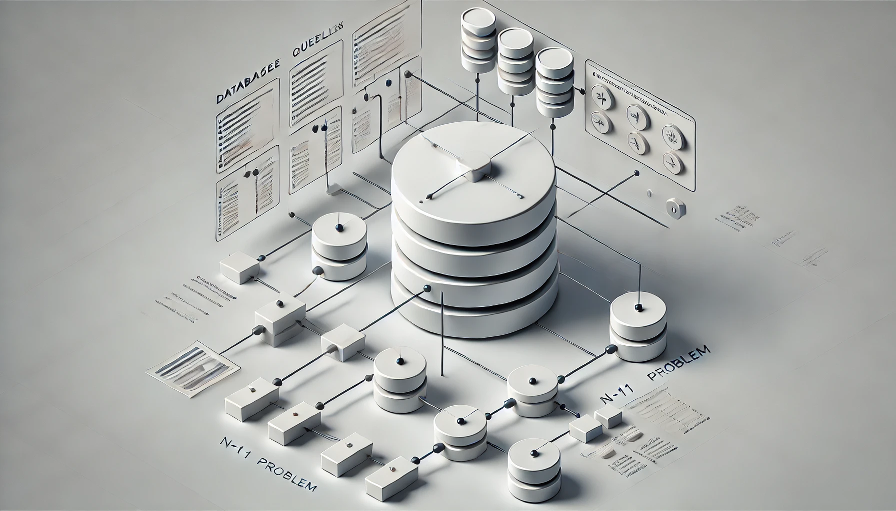

## N+1 문제란? 

N+1 문제는 주로 ORM(Object-Relational Mapping)과 관련된 성능 문제입니다. 이를 간단하게 설명하자면, N+1 문제는 하나의 쿼리를 실행한 후, 그 결과에 대해 추가적으로 N개의 쿼리를 실행하게 되어, 총 N+1번의 쿼리가 발생하는 상황을 말합니다.

Spring에서는 JPA나 Hibernate를 사용할 때 이 문제가 자주 발생합니다. 예를 들어, `1:N` 관계를 가진 두 개의 엔티티(예: `User`와 `Order`)가 있다고 가정해봅시다. `User` 리스트를 조회하면서 각 `User`의 `Order` 리스트를 조회해야 한다면, 처음에 `User` 엔티티를 조회하는 쿼리가 1번 발생하고, 각 `User`마다 `Order` 리스트를 조회하는 쿼리가 N번 발생하여 총 N+1번의 쿼리가 실행됩니다.

ORM을 사용하는 개발자가 쿼리 최적화에 대한 이해가 부족하거나, 기본 설정 그대로 사용할 경우 발생하는 문제라고 볼 수 있습니다. ORM은 기본적으로 객체 지향적인 방식으로 데이터베이스를 다루기 때문에, 개발자는 비즈니스 로직에 집중할 수 있습니다. 그러나 데이터베이스와의 상호작용 방식을 깊이 이해하지 못하면, 의도치 않게 비효율적인 쿼리를 작성하게 될 수 있는 거죠. N+1 문제도 이런 맥락에서 발생하는 대표적인 문제입니다.

## 원인

이 문제가 발생하는 주된 원인은 JPA에서 연관된 엔티티를 지연 로딩(Lazy Loading) 방식으로 가져올 때, 각 엔티티마다 별도의 쿼리를 실행하기 때문입니다. 이러한 방식은 데이터가 많아질수록 성능에 악영향을 끼칠 수 있습니다.

지연로딩은 연관된 엔티티를 실제로 필요할 때까지 로딩하지 않고, 그 시점에 쿼리를 실행하여 데이터를 불러오는 전략입니다. 이는 성능 최적화를 위해 설계된 방식이지만, 잘못 사용하면 오히려 성능 문제를 일으킬 수 있습니다.

```kotlin
@Entity
public class User {
    @OneToMany(mappedBy = "user", fetch = FetchType.LAZY)
    private List<Order> orders;
}
```

위와 같이 설정하면, `User` 엔티티를 조회할 때는 `Order` 리스트는 로딩되지 않습니다. `orders` 필드에 접근하는 시점에 Hibernate가 `Order` 데이터를 가져오기 위한 쿼리를 실행합니다. 즉, 필요한 순간에만 쿼리를 실행하는 방식입니다.

하지만 이 방식으로 여러 `User` 엔티티를 조회하고 각각의 `Order`에 접근하게 되면, 각 `User`에 대해 `Order`를 가져오는 쿼리가 N번 실행되어 N+1 문제가 발생할 수 있습니다. 

## 지연로딩(Lazy Loading)이란? 

지연로딩은 데이터베이스에서 실제로 데이터를 가져오는 시점을 지연시켜, 필요할 때만 데이터를 로드하는 방식입니다. 이 과정은 성능을 최적화하려는 목적에서 사용되지만, 상황에 따라 성능 저하를 유발할 수도 있습니다. 이제 지연로딩이 어떻게 작동하는지 좀 더 깊이 살펴보겠습니다.

### 프록시 객체(Proxy Object)

지연 로딩의 핵심은 프록시 객체입니다. Hibernate나 JPA와 같은 ORM 프레임워크는 데이터베이스에서 실제로 데이터를 가져오는 대신, 먼저 프록시 객체를 반환합니다. 이 프록시 객체는 실제 엔티티 클래스의 서브클래스 또는 대리 객체로, 데이터베이스에 접근하는 기능이 추가된 형태입니다.

프록시 객체는 해당 엔티티에 대한 모든 정보를 가지고 있지는 않지만, 메모리에 로드된 엔티티와 동일한 메서드와 필드를 갖고 있습니다. 필요할 때만 데이터베이스에서 실제 데이터를 가져오는 역할을 합니다.

### 필드 접근 시점에 쿼리 실행

지연 로딩의 핵심은 필드에 실제로 접근하는 시점에 데이터베이스 쿼리를 실행한다는 점입니다. 즉, 엔티티를 처음 로드할 때는 연관된 데이터는 로드되지 않고, 연관된 데이터에 접근하려고 할 때 비로소 데이터베이스에 쿼리를 실행하여 필요한 데이터를 가져옵니다.

예를 들어, `User` 엔티티와 `Order` 엔티티가 `1:N` 관계로 연결되어 있고, `Order` 필드가 지연 로딩으로 설정된 경우를 생각해봅시다.

```kotlin
@Entity
public class User {
    @OneToMany(fetch = FetchType.LAZY)
    private List<Order> orders;
}
```

이 경우, `User` 객체를 조회할 때 `orders`는 바로 로드되지 않습니다. 대신 프록시 객체가 생성되고, 이 `orders` 필드에 접근하는 순간 `SELECT` 쿼리가 실행되어 데이터베이스에서 `Order` 리스트를 가져옵니다.

```kotlin
User user = userRepository.findById(1L); // 여기서는 orders에 대한 쿼리 없음
List<Order> orders = user.getOrders();   // 이 시점에서 쿼리 실행
```

여기서 핵심은 **데이터에 접근하는 순간**에 쿼리가 실행된다는 점입니다.

#### Hibernate와 프록시 객체

Hibernate에서 프록시 객체는 데이터베이스에서 실제로 데이터를 로드할 때 메서드 호출을 가로챕니다. 예를 들어, `getOrders()` 메서드를 호출하면, Hibernate는 이 메서드 호출을 감지하고 해당 엔티티의 프록시가 아닌 실제 데이터를 로드하도록 동작합니다. 이를 통해 개발자는 메서드 호출 시점에 자연스럽게 데이터베이스와 상호작용하는 것처럼 느낍니다.

### 장점

- 불필요한 데이터 로드를 피함: 필요한 데이터만 로드하여 메모리 사용량을 줄일 수 있습니다. 특히, 연관된 데이터가 많을 때 불필요한 로드를 피할 수 있어 성능 향상에 도움이 됩니다.

- 성능 최적화: 모든 데이터를 한 번에 가져오는 대신, 실제로 필요한 시점에만 데이터를 가져오므로 초기 로드 시간이 줄어들 수 있습니다. 예를 들어, 대규모 연관 데이터를 갖는 엔티티를 매번 로드할 필요가 없을 때 유용합니다.

### 단점

- N+1 문제: 앞서 설명한 것처럼, 지연 로딩을 잘못 사용하면 하나의 엔티티를 가져오는 쿼리 외에 추가적으로 여러 번의 쿼리가 실행되어 성능 저하를 초래할 수 있습니다. `1:N` 관계에서 `N`개의 엔티티가 각각 추가적인 쿼리를 실행하게 되어 N+1 문제가 발생할 수 있습니다.

- 영속성 컨텍스트(Persistence Context)와의 연관성: 지연 로딩은 엔티티가 영속성 컨텍스트 안에 있을 때만 동작합니다. 만약 영속성 컨텍스트 밖에서(예: 트랜잭션이 종료된 후) 프록시 객체에 접근하면 `LazyInitializationException`이 발생할 수 있습니다. 이는 데이터를 로드할 수 있는 컨텍스트가 이미 종료되었기 때문입니다.

- 복잡한 쿼리와 성능 저하: 많은 연관 엔티티가 지연 로딩으로 설정되어 있을 때, 각 엔티티에 접근할 때마다 별도의 쿼리가 실행되므로 성능 저하를 초래할 수 있습니다. 이를 피하기 위해서는 상황에 맞게 `Fetch Join` 등을 사용해 즉시 로딩으로 전환하거나, 필요한 데이터를 한 번에 가져오는 전략이 필요합니다.

## 즉시 로딩(Eager Loading)

그렇다면 지연 로딩을 사용하지 않으면 모든 문제가 해결될까요? 

지연 로딩은 필요할 때만 데이터를 로드하는 반면, 즉시 로딩(Eager Loading)은 엔티티가 처음 로드될 때 관련된 모든 데이터를 즉시 로드합니다.

```kotlin
@Entity
public class User {
    @OneToMany(fetch = FetchType.EAGER)
    private List<Order> orders;
}
```

위와 같이 `FetchType.EAGER`로 설정된 경우, `User`를 조회할 때 `Order` 리스트도 함께 즉시 로딩됩니다. 이 방식은 N+1 문제를 피할 수 있지만, 불필요한 데이터까지 모두 로드하게 되어 메모리 사용량이 늘어날 수 있습니다.

## 즉시로딩 vs 지연로딩

로우 쿼리 레벨에서 이야기 한다면 즉시 로딩은 불필요하게 User 테이블을 조회할 떄마다 Join 해서 Order를 항상 다 가져오는거고, 지연 로딩은 User만 가지고 왔다가 Order가 필요할 때 뒤늦게 N개의 User에 대해 for 문을 돌면서 User별 Order를 가져오는 쿼리를 N번 실행해서 생기는 문제라고 이해할 수 있습니다. 

### 즉시로딩

`User` 테이블을 조회할 때마다 항상 `JOIN`을 사용해서 연관된 `Order` 테이블의 데이터를 함께 가져옵니다. 이 방식은 한 번의 쿼리로 필요한 데이터를 모두 가져올 수 있지만, `Order` 데이터를 필요로 하지 않는 경우에도 항상 `JOIN`이 발생해 불필요한 데이터까지 로드하게 되어 메모리나 성능상 오버헤드가 생길 수 있습니다.

이를 쿼리문으로 표시하면 다음과 같습니다. 

```sql
SELECT u.*, o.*
FROM User u
LEFT JOIN Order o ON u.id = o.user_id
```

### 지연로딩

처음에는 `User` 테이블만 조회하고, 연관된 `Order`는 실제로 필요할 때 그때서야 개별적으로 쿼리를 실행하여 데이터를 가져옵니다. 이로 인해 `User`를 조회한 후 `Order`가 필요해지면, 각 `User`별로 `Order`를 조회하는 추가적인 쿼리가 발생하게 됩니다. 만약 `N`명의 `User`가 있다면, `N`번의 추가 쿼리가 실행되며, 이로 인해 N+1 문제가 발생합니다.

이를 쿼리문으로 표시하면 다음과 같습니다. 

```sql
-- 처음에 User만 조회
SELECT * FROM User;

-- 나중에 각 User마다 Order를 조회 (N번 실행)
SELECT * FROM Order WHERE user_id = ?;
```

## N+1 문제의 해결 방법

### **레포지토리에 User와 Order를 조인해서 가져오는 메소드**와 **User만 가져오는 메소드**를 따로 만들기

이렇게 하면, 상황에 맞게 필요한 데이터만 가져올 수 있고, 불필요한 쿼리나 데이터 로드를 방지할 수 있습니다.

#### 예시

레포지토리에 각각의 메소드를 따로 작성할 수 있습니다.

- `User`만 조회하는 메소드

    이 메소드는 `User`만 가져오고, `Order`는 지연 로딩을 통해 나중에 필요할 때 가져오도록 설정할 수 있습니다.

    ```kotlin
    @Repository
    public interface UserRepository extends JpaRepository<User, Long> {
        // User만 조회하는 메소드
        @Query("SELECT u FROM User u")
        List<User> findAllUsers();
    }
    ```

- `User`와 `Order`를 함께 조회하는 메소드

    이 메소드는 `JOIN FETCH`를 사용하여 `User`와 연관된 `Order`를 한 번에 가져옵니다.

    ```kotlin
    @Repository
    public interface UserRepository extends JpaRepository<User, Long> {
        // User와 Order를 조인해서 조회하는 메소드
        @Query("SELECT u FROM User u JOIN FETCH u.orders")
        List<User> findAllUsersWithOrders();
    }
    ```

#### 장점

- 필요한 데이터만 로드

    - `User`만 필요한 경우 불필요한 `Order` 데이터를 가져오지 않기 때문에 쿼리가 간결하고 성능이 최적화됩니다.

    - 반대로, `User`와 `Order`가 모두 필요한 경우에는 조인을 통해 데이터를 한 번에 가져와서 N+1 문제를 방지할 수 있습니다.

- 쿼리 제어 가능

    - 각 메소드에서 쿼리의 동작 방식을 명시적으로 설정할 수 있으므로, ORM의 기본 동작(지연 로딩, 즉시 로딩 등)에 의존하지 않고 최적화된 방식으로 데이터 조회가 가능합니다.

#### 단점

- **메소드의 복잡성 증가**

    - 레포지토리에 여러 종류의 메소드를 추가하다 보면 코드가 복잡해질 수 있습니다. 특히, 다양한 쿼리 요구사항을 처리해야 하는 경우 메소드 수가 급격히 늘어나 관리가 어려워질 수 있습니다.

    - 매번 어떤 메소드를 사용할지 개발자가 직접 선택해야 하므로 실수로 적절하지 않은 메소드를 사용할 가능성도 있습니다.

- 중복 코드 발생 가능성

    - `User`만 가져오는 메소드와 `Order`까지 조인하는 메소드처럼 비슷한 기능을 가진 메소드들이 생기면서 중복 코드가 발생할 수 있습니다. 중복된 코드를 유지보수해야 하므로 코드가 장기적으로 복잡해질 수 있습니다.

- 확장성의 한계

    - 만약 엔티티의 관계가 많아지거나 복잡해지면, 조인해야 할 엔티티가 많아지므로 각 관계마다 최적화된 메소드를 만들어야 하는데, 이 과정에서 코드 관리가 어려워질 수 있습니다.

    - 예를 들어 `User`와 `Order`뿐만 아니라 `Payment`나 `Delivery` 같은 연관된 엔티티가 추가된다면 그때마다 새로운 메소드를 만들어야 할 수 있습니다.

### Fetch Join

#### 예시

Fetch Join을 사용하여 연관된 엔티티를 한 번에 가져오는 방법입니다. JPA에서 `JOIN FETCH`를 사용하면 기본적으로 Lazy Loading으로 설정된 연관 엔티티를 즉시 로딩으로 전환하여, 필요한 데이터를 모두 한 번에 가져옵니다.

```kotlin
@Repository
public interface UserRepository extends JpaRepository<User, Long> {
    @Query("SELECT u FROM User u JOIN FETCH u.orders")
    List<User> findAllUsersWithOrders();
}
```

#### 장점

- 한 번의 쿼리로 관련 데이터를 모두 조회: 여러 테이블을 조인해 한 번의 쿼리로 데이터를 조회하므로 N+1 문제를 해결할 수 있습니다.

- 성능 최적화: 불필요한 추가 쿼리가 발생하지 않기 때문에 성능이 향상됩니다.

#### 단점

- 데이터 중복: 조인된 테이블의 데이터가 중복되어 반환될 수 있습니다. 예를 들어, `User` 1명에 `Order` 10개가 있으면, `User`가 10번 중복되어 조회될 수 있습니다.

- 페이징 불가: JPA에서는 `Fetch Join`을 사용할 때 페이징 기능을 사용할 수 없습니다. 대량의 데이터에서 페이징이 필요하면 다른 해결책을 찾아야 합니다.

### EntityGraph

#### 예시

`@EntityGraph`는 특정 엔티티의 연관된 엔티티들을 즉시 로딩으로 설정할 수 있는 기능입니다. 이 방법은 Fetch Join보다 더 명시적으로 필요한 엔티티들만 선택적으로 로드할 수 있습니다.

```kotlin
@Repository
public interface UserRepository extends JpaRepository<User, Long> {
    @EntityGraph(attributePaths = {"orders"})
    List<User> findAllWithOrders();
}
```

#### 장점

- 선택적 즉시 로딩: 특정 연관 엔티티만 선택적으로 즉시 로딩할 수 있어 성능 최적화에 유리합니다.

- 더 간결한 쿼리: Fetch Join보다 코드가 간결하며 쿼리 가독성이 좋습니다.

#### 단점

- 유연성 부족: 복잡한 조인 관계를 설정할 때는 Fetch Join보다 유연성이 떨어질 수 있습니다. 특히 다중 테이블 조인이나 특정 조건의 조인에는 적합하지 않을 수 있습니다.

- 쿼리 튜닝의 한계: 데이터베이스 레벨에서 세밀한 쿼리 튜닝을 하기는 어렵습니다.

### Batch Size

#### 예시

`@BatchSize`는 연관 엔티티를 Lazy Loading으로 가져올 때, 한 번에 가져올 데이터의 수를 조정하여 성능을 최적화하는 방법입니다.

```kotlin
@Entity
public class User {
    @OneToMany(fetch = FetchType.LAZY)
    @BatchSize(size = 10)
    private List<Order> orders;
}
```

#### 장점

- Lazy Loading을 유지하면서 성능 최적화: 한 번에 여러 개의 엔티티를 가져오므로, Lazy Loading의 장점을 살리면서 N+1 문제를 줄일 수 있습니다.

- 메모리 효율: 필요한 만큼의 데이터를 가져오므로 메모리 사용을 최적화할 수 있습니다.

#### 단점

- 설정 복잡성: 각 연관 관계마다 적절한 배치 크기를 설정해야 하므로, 모든 상황에 대해 적절한 값을 찾기가 어려울 수 있습니다.

- 대규모 데이터에서 한계: 데이터가 대규모일 경우에도 배치로 묶어 가져오기 때문에 여전히 성능 문제나 메모리 부담이 발생할 수 있습니다.

### DTO Projection 사용

#### 예시

DTO(데이터 전송 객체)를 사용해 필요한 데이터만 쿼리해서 가져오는 방식입니다. 엔티티 전체를 로딩하는 대신, 특정 필드들만 쿼리해서 가져오기 때문에 성능 최적화가 가능합니다.

```kotlin
public class UserOrderDTO {
    private String userName;
    private LocalDateTime orderDate;

    public UserOrderDTO(String userName, LocalDateTime orderDate) {
        this.userName = userName;
        this.orderDate = orderDate;
    }
}

@Repository
public interface UserRepository extends JpaRepository<User, Long> {
    @Query("SELECT new com.example.UserOrderDTO(u.name, o.orderDate) FROM User u JOIN u.orders o")
    List<UserOrderDTO> findUserOrderData();
}
```

#### 장점

- 필요한 데이터만 조회: 엔티티 전체를 가져오지 않고, 필요한 필드만 가져와 성능을 최적화할 수 있습니다.

- 성능 최적화: 연관 엔티티가 많아도 DTO로 필요한 정보만 가져오므로 데이터 로딩 비용을 줄일 수 있습니다.

#### 단점

