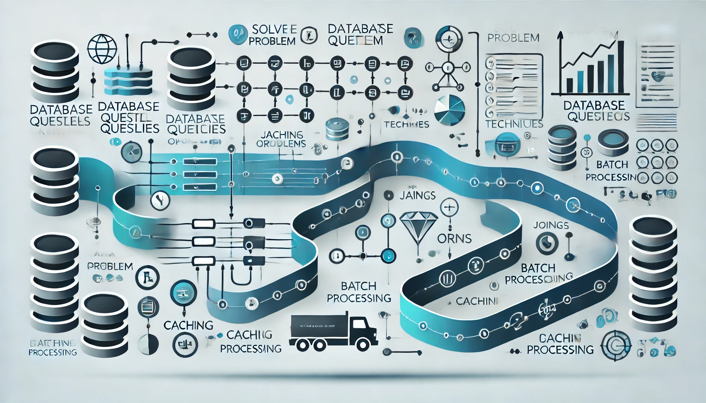

## 서론

지난 시간의 [N+1 문제 소개](https://sharknia.github.io/N1-문제)에 이어 이번 시간에는 N+1 문제를 해결하기 위해서는 어떤 방법들이 있는지 알아보려고 합니다. 

## **레포지토리에 User와 Order를 조인해서 가져오는 메소드**와 **User만 가져오는 메소드**를 따로 만들기

이렇게 하면, 상황에 맞게 필요한 데이터만 가져올 수 있고, 불필요한 쿼리나 데이터 로드를 방지할 수 있습니다.

### 예시

레포지토리에 각각의 메소드를 따로 작성할 수 있습니다.

#### `User`만 조회하는 메소드

이 메소드는 `User`만 가져오고, `Order`는 지연 로딩을 통해 나중에 필요할 때 가져오도록 설정할 수 있습니다.

```kotlin
@Repository
public interface UserRepository extends JpaRepository<User, Long> {
    // User만 조회하는 메소드
    @Query("SELECT u FROM User u")
    List<User> findAllUsers();
}
```

#### `User`와 `Order`를 함께 조회하는 메소드

이 메소드는 `JOIN FETCH`를 사용하여 `User`와 연관된 `Order`를 한 번에 가져옵니다.

```kotlin
@Repository
public interface UserRepository extends JpaRepository<User, Long> {
    // User와 Order를 조인해서 조회하는 메소드
    @Query("SELECT u FROM User u JOIN FETCH u.orders")
    List<User> findAllUsersWithOrders();
}
```

### 장점

#### 필요한 데이터만 로드

- `User`만 필요한 경우 불필요한 `Order` 데이터를 가져오지 않기 때문에 쿼리가 간결하고 성능이 최적화됩니다.

- 반대로, `User`와 `Order`가 모두 필요한 경우에는 조인을 통해 데이터를 한 번에 가져와서 N+1 문제를 방지할 수 있습니다.

#### 쿼리 제어 가능

- 각 메소드에서 쿼리의 동작 방식을 명시적으로 설정할 수 있으므로, ORM의 기본 동작(지연 로딩, 즉시 로딩 등)에 의존하지 않고 최적화된 방식으로 데이터 조회가 가능합니다.

### 단점

#### **메소드의 복잡성 증가**

- 레포지토리에 여러 종류의 메소드를 추가하다 보면 코드가 복잡해질 수 있습니다. 특히, 다양한 쿼리 요구사항을 처리해야 하는 경우 메소드 수가 급격히 늘어나 관리가 어려워질 수 있습니다.

- 매번 어떤 메소드를 사용할지 개발자가 직접 선택해야 하므로 실수로 적절하지 않은 메소드를 사용할 가능성도 있습니다.

#### 중복 코드 발생 가능성

- `User`만 가져오는 메소드와 `Order`까지 조인하는 메소드처럼 비슷한 기능을 가진 메소드들이 생기면서 중복 코드가 발생할 수 있습니다. 중복된 코드를 유지보수해야 하므로 코드가 장기적으로 복잡해질 수 있습니다.

#### 확장성의 한계

- 만약 엔티티의 관계가 많아지거나 복잡해지면, 조인해야 할 엔티티가 많아지므로 각 관계마다 최적화된 메소드를 만들어야 하는데, 이 과정에서 코드 관리가 어려워질 수 있습니다.

- 예를 들어 `User`와 `Order`뿐만 아니라 `Payment`나 `Delivery` 같은 연관된 엔티티가 추가된다면 그때마다 새로운 메소드를 만들어야 할 수 있습니다.

## Fetch Join

### 예시

Fetch Join을 사용하여 연관된 엔티티를 한 번에 가져오는 방법입니다. JPA에서 `JOIN FETCH`를 사용하면 기본적으로 Lazy Loading으로 설정된 연관 엔티티를 즉시 로딩으로 전환하여, 필요한 데이터를 모두 한 번에 가져옵니다.

```kotlin
@Repository
public interface UserRepository extends JpaRepository<User, Long> {
    @Query("SELECT u FROM User u JOIN FETCH u.orders")
    List<User> findAllUsersWithOrders();
}
```

### 장점

- 한 번의 쿼리로 관련 데이터를 모두 조회: 여러 테이블을 조인해 한 번의 쿼리로 데이터를 조회하므로 N+1 문제를 해결할 수 있습니다.

- 성능 최적화: 불필요한 추가 쿼리가 발생하지 않기 때문에 성능이 향상됩니다.

### 단점

- 데이터 중복: 조인된 테이블의 데이터가 중복되어 반환될 수 있습니다. 예를 들어, `User` 1명에 `Order` 10개가 있으면, `User`가 10번 중복되어 조회될 수 있습니다.

- 페이징 불가: JPA에서는 `Fetch Join`을 사용할 때 페이징 기능을 사용할 수 없습니다. 대량의 데이터에서 페이징이 필요하면 다른 해결책을 찾아야 합니다.

## EntityGraph

### 예시

`@EntityGraph`는 특정 엔티티의 연관된 엔티티들을 즉시 로딩으로 설정할 수 있는 기능입니다. 이 방법은 Fetch Join보다 더 명시적으로 필요한 엔티티들만 선택적으로 로드할 수 있습니다.

```kotlin
@Repository
public interface UserRepository extends JpaRepository<User, Long> {
    @EntityGraph(attributePaths = {"orders"})
    List<User> findAllWithOrders();
}
```

### 장점

- 선택적 즉시 로딩: 특정 연관 엔티티만 선택적으로 즉시 로딩할 수 있어 성능 최적화에 유리합니다.

- 더 간결한 쿼리: Fetch Join보다 코드가 간결하며 쿼리 가독성이 좋습니다.

### 단점

- 유연성 부족: 복잡한 조인 관계를 설정할 때는 Fetch Join보다 유연성이 떨어질 수 있습니다. 특히 다중 테이블 조인이나 특정 조건의 조인에는 적합하지 않을 수 있습니다.

- 쿼리 튜닝의 한계: 데이터베이스 레벨에서 세밀한 쿼리 튜닝을 하기는 어렵습니다.

## Batch Size

### 예시

`@BatchSize`는 연관 엔티티를 Lazy Loading으로 가져올 때, 한 번에 가져올 데이터의 수를 조정하여 성능을 최적화하는 방법입니다.

```kotlin
@Entity
public class User {
    @OneToMany(fetch = FetchType.LAZY)
    @BatchSize(size = 10)
    private List<Order> orders;
}
```

### 장점

- Lazy Loading을 유지하면서 성능 최적화: 한 번에 여러 개의 엔티티를 가져오므로, Lazy Loading의 장점을 살리면서 N+1 문제를 줄일 수 있습니다.

- 메모리 효율: 필요한 만큼의 데이터를 가져오므로 메모리 사용을 최적화할 수 있습니다.

### 단점

- 설정 복잡성: 각 연관 관계마다 적절한 배치 크기를 설정해야 하므로, 모든 상황에 대해 적절한 값을 찾기가 어려울 수 있습니다.

- 대규모 데이터에서 한계: 데이터가 대규모일 경우에도 배치로 묶어 가져오기 때문에 여전히 성능 문제나 메모리 부담이 발생할 수 있습니다.

## DTO Projection 사용

### 예시

DTO(데이터 전송 객체)를 사용해 필요한 데이터만 쿼리해서 가져오는 방식입니다. 엔티티 전체를 로딩하는 대신, 특정 필드들만 쿼리해서 가져오기 때문에 성능 최적화가 가능합니다.

```kotlin
public class UserOrderDTO {
    private String userName;
    private LocalDateTime orderDate;

    public UserOrderDTO(String userName, LocalDateTime orderDate) {
        this.userName = userName;
        this.orderDate = orderDate;
    }
}

@Repository
public interface UserRepository extends JpaRepository<User, Long> {
    @Query("SELECT new com.example.UserOrderDTO(u.name, o.orderDate) FROM User u JOIN u.orders o")
    List<UserOrderDTO> findUserOrderData();
}
```

### 장점

- 필요한 데이터만 조회: 엔티티 전체를 가져오지 않고, 필요한 필드만 가져와 성능을 최적화할 수 있습니다.

- 성능 최적화: 연관 엔티티가 많아도 DTO로 필요한 정보만 가져오므로 데이터 로딩 비용을 줄일 수 있습니다.

### 단점

- 유연성 부족: DTO는 엔티티와 다르게 데이터베이스의 영속성 컨텍스트에서 관리되지 않으므로, 비즈니스 로직에서 엔티티처럼 활용하기 어려울 수 있습니다.

- 복잡한 쿼리 작성 필요: 다양한 필드를 조합해야 할 경우, 복잡한 쿼리와 DTO 설계가 필요해질 수 있습니다.

## Secondary Query Cache

### 예시

ORM에서 제공하는 2차 캐시 기능을 활용하여, 쿼리 결과를 캐싱하고 필요할 때 캐시된 데이터를 재사용하는 방식입니다. Hibernate에서는 설정을 통해 2차 캐시를 사용할 수 있습니다.

```bash
hibernate.cache.use_second_level_cache=true
hibernate.cache.region.factory_class=org.hibernate.cache.jcache.JCacheRegionFactory
```

### 장점

- 데이터 재사용: 데이터베이스를 매번 조회하지 않고 캐시에 저장된 데이터를 재사용할 수 있으므로 성능 향상에 도움이 됩니다.

- N+1 문제 완화: 동일한 쿼리가 반복적으로 실행될 때 캐시된 데이터를 활용하여 성능 저하를 방지할 수 있습니다.

### 단점

- 데이터 일관성 문제: 캐시된 데이터가 실시간으로 변경되지 않기 때문에 데이터 일관성 문제가 발생할 수 있습니다. 자주 변경되는 데이터를 캐싱하는 데는 부적합할 수 있습니다.

- 캐시 관리의 복잡성: 캐시 만료 시간, 데이터 동기화 등의 설정을 적절히 관리해야 하며, 복잡한 애플리케이션에서는 캐시 관리가 어려워질 수 있습니다.

## 요약

로우쿼리로 직접 작업할 때에도 스키마가 복잡해지면 결국 쿼리문이 복잡해져서 작업이 힘들어지는데 ORM도 결국 같은 문제를 갖고 있다고 생각됩니다. 각 방법은 상황에 맞게 적용해야 하며, 각각의 장점과 단점이 있으므로 성능과 코드 복잡성을 모두 고려한 최적화 전략을 선택하는 것이 중요합니다.

- Fetch Join: 한 번의 쿼리로 모든 데이터를 가져올 수 있지만, 페이징이 어렵고 중복 데이터가 발생할 수 있음.

- EntityGraph: 더 세밀한 제어가 가능하지만, 유연성이 부족하고 쿼리 튜닝에 한계가 있음.

- Batch Size: Lazy Loading을 유지하면서 최적화를 시도할 수 있지만, 설정의 복잡성과 대규모 데이터 처리에 한계가 있음.

- DTO Projection: 필요한 데이터만 조회할 수 있어 성능이 좋지만, DTO 설계가 복잡하고 영속성 관리가 어려움.

- Secondary Cache: 쿼리 성능을 크게 향상시키지만, 캐시 관리의 복잡성과 데이터 일관성 문제가 발생할 수 있음.

