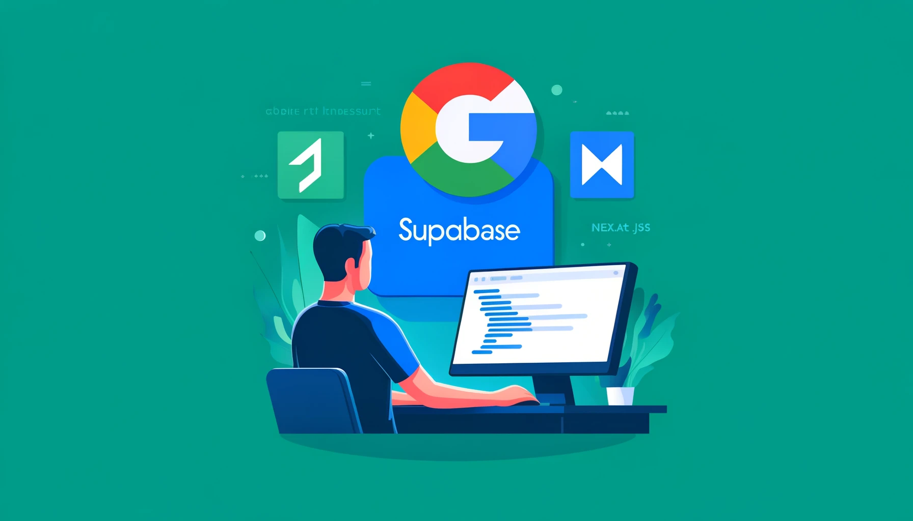
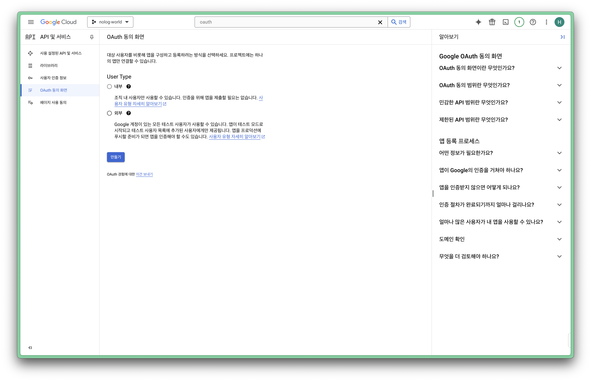
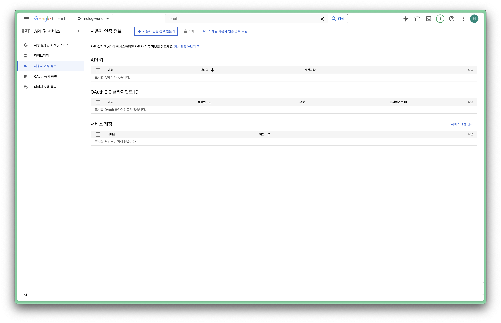
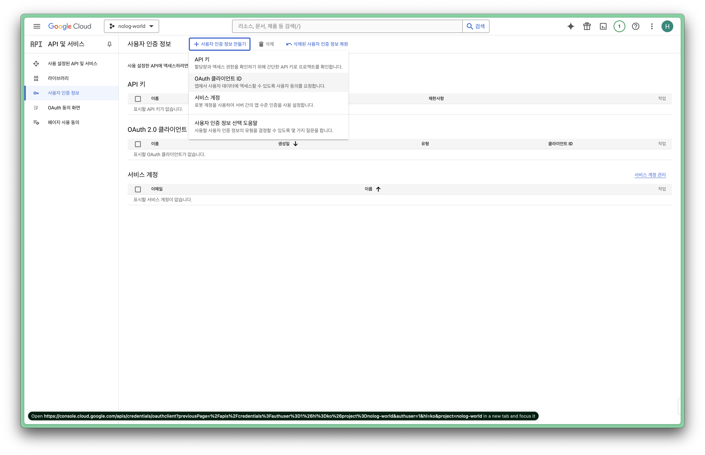
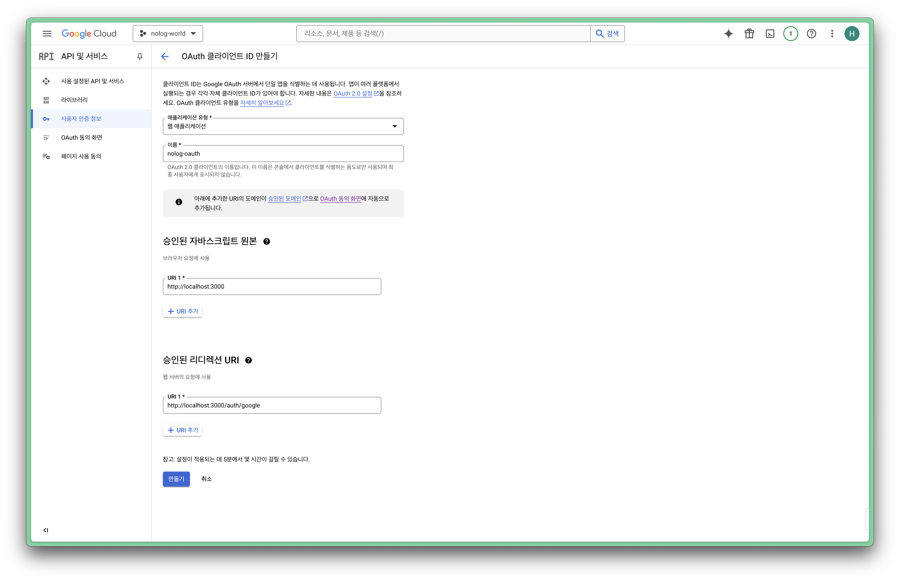
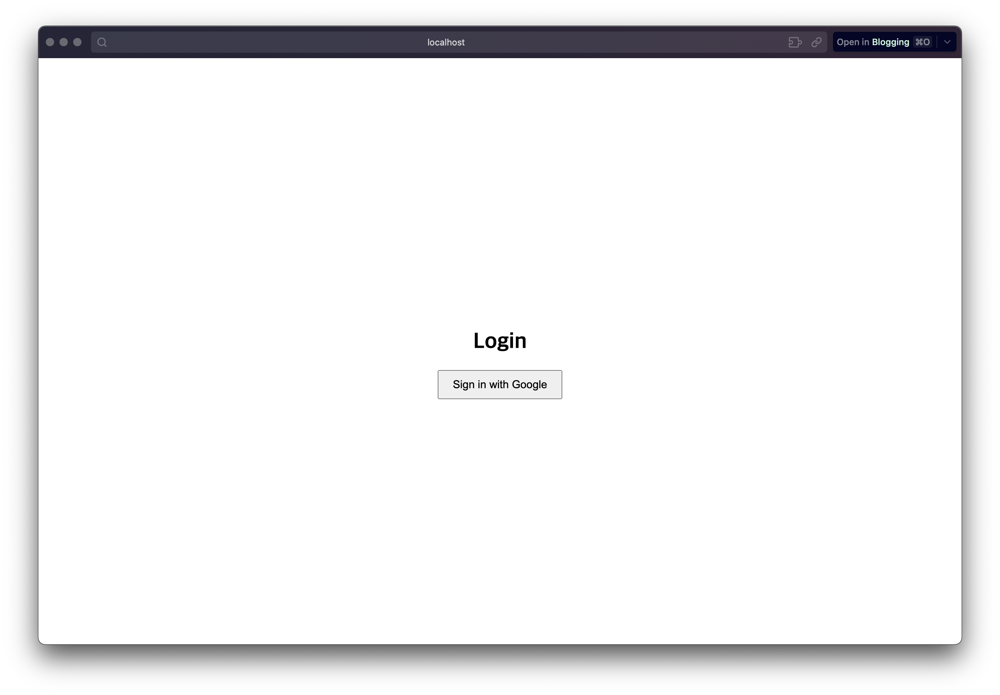

## 서론


        천리길도 한걸음부터. 시작이 반이다. 

갈 길이 멀지만 하나씩 해보겠습니다. 만들고자 하는 프로젝트는 있지만 아직 확정은 나지 않았고, 어떤 프로젝트를 하게 되더라도 로그인은 필수이지 않을까 싶습니다. 

### 기술스택?

Supabase를 한동안 사용해본 결과 큰 규모의 프로젝트에는 맞지 않는다고 뼈저리게 느꼈습니다. 

그런가하면, 소규모 1인 프로젝트에는 더할나위없이 적합하다고 느꼈습니다. 가격에 비해서 기능이 강력하고 서버를 꾸미는 수고로움을 엄청나게 축소시켜줍니다. 

Next.js도 마찬가지로, 하나의 프로젝트에서 백과 프론트를 모두 구현할 수 있다는게 큰 장점으로 느껴졌고 개인적으로 Typescript가 이유를 모르게 호감이어서 선택했습니다. 

따라서 이번 사이드 프로젝트의 기술 스택은 Next.js + Supabase로 꾸며보려고 합니다. 

Next.js도 그렇지만, 특히 프론트엔드는 완전히 새로운 경험이므로 초짜나 다름없습니다. 천천히 빠르게(? 해보려고 합니다. 

## Google 설정

구글 OAuth 2.0을 활용한 구글 로그인을 구현할 예정입니다. 추후 어떤 서비스가 되더라도 구글 로그인을 폐기할 일은 없을 것 같아 이것부터 구현해보려고 합니다. 

#### 프로젝트 생성

[구글 클라우드 콘솔](https://console.cloud.google.com/)에서 프로젝트를 생성합니다. 


상단에 oauth를 검색하면 OAuth 동의 화면 메뉴가 나옵니다. 외부를 선택하고 만들기를 실행합니다. 

필수 입력값(앱 이름, 사용자 지원 이메일, 개발자 이메일)만 입력한 후 다음을 선택합니다. 이후에도 계속 다음을 선택하고, 대시보드로 돌아가기를 클릭하면 완료됩니다. 

#### 각종 키 값 획득


바로 좌측의 사용자 인증 정보 메뉴로 이동합니다. 


상단의 사용자 인증 정보 만들기를 선택하고 OAuth 클라이언트 ID를 선택합니다. 


이름을 적당히 입력하고, 승인된 자바스크립트 원본에는 서버의 주소를, 승인된 리디렉션 URI에는 콜백으로 호출될 URI를 입력합니다. 

여기까지 완료하면 클라이언트 ID와 클라이언트 보안 비밀번호를 얻을 수 있습니다. 

## Supabase 설정 및 설치

### 프로젝트 설정

[Supabase](https://supabase.com/)에 프로젝트를 생성한 후, Authentication 메뉴에서 Provider를 선택해 구글 토글을 켜주고, 위에서 획득한 클라이언트 아이디와 클라이언트 보안 비밀번호를 입력합니다. 

아래쪽에서 `https://[project-id].supabase.co/auth/v1/callback` 꼴의 콜백 URI를 얻을 수 있습니다. 구글 OAuth2.0의 리디렉션 UI에 해당 주소를 넣어줍니다. 

### Install

Supabase를 설치합니다. 

```bash
npm install @supabase/supabase-js
```

## 코드 작성

### supabase.ts

`common/supabase.ts` 파일을 생성하고 다음의 내용을 작성합니다. 

```typescript
import { createClient } from '@supabase/supabase-js';

const supabaseUrl = 'YOUR_SUPABASE_URL';
const supabaseAnonKey = 'YOUR_SUPABASE_ANON_KEY';

export const supabase = createClient(supabaseUrl, supabaseAnonKey);
```

`supabaseUrl`과 `supabaseAnonKey`는 Supabase의 Project Setting - API 메뉴에서 획득할 수 있습니다. 

### googleLoginButton

`pages/main/googleLoginButton.tsx`파일을 생성하고 다음의 내용을 작성합니다. 

```typescript
import React from 'react';
import { supabase } from '../../common/supabase';

const GoogleLoginButton: React.FC = () => {
    const handleGoogleLogin = async () => {
        const { error } = await supabase.auth.signInWithOAuth({
            provider: 'google',
        });

        if (error) {
            console.error('Login Failed:', error.message);
            // 로그인 실패 시 처리 로직을 여기에 추가하세요.
        } else {
            console.log('Login Success');
            // 로그인 성공 시 처리 로직을 여기에 추가하세요.
        }
    };

    return (
        <div style={styles.container}>
            <h1>Login</h1>
            <button onClick={handleGoogleLogin} style={styles.button}>
                Sign in with Google
            </button>
        </div>
    );
};

const styles = {
    container: {
        display: 'flex',
        flexDirection: 'column' as const,
        justifyContent: 'center',
        alignItems: 'center',
        height: '100vh',
    },
    button: {
        padding: '10px 20px',
        fontSize: '16px',
        cursor: 'pointer',
    },
};

export default GoogleLoginButton;
```

### login.tsx

`pages/main/login.tsx` 파일을 생성하고, 다음의 내용을 작성합니다. 

```typescript
import React from 'react';
import GoogleLoginButton from './GoogleLoginButton';

const Login: React.FC = () => {
    return (
        <div>
            <GoogleLoginButton />
        </div>
    );
};

export default Login;
```

## 회원가입 테스트

[http://localhost:3000/main/login](http://localhost:3000/main/login) 으로 접속해봅니다. 


버튼을 눌러서 구글 로그인을 해본 후에 Supabase의 Authentication - Users 메뉴로 들어가면 정상적으로 회원가입이 된 것을 확인할 수 있습니다. 

