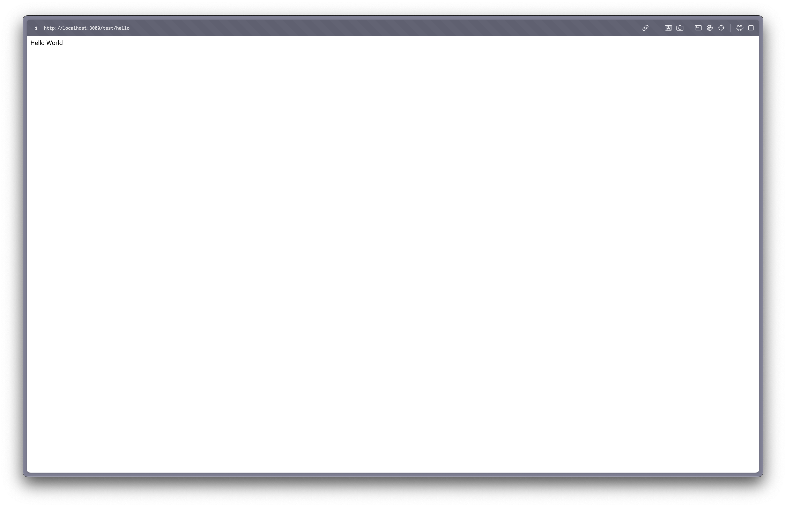

## Next.js?

### 개요

Next.js는 React 기반의 프레임워크로, 웹사이트와 애플리케이션을 구축하기 위해 사용됩니다. 서버 사이드 렌더링(SSR), 정적 사이트 생성(SSG), 그리고 클라이언트 사이드 렌더링을 지원하며, 개발자가 사용하기 편리한 기능들을 제공합니다.

### 특징 및 장점

- 파일 기반 라우팅: `pages` 디렉토리 내의 파일 구조를 기반으로 자동 라우팅을 생성합니다.

- 자동 코드 분할과 서버 사이드 렌더링을 통해 빠른 페이지 로드를 제공합니다. 

- 또한 SSR을 통해 SEO에 최적화 되어 있어 검색 엔진 최적화가 용이합니다. 

- 데이터 가져오기: `getStaticProps`, `getServerSideProps` 같은 데이터 페칭 함수를 제공하여 데이터 관리를 간소화합니다.

- API 라우트: 서버사이드 로직을 쉽게 구현할 수 있는 API 경로를 지원합니다.

## 설치

### Node.js 설치

nvm은 설치되어있다고 가정합니다. 

오늘(2024년 5월 13일) 기준 가장 최신의 20.13.1 버전을 설치합니다. 

```bash
nvm install 20.13.1
echo "20.13.1" > .nvmrc
nvm use
```

### Next.js 설치

```bash
npx create-next-app@latest
```

이후 설정은 기본값으로 해주었습니다.

```bash
user@MacBook-Pro nextjs % npx create-next-app@latest
Need to install the following packages:
create-next-app@14.2.3
Ok to proceed? (y) y
✔ What is your project named? … my-app
✔ Would you like to use TypeScript? … No / Yes
✔ Would you like to use ESLint? … No / Yes
✔ Would you like to use Tailwind CSS? … No / Yes
✔ Would you like to use `src/` directory? … No / Yes
✔ Would you like to use App Router? (recommended) … No / Yes
✔ Would you like to customize the default import alias (@/*)? … No / Yes
Creating a new Next.js app in /Users/user/Develop/nextjs/my-app.

Using npm.

Initializing project with template: app-tw 


Installing dependencies:
- react
- react-dom
- next

Installing devDependencies:
- typescript
- @types/node
- @types/react
- @types/react-dom
- postcss
- tailwindcss
- eslint
- eslint-config-next


added 358 packages, and audited 359 packages in 32s

133 packages are looking for funding
  run `npm fund` for details

found 0 vulnerabilities
Initialized a git repository.

Success! Created my-app at /Users/user/Develop/nextjs/my-app
```

이제 my-app 디렉토리로 이동하고, 

```bash
cd my-app
```

다음의 코드를 실행하면

```bash
npm run dev
```

[http://localhost:3000](http://localhost:3000/)에서 바로 웹페이지를 확인할 수 있습니다. 

## 간단 예제

### Hello World 출력하기 

`/hello` 경로에 접속하면 `Hello World` 가 출력되도록 해보겠습니다. Next.js는 파일 기반 라우팅 시스템을 사용하기 때문에 간단히 `pages` 디렉토리 내에 `hello.js` 파일을 생성하고 그 안에 적절한 코드를 작성하면 됩니다.

프로젝트의 `pages` 디렉토리 내에 `hello.js` 파일을 생성합니다. 이 파일이 `/hello` 경로에 대응됩니다. `hello.js` 파일을 열고 다음과 같은 코드를 작성합니다

```javascript
export default function Hello() {
    return <div>Hello World</div>;
}
```

[http://localhost:3000/test/hello](http://localhost:3000/test/hello)로 접속해보면 Hello World 문구를 확인할 수 있습니다. 


### API Route 방식을 사용해서 Hello World 출력하기

#### API Route?

Next.js의 API 라우트는 `pages/api` 디렉토리 내에 정의된 서버사이드 코드를 통해 구현됩니다. 이 기능을 통해 개발자는 RESTful API를 손쉽게 구현할 수 있으며, 이 API는 데이터 처리, 데이터베이스 쿼리, 외부 API 호출 등 서버사이드 로직을 실행하는 데 사용됩니다.

API 라우트를 설정할 때 파일 위치는 반드시 `pages/api` 디렉토리 안에 있어야 합니다. 이 구조는 Next.js의 컨벤션을 따르는 것으로, Next.js는 이 디렉토리 내의 파일들을 서버사이드 로직으로 처리하고 자동으로 해당 파일 경로에 매칭되는 API 엔드포인트를 생성합니다.

#### 왜 `pages/api` 디렉토리인가?

- 자동화된 API 엔드포인트: `pages/api` 내부에 파일을 배치함으로써, Next.js는 해당 파일의 경로를 기반으로 자동으로 API 엔드포인트를 설정합니다. 예를 들어, `pages/api/user.js`는 `/api/user`로 접근할 수 있습니다.

- 서버 사이드 실행: 이 디렉토리 내의 코드는 클라이언트 사이드가 아닌 서버 사이드에서 실행됩니다. 이는 보안 상 중요한 데이터를 클라이언트에 노출하지 않고 처리할 수 있게 합니다.

- 분리된 로직: `pages/api`는 UI와 관련 없이 데이터 처리나 서버 로직을 관리하는 데 사용되므로, 프론트엔드와 백엔드 로직을 명확하게 분리할 수 있습니다.

#### 경로 및 파일 구조

- 파일 이름과 디렉토리 구조가 URL 경로로 직접 매핑됩니다. 예를 들어, `pages/api/products/list.js`는 `/api/products/list` 경로에 매핑됩니다.

- 파일 내에서는 기본으로 내보내는 함수(`export default function`)를 사용하여 API의 로직을 처리합니다.

#### API 생성

/pages/api 경로에 hello.js 파일을 생성하고 다음의 내용을 작성합니다. 

```javascript
export default function handler(req, res) {
  res.status(200).json({ message: 'Hello World' });
}
```

이제 [http://localhost:3000/api/hello](http://localhost:3000/api/hello)로 접속하면 api가 정상적인 응답값을 내려주는 것을 확인할 수 있습니다. 

#### API의 호출

API 라우트의 결과를 페이지에 표시하려면 클라이언트 측 JavaScript를 사용하여 API 라우트를 호출하고, 응답을 상태로 관리하여 렌더링해야 합니다. React의 `useState`와 `useEffect` 훅을 활용할 수 있습니다.

`/test/hello.js` 를 다음과 같이 수정합니다. 

```javascript
import React, { useEffect, useState } from 'react';

export default function Hello() {
    const [message, setMessage] = useState('Loading...');

    useEffect(() => {
        fetch('/api/hello')
            .then((res) => res.json())
            .then((data) => setMessage(data.message))
            .catch((err) => setMessage('Failed to fetch data'));
    }, []);

    return <div>api response : {message}</div>;
}
```

1. useState 사용: `message` 상태를 선언하여 API 호출의 결과를 저장합니다. 초기값은 'Loading...'으로 설정하여 API 응답을 기다리는 동안 사용자에게 보여집니다.

1. useEffect 사용: 컴포넌트가 마운트될 때 `/api/hello2` 엔드포인트를 호출합니다. `fetch` 함수를 사용하여 API를 호출하고, 응답이 돌아오면 JSON으로 변환 후 `setMessage`를 통해 상태를 업데이트합니다. 에러가 발생하면 메시지를 'Failed to fetch data'로 설정합니다.

이제 [http://localhost:3000/test/hello](http://localhost:3000/test/hello)로 접속하면 다음과 같은 화면을 볼 수 있습니다. 


## getStaticProps

`getStaticProps`는 빌드 시에 데이터를 불러와 페이지를 미리 생성하는 데 사용됩니다. 이는 주로 변경되지 않는 데이터가 필요한 페이지에 적합합니다.

간단한 getStaticProps 예제를 구현해보겠습니다. 

먼저, data로 사용될 json 파일을 작성합니다. 위치는 `data/` 입니다. 

```json
[
    {
        "id": 1,
        "title": "First Post",
        "content": "This is the first post."
    },
    {
        "id": 2,
        "title": "Second Post",
        "content": "This is the second post."
    }
]
```

그리고 `pages/posts.js` **에 다음의 내용을 작성합니다.** 

```javascript
import React from 'react';

export async function getStaticProps() {
    // 가정: 데이터는 로컬 JSON 파일에서 불러옴
    const data = require('../data/post.json');
    return {
        props: {
            posts: data,
        },
    };
}

export default function Posts({ posts }) {
    return (
        <div>
            <h1>Blog Posts</h1>
            <ul>
                {posts.map((post) => (
                    <li key={post.id}>
                        <h2>{post.title}</h2>
                        <p>{post.content}</p>
                    </li>
                ))}
            </ul>
        </div>
    );
}

```

`getStaticProps` 함수는 Next.js 애플리케이션을 빌드할 때 호출됩니다. 이는 개발 모드에서는 페이지에 처음 접근할 때 한 번, 프로덕션 모드에서는 빌드 과정에서 실행됩니다.

또한 이 함수는 서버 사이드에서만 실행됩니다. 즉, 클라이언트 사이드 또는 브라우저에서는 실행되지 않습니다. 이는 보안 상 중요한 작업을 수행하거나 외부 API, 데이터베이스 등 서버 측 리소스에 접근할 때 유용합니다.

`getStaticProps`에서 반환된 데이터는 React 컴포넌트의 props로 전달됩니다. 이를 통해 사전에 정의된 데이터를 이용하여 페이지를 렌더링할 수 있으며, 이 페이지는 HTML 파일로 생성되어 클라이언트에게 제공됩니다.

`getStaticProps`에서 반환하는 `props` 객체의 키 이름과, 페이지 컴포넌트의 `props` 매개변수에서 받는 이름이 일치해야 합니다.

## **getServerSideProps**

`getServerSideProps`는 각 페이지 요청 시 서버에서 데이터를 불러와 렌더링하는 데 사용됩니다. 동적인 데이터가 필요한 페이지에 적합합니다.

아까 useEffect를 사용했던 코드를 개선해보겠습니다.  test/hello.js를 다음과 같이 수정합니다. 

```javascript
import React from 'react';

export async function getServerSideProps() {
    try {
        const res = await fetch('http://localhost:3000/api/hello'); // API 엔드포인트 호출
        const data = await res.json();
        return {
            props: { message: data.message }, // 페이지 컴포넌트로 props 전달
        };
    } catch (err) {
        return {
            props: { message: 'Failed to fetch data' }, // 에러 처리
        };
    }
}

export default function Hello({ message }) {
    return <div>API response: {message}</div>; // 서버에서 받은 메시지 출력
}

```

`getServerSideProps`는 페이지가 렌더링될 때마다 서버에서 실행되어, 서버 사이드에서 필요한 데이터를 사전에 불러오고, 이 데이터를 페이지 컴포넌트로 직접 전달할 수 있습니다. 이 방법은 페이지 로드 시 클라이언트 사이드에서 추가적인 API 요청을 방지하므로 초기 렌더링 속도를 개선할 수 있습니다.

#### `getServerSideProps` 사용 시 고려할 점

- 서버 부하: `getServerSideProps`는 페이지 요청이 있을 때마다 서버에서 실행되므로, 트래픽이 많은 사이트에서는 서버에 상당한 부하가 가해질 수 있습니다.

- 응답 시간: 클라이언트 사이드에서 데이터를 가져오는 것보다는 빠를 수 있지만, 서버 사이드에서 모든 데이터를 처리하고 완성된 페이지를 전송해야 하므로 응답 시간이 길어질 수 있습니다.

- SEO 최적화: `getServerSideProps`를 사용하면 서버에서 렌더링된 페이지가 클라이언트에게 전송되기 때문에, 검색 엔진 최적화(SEO)에 유리합니다. 모든 콘텐츠가 HTML로 서버에서 미리 생성되어 전달되기 때문입니다.

사실 `/api/hello` API는 고정된 결과(Hello World)만들 반환하므로, getServerSideProps 메소드로 구현할 필요가 없습니다. 

데이터가 변경되지 않는다면, `getStaticProps`를 사용하여 빌드 시점에 데이터를 미리 불러와서 정적 페이지를 생성하는 것이 매우 효율적입니다. 이 방법은 로딩 시간을 단축시키고 서버 부하를 줄이는 데 도움을 줄 수 있습니다.

API의 결과가 항상 동일하다면 해당 데이터를 빌드 시 한 번만 불러오고, 생성된 HTML 파일을 사용하여 모든 사용자 요청을 처리할 수 있기 때문에, 웹사이트의 성능을 크게 향상시킬 수 있습니다. 이런 접근 방식은 특히 고정된 콘텐츠를 다루는 블로그, 문서화 사이트, 제품 정보 페이지 등에서 유리합니다.


