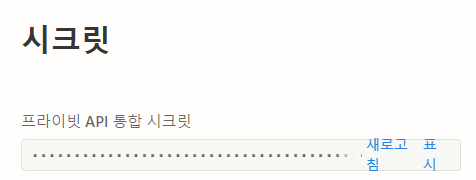
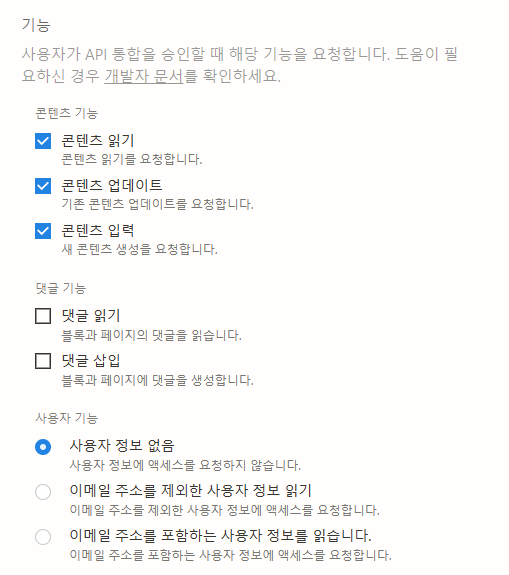
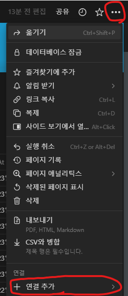

Notion API를 사용해보려고 한다. 

이것으로 무엇을 할 것인가? 는 생각해둔게 있지만, 가능하다고 생각된 시점에서 본격적으로 해보려고 하고, 일단 오늘은 Notion API를 살펴보려고 한다. 

### 간단한 소개

[Start building with the Notion API](https://developers.notion.com/)

Notion의 공개 Rest API를 이용하여 Notion Workspace와 상호 작용 할 수 있다.

페이지, 데이터베이스, 사용자, 페이지 및 인라인 주석, Workspace의 포스팅에 대한 검색 등등.. 

점점 지원 영역이 늘어나는 것 같다. change-log가 꽤 활발해보인다. 

### API 생성 및 권한 부여

일단 우선, API를 생성하고 권한 부여 작업을 해야 한다. 

[Notion – The all-in-one workspace for your notes, tasks, wikis, and databases.](https://www.notion.so/my-integrations)

올라와 있는 한글 블로그들과 현재의 API 권한 부여 방식이 달라지는 바람에  여기서 은근 헤맸다… 역시 공식 가이드를 우선적으로 봐야한다. 

위 페이지에서 새 `API 통합 만들기` 를 선택한다. 

API의 권한은 워크스페이스별로 관리되므로, `연결된 워크스페이스` 를 정확히 선택해준다. 

필수 항목을 입력해주고 `제출` 을 눌러주자. 

그럼 바로 위와 같은 화면으로 넘어온다. 표시를 눌러서 시크릿 키를 복사해서 보관해주자. 

기능도 커스텀 할 수 있는데, 일단 기본적인 기능을 넣어주었다. 

배포는 당연히 공개로 해두지 않았다. 

이후, 노션으로 돌아와 API와 연결된 워크스페이스를 선택하고 

<aside>
💡 **오른쪽 상단의 `…` 를 눌러서 `연결추가` 를 선택한 다음, 아까 만들어준 API의 이름을 검색해 해당 API와 연결을 해주면 된다.**

</aside>

이 부분이 UI가 달라진 부분이어서 공식 가이드를 보기 전까지 한참 헤맸던 부분이었다.

이제, API와 Notion Workspace가 연결되었다!