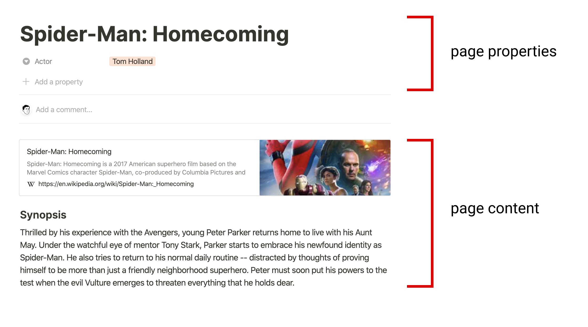

# Notion API(2)

# 무엇을 하는가?

Notion API를 이용해서 내가 쓴 글 들을 불러와 MD 파일로 만들려고 한다. 그 과정을 실시간으로 기록하려고 한다. 명확하게 가능한가? 는 사실 아직 알아보지 않았다. 

# 왜 하는가?

너무나 너무나 귀찮기 때문이다.

블로그 포스팅을 위해서 마크다운 에디터로 노션을 쓰고 싶기 때문이다. 아니? 노션으로 쓴 것을 그대로 블로그에 커밋해버리고 싶기 때문이다. 그 과정을 자동화해버리고 싶기 때문이다. 

즉, 노션에 글만 써두면 자동으로 마크다운으로 받아져서 깃허브에 커밋이 되고 깃허브 페이지에 배포가 되는 원대한 자동화를 원한다. 

# 어떻게 하는가?

## 환경

Node.js 18.17.1 버전을 사용한다.

Node.js 프로젝트 시작

```bash
npm init
```

.env 생성

```bash
NOTION_KEY=<노션키>
NOTION_PAGE_ID=<PageId>
```

.gitignore에 .env 등록

```bash
.env
```

.env 안의 내용을 가져올 수 있도록 `dotenv` 패키지 설치

```bash
$ npm install dotenv
```

Notion API를 이용할 수 있도록 패키지 설치

```bash
$ npm install @notionhq/client
```

## API 확인

### 코드

Notion API reference에 아주 친절하게 JavaScript 예제 코드까지 전부 붙어있다. Node.js를 선택한 이유이기도 하다. 예제 코드가 자바스크립트로 되어있어 그대로 갖다 붙이기 쉬워 보였기 때문이다. 일단 API의 결과물이 어떻게 날아오는지 확인하기 위해 있는 대로 갖다 붙였다. 

```jsx
require("dotenv").config();
const { Client } = require("@notionhq/client");

const pageId = process.env.NOTION_PAGE_ID;
const key = process.env.NOTION_KEY;

const notion = new Client({ auth: key });

(async () => {
    try {
        const response = await notion.databases.query({ database_id: pageId });
        // console.log(response);
        //페이지들을 돌면서 id로 페이지를 읽어온다. 
        response.results.forEach(page => {
            (async () => {
                const pageId = page.id;
                //page properties
                const response = await notion.pages.retrieve({ page_id: pageId });
                console.log("----------Page Properties----------")
                console.log(JSON.stringify(response, null, 2));
                //page contents
                (async () => {
                    const blockId = pageId;
                    const response = await notion.blocks.retrieve({
                        block_id: blockId,
                    });
                    console.log("----------Page Contents as Block----------")
                    console.log(JSON.stringify(response, null, 2))
                })();
                (async () => {
                    const blockId = pageId;
                    const response = await notion.blocks.children.list({
                        block_id: blockId,
                        page_size: 50,
                    });
                    console.log("----------Page Block List----------");
                    console.log(JSON.stringify(response, null, 2));
                })();
            })();
        });
    } catch (error) {
        console.error("Error querying the database:", error);
    }
})();
```

### 노션의 페이지 구성



page properties는 정확하게 마크다운의 Front Matter에 사용하면 될 것 같다. 

그리고, 마크다운의 콘텐츠에 page content가 들어가면 되겠다. 

page properties를 얻기 위해서는 notion.pages.retrieve method를 이용하면 된다. 

### 코드 실행 결과문 분석

- notion.pages.retrieve

```json
{
  "object": "page",
  "id": "...id...",
  "created_time": "2023-08-23T13:32:00.000Z",
  "last_edited_time": "2023-09-01T12:45:00.000Z",
  "created_by": {
    "object": "user",
    "id": "...id..."
  },
  "last_edited_by": {
    "object": "user",
    "id": "...id..."
  },
  "cover": null,
  "icon": null,
  "parent": {
    "type": "database_id",
    "database_id": "...id..."
  },
  "archived": false,
  "properties": {
    "tags": {
      "id": "PHNF",
      "type": "multi_select",
      "multi_select": [
        {
          "id": "...id...",
          "name": "AWS",
          "color": "brown"
        },
        {
          "id": "...id...",
          "name": "TAG2",
          "color": "pink"
        }
      ]
    },
  },
  "url": "https://www.notion.so/...",
  "public_url": "https://name.notion.site/..."
}
```

정확하게 페이지의 속성들을 가져오고 있다. Front Matter에 필요한 내용들을 속성으로 만들어두면 완벽할 것 같다. 

- notion.blocks.retrieve

notion.blocks.retrieve는 page ID를 넣으면 해당 페이지의 정보를 가져다 주는데 왜냐면 노션에서 모든 단위가 블록이기 때문이다. 해당 페이지의 블록으로서의 데이터를 주는 것이기 때문에 지금 내 상황에선 그다지 사용할 필요가 없어 보인다. 

- notion.blocks.children.list

```json
{
  "object": "list",
  "results": [
    {
      "object": "block",
      "id": "id",
      "parent": {
        "type": "page_id",
        "page_id": "id"
      },
      "created_time": "2023-09-01T12:00:00.000Z",
      "last_edited_time": "2023-09-01T12:12:00.000Z",
      "created_by": {
        "object": "user",
        "id": "id"
      },
      "last_edited_by": {
        "object": "user",
        "id": "id"
      },
      "has_children": false,
      "archived": false,
      "type": "heading_1",
      "heading_1": {
        "rich_text": [
          {
            "type": "text",
            "text": {
              "content": "제목1",
              "link": null
            },
            "annotations": {
              "bold": false,
              "italic": false,
              "strikethrough": false,
              "underline": false,
              "code": false,
              "color": "default"
            },
            "plain_text": "제목1",
            "href": null
          }
        ],
        "is_toggleable": false,
        "color": "default"
      }
    },
	...
}
```

우리가 원하는 Page Content들의 내용이 드디어 보인다. 위의 결과에는 나타나지 않았지만, 들여쓰기가 된 경우에는 해당 들여쓰기가 된 block의 상위 요소에게 종속된다. 다시 말 내 다음 블록에 들여쓰기를 한 블록이 있다면 `has_children` 속성이 true가 된다. 그 안을 다시 파고 들어가면 될 것 같다. 

# 오늘의 결론

이렇게 해서, API를 통해서 내 노션에 올려진 글들을 가져오는 데에 성공했다. 이제 다음 시간에는 이 JSON들을 가공해서 Markdown으로 변환하려고 한다. 

방법은 세 가지 정도를 생각하고 있다. 

1. 노션 내부 API 사용
    
    실제 노션 페이지를 띄울 때 오고 가는 요청값 들을 확인해 이를 사용하여 마크다운 파일을 바로 만들 수 있는 것으로 보인다. 이는 만들기가 가장 쉬워 보이나, 언제 폭파 될지 모른다는 문제점을 갖고 있다.  만약 폭파된다면 귀찮게도 다시 만들어야 한다는 치명적인 문제 때문에 지금 당장은 고려하고 있지 않지만 실패할 가능성도 가장 적어 보이므로, 귀찮아지면 언제든지 이쪽으로 틀도록 하자. 
    
2. 오픈 소스 사용
    
    Notion 블록을 마크다운 형식으로 바꿔주는 오픈 소스가 있는 것으로 보인다. 아직 자세히 살펴보지는 않았다. 
    
3. 직접 구현
    
    그냥.. 직접 만든다. 아마 많은 기능을 지원하지는 못하겠지만 노션을 쓰면서 느낀 건데 많은 기능을 딱히 사용하지 않는다. 정말 개인적인 용도라면 그냥 생각보다 쉽게 될 것 같기도 하다.
    

일단 코드를 막 짜고 있는데, 이번에는 변화에 닫힌, 확장에 열린 코드를 짜보려고 한다. 설계도 신경써서 하고 싶다. 

또 여유가 허락된다면 타입스크립트도 써보고 싶다. 

# 참고문서

[Start building with the Notion API](https://developers.notion.com/reference)

[Notion API와 함께 정적 페이지로의 여정 – 화해 블로그 | 기술 블로그](https://blog.hwahae.co.kr/all/tech/10960)