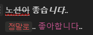
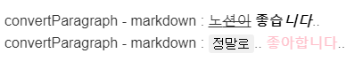
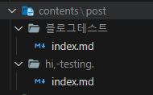
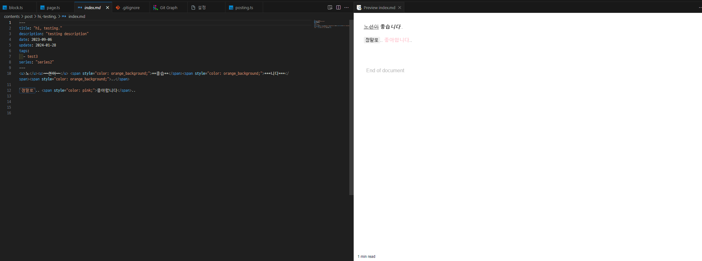
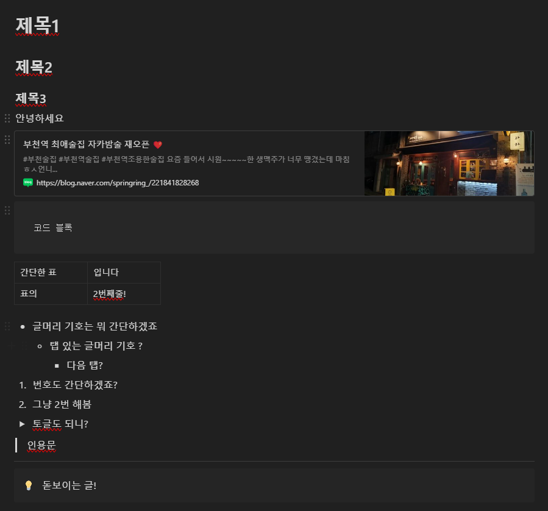

---
tags:
  - Blogging
  - Notion-API
  - Typescript
  - Hobby
description: "쭉쭉 진행되는 작업"
series: "GitHub Pages와 Notion API 연동"
update: "2024-01-29"
date: "2024-01-27"
상태: "POST"
title: "NotionAPI를 활용한 자동 포스팅(4)"
---
## 지난 이야기

[NotionAPI를 활용한 자동 포스팅(3)](https://sharknia.github.io/NotionAPI를-활용한-자동-포스팅3)

간만에 복귀를 했다. 별건 아니고.. 그냥 복습을 했다. 

## 오늘의 작업

### block.ts 나머지 작업

지난번에 block.ts를 미완성 된 상태로 두었다. 타입 검사에서 걸린 상태로 일단 두었고,

```typescript
export type GetBlockResponse = PartialBlockObjectResponse | BlockObjectResponse;
```

Union Type이라는 것이 있다는 것을 알게 되었다. 해당 내용에 대해서는 따로 정리 해두었다. 

[Union Type](https://sharknia.github.io/Union-Type)  

### 로그 강화

로그도 작업 순서에 맞게 찍히도록 강화했다. json 형태의 데이터여서 [object Object] 와 같이 찍히던 것도 제대로 내용물이 출력되도록 수정했다. 다음과 같은 코드로 json 형태의 데이터도 이쁘게 출력할 수 있다. 

```typescript
console.log(
            `convertParagraph - paragraph : ${JSON.stringify(
                paragraph,
                null,
                2,
            )}`,
        );
```

### ConvertParagraph 완성

paragraph는 노션 블록 타입 주으이 하나로, 텍스트의 기본 단위이다. 텍스트를 입력할 때 기본적으로 생성되는 블록 유형이다. 

이 블록 안에 들어있는 내용을 마크다운으로 바꿔주는 메소드를 완성했다. 

원본 노션의 내용은 다음과 같다. 일부러 여러가지 케이스를 집어넣었다. 


이 paragraph블록의 데이터 형태는 다음과 같다. 

#### <u>노</u><u>~~션이~~</u>  **좋습*****니다***..

```json
{
  "rich_text": [
    {
      "type": "text",
      "text": {
        "content": "노",
        "link": null
      },
      "annotations": {
        "bold": false,
        "italic": false,
        "strikethrough": false,
        "underline": true,
        "code": false,
        "color": "default"
      },
      "plain_text": "노",
      "href": null
    },
    {
      "type": "text",
      "text": {
        "content": "션이",
        "link": null
      },
      "annotations": {
        "bold": false,
        "italic": false,
        "strikethrough": true,
        "underline": true,
        "code": false,
        "color": "default"
      },
      "plain_text": "션이",
      "href": null
    },
    {
      "type": "text",
      "text": {
        "content": " ",
        "link": null
      },
      "annotations": {
        "bold": false,
        "italic": false,
        "strikethrough": false,
        "underline": false,
        "code": false,
        "color": "default"
      },
      "plain_text": " ",
      "href": null
    },
    {
      "type": "text",
      "text": {
        "content": "좋습",
        "link": null
      },
      "annotations": {
        "bold": true,
        "italic": false,
        "strikethrough": false,
        "underline": false,
        "code": false,
        "color": "default"
      },
      "plain_text": "좋습",
      "href": null
    },
    {
      "type": "text",
      "text": {
        "content": "니다",
        "link": null
      },
      "annotations": {
        "bold": true,
        "italic": true,
        "strikethrough": false,
        "underline": false,
        "code": false,
        "color": "default"
      },
      "plain_text": "니다",
      "href": null
    },
    {
      "type": "text",
      "text": {
        "content": "..",
        "link": null
      },
      "annotations": {
        "bold": false,
        "italic": false,
        "strikethrough": false,
        "underline": false,
        "code": false,
        "color": "default"
      },
      "plain_text": "..",
      "href": null
    }
  ],
  "color": "default"
}
```

#### `정말로`.. <span style="color: pink;">좋아합니다</span>.. 

```json
{
  "rich_text": [
    {
      "type": "text",
      "text": {
        "content": "정말로",
        "link": null
      },
      "annotations": {
        "bold": false,
        "italic": false,
        "strikethrough": false,
        "underline": false,
        "code": true,
        "color": "default"
      },
      "plain_text": "정말로",
      "href": null
    },
    {
      "type": "text",
      "text": {
        "content": ".. ",
        "link": null
      },
      "annotations": {
        "bold": false,
        "italic": false,
        "strikethrough": false,
        "underline": false,
        "code": false,
        "color": "default"
      },
      "plain_text": ".. ",
      "href": null
    },
    {
      "type": "text",
      "text": {
        "content": "좋아합니다",
        "link": null
      },
      "annotations": {
        "bold": false,
        "italic": false,
        "strikethrough": false,
        "underline": false,
        "code": false,
        "color": "pink"
      },
      "plain_text": "좋아합니다",
      "href": null
    },
    {
      "type": "text",
      "text": {
        "content": ".. ",
        "link": null
      },
      "annotations": {
        "bold": false,
        "italic": false,
        "strikethrough": false,
        "underline": false,
        "code": false,
        "color": "default"
      },
      "plain_text": ".. ",
      "href": null
    }
  ],
  "color": "default"
}
```

이 중에서 밑줄과 색상은 기본적으로 마크다운에서 지원하지 않는 기능이므로 html 태그를 사용했다. 코드는 다음과 같다. 

```typescript
private convertParagraph(paragraph: any): string {
        let markdown = '';

        for (const textElement of paragraph.rich_text) {
            let textContent = textElement.plain_text;

            // 텍스트 스타일링 처리
            if (textElement.annotations.bold) {
                textContent = `**${textContent}**`;
            }
            if (textElement.annotations.italic) {
                textContent = `*${textContent}*`;
            }
            if (textElement.annotations.strikethrough) {
                textContent = `~~${textContent}~~`;
            }
            if (textElement.annotations.code) {
                textContent = `\`${textContent}\``;
            }
            if (textElement.annotations.underline) {
                // 마크다운은 기본적으로 밑줄을 지원하지 않으므로, HTML 태그 사용
                textContent = `<u>${textContent}</u>`;
            }
            // 색상 처리 (HTML 스타일을 사용)
            if (textElement.annotations.color !== 'default') {
                textContent = `<span style="color: ${textElement.annotations.color};">${textContent}</span>`;
            }
            if (textElement.href) {
                textContent = `[${textContent}](${textElement.href})`;
            }
            markdown += textContent;
        }
        console.log(
            `convertParagraph - paragraph : ${JSON.stringify(
                paragraph,
                null,
                2,
            )}`,
        );
        markdown = markdown + '\n\n';
        console.log(`convertParagraph - markdown : ${markdown}`);
        return markdown; // 문단 끝에 줄바꿈 추가
    }
```

각 문장은 각각 다음과 같이 변환된다. 

```bash
convertParagraph - markdown : <u>노</u><u>~~션이~~</u> **좋습*****니다***..
convertParagraph - markdown : `정말로`.. <span style="color: pink;">좋아합니다</span>..
```

이를 vscode의 마크다운 편집 기능을 통해서 확인하면 다음과 같이 정상적으로 출력되는 것을 확인할 수 있다. 


### 마크다운 파일 저장 기능 추가 

page.ts에 block들로부터 받아온 마크다운 내용과 properties에 저장된 내용들을 합해 마크다운 파일로 저장하는 메소드를 완성했다. 

```typescript
public async printMarkDown() {
        //contentMarkdown과 properties의 내용을 마크다운 파일로 저장한다.
        try {
            // 파일 이름 설정 (페이지 제목으로)
            const filename = `${this.pageTitle}.md`;

            // 마크다운 메타데이터 생성
            const markdownMetadata = this.formatMarkdownMetadata();

            // 마크다운 메타데이터와 contentMarkdown을 결합
            const fullMarkdown = `${markdownMetadata}${this.contentMarkdown}`;

            // 디렉토리 생성 (이미 존재하는 경우 오류를 무시함)
            await fs.mkdir(this.pageUrl ?? '', { recursive: true });
            const filePath = join(this.pageUrl ?? '', 'index.md');
            // 결합된 내용을 파일에 쓰기 (이미 존재하는 경우 덮어쓰기)
            await fs.writeFile(filePath, fullMarkdown);
            console.log(`[page.ts] Markdown 파일 저장됨: ${filePath}`);
        } catch (error) {
            console.error(`[page.ts] 파일 저장 중 오류 발생: ${error}`);
        }
    }

    private formatMarkdownMetadata(): string {
        // properties를 마크다운 메타데이터로 변환
        const metadata = [
            '---',
            `title: "${this.properties?.title ?? ''}"`,
            `description: "${this.properties?.description ?? ''}"`,
            `date: ${this.properties?.date ?? ''}`,
            `update: ${this.properties?.update ?? ''}`,
            // tags가 배열인 경우에만 join 메소드를 호출
            `tags:\n  - ${
                Array.isArray(this.properties?.tags)
                    ? this.properties.tags.join('\n  - ')
                    : ''
            }`,
            `series: "${this.properties?.series ?? ''}"`,
            '---',
            '',
        ].join('\n');

        return metadata;
    }
```

github.io의 블로그 형식에 맞춰서 properties를 바꿔주고, 블로그 형식에 맞는 위치에 일단 마크다운 파일을 저장하게끔 해주었다. 아마, 추후 배포 방식에 따라 해당 위치는 바뀔 수 있을 것이다. 아직 정확하게 어떤 방식으로 블로그를 배포할 것인지까지는 고려하지 않았다. 

위 코드를 포함해서 실행하면, 


이렇게 저장이 되고, 


이렇게 깔끔하게 저장이 된다. 이제 앞으로는 각 블록 타입들에 대한 변환을 추가하면 된다!

### BlockObjectResponse 분석

실질적으로 컨텐츠들은 BlockObjectResponse 타입들로 이루어져있다. BlockObjectResponse는 다음의 Union Type이다. 

```typescript
export type BlockObjectResponse = ParagraphBlockObjectResponse | Heading1BlockObjectResponse | Heading2BlockObjectResponse | Heading3BlockObjectResponse | BulletedListItemBlockObjectResponse | NumberedListItemBlockObjectResponse | QuoteBlockObjectResponse | ToDoBlockObjectResponse | ToggleBlockObjectResponse | TemplateBlockObjectResponse | SyncedBlockBlockObjectResponse | ChildPageBlockObjectResponse | ChildDatabaseBlockObjectResponse | EquationBlockObjectResponse | CodeBlockObjectResponse | CalloutBlockObjectResponse | DividerBlockObjectResponse | BreadcrumbBlockObjectResponse | TableOfContentsBlockObjectResponse | ColumnListBlockObjectResponse | ColumnBlockObjectResponse | LinkToPageBlockObjectResponse | TableBlockObjectResponse | TableRowBlockObjectResponse | EmbedBlockObjectResponse | BookmarkBlockObjectResponse | ImageBlockObjectResponse | VideoBlockObjectResponse | PdfBlockObjectResponse | FileBlockObjectResponse | AudioBlockObjectResponse | LinkPreviewBlockObjectResponse | UnsupportedBlockObjectResponse;
```

~~너무 많다~~

일단, 많이 쓸 것 같은 블록들을 예제 파일로 만들고 해당 노션 파일들을 불러와보고 어떤 타입들을 사용하는지 살펴보기로 했다. 나머지는 모르겠다 아직은 그냥 미지원이다. 


이것들을 넘는것은 내가 아직은 노션에 쓸 것 같지가 않다. 따라서 위의 블록들을 중점적으로 먼저 변환하기로 하자. 

다음의 녀석들이 그 녀석들이다. 

#### heading_ 시리즈

제목1, 제목2, 제목3 들이다. heading\_1부터 heading\_3까지를 노션에서는 사용할 수 있는데, 각각 h2, h3, h4로 변환하면 될 것 같다. 이건 쉬울 것 같은 예감이 든다. 

#### bookmark

북마크는 간단할 것 같지만, 간단하지 않은 점이 있다. 노션에는 페이지 링크 기능이 있는데, 이것도 가능하면 (페이지 링크도 어차피 내 블로그 글 일테니까, 아니 사용자가 그렇게 사용해야 한다. ) 블로그 글의 링크로 변환하고 싶다. 이게 가능할까? 이건 쉽지 않을 수도 있을 것 같은 생각이 지금은 든다. 생성된 페이지 링크와 페이지 아이디가 다르다면 근본적으로 불가능한 일이다. 

#### code

코드 블록이다. 이건 쉬울 것 같다. 

#### table, table\_row

마크다운은 표 그리기가 까다롭다. 그래도 어떻게든 할 수 있지 않을까? 

#### bulleted\_list\_item

글머리 기호이다. 이건.. 이건 쉽지 않을까? 

#### numbered\_list\_item

번호 이것도 쉽지 않을까?? 

#### toggle

토글도 어떻게든 되지 않을까? 다른것보단 복잡하겠지만 특별한 건 없을 것 같다. 

#### quote, divider, callout

이 놈들도 특별한 어려움은 예상되지 않는다. 그냥 스타일이나 이쁘게 주면 될 것 같다. 

결국, 표나 북마크를 제외하면 나머지는 그냥 단순 노가다로 예상이 된다. 

### heading 시리즈 컨버터 생성

이건 간단했다. 다만, 컨버팅 관련 내용이 길어질 것 같아 해당 역할을 하는 클래스 MarkdownConverter을 만들어서 이걸 이용하기로 했다. 이 클래스는 블록의 내용을 받아 markdown 문자열로 변환해서 리턴하는 역할을 한다. 

paragraph와 heading 시리즈에 겹치는 내용이 많다. 사실상 pre 태그만 다르다. 따라서 중복되는 내용을 formatTextElement 메소드로 분리했다. 아마 다른 타입에 대해서도 사용할 수 있을 것 같은 예감이 든다. 

완성된 코드는 다음과 같다. 

#### 코드 

```typescript
import { BlockObjectResponse } from '@notionhq/client/build/src/api-endpoints';

export class MarkdownConverter {
    private block: BlockObjectResponse;

    private constructor(block: BlockObjectResponse) {
        this.block = block;
    }

    public static async create(block: BlockObjectResponse): Promise<string> {
        const converter: MarkdownConverter = new MarkdownConverter(block);
        const result = await converter.makeMarkDown();
        return result;
    }

    private async makeMarkDown(): Promise<string> {
        let block = this.block;
        let markdown: string = '';

        console.log(
            `[markdownConverter.ts] makeMarkDown : ${
                block.type
            } : ${JSON.stringify(block, null, 2)}`,
        );

        switch (block.type) {
            // 텍스트의 기본 단위,텍스트를 입력할 때 기본적으로 생성되는 블록 유형
            case 'paragraph':
                markdown += this.convertParagraph(block.paragraph);
                break;
            case 'heading_1':
                markdown += this.convertHeading(block.heading_1, 1);
                break;
            case 'heading_2':
                markdown += this.convertHeading(block.heading_2, 2);
                break;
            case 'heading_3':
                markdown += this.convertHeading(block.heading_3, 3);
            // 다른 블록 유형에 대한 처리를 여기에 추가...
            default:
                console.warn(
                    `[markdownConverter.ts] makeMarkDown : Unsupported block type - ${block.type}`,
                );
        }
        return markdown;
    }

    private convertParagraph(paragraph: any): string {
        let markdown = '';
        for (const textElement of paragraph.rich_text) {
            markdown += this.formatTextElement(textElement);
        }
        return markdown + '\n\n';
    }

    private convertHeading(heading: any, level: number): string {
        let markdown = '';
        const prefix = '#'.repeat(level + 1) + ' ';
        for (const textElement of heading.rich_text) {
            markdown += this.formatTextElement(textElement);
        }
        return prefix + markdown + '\n\n';
    }

    private formatTextElement(textElement: any): string {
        let textContent = textElement.plain_text;

        // 텍스트 스타일링 처리
        if (textElement.annotations.bold) {
            textContent = `**${textContent}**`;
        }
        if (textElement.annotations.italic) {
            textContent = `*${textContent}*`;
        }
        if (textElement.annotations.strikethrough) {
            textContent = `~~${textContent}~~`;
        }
        if (textElement.annotations.code) {
            textContent = `\`${textContent}\``;
        }
        if (textElement.annotations.underline) {
            textContent = `<u>${textContent}</u>`;
        }
        if (textElement.annotations.color !== 'default') {
            textContent = `<span style="color: ${textElement.annotations.color};">${textContent}</span>`;
        }
        if (textElement.href) {
            textContent = `[${textContent}](${textElement.href})`;
        }

        return textContent;
    }
}
```

### convertLinkToPage 생성

아까 북마크에 대해서 고려할 때, 페이지 링크가 어렵지 않을까? 고민했었는데 해당 문제는 해결이 가능했다. link\_to\_page 타입에서 페이지 아이디를 제공하고 있었고, 페이지 아이디를 API를 통해서 호출을 하면 해당 데이터를 가져오는 것이 가능했다. 이 경우에는 마크다운 파일은 필요없고 URL만 필요하므로, Page 클래스에 간단한 정보만 가져오는 메소드를 만들고 해당 메소드를 활용해 북마크를 생성해주었다. 또, 설정 파일에 블로그의 주소를 설정하도록 했다. 

```typescript
export class Page {
    private pageId: string;
    private notion: Client;

    public properties?: Record<string, PropertyValue>;
    public pageTitle?: string;
    public pageUrl?: string;
    public contentMarkdown?: string;

    private constructor(pageId: string, notion: Client) {
        this.pageId = pageId;
        this.notion = notion;
    }

    private async init(page: Page) {
        const properties = await page.getProperties();
        page.properties = await page.extractDataFromProperties(properties);
        page.pageUrl = `${
            page.pageTitle
                ?.trim()
                .replace(/[^가-힣\w\-_~]/g, '') // 한글, 영어, 숫자, '-', '_', '.', '~'를 제외한 모든 문자 제거
                .replace(/\s+/g, '-') ?? // 공백을 하이픈으로 치환
            ''
        }`;
    }

		.... 생략 ....

    public static async getSimpleData(pageId: string) {
        const notionApi: NotionAPI = await NotionAPI.create();
        const page: Page = new Page(pageId, notionApi.client);
        await page.init(page);
        return {
            pageTitle: page.pageTitle ?? '',
            pageUrl: page.pageUrl ?? '',
        };
    }

		.... 생략 ....
}
```

기존의 생성자 create 메소드와 중복되는 부분을 init 메소드로 분리하고, getSimpleData에서는 title, url만 리턴하도록 수정해주었다. 

```typescript
private async convertLinkToPage(linkToPage: any): Promise<string> {
        try {
            const envConfig = EnvConfig.create(); // EnvConfig 인스턴스 생성
            const blogUrl = envConfig.blogUrl; // blogUrl 가져오기
            const pageId = linkToPage.page_id;
            const pageData = await Page.getSimpleData(pageId);

            const pageTitle = pageData.pageTitle;
            const pageUrl = pageData.pageUrl;

            return `[${pageTitle}](${blogUrl}/${pageUrl})\n\n`;
        } catch (error) {
            console.error('Error converting link_to_page:', error);
            return '';
        }
    }
```

그리고 이렇게 해당 값과 설정값을 이용해 북마크를 연결할 주소를 만들었다. 

### Page 멘션 기능 대응

Page Mention의 경우에는 특이하게 paragraph에 링크 관련 정보가 담겨서 온다. 해당 경우에 대응하기 위해 convertParagraph를 다음과 같이 수정해주었다. 

```typescript
private async convertParagraph(paragraph: any): Promise<string> {
        let markdown = '';
        for (const textElement of paragraph.rich_text) {
            if (
                textElement.type === 'mention' &&
                textElement.mention.type === 'page'
            ) {
                // mention 타입이고, page를 참조하는 경우
                markdown += await this.convertMentionToPageLink(
                    textElement.mention.page.id,
                );
            } else {
                // 기타 텍스트 요소
                markdown += this.formatTextElement(textElement);
            }
        }
        return markdown + '\n\n';
    }

    private async convertMentionToPageLink(pageId: string): Promise<string> {
        try {
            const envConfig = EnvConfig.create(); // EnvConfig 인스턴스 생성
            const blogUrl = envConfig.blogUrl; // blogUrl 가져오기
            const pageData = await Page.getSimpleData(pageId);

            const pageTitle = pageData.pageTitle;
            const pageUrl = pageData.pageUrl;

            return `[${pageTitle}](${blogUrl}/${pageUrl})`;
        } catch (error) {
            console.error('Error converting mention to page link:', error);
            return '';
        }
    }
```

이로써 까다로울 것 같았던 두 가지에 대한 대응이 끝났고, 나머지는 노가다만 남은 것 같다!

### imageConverter 구현

이미지도 구현이 쉬웠다. 마크다운과 같은 폴더에 이미지를 다운로드 받고(amazone 저장소 주소가 API에서 제공된다. ) 캡션 형식으로 넣어주면 된다. 

```typescript
private async convertImage(imageBlock: any): Promise<string> {
        try {
            const imageUrl = imageBlock.file.url;
            const imageCaption =
                imageBlock.caption.length > 0
                    ? this.formatRichText(imageBlock.caption)
                    : '';

            // 이미지 이름을 순서대로 할당 (image1, image2, ...)
            const imageName = `image${++MarkdownConverter.imageCounter}.png`;
            const imageDownDir = `/${this.pageUrl}/${imageName}`;
            const imagePath = join('contents/post', imageDownDir);

            // 이미지 다운로드 및 로컬에 저장
            const response = await axios.get(imageUrl, {
                responseType: 'arraybuffer',
            });
            await fs.writeFile(imagePath, response.data);

            // 마크다운 이미지 문자열 생성
            let markdownImage = `\n`;
            if (imageCaption) {
                markdownImage += `<p style="text-align:center;"><small>${imageCaption}</small></p>\n`;
            }

            return markdownImage;
        } catch (error) {
            console.error('Error converting image:', error);
            return '';
        }
    }
```

단, 이 클래스는 상당히 분리되어있는 클래스여서 따로 저장될 곳의 디렉토리 명을 알 수 있는 방법이 없었다.. 어쩔 수 없이 Page클래스부터 계속해서 디렉토리 명을 던져줬다.. 깔끔하지 않다.. 

또, 저장될 디렉토리 (contents/post) 도 설정의 영역에 넣어야 할 것 같다. 

## 오늘의 마무리 

오늘은 이 정도면 될 것 같다. 이미 핵심 부분은 모두 진행이 됐고, 앞으로는

### 남은 타입별 구현

콜아웃, devider, quote는 html, css의 영역으로 생각된다. 이건 추후 따로 정적 파일에 html, css를 추가하거나 해야 할 것 같다. 자세한 방법은 나중에 생각해보려고 한다. 오늘 다섯시간? 정도를 쉬지 않고 했더니 집중력이 많이 떨어진 게 느껴진다. 

토글도 의외로 까다로울지도? 뭐 초반엔 내가 그냥 토글을 노션에 안쓰면 되는거 아닐까? 

까다로운 부분은 많이 구현된 것 같다. 빠르면 내일, 열심히 한다면 이번주 안에 직접 사용을 해볼 수 있을 것 같다.


