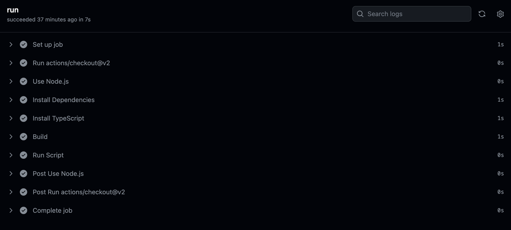
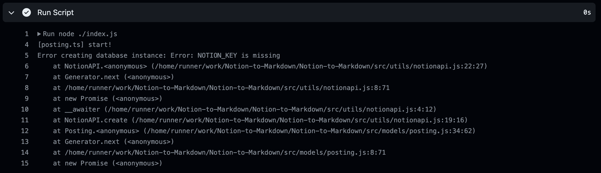
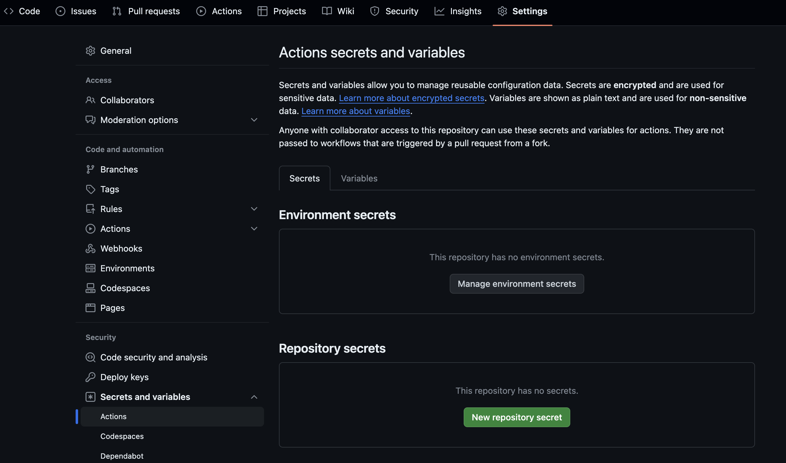

---
tags:
  - Notion-API
  - Blogging
  - Hobby
  - GitHub
  - Typescript
description: "Github Action을 활용한 자동화"
series: "GitHub Pages와 Notion API 연동"
update: "2024-02-01"
date: "2024-02-01"
상태: "Ready"
title: "NotionAPI를 활용한 자동 포스팅(8)"
---
## 목표

단계적으로 GitHub Action을 사용해 블로그 자동 배포를 하려고 한다. 

일단, 구상한 깃허브 액션에서 실행할 플로우는 다음과 같다. 

## 구상

1. 블로그 레포지토리를 받아온다. 

1. 내 프로그램을 돌려 블로그 레포지토리를 업데이트한다. 

1. 블로그 레포지토리를 커밋/푸시한다. 

1. 해당 작업은 특정 시간에, 또는 특정 시간마다 이뤄져야 한다. 

## 구현

### Notion to Markdown 프로그램 실행

#### 워크플로우 파일 생성

단계적으로 구현해보려고 한다. 일단은 내 프로그램을 돌려보자. 

일단 대충 다음과 같이 초안을 짜주었다. 

```yaml
# 이름을 정의한다. 
name: Run TypeScript
# 실행 시기입니다. 이번엔 push, pull_request 될 때 이다. 
on: [push, pull_request]

# 깃허브 액션에서 실행할 작업을 정의하는 섹션이다.
jobs:
	# 단일 작업의 이름을 정의합니다. 이 경우에는 이름이 run 이다.
  run:
		# 작업이 어떤 환경에서 실행될지 정의한다. 
    runs-on: ubuntu-latest
		# 각 작업에서 실행할 순차적인 단계들을 정의한다. 
    steps:
		# uses : 특정 액션을 사용할 때 사용한다.
		# name : step의 이름을 정의한다.
		# with : user로 지정된 액션에 추가적인 매개변수를 전달한다. 
		# run : 쉘 명령어를 실행한다. 
		# env : 환경변수를 설정한다. 
		# if : 조건문
    - uses: actions/checkout@v2
    - name: Use Node.js
      uses: actions/setup-node@v2
      with:
        node-version: '18'

    - name: Install Dependencies
      run: npm install

    - name: Install TypeScript
      run: npm install --save-dev typescript

    - name: Build
      run: npx tsc

    - name: Run Script
      run: node ./index.js
```

이 파일을 프로젝트의 `.github/workflows/main.yml` 로 저장해준다.

그리고 커밋-푸시를 하면 

  


이렇게 실행이 된다. 그리고


env 파일이 없기 때문에 바로 설정값 오류가 났다. 

#### Github secret을 이용한 환경변수 설정

환경변수 설정을 워크플로우 파일 내에서 직접 설정하거나, 리포지토리 설정 또는 깃허브 환경에서 설정할 수 있다. 환경변수가 노출되지 않기를 원하지만 깃허브 전체에 적용될 필요는 없으므로 리포지토리 Setting에서 설정해주려고 한다. 


Secrets는 로그에도 노출되지 않으며, variables는 로그에서 노출이 된다. 적절하게 선택하자. 

NOTION_KEY와 NOTION_DATABASE_ID는 시크릿에, 나머지는 변수들에 저장해주었다. 

다음과 같이 워크플로우 파일을 수정해주면 정상 작동된다. 

```yaml
name: Run TypeScript

on: [push, pull_request]

jobs:
  run:
    runs-on: ubuntu-latest

    steps:
    - uses: actions/checkout@v2

    - name: Use Node.js
      uses: actions/setup-node@v2
      with:
        node-version: '18'

    - name: Install Dependencies
      run: npm install

    - name: Install TypeScript
      run: npm install --save-dev typescript

    - name: Build
      run: npx tsc

    - name: Run Script
      run: node ./index.js
			# 환경변수 불러오기 추가 
      env:
        NOTION_KEY: ${{ secrets.NOTION_KEY }}
        NOTION_DATABASE_ID: ${{ secrets.NOTION_DATABASE_ID }}
        BLOG_URL: ${{ var.BLOG_URL }}
        SAVE_DIR: ${{ var.SAVE_DIR }}
        SAVE_SUB_DIR: ${{ var.SAVE_SUB_DIR }}
```

### 블로그 Repository 추가 

1, 3번 작업을 위해 블로그 레포를 체크아웃 하는 과정을 추가하자. 

이 전에 깃 권한을 얻기 위해 토큰을 발급해주었다. Setting - Develper 설정에 가서 토큰을 발급해주자. classic token으로 발행하고, 적당히 권한을 수정해주었다. 

그리고 해당 토큰도 레포의 Secret에 추가해주었다. 

그리고 나서 워크플로우를 아래와 같이 수정해주었다. 

```yaml
name: Run TypeScript

on: [push, pull_request]

jobs:
  run:
    runs-on: ubuntu-latest

    steps:
    - uses: actions/checkout@v2
		# 블로그 레포 체크아웃
    - name: Checkout Blog Repository
      uses: actions/checkout@v2
      with:
        repository: 'Sharknia/Sharknia.github.io'
        token: ${{ secrets.GITTOKEN }}
        path: 'blog-repo'

    - name: Use Node.js
      uses: actions/setup-node@v2
      with:
        node-version: '18'

    - name: Install Dependencies
      run: npm install

    - name: Install TypeScript
      run: npm install --save-dev typescript

    - name: Build
      run: npx tsc

    - name: Run Script
      run: node ./index.js
      env:
        NOTION_KEY: ${{ secrets.NOTION_KEY }}
        NOTION_DATABASE_ID: ${{ secrets.NOTION_DATABASE_ID }}
        BLOG_URL: ${{ var.BLOG_URL }}
        SAVE_DIR: ${{ var.SAVE_DIR }}
        SAVE_SUB_DIR: ${{ var.SAVE_SUB_DIR }}
		# 블로그 레포 커밋/푸쉬
    - name: Set Git remote URL with token and Commit and Push Changes
			# 다른 저장소이므로 git remote set-url을 실행한다. 
      run: |
        cd blog-repo
        git remote set-url origin https://${{ secrets.GITTOKEN }}@github.com/name/name.github.io
        git config user.name 'name'
        git config user.email 'mail'
        git add .
        git commit -m "Update blog contents" || echo "No changes to commit"
        git push
```

여기까지 해두면, 제대로 깃허브 블로그에 새로운 글이 커밋/푸쉬 되었다!

