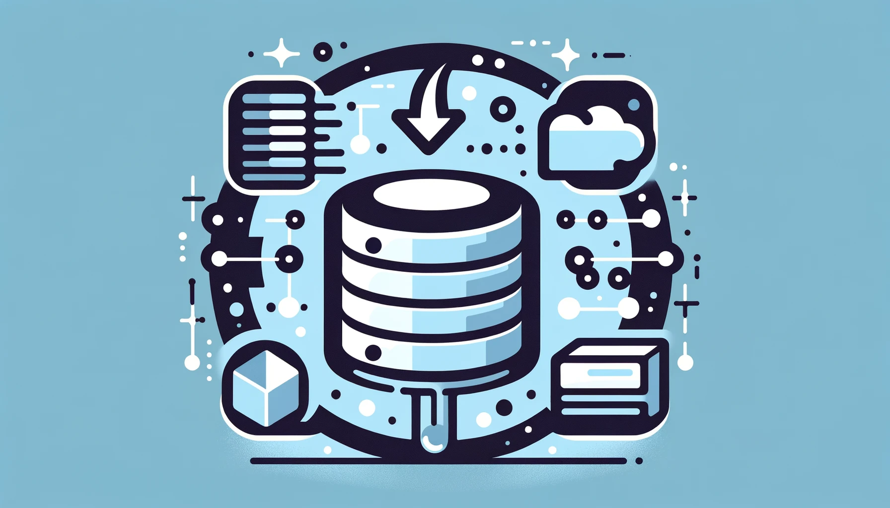

## 서론

PostgreSQL에서는 관계형 데이터를 JSON 형식으로 변환하거나 JSON 데이터를 관계형 테이블로 저장할 수 있는 다양한 기능을 제공합니다. 이번 글에서는 JSON 데이터를 생성하고 다루는 세 가지 유용한 함수인 `row_to_json`, `json_agg`, `json_build_object`에 대해 알아보겠습니다.

## row\_to\_json

`row_to_json` 함수는 관계형 데이터의 단일 행(row)을 JSON 객체로 변환합니다. 이 함수는 테이블의 모든 컬럼을 자동으로 JSON 키-값 쌍으로 매핑하므로, 컬럼을 하나씩 지정할 필요가 없어 편리합니다.

```sql
SELECT row_to_json(row) FROM (
  SELECT id, name, email FROM users WHERE id = 1
) row;
```

위 쿼리는 `users` 테이블에서 `id`, `name`, `email` 컬럼을 선택하고, 이를 JSON 객체로 변환합니다.

## json\_agg

`json_agg` 함수는 여러 행을 JSON 배열로 집계합니다. 이 함수는 하위 쿼리에서 생성된 행 집합을 JSON 배열로 반환합니다.

```sql
SELECT json_agg(row_to_json(row)) FROM (
  SELECT id, name, email FROM users
) row;
```

위 쿼리는 `users` 테이블의 모든 행을 JSON 객체로 변환한 다음, 이러한 JSON 객체들을 JSON 배열로 집계합니다.

## json\_build\_object

`json_build_object` 함수는 키-값 쌍을 입력받아 JSON 객체를 생성합니다. 이 함수는 동적으로 JSON 객체를 구성할 때 유용합니다.

```sql
SELECT json_build_object(
  'id', id,
  'name', name,
  'email', email
) FROM users WHERE id = 1;
```

위 쿼리는 `id`, `name`, `email` 컬럼 값을 사용하여 JSON 객체를 동적으로 생성합니다.

이들 함수를 조합하면 더욱 복잡한 JSON 데이터 구조를 생성할 수 있습니다. 예를 들어, 다음 쿼리는 사용자별 주문 내역을 JSON 형식으로 반환합니다.

```sql
SELECT json_build_object(
  'user', row_to_json(u),
  'orders', json_agg(row_to_json(o))
) FROM users u
LEFT JOIN orders o ON u.id = o.user_id
GROUP BY u.id;
```

이 쿼리는 `users` 테이블과 `orders` 테이블을 조인하여, 각 사용자의 정보와 해당 사용자의 주문 내역을 JSON 객체로 반환합니다. `row_to_json`은 사용자 정보와 각 주문 정보를 JSON 객체로 변환하고, `json_agg`는 주문 내역을 JSON 배열로 집계합니다. 마지막으로 `json_build_object`는 사용자 정보와 주문 내역 JSON 배열을 포함하는 최종 JSON 객체를 생성합니다.

## 다른 함수들

1. json\_object\_agg(key, value)

    - `json_agg` 함수와 유사하지만, 키-값 쌍으로 구성된 JSON 객체를 생성합니다.

    - 예시: `SELECT json_object_agg(id, name) FROM users;`

1. json\_populate\_record(base\_record, json)

    - JSON 데이터를 PostgreSQL 레코드 타입으로 변환합니다.

    - 예시: `SELECT json_populate_record(null::users, '{"id":1, "name":"John"}'::json);`

1. json\_to\_record(json)

    - JSON 데이터를 레코드 타입으로 변환하고, 필드 이름을 키로 사용합니다.

    - 예시: `SELECT * FROM json_to_record('{"id":1, "name":"John"}') AS x(id int, name text);`

1. json\_array\_elements(json)

    - JSON 배열의 각 요소를 별도의 행으로 반환합니다.

    - 예시: `SELECT json_array_elements('[1,2,3]');`

1. json\_array\_elements\_text(json)

    - JSON 배열의 각 요소를 텍스트로 반환합니다.

    - 예시: `SELECT json_array_elements_text('["a", "b", "c"]');`

1. json\_extract\_path(json, path)

    - JSON 데이터에서 지정된 경로의 값을 추출합니다.

    - 예시: `SELECT json_extract_path('{"a": [1,2,3], "b": 4}', '$.a[0]');`

1. json\_extract\_path\_text(json, path)

    - JSON 데이터에서 지정된 경로의 값을 텍스트로 추출합니다.

    - 예시: `SELECT json_extract_path_text('{"a": [1,2,3], "b": 4}', '$.b');`  

## 관계형 데이터 조인 vs JSON 데이터 변환

관계형 데이터를 클라이언트에게 제공할 때, 데이터를 그대로 조인하여 내려주는 방식과 JSON 형식으로 변환하여 내려주는 방식 중 선택할 수 있습니다. 각 방식의 장단점은 다음과 같습니다.

### 관계형 데이터 조인

- 장점:

    - 별도의 데이터 변환 과정이 필요 없어 처리 속도가 빠름

    - 관계형 데이터베이스의 성능 최적화 기능을 그대로 활용할 수 있음

    - 클라이언트에서 데이터 구조 변경이 필요 없음

- 단점:

    - 데이터베이스 스키마 구조에 따라 데이터 형태가 고정됨

    - 계층적 데이터 구조를 표현하기 어려움

    - 클라이언트 측에서 추가 데이터 가공이 필요할 수 있음

### JSON 데이터 변환

- 장점:

    - 데이터 구조를 유연하게 표현할 수 있음

    - 계층적 데이터 구조를 쉽게 표현 가능

    - 클라이언트 측에서 추가 데이터 가공이 필요 없음

    - 다양한 클라이언트(웹, 모바일 앱 등)에 호환 가능

- 단점:

    - 데이터 변환 과정에서 추가 처리 비용 발생

    - 대량 데이터 처리 시 성능 이슈 발생 가능

    - 데이터베이스 최적화 기능을 활용하기 어려움

일반적으로 관계형 데이터를 직접 내려주는 방식이 더 간편하고 성능이 좋습니다. 하지만 데이터 구조가 복잡하거나 다양한 클라이언트에 대응해야 하는 경우, JSON으로 변환하여 내려주는 방식이 유리할 수 있습니다.

따라서 데이터의 양과 복잡성, 클라이언트 유형, 성능 요구 사항 등을 종합적으로 고려하여 적절한 방식을 선택해야 합니다. 또한 두 가지 방식을 혼합하여 사용할 수도 있습니다. 예를 들어, 대량의 단순 데이터는 관계형 데이터로 내려주고, 복잡한 구조의 데이터는 JSON으로 변환하여 내려주는 식입니다.

## 결론

이번 글에서는 PostgreSQL에서 관계형 데이터를 JSON으로 변환하는 방법과 관련 함수들에 대해 알아보았습니다. `row_to_json`, `json_agg`, `json_build_object` 등의 함수를 활용하면 간단한 단일 행부터 복잡한 계층적 구조까지 다양한 형태의 JSON 데이터를 생성할 수 있습니다.

하지만 실제 프로젝트에서는 단순히 JSON 데이터를 생성하는 것 이상의 고려 사항이 있습니다. 먼저 JSON 변환 작업에 따른 성능 오버헤드를 염두에 두어야 합니다. 대량의 데이터를 JSON으로 변환할 경우 성능 이슈가 발생할 수 있으므로, 필요에 따라 적절한 인덱싱이나 파티셔닝 등의 최적화 작업이 수반되어야 합니다.

또한 JSON 데이터를 활용하는 클라이언트 유형과 요구 사항을 파악하는 것도 중요합니다. 웹 API와 모바일 앱의 요구 사항이 다를 수 있으므로, 클라이언트 측에서 추가 작업이 필요한지 여부를 고려해야 합니다. 이를 위해 프론트엔드 개발자와의 긴밀한 협업이 필수적입니다.


