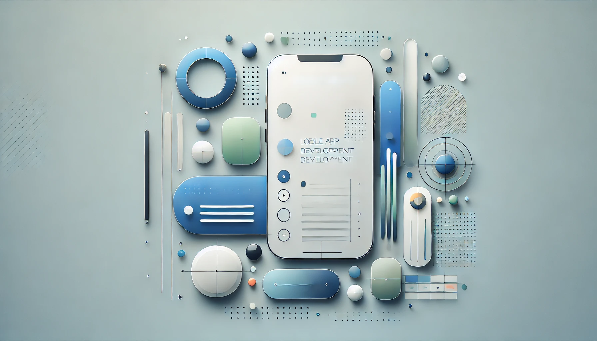

## React Native Paper

### 소개

`react-native-paper`는 React Native로 앱을 개발할 때 Material Design 가이드를 준수하는 UI 컴포넌트 라이브러리입니다. Google의 Material Design 철학을 기반으로 한 다양한 UI 요소를 제공합니다. React Native를 처음 사용하거나, 디자인을 크게 신경 쓰지 않고 표준적인 UI를 빠르게 구축하려는 경우에 적합합니다. 

### 특징

- Material Design 준수

    - Google Material Design의 스타일 가이드를 따르며, 디자인 일관성을 유지하기에 적합합니다.

- 사용하기 쉬운 컴포넌트

    - 버튼, 카드, 텍스트 입력, 다이얼로그, 앱바 등 자주 사용하는 UI 컴포넌트를 제공합니다.

    - **프리셋 스타일**과 **테마**를 이용해 빠르게 개발할 수 있습니다.

- 커스터마이징 가능

    - 제공되는 컴포넌트를 프로젝트에 맞게 커스터마이징할 수 있으며, 테마를 적용하여 색상, 글꼴 등을 변경 가능합니다.

- 반응형 디자인 지원

    - 다양한 화면 크기 및 플랫폼(iOS, Android)에서 잘 동작하는 반응형 디자인을 지원합니다.

- React Native 친화적

    - React Native의 철학에 맞춰 제작되었으며, `react-native-vector-icons`와 잘 통합됩니다.

### 주요 컴포넌트

- Button: 기본 버튼, 아이콘 버튼 등 다양한 스타일의 버튼 제공.

- Card: Material Design 스타일의 카드 컴포넌트.

- AppBar: 상단바(AppBar) 컴포넌트.

- TextInput: 다양한 텍스트 입력 UI.

- FAB: 플로팅 액션 버튼(Floating Action Button).

- Dialog: 알림 대화상자.

- Snackbar: 사용자에게 간단한 알림을 제공하는 스낵바.

### 설치

```bash
npm install nativewind react-native-paper react-native-vector-icons
```

### 예제

```typescript
import * as React from 'react';
import { Button } from 'react-native-paper';

const MyComponent = () => (
    <Button icon="camera" mode="contained" onPress={() => console.log('Pressed')}>
        Press me
    </Button>
);

export default MyComponent;

```

위처럼 버튼 컴포넌트를 쉽게 사용할 수 있습니다. 

### 아이콘이 제대로 로드되지 않는 문제

react-native-vector-icons를 사용해 아이콘을 쓰고 싶은데, 아이콘 이름을 제대로 입력해도 아이콘이 제대로 출력되지 않는 문제가 발생했습니다. 이 문제는 다음의 방법을 사용해 해결할 수 있습니다. 

react-native-vector-icons.d.ts 파일을 생성합니다. 

```typescript
declare module 'react-native-vector-icons/MaterialCommunityIcons' {
    import { Component } from 'react';
    import { IconProps } from 'react-native-vector-icons/Icon';

    export default class MaterialCommunityIcons extends Component<IconProps> {}
}
```

App.tsx의 상단부에 선언합니다. 

```typescript
import Icon from 'react-native-vector-icons/MaterialCommunityIcons';

Icon.loadFont();
```

아래와 같이 사용합니다. 

```typescript
import React from 'react';
import { StyleSheet } from 'react-native';
import { Button } from 'react-native-paper';
import Icon from 'react-native-vector-icons/MaterialCommunityIcons';

interface SocialButtonProps {
    text: string;
    icon: string;
    color: string;
    onPress: () => void;
}

const SocialButton: React.FC<SocialButtonProps> = ({ text, icon, color, onPress }) => {
    return (
        <Button
            mode="contained"
            onPress={onPress}
            style={[styles.button, { backgroundColor: color }]}
            labelStyle={styles.label}
            icon={() => <Icon name={icon} size={24} color="white" />}
        >
            {text}
        </Button>
    );
};
```

[이 페이지](https://pictogrammers.com/library/mdi/)에서 아이콘을 미리 볼 수 있습니다. 

## React Navigation

상단 헤더는 `react-native-paper` 를 사용해 간단하게 구현이 가능하지만 하단탭은 React Navigation 라이브러리를 설치하고 사용해야 합니다.

```typescript
npm install @react-navigation/native @react-navigation/bottom-tabs react-native-screens react-native-safe-area-context react-native-gesture-handler react-native-reanimated react-native-vector-icons
```

AppNavigator를 만들 때 사용했던 `AppNavigator.tsx` 파일에 다음의 내용을 추가 작성합니다. 

```typescript
import { createBottomTabNavigator } from '@react-navigation/bottom-tabs';
import React from 'react';
import Icon from 'react-native-vector-icons/MaterialCommunityIcons';
import FeedScreen from '../screens/FeedScreen';
import HomeScreen from '../screens/HomeScreen';
import WriteScreen from '../screens/WriteScreen';

const Tab = createBottomTabNavigator();

const BottomTabNavigator: React.FC = () => {
    return (
        <Tab.Navigator
            screenOptions={({ route }) => ({
                tabBarIcon: ({ color, size }) => {
                    let iconName;
                    if (route.name === 'Home') {
                        iconName = 'home';
                    } else if (route.name === 'Write') {
                        iconName = 'pencil';
                    }
                    return <Icon name={iconName} size={size} color={color} />;
                },
                tabBarActiveTintColor: '#F4A261',
                tabBarInactiveTintColor: 'gray',
                // tabBarShowLabel: false, // 메뉴 이름 숨기기
                headerShown: false,
            })}
        >
            <Tab.Screen name="Home" component={HomeScreen} />
            <Tab.Screen name="Write" component={WriteScreen} />
        </Tab.Navigator>
    );
};
```

원하는대로 생성된 하단바의 모습을 볼 수 있습니다. 


