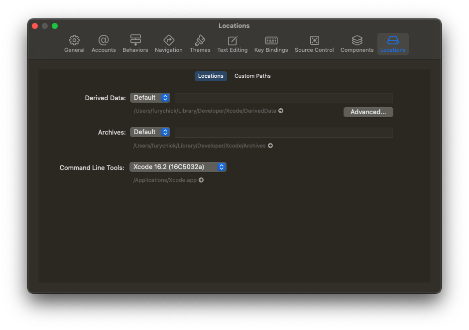
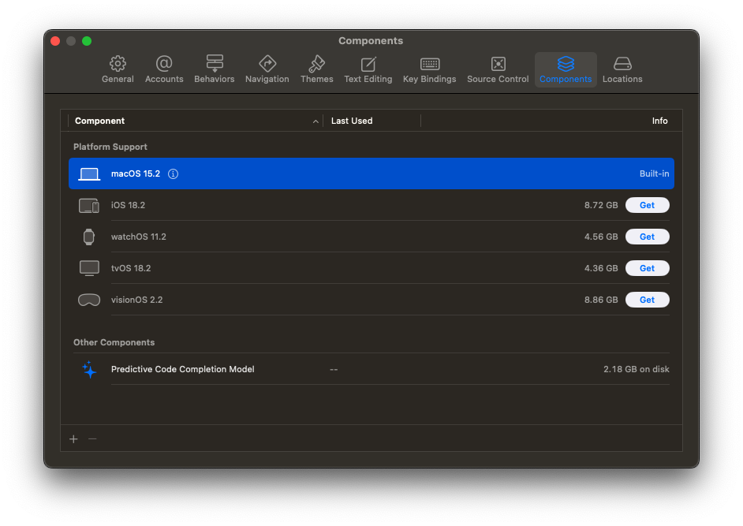
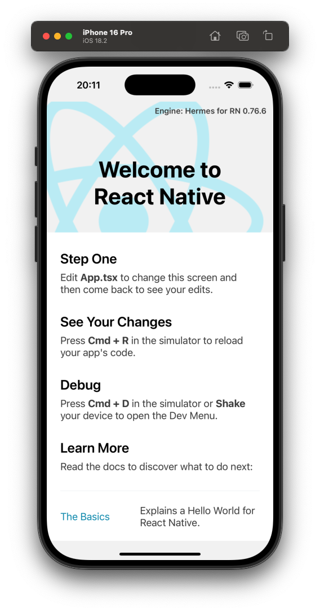

## **React Native 환경 설정**

현재 맥북을 사용하고 있고, IDE는 VScode를 사용하고 있습니다. NVM은 이미 설치되어 있다고 가정하겠습니다. 

먼저, iOS 개발을 위한 환경을 확인하세요.

### **Xcode 설치**

- App Store에서 Xcode를 설치하세요.

- 설치 후 Xcode를 실행하고, "Preferences > Locations"에서 Command Line Tools를 설정합니다.

    
### **Node.js 설치**

NVM을 이미 사용중이므로 다음의 명령어를 사용해 node 버전 명시만 해주겠습니다. 20.13.1을 사용하겠습니다. 

```bash
echo "20.13.1" > .nvmrc
```

## Watchman 설치

#### **Watchman의 역할**

- React Native CLI를 사용할 때, 파일 변경 사항을 감지해 앱을 즉각적으로 업데이트.

- 대규모 프로젝트에서도 빠르게 파일 변경을 감지.

- 선택 사항이지만, 맥에서 개발할 때 성능을 개선하는 데 유용.

```bash
brew install watchman
```

설치 후 아래의 명령어로 설치를 확인합니다. 

```bash
watchman --version
```

## React Native 프로젝트 생성

React Native CLI를 사용해 프로젝트를 생성합니다.

```bash
npx @react-native-community/cli init MyFirstApp
cd MyFirstApp
```

설치를 하다보면 CocoaPods를 설치하겠냐고 물어봅니다. 

### CocoaPods

**CocoaPods**는 macOS 및 iOS 앱 개발에서 사용되는 **의존성 관리 도구**입니다. React Native 프로젝트의 iOS 빌드와 관련된 라이브러리를 관리하기 위해 필수적인 도구입니다.

#### **CocoaPods의 역할**

iOS 네이티브 라이브러리 관리

- 외부 라이브러리(예: React Native Paper, Firebase 등)를 프로젝트에 추가하고 관리합니다.

- 필요할 때마다 최신 버전으로 업데이트를 쉽게 수행할 수 있습니다.

자동 구성

- 네이티브 라이브러리를 프로젝트에 포함시킬 때 필요한 설정(예: Xcode 빌드 설정)을 자동으로 처리합니다.

- CocoaPods 없이 이런 설정을 수동으로 관리하면 시간이 많이 걸리고 오류가 발생할 가능성이 높습니다.

Podfile 관리

- CocoaPods는 프로젝트의 의존성을 Podfile이라는 파일로 관리합니다.

- Podfile은 어떤 라이브러리를 사용할지 정의하는 파일입니다.

#### 설치

```bash
pod --version
```

CocoaPods가 설치되지 않았다면 다음의 명령어를 사용해 설치합니다. 

```bash
brew install cocoapods
```

cocoapods를 지금 설치했다면 CocoaPods 의존성 재설치를 해야 합니다. 

```bash
cd ios
pod install
```

## iOS 프로젝트 빌드

```bash
npx react-native run-ios
```

iOS 시뮬레이터가 자동으로 실행되며, 기본 React Native 앱이 표시됩니다.

### 시뮬레이터

해당 명령어를 실행했을 때, 다음과 같은 오류가 발생할 수 있습니다. 

```bash
error iOS devices or simulators not detected. Install simulators via Xcode or connect a physical iOS device
```

이 오류는 시뮬레이터가 설치되지 않은 것으로,

```bash
xcrun simctl list devices
```

이 명령어를 사용해 설치된 시뮬레이터를 확인할 수 있습니다. 만약 시뮬레이터가 설치되어 있지 않다면 설치해야 합니다. 저는 최초 Xcode 설치 시 iOS를 선택하지 않아 해당 오류가 발생했습니다. 

Xcode의 설정에서 Components 탭으로 이동해 iOS 시뮬레이터를 설치해주면 됩니다. 


### 오류!

```bash
Error: EMFILE: too many open files, watch
    at FSWatcher._handle.onchange (node:internal/fs/watchers:207:21)
Emitted 'error' event on NodeWatcher instance at:
    at FSWatcher._checkedEmitError (/Users/furychick/Develop/tuum/node_modules/metro-file-map/src/watchers/NodeWatcher.js:82:12)
    at FSWatcher.emit (node:events:519:28)
    at FSWatcher._handle.onchange (node:internal/fs/watchers:213:12) {
  errno: -24,
  syscall: 'watch',
  code: 'EMFILE',
  filename: null
}
```

이런 오류가 발생할 수 있습니다. 이 에러는 파일 감시(watch)와 관련된 문제이며, macOS에서 `EMFILE: too many open files`는 시스템이 동시에 열 수 있는 파일 핸들의 수가 초과되었을 때 발생합니다. Watchman을 사용해 이 오류를 피할 수 있습니다. 이미 설치가 되어있는데도 해당 오류가 발생한다면 Watchman 서비스 재시작 - 캐시 정리 - 다시 실행을 시도합니다. 

```bash
watchman shutdown-server
watchman watch-del-all
npx react-native start --reset-cache
```

## 결론


이 화면이 확인되면 React Native 프로젝트가 **정상적으로 빌드 및 실행된 것**입니다. 이제 React Native의 기본 구조와 기능을 수정하거나 추가하여 프로젝트를 진행할 수 있습니다.


