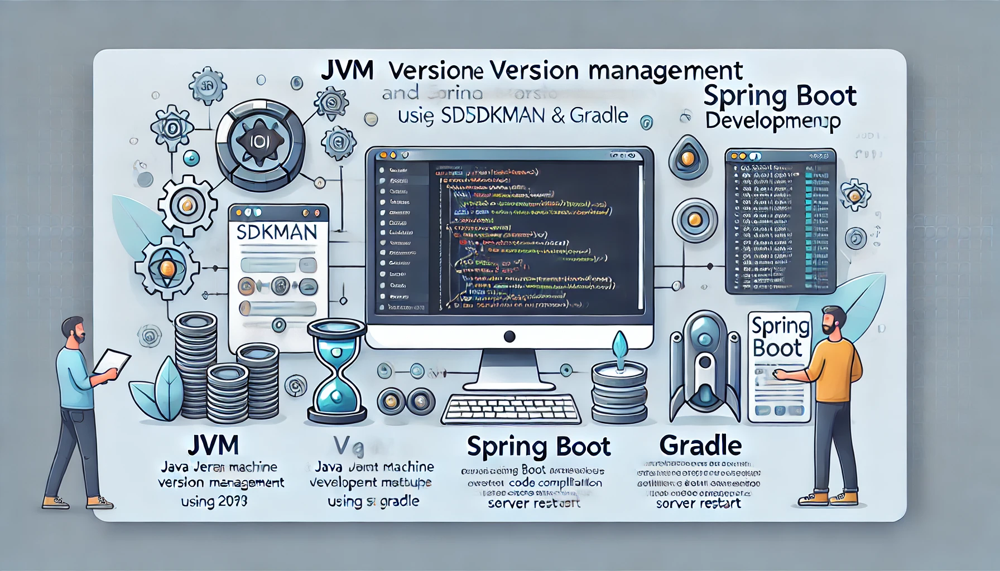
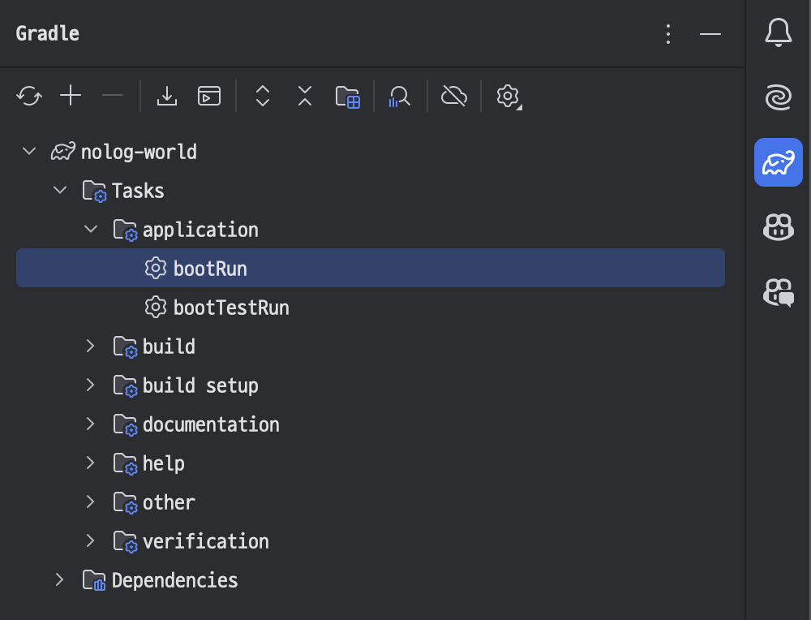
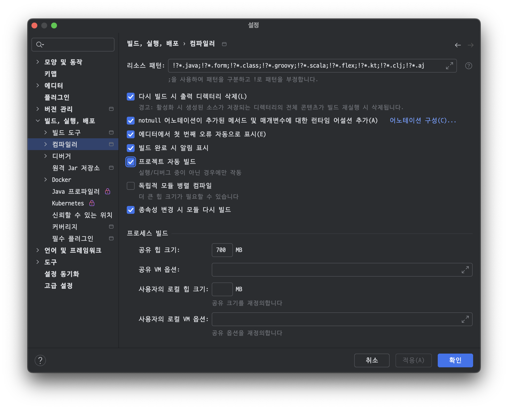
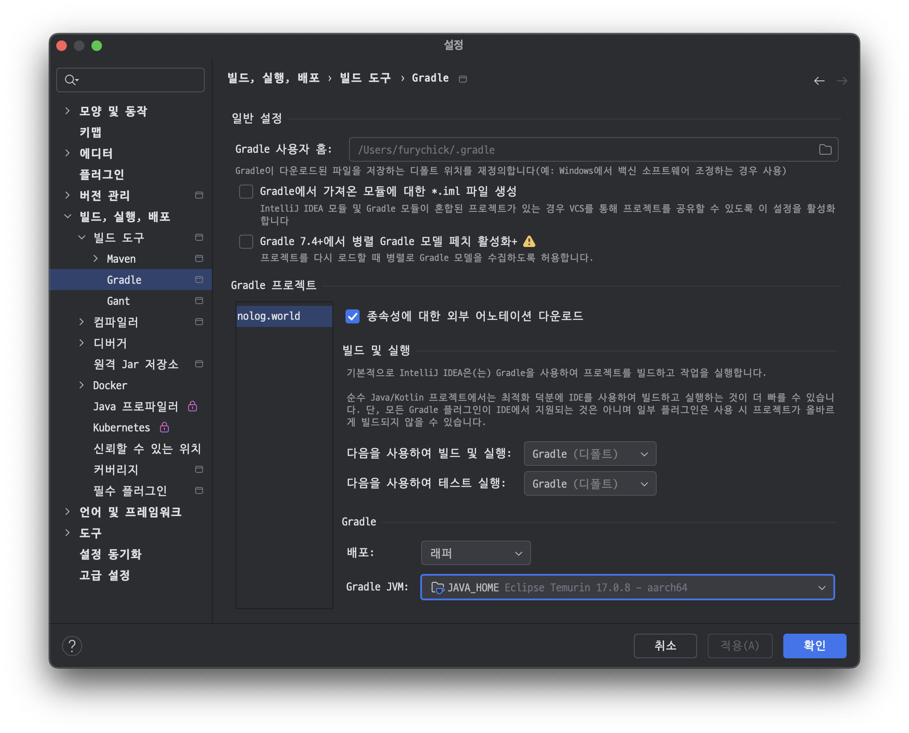
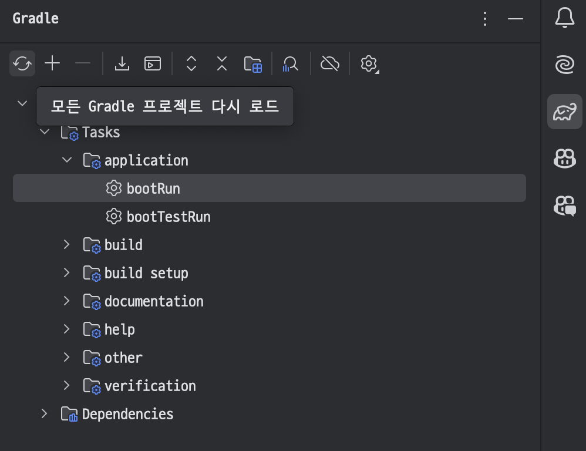

## 서론

JVM(Java Virtual Machine) 버전을 관리할 수 있는 도구로는 **SDKMAN!**이라는 것이 있습니다. SDKMAN!은 다양한 JVM 버전뿐만 아니라 여러 Java 관련 도구(예: Maven, Gradle, Scala 등)도 쉽게 설치하고 관리할 수 있게 도와줍니다.

## 설치

터미널에서 다음 명령어를 실행하여 SDKMAN!을 설치합니다.

```bash
curl -s "https://get.sdkman.io" | bash
```

설치가 완료되면, 새로운 쉘을 열거나 다음 명령어를 실행하여 SDKMAN!을 활성화합니다.

```bash
source "$HOME/.sdkman/bin/sdkman-init.sh"
```

JVM 버전을 설치하고 관리할 수 있습니다. 예를 들어, 특정 Java 버전을 설치하려면 다음과 같이 입력합니다.

```bash
sdk install java 11.0.11.hs-adpt
```

설치된 JVM 버전을 전환할 때는 다음 명령어를 사용합니다.

```bash
sdk use java 11.0.11.hs-adpt
```

## bootRun

### booRun?

`bootRun`은 Spring Boot 애플리케이션을 Gradle을 통해 직접 실행할 수 있도록 하는 Gradle task입니다. 이는 Gradle 빌드 도구를 사용하는 Spring Boot 프로젝트에서, 애플리케이션을 컴파일하고 즉시 실행할 수 있도록 해주는 편리한 명령어입니다.

### `bootRun`의 역할

1. 코드를 컴파일: `bootRun` 명령어는 프로젝트의 코드를 컴파일한 후, 애플리케이션을 실행합니다.

1. 애플리케이션 실행: Spring Boot 애플리케이션을 직접 실행하여 `localhost:8080` 등에서 결과를 확인할 수 있습니다.

1. 개발 단계에서 주로 사용: `bootRun`은 애플리케이션을 개발할 때 빠르게 실행하고 테스트하기에 적합한 도구입니다. `bootJar`와 같이 패키징하는 과정 없이도 바로 실행이 가능하기 때문에, 코드를 수정하고 결과를 빠르게 확인할 수 있습니다.

### `bootRun` 명령어 실행 방법


Intellij에서 Gradle 메뉴를 선택 후 `bootRun`을 더블클릭 합니다. 

### 주의 사항

- `bootRun`은 개발 환경에서 주로 사용되며, 배포용 빌드에는 적합하지 않습니다. 실제로 애플리케이션을 배포할 때는 `bootJar` 같은 태스크로 패키징된 JAR 파일을 만들어서 배포하는 것이 좋습니다.

- 환경 변수 및 프로파일 설정을 통해 개발과 배포 환경을 구분해서 사용할 수 있습니다.

### 요약

- `bootRun`은 Spring Boot 애플리케이션을 즉시 실행하는 Gradle의 편리한 태스크입니다.

- 개발 중에 빠르게 애플리케이션을 실행하고 테스트할 수 있습니다.

### 결과

bootRun까지 마치면 [http://localhost:8080](http://localhost:8080/)에서 서버를 테스트 해볼 수 있습니다.

## 코드 수정 후 자동 컴파일-자동 재실행 설정하기

코드를 수정할 때마다 bootRun을 할 생각을 하니 끔찍합니다. 이를 피하기 위해 코드 변경 시 서버가 자동으로 재시작되도록 설정하는 것이 훨씬 편리하게 개발할 수 있는 방법입니다.

### IntelliJ에서 자동 빌드 설정

설정에서 다음을 찾아 `프로젝트 자동 빌드` 를 체크합니다.


이번안 다음을 찾아 `개발된 애플리케이션이 현재 실행 중인 경우에도 auto-make가 시작되도록 허용` 을 체크합니다. 


### 자동 서버 재실행: spring boot devtools

### Spring Boot Devtools의 주요 기능

#### **자동 재시작 (Automatic Restart)**

애플리케이션의 클래스나 리소스 파일이 변경되면, Devtools가 이를 감지하고 애플리케이션을 자동으로 재시작합니다.

Gradle 또는 Maven 프로젝트에 의존성을 추가하면 활성화되며, Spring Boot 프로젝트를 재실행하지 않아도 변경된 코드가 반영됩니다.

#### **LiveReload 통합**

LiveReload는 브라우저를 자동으로 새로 고침하는 기능을 제공하며, 코드를 수정하면 브라우저에서 변경 사항이 즉시 반영됩니다.

이를 통해 프론트엔드 개발 시에도 수정한 내용을 즉시 확인할 수 있습니다.

#### **캐싱 비활성화**

Devtools는 개발 중 데이터 캐싱을 비활성화하여, 변경된 설정이나 데이터를 즉시 반영할 수 있도록 돕습니다. 프로덕션 환경에서는 캐싱을 사용하는 것이 일반적이지만, 개발 중에는 캐싱으로 인해 변경 사항이 제대로 반영되지 않는 상황을 방지합니다.

#### **프로퍼티 파일 자동 로딩**

`application.properties` 또는 `application.yml` 파일을 수정하면, Devtools가 이를 감지하고 다시 로딩해 변경된 설정을 반영합니다.

### 설치

자동으로 서버를 재실행 하기 위해서는 spring boot devtools가 필요합니다. 다음의 의존성을 추가하고 Gradle을 새로고침합니다. 

```bash
developmentOnly("org.springframework.boot:spring-boot-devtools")
```

`developmentOnly` 를 사용해 **개발 환경에서만 사용**하도록 설계되었습니다. 배포 시 Devtools가 포함되지 않으며, 이를 위한 별도의 설정 없이도 프로덕션 빌드에서 Devtools가 자동으로 제외됩니다.

### 환경 설정

`application.properties` 에 다음의 설정을 추가해줬습니다. 이로써 이 프로젝트가 어느 환경인지를 명시할 수 있습니다. 

```kotlin
${enviroment:dev}
```

### 결과

여기까지 마치면 클래스 파일을 수정을 하면 브라우저를 통해서 테스트를 해보면 변경사항이 별도의 작업 없이 반영되는 것을 확인할 수 있습니다. 다만 파이썬이나 Node.js처럼 즉각적으로 반영은 되지 않고 약간의 시간 소요가 필요합니다. 

## 윈도우에선: jabba

윈도우에서도 SDKMAN!을 사용할 수 있는지 찾아보면 WSL을 통해 설치할 수 있다는 글이 꽤 나옵니다. 물론 이렇게 해서 설치를 할 수는 있지만, WSL은 윈도우 환경과 분리되어 있어 WSL에 설치된 프로그램은 기본적으로 WSL 내부에서만 동작합니다. 

단적으로 이야기해서 인텔리제이에서는 이렇게 설치된 SDKMAN!을 통한 JDK는 사용할 수 없습니다. 따라서 윈도우에서 JDK 버전 관리를 위해서는 다른 프로그램을 사용해야 합니다. 바로 Jabba입니다. 

### Jabba 설치

PowerShell을 관리자 권한으로 실행해 다음의 명령어를 실행합니다. 

```powershell
iwr -useb https://raw.githubusercontent.com/shyiko/jabba/master/install.ps1 | iex
```

### 설치 오류

관리자 권한으로 실행을 했는데도 다음과 같은 오류가 난다면

```powershell
. : 이 시스템에서 스크립트를 실행할 수 없으므로 C:\Users\ID\.jabba\jabba.ps1 파일을 로드할 수 없습니다. 자세한
내용은 about_Execution_Policies(https://go.microsoft.com/fwlink/?LinkID=135170)를 참조하십시오.
위치 줄:80 문자:3
+ . $jabbaHome\jabba.ps1
+   ~~~~~~~~~~~~~~~~~~~~
    + CategoryInfo          : 보안 오류: (:) [], PSSecurityException
    + FullyQualifiedErrorId : UnauthorizedAccess
```

PowerShell의 실행 정책이 기본적으로 제한되어 있어 발생합니다. 이를 허용하려면 실행 정책을 변경하면 됩니다. PowerShell을 관리자 권한으로 실행해 다음의 명령어를 입력합니다.

```powershell
Set-ExecutionPolicy RemoteSigned -Scope CurrentUser
```

이 명령어는 로컬에서 생성된 스크립트는 실행을 허용하고, 원격에서 다운로드된 스크립트는 서명이 있을 때만 실행하도록 합니다.

다시 시도를 하면 설치가 정상적으로 된 것을 확인할 수 있습니다. 

### JDK 설치

다음의 명령어를 사용해 설치 가능한 리스트를 확인할 수 있습니다. 

```powershell
jabba ls-remote
```

원하는 버전을 선택해 다음의 명령어로 설치합니다. 

```powershell
jabba install {선택한버전}
```

아래의 명령어로 설치된 JDK 리스트를 확인하고

```powershell
jabba ls
```

다음의 명령어로 사용할 자바를 선택할 수 있습니다. 

```powershell
jabba use {선택한버전}
```

## 오류

### 잘못된 Gradle JDK 구성을 발견했습니다.

**IntelliJ IDEA**에서 Gradle이 사용하고 있는 JDK 버전이 프로젝트에 필요한 JDK 버전과 일치하지 않기 때문에 발생할 수 있습니다. 이를 해결하려면 IntelliJ에서 Gradle이 사용하는 JDK를 올바르게 설정해 주어야 합니다.

IntelliJ IDEA에서 "잘못된 Gradle JDK 구성을 발견했습니다" 메시지 옆에 있는 "Gradle 설정 열기" 버튼을 클릭하거나, 상단 메뉴에서 File > Settings (macOS의 경우 IntelliJ IDEA > Preferences)로 이동합니다.

왼쪽 메뉴에서 Build, Execution, Deployment > Build Tools > Gradle을 선택합니다.


현재 사용하는 버전의 JVM이 올바르게 선택되어 있는지 확인합니다. 만약 필요한 버전이 목록에 없으면, 해당 버전을 설치 또는 추가 해줘야합니다.

오류를 해결 한 후 


Refresh를 실행합니다. 

