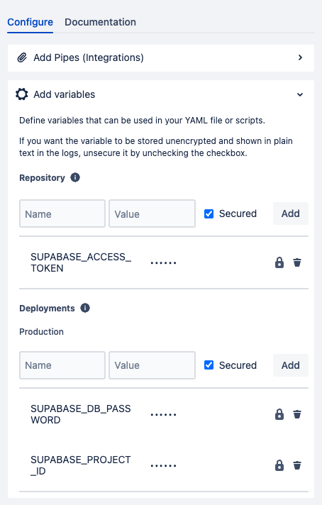

## 서론

이제 작업이 막바지에 이르러 실서버를 꾸며야 하는 날이 왔습니다. 로컬에서 명령어를 입력해서 실서버에 배포를 하는 일은 절대로 사양이기 때문에 Bitbucket의 Pipelines를 활용해서 태그가 달리는 순간 자동적으로 Supabase 내용이 실서버에 적용되도록 CI/CD 워크플로우를 구축하려고 합니다. 

이 포스팅은 해당 과정을 기록한 것입니다. 

## 워크플로우 파일 작성

우선 워크플로우 파일을 작성해야 합니다. Github Action과 다르게 Bitbucket Pipelines를 위한 yml 파일은 루트 폴더에 바로 위치합니다. `bitbucket-pipelines.yml` 파일입니다. 

### 환경변수 정의

[이 링크](https://supabase.com/docs/guides/cli/managing-environments?queryGroups=environment&environment=production) 를 보면 필요한 환경변수들이 정의되어 있습니다. Github Action을 위한 페이지이지만, Bitbucket에서도 해당 내용은 동일하게 적용됩니다. 

| SUPABASE_ACCESS_TOKEN | Supabase Access Token입니다.  | [이 페이지](https://supabase.com/dashboard/account/tokens) |  에서 발급받을 수 있습니다. |
| --- | --- |
| SUPABASE_DB_PASSWORD | DB 비밀번호입니다. 각 프로젝트의 Setting - Database 메뉴 - Database password 섹션에서 재발급 받을 수 있습니다.  |
| SUPABASE_PROJECT_ID | 각 프로젝트의 Setting - General 메뉴 - Reference ID 섹션에서 확인할 수 있습니다.  |


Bitbukcet 콘솔의 Pipelines를 정의하는 곳에서 위와 같이 설정해주면 됩니다. SUPABASE\_ACCESS\_TOKEN는 모든 환경에서 공통적으로 쓰이기 때문에 Repository 영역에 정의해주고, 나머지 두 환경변수는 각 환경 (dev, prod, staging 등.. ) 마다 다를 것이므로 Deployments 영역에 정의해주었습니다. 

### bitbucket-pipelines.yml

완성된 코드는 다음과 같습니다. 

```yaml
image: node:20

pipelines:
    tags:
        'v*': # 태그 이름이 'v'로 시작하는 경우
            - step:
                  name: Edge function Deploy and DB Update
                  caches:
                      - node
                  script:
                      - npm i supabase
                      - npx supabase link --project-ref $SUPABASE_PROJECT_ID
                      - npx supabase functions deploy
                      - yes | npx supabase db push
                  services:
                      - docker
                  deployment: production
```

tags가 달렸을 때, 그 태그의 이름이 v로 시작한다면 production deployment의 워크플로우가 실행됩니다. 

supabase를 설치해주고, 실서버 프로젝트에 연결해준 후, edge function을 배포하고, 마지막으로 DB의 변경사항을 체크해 db 스키마를 업데이트 합니다. 

## Troubleshooting

처음에는 [해당 가이드](https://supabase.com/docs/guides/functions/cicd-workflow#bitbucket-pipelines)를 보고 코드를 작성하였습니다. 

### deployment의 정의

<details>
<summary>에러 코드 전문</summary>

```yaml
image: node:20

pipelines:
  branches:
    main:
      - step:
          name: Setup
          caches:
            - node
          script:
            - npm i supabase
      - step:
          name: Functions Deploy
          script:
            - npx supabase functions deploy
          services:
            - docker
          deployment: production
      - step:
          name: DB Update
          script:
            - npx supabase db push
          services:
            - docker
          deployment: production
```


</details>

처음 위와 같이 워크플로우를 작성하였을 때, 아래와 같은 오류가 발생했습니다. 

```bash
Configuration error
The deployment environment 'production' in your bitbucket-pipelines.yml file 
occurs multiple times in the pipeline. 
Please refer to our documentation for valid environments and their ordering.
```

Bitbucket Pipelines에서 발생하는 이 오류 메시지는 특정 단계에서 동일한 배포 환경(여기서는 'production')이 여러 번 지정되었을 때 나타납니다. 각 파이프라인 구성에서는 각 배포 환경을 한 번만 명시적으로 참조해야 합니다.

여기서 문제는 'Functions Deploy' 단계와 'DB Update' 단계 모두에서 `deployment: production`이 사용되었다는 것입니다. 이러한 중복을 해결하기 위해 다음과 같은 방법들을 고려할 수 있습니다. 

어차피 모두 실행되어야 하는 코드 조각이므로, 여러 스텝을 단일 배포 단계로 통합해주었습니다. 

### npm i supabase를 했는데도 npx에서 다시 설치하려고 하는 문제

<details>
<summary>문제 코드 전문</summary>

```yaml
image: node:20

pipelines:
    tags:
        'v*': # 태그 이름이 'v'로 시작하는 경우
            - step:
                  name: Setup
                  caches:
                      - node
                  script:
                      - npm i supabase
                  services:
                      - docker
            - step:
                  name: Edge function Deploy and DB Update
                  caches:
                      - node
                  script:
                      - npx supabase link --project-ref $SUPABASE_PROJECT_ID
                      - npx supabase functions deploy
                      - yes | npx supabase db push
                  services:
                      - docker
                  deployment: production

```


</details>

위와 같이 작성하면, 첫번째 스텝에서 npm i 를 통해 supabase를 저장하고 캐싱 해주었는데도 두번째 스텝에서 패키지를 찾지 못하고 npx에서 다시 인스톨을 합니다. 

```bash
npx supabase link --project-ref $SUPABASE_PROJECT_ID
1s
+ npx supabase link --project-ref $SUPABASE_PROJECT_ID
npm WARN exec The following package was not found and will be installed: supabase@1.163.6
```

결국 Step을 나누지 않고 한 Step에 합쳐주었습니다.

### 프롬포트에 응답이 필요한 경우

```yaml
script:
  - npm i supabase
  - npx supabase link --project-ref $PRODUCTION_PROJECT_ID --debug
  - npx supabase db push --debug
```

이렇게 스크립트를 작성한 경우, 아래와 같이 출력된 상황에서 무한 로딩이 발생합니다. 

```bash
Do you want to push these migrations to the remote database?
 • 20240329084939_remote_schema.sql
 • 20240415051605_remote_schema.sql
 • 20240415052055_remote_schema.sql
 • 20240415082434_remote_schema.sql
 • 20240415092355_storage.sql
 • 20240415092443_remote_schema.sql
 • 20240416060241_remote_schema.sql
 • 20240429012631_remote_schema.sql
 • 20240429061821_remote_schema.sql
 • 20240429062003_remote_schema.sql
 [Y/n] 2024/04/29 08:30:26 PG Recv: {"Type":"ParameterStatus","Name":"application_name","Value":"Supavisor"}
```

배포 작업이 진행되다보면, Y 또는 N 응답을 요구하는 경우가 있습니다. 이 경우가 바로 그 경우입니다. 

CI/CD 파이프라인에서 대화형 프롬프트에 자동으로 응답하는 방법은 일반적으로 스크립트를 사용하여 자동화하는 것입니다. 이 경우, `supabase db push` 명령이 사용자 입력을 요구하는데, 이를 자동화하기 위해 `yes` 명령을 사용할 수 있습니다.

`yes` 명령은 반복적으로 `y`를 출력하여, 대화형 프롬프트에 자동으로 'yes'를 입력하는 데 사용됩니다. 이 명령을 `supabase db push`와 파이프라인하면 사용자 입력을 요구하는 모든 질문에 자동으로 `y`를 제공할 수 있습니다.

Bitbucket Pipelines의 스크립트를 다음과 같이 수정합니다. 

```yaml
script:
  - npm i supabase
  - npx supabase link --project-ref $PRODUCTION_PROJECT_ID --debug
  - yes | npx supabase db push --debug
```


        물론, 무조건 Y를 연타하게 되기 때문에 주의해서 사용해야 합니다!

### Supabase Migration 버전 맞추기

```yaml
yes | npx supabase db push
2s
+ yes | npx supabase db push
Connecting to remote database...
Do you want to push these migrations to the remote database?
 • 20240329084939_remote_schema.sql
 • 20240415051605_remote_schema.sql
 • 20240415052055_remote_schema.sql
 • 20240415082434_remote_schema.sql
 • 20240415092355_storage.sql
 • 20240415092443_remote_schema.sql
 • 20240416060241_remote_schema.sql
 • 20240429012631_remote_schema.sql
 • 20240429061821_remote_schema.sql
 • 20240429062003_remote_schema.sql
 [Y/n] y
Applying migration 20240329084939_remote_schema.sql...
ERROR: type "action_type_enum" already exists (SQLSTATE 42710)    
At statement 24: CREATE TYPE "public"."action_type_enum" AS ENUM (
    'pending',                                                    
    'skipped',                                                    
    'disliked',                                                   
    'proposed',                                                   
    'blocked'                                                     
)                                                                 
Try rerunning the command with --debug to troubleshoot the error.
```

이미 존재한다는 오류가 발생하고 있습니다. 로컬에서 remote의 마이그레이션 상태를 확인해봅시다. 

```yaml
supabase link --project-ref [ProjcetId]
```

를 통해 실서버 프로젝트와 연결한 후 

```yaml
supabase migration list   
```

명령어를 사용하면

```yaml
        LOCAL      │ REMOTE │     TIME (UTC)
  ─────────────────┼────────┼──────────────────────
    20240329084931 │        │ 2024-03-29 08:49:39
    20240415051602 │        │ 2024-04-15 05:16:05
    20240415052053 │        │ 2024-04-15 05:20:55
    20240415082434 │        │ 2024-04-15 08:24:34
    20240415092355 │        │ 2024-04-15 09:23:55
    20240415092447 │        │ 2024-04-15 09:24:43
    20240416060241 │        │ 2024-04-16 06:02:41
    20240429012631 │        │ 2024-04-29 01:26:31
    20240429061821 │        │ 2024-04-29 06:18:21
    20240429062003 │        │ 2024-04-29 06:20:03
```

이렇게, 마이그레이션 버전이 로컬과 원격이 맞지 않는 것을 확인할 수 있습니다. 

왜냐면 제가 실서버에 DB를 세팅할 때에 supabase migration 명령어를 사용한 것이 아니라 직접 생성된 쿼리문을 실서버에 실행시켰기 때문입니다. 

DB 상태가 이미 강제로 맞춰져 있을 것이므로(작업이 끝난 후 혹시 몰라 한 번 더 확인 하였습니다\), 다음의 명령어를 통해 강제로 마이그레이션이 적용된 상태로 수리합니다. 

```yaml
supabase migration repair --status applied
```

이렇게 한 후, 다시 migration list 명령어를 사용하면 

```yaml
Connecting to remote database...

  
        LOCAL      │     REMOTE     │     TIME (UTC)
  ─────────────────┼────────────────┼──────────────────────
    20240329084939 │ 20240329084939 │ 2024-03-29 08:49:39
    20240415051605 │ 20240415051605 │ 2024-04-15 05:16:05
    20240415052055 │ 20240415052055 │ 2024-04-15 05:20:55
    20240415082434 │ 20240415082434 │ 2024-04-15 08:24:34
    20240415092355 │ 20240415092355 │ 2024-04-15 09:23:55
    20240415092443 │ 20240415092443 │ 2024-04-15 09:24:43
    20240416060241 │ 20240416060241 │ 2024-04-16 06:02:41
    20240429012631 │ 20240429012631 │ 2024-04-29 01:26:31
    20240429061821 │ 20240429061821 │ 2024-04-29 06:18:21
    20240429062003 │ 20240429062003 │ 2024-04-29 06:20:03
```

정상적으로 마이그레이션이 적용되었고, CI/CD를 다시 태워보면

```yaml
yes | npx supabase db push
2s
+ yes | npx supabase db push
Connecting to remote database...
Remote database is up to date.
```

정상적으로 원격 DB가 최신화된 로그를 확인할 수 있습니다. 

## (Option) Edge Function의 배포

Edge Function의 배포는 다음의 명령어를 통해 이뤄집니다. 

```bash
supabase functions deploy [Option: 함수명]
```

그런데 인증 jwt 토큰이 없어도 실행이 가능해야 하는 Edge function이 있을 수 있습니다. 이때에는 옵션값을 추가해줘야 합니다. 옵션은 다음과 같습니다. 

```bash
supabase functions deploy hello-world --no-verify-jwt
```

함수명을 입력하지 않고, deploy 까지만 했을 때에는 전체 함수를 한 번에 배포하게 되는데 기본적으로 jwt 토큰이 필요한 상태로 배포되게 됩니다. 따라서 특히 웹훅을 위한 함수 같은 경우 인증 오류가 발생하게 되므로, 

- Supabase Console에서 하나하나 토글을 해주거나

- 다시 하나하나 옵션을 붙여 특정 함수를 배포해주거나 

해야 하지만, [이 방법](https://supabase.com/docs/guides/functions/cicd-workflow#declarative-configuration)을 사용하면 supabase functions deploy 명령어만 사용해서 jwt 토큰 미사용 옵션값과 함께 한 번에 배포가 가능합니다. CI/CD를 위해서는 사실상 필수라고 할 수 있습니다. 

config.toml 파일에 다음과 같이 작성해주면 됩니다. 

```bash
[functions.hello-world]
verify_jwt = false
```


