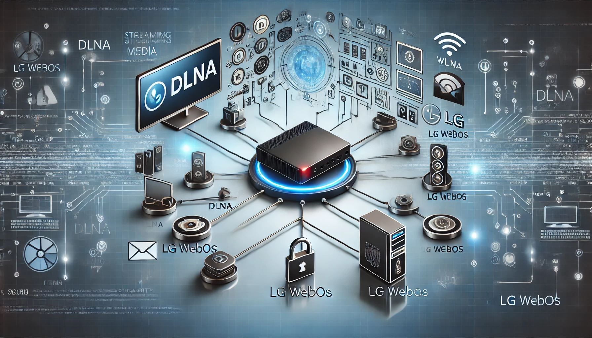

## 서론

NAS 서버의 영상을 보는 방법엔 여러가지가 있습니다. 그 중 LG WebOS에서는 서버에 직접적으로 연결할만한 충분한 방법을 제공하지 않기 때문에 어떤 방법이 좋을까 잠깐 고민하다가 DLNA가 떠올랐습니다. 

서버 설정도 간단하기 때문에 짧게 하고 넘어가려고 합니다. 

## DLNA

### 장점

- 호환성: DLNA는 다양한 제조사에서 채택한 표준 프로토콜로, 서로 다른 기기 간에도 원활하게 미디어를 공유할 수 있습니다. 예를 들어, 스마트폰, 태블릿, 스마트 TV, 게임 콘솔 등에서 모두 사용할 수 있습니다.

- 편리한 미디어 공유: 복잡한 설정 없이 네트워크에 연결된 기기 간에 미디어 파일을 손쉽게 공유하고 스트리밍할 수 있습니다. 미디어 서버에 파일을 업로드하면 즉시 다른 기기에서 재생이 가능합니다.

- 자동 탐지: DLNA 지원 기기는 네트워크 상에 연결된 미디어 서버를 자동으로 탐지하여 사용자가 별도의 설정 없이도 미디어를 쉽게 이용할 수 있습니다.

- 저전력 및 경량 운영: minidlna와 같은 경량 서버 프로그램은 서버의 자원을 효율적으로 사용하여 저전력 환경에서도 안정적으로 동작합니다.

### 단점

- 제한된 파일 형식 지원 - DLNA는 모든 파일 형식을 지원하지 않습니다. 특정 비디오, 오디오, 자막 파일 형식은 DLNA를 통해 스트리밍할 때 제대로 지원되지 않을 수 있습니다. 이로 인해 파일을 변환하거나 별도의 코덱을 설치해야 하는 번거로움이 발생할 수 있습니다.

- 인증 및 보안 부족 - 앞서 언급한 것처럼 DLNA는 인증 메커니즘이 거의 없기 때문에 보안이 취약합니다. 이를 통해 연결된 장치가 네트워크 내에서 자유롭게 미디어에 접근할 수 있지만, 그만큼 보안 위험도 큽니다. 이는 외부에서 접근 시 더욱 큰 문제가 됩니다.

- 제한된 장치 호환성- DLNA는 다양한 기기에서 사용할 수 있지만, 모든 기기에서 동일한 수준의 지원을 제공하지는 않습니다. 일부 기기는 DLNA를 완전히 지원하지 않거나, 특정 기능(예: 자막 지원, 특정 미디어 포맷 재생)이 제대로 작동하지 않을 수 있습니다.

- DLNA 서버는 미디어 파일을 자동으로 인덱싱하지만, 이를 수동으로 관리하기가 어려울 수 있습니다. 미디어 라이브러리가 크거나, 파일이 다양한 폴더에 분산되어 있는 경우, DLNA 서버에서 이를 제대로 탐지하지 못하거나, 잘못된 메타데이터로 인식할 수 있습니다.

## minidlna

minidlna는 DLNA(Digital Living Network Alliance) 표준을 지원하는 경량 미디어 서버 소프트웨어입니다. Linux 기반의 시스템에서 쉽게 설정할 수 있으며, 동영상, 음악, 사진과 같은 다양한 미디어 파일을 네트워크 상에서 DLNA를 지원하는 기기들로 스트리밍할 수 있습니다. 특히 minidlna는 설정이 간편하고, 서버의 자원을 효율적으로 사용하는 것이 큰 장점입니다.

## 설치 및 설정

다음의 명령어로 minidlna를 설치합니다. 

```bash
sudo apt install minidlna
```

설정파일도 간단합니다. 

```bash
media_dir=A,/var/lib/minidlna/Music
media_dir=V,/var/lib/minidlna/Video
media_dir=P,/var/lib/minidlna/Picture
```

A가 음악, V가 동영상, P가 사진 폴더입니다. 필요없다면 지정하지 않아도 됩니다. 

설정 적용을 위해 프로그램을 다시 시작합니다. 

```bash
sudo systemctl restart minidlna.service
```

## 확인

`내부아이피:8200`으로 접속하면 현황을 볼 수 있습니다. WebOS에서도 미디어 플레이어를 실행하면 같은 망이라면 자동으로 확인이 됩니다. 

자막 파일도 정상 지원합니다. 

## [중요] 보안 문제

DLNA를 포트포워딩을 사용해 외부에서 접근 가능하도록 하는 것은 추천하지 않습니다. 

DLNA 프로토콜은 기본적으로 보안에 취약합니다. 데이터 전송 시 암호화가 이루어지지 않기 때문에, 민감한 정보가 노출될 수 있습니다. 이는 SMB 프로토콜에서 발생하는 보안 문제와 유사합니다.

또한 단점에서 언급되었듯이 DLNA 서버는 인증 없이 미디어 파일에 접근할 수 있기 때문에 악의적인 사용자가 네트워크에 침투할 위험이 있습니다.


