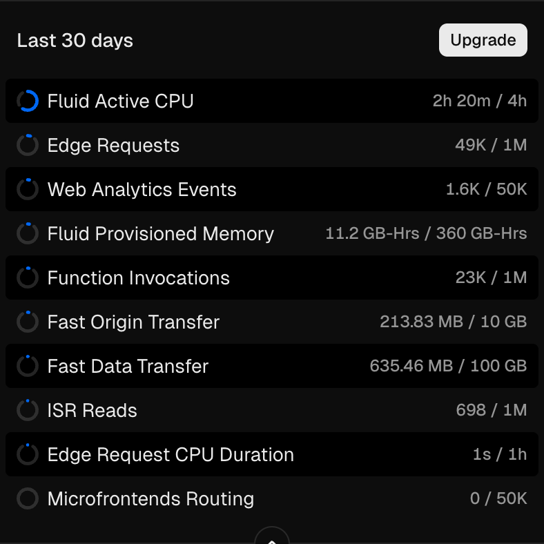

## 코드 최적화보다 강력한 한 줄: 하마터면 서버 비용을 낭비할 뻔했다

최근 '[AI 판사](https://ai.tuum.day/)'라는 새로운 토이 프로젝트를 시작했습니다. 사용자가 다투고 있는 내용을 입력하면 LLM이 판사가 되어 판결을 내려주는 서비스입니다.

빠른 아이디어 검증을 위해 Next.js 16 (App Router), Supabase의 조합으로 서비스를 구축하고 Vercel에 배포했습니다. 그런데 프로젝트를 오픈하고 얼마 지나지 않아 Vercel 대시보드에서 예상치 못한 지표를 마주했습니다.

이 글은 코드를 열심히 깎는 것보다 '제대로 된 캐싱 전략' 하나가 얼마나 강력한 성능 개선과 비용 절감을 가져다주는지에 대한 기록입니다.

## 문제의 발견: Vercel Functions 지표


Vercel은 서버리스 함수(Functions)의 실행 시간을 기준으로 과금을 합니다. 

Vercel의 최신 Fluid Compute 모델은 메모리 사용량(GB-Hours)과 별개로 순수 CPU 실행 시간(Active CPU)을 측정합니다. 무료 플랜은 이 CPU 시간이 월 4시간으로 제한되는데 아직 사용자가 많지 않음에도 불구하고 이 시간을 빠르게 소모하고 있었습니다.

특히 최근에는 하루에 10분 이상의 컴퓨팅 시간을 사용하고 있어 30일간 5시간 정도를 쓰게 돼 무료 사용량을 넘길 판이었습니다. 

이에 제한적인 지표지만 지난 12시간 어떤 페이지가 컴퓨팅 시간을 많이 소모하는지를 찾아봤습니다. 


- `/verdicts/[id]/opengraph-image-Block1`: Active CPU 2m (98 invocations)

- `/verdicts/[id]`: Active CPU 16s (149 invocations)

가장 큰 원인은 소셜 미디어 공유용 미리보기 이미지를 만드는 OG(OpenGraph) 이미지 생성 함수였습니다. 고작 88번 호출되었는데 무려 2분의 CPU 시간을 점유하고 있었습니다. 단순 텍스트 조회인 판결 상세 페이지 역시 CPU 사용량이 비정상적으로 높았습니다.

AI 판사의 판결 결과는 한 번 생성되면 변하지 않는 정적인 데이터입니다. 그럼에도 불구하고 왜 이런 비효율이 발생했을까? 처음에는 "비효율적인 쿼리나 무거운 라이브러리 문제일 것"이라고 가정하고 분석을 시작했습니다. 하지만 코드를 열어보고 나서야 이 가정이 틀렸음을 깨달았습니다.

## 분석: 캐싱 정책의 부재

코드를 분석하면서 발견한 근본적인 문제는 로직의 효율성이 아니라 '캐싱 정책의 부재'였습니다.

### 1. 1회성 데이터를 위해 매번 가동되는 무거운 엔진 (OG Image)

AI 판사는 공유 기능을 위해 결과를 즉석에서 동적 이미지로 생성합니다. Next.js의 `ImageResponse`를 사용하면 HTML/CSS 코드를 이미지로 변환해 주는데, 이 과정은 생각보다 무거운 연산입니다.

1. DB에서 데이터를 조회

1. 폰트 로드

1. Satori 엔진을 통한 SVG 변환 (CPU 집약적)

1. PNG 인코딩

제 코드는 봇이 링크를 긁어갈 때마다 이 무거운 4단계 공정을 매번 처음부터 다시 수행하고 있었습니다. 판결 결과는 불변 데이터임에도 불구하고 말입니다.

### 2. 한 페이지에서 두 번 발생하는 쿼리

판결 상세 페이지에서도 비효율이 발견되었습니다. Next.js App Router는 '메타데이터 생성(`generateMetadata`)'과 'UI 렌더링(`Page`)'을 분리해서 처리합니다.

```typescript
// 1. 메타데이터 생성 시 호출
export async function generateMetadata({ params }) {
  const verdict = await getBotVerdictById(params.id);
  return { title: verdict.title };
}

// 2. 페이지 렌더링 시 호출
export default async function Page({ params }) {
  const verdict = await getBotVerdictById(params.id);
  return <VerdictContent data={verdict} />;
}

```

일반적인 `fetch`를 사용했다면 Next.js가 자동으로 중복 요청을 제거(deduplication)해주었겠지만, 저는 Supabase 클라이언트를 직접 사용하고 있어 이 기능이 동작하지 않았습니다. 결과적으로 사용자가 페이지를 한 번 볼 때마다 서버는 동일한 데이터를 위해 DB를 두 번 호출하고 있었습니다.

## 해결: 코드가 아닌 정책을 재설계하다

문제를 해결하기 위해 로직을 최적화하는 대신 프레임워크와 인프라가 제공하는 캐싱 기능을 적재적소에 배치하기로 했습니다.

### 1. OG 이미지: 24시간 캐시

가장 무거운 OG 이미지에는 과감하게 24시간(`revalidate = 86400`) 캐시를 적용했습니다.

```typescript
export const revalidate = 86400; // 24시간
```

판결 내용은 불변이므로 기술적으로는 영구 캐싱도 가능합니다. 하지만 현재 트래픽 패턴상 최신 글은 하루 정도 조회가 발생하고 이후 급격히 줄어드는 점을 고려하여, 24시간이면 충분히 효율적이라 판단했습니다. 이 설정으로 봇이 수백 번 방문해도 서버(함수)는 단 한 번만 실행됩니다.

### 2. Request Deduplication: React.cache

중복 DB 호출 문제는 React의 `cache` 함수를 도입하여 해결했습니다.

```typescript
import { cache } from 'react';

const getBotVerdictByIdRaw = async (id: string) => { ... };

// 요청 주기(Request Cycle) 동안만 유효한 메모리 캐시
export const getBotVerdictById = cache(getBotVerdictByIdRaw);

```

이 함수는 '한 번의 요청 주기(Request Cycle)' 내에서 결과를 메모리에 기억합니다. 이제 메타데이터 함수와 페이지 컴포넌트가 각각 호출하더라도 실제 DB 쿼리는 처음에 딱 한 번만 실행됩니다.

### 3. On-Demand ISR

페이지 캐싱 전략에서 가장 고민되었던 부분은 '변하지 않는 판결'과 '계속 변하는 투표/댓글'의 공존이었습니다. 이 문제를 해결하기 위해 두 가지 선택지를 놓고 저울질했습니다.

#### 선택지 A: KV(Redis)를 이용한 Write-Through 캐싱

- 장점: 데이터만 갱신하므로 빠르고 효율적입니다.

- 단점: 별도의 저장소(Redis) 비용이 들고, 캐시 조회/무효화 로직을 직접 구현해야 해서 복잡도가 올라갑니다.

#### 선택지 B: On-Demand ISR (주문형 재검증)

- 장점: 구현이 매우 단순하고 외부 저장소 비용이 없습니다. 데이터 정합성이 보장됩니다.

- 단점: 댓글 하나가 달릴 때마다 페이지 전체(HTML)를 다시 빌드해야 하므로, 페이지가 무겁다면 서버 부담이 될 수 있습니다.
"AI 판사"의 판결 페이지는 텍스트 위주의 단순한 구조라 빌드 비용이 매우 낮습니다. 또한 아직 트래픽이 폭발적인 단계는 아니기에, 저는 구현의 단순함과 비용 효율성을 선택하여 B안(On-Demand ISR)을 택했습니다.
Next.js에서는 이를 코드 한 줄로 구현할 수 있습니다.

```typescript
// 평소에는 24시간 정적 캐싱 (CPU 사용 0)
export const revalidate = 86400;
// 댓글/투표 발생 시에만 캐시 무효화
revalidatePath('/verdicts/[id]');
```

이 전략을 통해 평소에는 24시간 캐싱된 정적 HTML을 서빙하여 서버 리소스를 극단적으로 아끼고, 사용자가 댓글을 달거나 투표를 하는 이벤트가 발생할 때만 즉시 페이지를 갱신하도록 구현했습니다.
결과적으로 복잡한 KV 인프라 구축 없이도, 정적 페이지의 성능과 동적 페이지의 실시간성이라는 두 마리 토끼를 모두 잡을 수 있었습니다.

## 기대 효과 및 결론

이러한 최적화 전략의 도입으로 다음과 같은 효과를 기대하고 있습니다.

| 항목 | 최적화 전 | 최적화 후 (예상) |
| --- | --- | --- |
| OG 이미지 생성 | 60초 (Active CPU) | **6초** |  (90% 절감) |
| DB 호출 | 2회/요청 | **1회/요청** |
| 페이지 응답 (평소) | 실행마다 생성 | **정적 캐시 서빙 (0ms)** |
| 페이지 응답 (이벤트) | 실행마다 생성 | **필요할 때만 1회 생성** |

전체적으로 CPU 사용량을 75% 이상 절감할 수 있을 것으로 예상됩니다. 이는 단순히 성능을 높이는 것을 넘어, Vercel 무료 플랜의 제한된 리소스(월 4시간) 내에서 안정적으로 서비스를 운영하기 위한 필수적인 조치입니다.

이번 경험은 서버리스 환경에서 '무엇을 계산할 것인가'보다 '무엇을 저장하고 재사용할 것인가'가 비용에 훨씬 더 직접적인 영향을 미친다는 사실을 명확히 보여주었습니다. 코드 레벨의 최적화 이전에 아키텍처와 정책 레벨에서의 효율성을 먼저 고민하는 것의 중요성을 다시 한번 깨닫게 된 계기였습니다.


