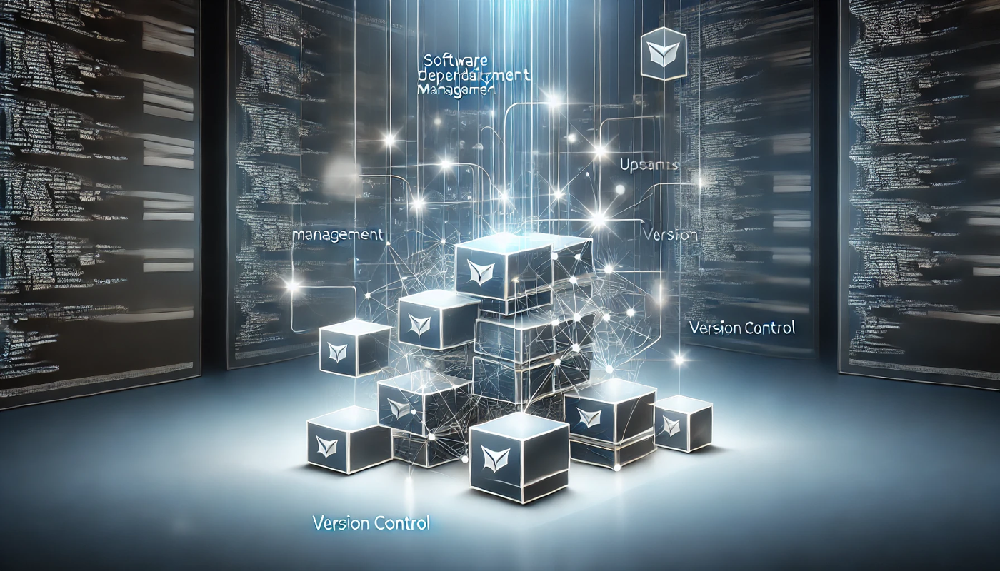

## 서론

[uv](https://sharknia.github.io/uv-간단-소개-및-적용)는 빠른 설치, 간편한 사용 등 많은 장점이 있지만 아쉽게도 패키지 업데이트 및 설치 시에 최신 버전을 우선적으로 설치하며, poetry 같은 세밀한 의존성 검사를 수행하지 않습니다.

지금 새로 시작하는 프로젝트로 최신 버전의 라이브러리를 사용할 것이라면 별 문제가 되지 않겠지만 레거시 프로젝트를 업데이트 할 때에는 uv를 사용하기가 쉽지 않습니다. 

이때 poetry를 사용해서 안정적인 패키지 업데이트를 도모할 수 있는 방법이 있지 않을까 궁리해봤습니다. 둘 모두 같은 `pyproject.toml` 파일 양식을 공유하기 때문에 가능할 것이라고 생각했고, 실제로 성공해서 그 방법을 적어둡니다. 

## `pyproject.toml` 생성 및 수정

이미 uv로 관리되고 있거나 생성된 프로젝트라면 당연히 `pyproject.toml` 파일이 존재하겠지만, 그렇지 않은 경우라면 우선 `pyproject.toml` 파일을 생성해줍니다. 

```bash
uv init
uv add -r requirements.txt
```

위 명령어로 uv 초기화를 하고 `pyproject.toml` 생성이 가능합니다. 

### 레거시 프로젝트의 `pyproject.toml` 생성이 안되는 경우

너무 오래된 레거시로 apple silicon과의 호환성 문제등으로 uv add 명령어에서 오류가 발생해 설치가 되지 않는 경우, requirements.txt의 내용을 수기로 `pyproject.toml` 에 붙여넣어서도 가능합니다. 

```toml
dependencies = [
    "lib==1.0.0",
]
```

코파일럿이나 커서 등 ai의 도움을 받으면 조금 더 수월하게 작업할 수 있습니다.

또는 아래의 명령어를 활용합니다. 

```bash
sed 's/^\(.*\)$/"\1",/' requirements.txt > requirements_temp.txt
```

requirements\_temp.txt에 toml 파일에 적절한 꼴의 리스트가 완성되므로 해당 내용을 붙여넣어 줍니다. 

### 업데이트 할 라이브러리 명시

`pyproject.toml` 에 작성된 라이브러리==버전은 uv나 poetry가 설치할 라이브러리의 버전을 의미합니다. 업데이트를 할 예정이므로,`==` 를 `>=`로 수정해줍니다. 

```toml
dependencies = [
    "lib>=1.0.0",
]
```

이 과정에서 버전이 고정되어야 하는 라이브러리는 `==`로 유지합니다. 

### 파이썬 버전 명시

사용할 파이썬 버전도 명시해줘야 합니다. 기본적으로 uv를 사용해 생성한 파일은 아래와 같이 최소 버전만 명시되어 있습니다. 

```toml
requires-python = ">=3.11"
```

파이썬의 최대 버전도 정확하게 정의합니다. 

```toml
requires-python = ">=3.11, <3.12"
```

이 과정을 거쳐야 poetry가 정확한 의존성 검사를 수행할 수 있습니다.

## 업데이트

여기까지 마쳤으면 준비과정은 끝났습니다. 다음의 명령어로 라이브러리에 대한 update를 실시합니다.

```bash
poetry update
```

poetry가 엄격한 의존성 검사를 실시해 현재 사용 가능한 파이썬 버전에서, 고정된 라이브러리와 잘 호환되는 최대 버전의 라이브러리들로 업데이트가 되어 가상환경에 설치됩니다. 

## 마무리 작업 - uv 개발환경 꾸미기

이렇게 하면 성공적으로 개발환경의 설치가 끝났습니다. 다만 이제 업데이트된 라이브러리 버전들로 `uv.lock` 을 재생성 해줘야 이후에도 의존성 검사를 거친 동일한 환경을 사용할 수 있습니다. 이 과정에서는 현재 설치된 라이브러리들을 requirements.txt로 export해 이를 기반으로 다시 uv 가상환경을 만드는 과정을 진행합니다. 

### requirements.txt 재생성

아래의 명령어로 `requirements.txt`를 재생성합니다. 

```bash
uv pip freeze > requirements.txt
```

### 가상환경 재설정

기존 환경을 정리하고 업데이트된 패키지 목록을 반영하기 위해서 `requirements.txt` 를 활용해 가상환경을 다시 만들 것이므로 `.venv`, `pyproject.toml`, `uv.lock` 을 삭제합니다. 

아래의 명령어로 가상환경을 다시 설정합니다. 

```bash
uv init
uv add -r requirements.txt
```

이제 업데이트된 환경의 uv 개발환경이 완성되었습니다. 

## 마무리

이로써 개발환경은 완성되었지만, 라이브러리 업데이트는 충돌 또는 기능 이상을 유발할 수 있는 위험성을 내포하고 있습니다. 테스트 환경이 잘 꾸며져 있다면 좋겠지만, 그렇지 않은 경우에는 철저한 검증을 통해 기능상 이상이 없는지를 잘 따져봐야 하겠습니다. 


