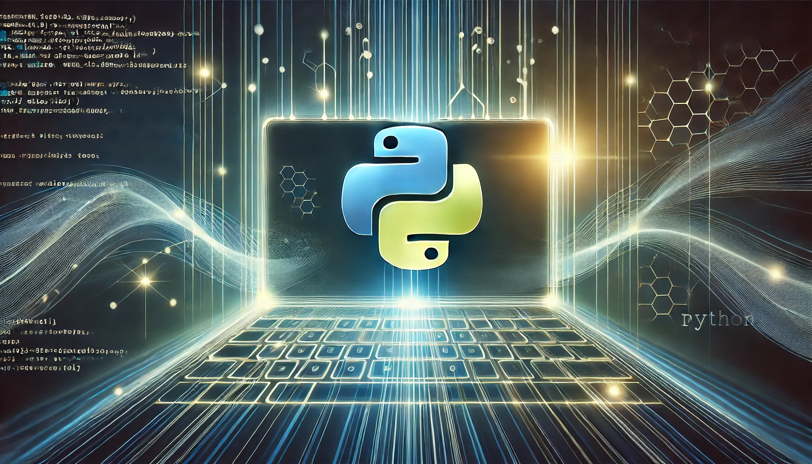

## 소개

uv는 Rust로 작성된 초고속 Python 패키지 및 프로젝트 관리 툴입니다. uv의 가장 메인 페이지에서도 속도를 크게 강조하고 있습니다. 실제로 사용해보니 진짜 빠릅니다. 


파이썬 개발환경을 위한 도구는 상당히 파편화되어있습니다. 가상 환경을 만드는 방법도 여러가지이며, 파이썬 버전관리를 하는 방법도 여러가지입니다. 

그런데 uv를 사용하면 pip, pip-tools, pipx, poetry, pyenv, twine, virtualenv 등을 하나로 대체할 수 있습니다. 거기에 명령어도 간단합니다. 


        즉 파이썬 버전 관리, 가상환경 관리, 패키지 관리등을 uv 하나로 모두 끝낼 수 있습니다. 

다만 uv는 속도가 빠르지만, 최신 버전을 우선적으로 설치하며 Poetry처럼 세밀한 의존성 분석을 수행하지 않기 때문에 업그레이드 시 의존성 충돌이 발생할 가능성이 있습니다.

## 설치

설치방법엔 여러가지가 있는데 Mac에서는 brew를 사용할 수도 있습니다. 

```bash
brew install uv
```

다음의 명령어로 설치를 확인합니다. 

```bash
uv --version
```

이 외에도 pip, curl 등 여러가지 설치 방법을 지원합니다. 

## 초기화 하기

### 이미 존재하는 프로젝트

```bash
uv init
```

`.python-version` 을 인식해 자동으로 알맞는 파이썬 버전으로 초기화됩니다. 

#### requirements.txt 적용

```bash
uv add -r requirements.txt
```

### 새 프로젝트

```bash
uv init <프로젝트명> -p 3.12
```

원하는 파이썬 버전을 선택해 초기화 할 수 있습니다. 프로젝트 초기화에 필요한 파이썬 버전이 없다면 자동으로 설치합니다. 

## 기본적인 명령어

uv는 가상환경을 생성하지 않아도 알아서 자동으로 가상환경을 적용합니다. 가상환경이 없다면 스스로 생성하고 있다면 이용합니다. 번거롭게 별도로 가상환경을 만들고 activate를 하고, activate를 잊은 경우 패키지가 잘못 설치되고.. 이런 번거로운 과정을 겪을 필요가 없습니다. 

가상환경은 필요한 시점에서 스스로 생성되며, .venv 형식으로 프로젝트 폴더 내에 생성되므로 IDE에서 이를 이용하면 됩니다. 

`.python-version` 이 있다면 해당 파이썬 버전을 자동으로 사용합니다. 해당 파이썬이 설치되어 있지 않다면 자동으로 설치합니다. 

### **uv run**

파이썬 파일 등을 실행할 때에 uv run 명령어로 실행할 수 있습니다. 가상환경이 자동 적용돼 파이썬 스크립트 파일이 실행됩니다. 

```bash
# django project 시작하기
uv run django-admin startproject practice .
 
# django 서버 실행하기
uv run manage.py runserver
```

### 패키지 관리

다음의 명령어로 패키지를 설치할 수 있습니다. 

```bash
uv add <패키지명>
```

위에 적어둔 것처럼 `uv add -r requirements.txt` 명령어로 requirements.txt 를 활용할 수도 있습니다. 

삭제는 다음의 명령어를 사용합니다. 

```bash
uv remove <패키지명>
```

### uv sync

uv sync 는 uv.lock 파일을 읽어서 같은 개발환경을 구성합니다. 역시 가상환경에 설치되며, 가상환경이 없다면 자동으로 구성됩니다. 

### 파이썬 버전 관리

pyenv를 대체해 파이썬 버전 관리도 가능합니다. 여러 버전을 동시에 설치하는 것도 가능합니다. 

```bash
uv python install 3.10 3.11 3.12
```

.python-version 파일을 통해 명시적으로 프로젝트에 사용할 파이썬 버전을 정의할 수 있습니다. 

```bash
uv python pin 3.11
```

설치된 파이썬은 다음의 명령어를 통해 확인할 수 있습니다. 

```bash
uv python list
```

## requirements.txt 만들기

requirements.txt 는 여전히 필요한 경우가 많습니다. 다음의 명령어를 통해 requirements.txt를 생성할 수 있습니다. 

```bash
# requirements.txt에 의존성을 기록하는데 hash값 없고 dev는 제외
uv export -o requirements.txt --no-hashes --no-dev
 
# requirements-dev.txt에 의존성을 기록하는데 hash값도 있고 dev도 포함
uv export -o requirements-dev.txt
```

또 Docker 환경에서는 가상환경 없이 패키지를 설치하는 것이 더 편리할 때가 많습니다. 이를 위해 가상환경이 아닌 기본 환경에 패키지를 설치할 수도 있습니다. 다만 이 경우에는 requirements.txt 가 필요합니다. 

```bash
uv pip sync --system requirements.txt
```

## (2025-02-18) 추가

uv sync를 활용하면 바로 알맞은 가상환경이 설치되고, uv pip list를 통해 가상환경에 설치된 라이브러리를 살펴볼수도 있지만 정작 터미널에서 직접 가상환경을 활성화 해 pip list를 날리면 전역의 pip list만 보여집니다. 

이는 uv를 통해 설치되는 가상환경에 pip가 설치되지 않아 발생하는 문제로, 가상환경을 실행한 뒤 다음의 명령어로 pip를 강제 설치해줍니다. 

```bash
python -m ensurepip
```

이 뒤에 가상환경을 재실행 하고 pip list를 날리면 가상환경에 설치된 pip 라이브러리 리스트를 확인할 수 있습니다. 

## 참조

[https://docs.astral.sh/uv/](https://docs.astral.sh/uv/)


