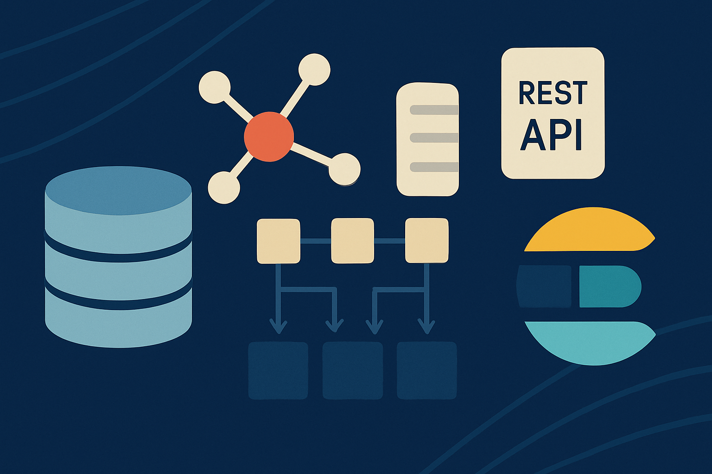

## 서론

#### 9개의 GraphQL 엔드포인트와 하나의 거대한 문제

7년차 백엔드 개발자로서 다양한 시스템의 아키텍처를 설계하고 개선하는 경험을 해왔습니다. 그중에서도 현재 마주한 통합 어드민 시스템은 기술적으로 가장 흥미로우면서도 복잡한 도전 과제였습니다. 시스템의 첫인상은 '현대적인 기술의 집합체'였습니다. Django 3.2, GraphQL, 마이크로서비스 아키텍처(MSA) 등 최신 기술 스택이 적용되어 있었기 때문입니다. 하지만 자세히 들여다본 시스템의 실체는, 현대적인 이름표를 단 '분산된 모놀리스(Distributed Monolith)'에 가까웠습니다.

시스템은 총 9개의 마이크로서비스로 구성되어 있었고, 각 서비스는 독립적인 GraphQL 엔드포인트를 외부에 노출하고 있었습니다. 이는 프론트엔드 개발에 심각한 병목을 유발했습니다. 예를 들어, '계약 상세 조회' 화면 하나를 렌더링하기 위해 프론트엔드는 계약 정보를 얻기 위해 A 서버에, 계약자의 계좌 정보를 얻기 위해 B 서버에, 해당 계약의 정산 내역을 확인하기 위해 C 서버에 각각 API를 호출해야 했습니다. 이렇게 여러 엔드포인트에서 가져온 데이터를 조합하고, 비즈니스 로직에 맞춰 가공하는 책임이 온전히 프론트엔드에 전가되어 있었습니다.

설상가상으로 통합 어드민 서버는 각 서비스의 데이터베이스를 직접 읽어오는 구조를 가지고 있었습니다. 서비스 간의 결합도는 기술적으로 허용 가능한 수준을 넘어섰고, 프론트엔드 팀의 리소스 부족이라는 현실적인 제약과 맞물려 이 복잡한 시스템은 사실상 유지보수가 불가능한 기술 부채의 집합체가 되어가고 있었습니다.

게다가 미완성인 시스템에 대해 사내에서는 끊임없이 해당 시스템에 대한 고도화를 요구해왔습니다. 필요성은 인지를 하면서도 니즈를 맞춰주기에는 도저히 불가능한 상황이었습니다. 

이 글은 이 총체적 난국 속에서 어떻게 문제의 본질을 체계적으로 분석하고, 현실적인 제약과 기술적인 이상 사이에서 최적의 해답을 찾아 아키텍처를 개선해야 할지를 설계하는 과정의 기록입니다.

## 문제 분석: 현상(What)이 아닌 본질(Why)에 집중하다

복잡한 시스템의 개선 작업을 시작할 때 가장 경계해야 할 것은, "GraphQL이 문제다" 또는 "프론트엔드 구현이 복잡하다"와 같이 눈에 보이는 현상에만 매몰되는 것입니다. 대신, "왜 이런 구조가 탄생했으며, 이 구조가 야기하는 가장 근본적인 문제는 무엇인가?"라는 본질적인 'Why'에 집중했습니다.

체계적인 분석 끝에, 제가 정의한 핵심 문제는 다음과 같았습니다.

- 잘못된 책임 분배: 데이터의 조합, 가공, 연산은 본질적으로 백엔드가 수행해야 할 책임입니다. 하지만 현재 구조는 이 책임을 프론트엔드로 떠넘기고 있었습니다. 이는 프론트엔드 코드의 비대화, 백엔드 로직의 중복 구현, 그리고 클라이언트 성능 저하라는 다각적인 문제로 이어졌습니다.

- 깨진 캡슐화: 게이트웨이가 MSA의 DB를 직접 조회하는 것은, 각 서비스가 자신의 데이터에 대한 주권을 가지고 API를 통해서만 외부에 상태를 노출해야 한다는 MSA의 제1원칙을 위배하는 심각한 안티패턴입니다. 

- 유지보수의 비효율성: 하위 MSA의 스키마 변경이 발생하면, 게이트웨이에 존재하는 수많은 GraphQL 관련 코드를 모두 수동으로 찾아 수정해야 했습니다. 이러한 비효율적인 동기화 프로세스는 인적 오류(Human Error)의 가능성을 높였고, 프론트엔드 리소스의 부재라는 현실과 맞물려 시스템 개선을 불가능하게 만드는 가장 큰 장애물이었습니다.

결론적으로, 이 시스템이 가진 진짜 문제는 특정 기술 스택의 단점이 아니라, '아키텍처 설계 원칙의 근본적인 실패' 에 있었습니다.

## 해결 방법 모색: 현실적 제약 속에서 최적의 경로 찾기

문제의 근원을 파악한 뒤, 실질적인 해결책을 모색하기 시작했습니다. 처음에는 이상적인 아키텍처들을 먼저 구상했습니다.

- 아이디어 1: GraphQL Federation 도입: Apollo Federation과 같은 기술을 도입하여 9개의 분산된 스키마를 논리적인 하나의 통합 스키마(Super-graph)로 묶는 방식입니다. 이는 GraphQL의 장점을 극대화할 수 있는 정석적인 해결책입니다.

- 아이디어 2: gRPC로 내부 통신 전환: MSA 간의 내부 통신을 고성능의 바이너리 프로토콜인 gRPC로 전환하여 성능을 최적화하고, Protobuf를 통해 명확한 API 계약을 강제하는 방식입니다.

하지만 두 아이디어 모두 "모든 하위 MSA의 코드를 수정하고, 각 서버에 대해 추가적인 개발 공수를 요구한다"는 치명적인 현실적 제약을 가지고 있었습니다. 현재의 리소스 상황을 고려했을 때, 전면적인 개편은 불가능했습니다. 또한, MSA중 일부 서버는 Django 1.11등 지나치게 오래된 레거시 코드로 이루어져 있어 더더욱 요구되는 개발 공수가 컸습니다.

이때부터 저의 고민은 '가장 이상적인 방법은 무엇인가?'에서 '지금 우리가 가진 자원으로, 가장 큰 고통을 유발하는 문제를 해결할 수 있는 현실적인 방법은 무엇인가?' 로 전환되었습니다. 따라서 저는 가장 문제가 복잡하고 성능에 영향을 미치는 조회(Read) 기능에 집중하기로 했습니다.

그래서 내린 첫 번째 전략적 결론은 다음과 같습니다.

        "CUD(생성/수정/삭제)는 현행 방식을 유지하고, 복잡한 조회(Read) 기능부터 점진적으로 개선하자."

이 결정에 따라, 기존 GraphQL 엔드포인트들은 레거시 시스템으로 유지하되, 추가되는 페이지에 대해서는 새로운 조회 기능을 위한 REST API를 신설하는 방향으로 가닥을 잡았습니다.

## 기술 스택 선정: N+1과 분산 Join이라는 두 가지 난관을 넘어서

REST API 기반의 BFF 게이트웨이를 구축하기로 결정하자, 곧바로 두 가지 거대한 기술적 난관에 부딪혔습니다. 이 문제들을 어떻게 해결할 것인지가 이번 프로젝트의 성패를 가르는 핵심이었습니다.\

### 난관

#### **1: N+1 문제**

하나의 리스트 화면을 조회하기 위해 여러 MSA를 순차적으로 호출하면, 아이템 개수(N)만큼 추가적인 네트워크 왕복이 발생합니다. 예를 들어 20개의 계약 리스트를 가져오고, 각 계약의 담당자 이름을 얻기 위해 20번의 추가 API 호출이 발생하는 상황입니다. 이는 과거 GraphQL 환경에서 [DataLoader](https://sharknia.github.io/DataLoader의-적용)가 해결해주던 문제였습니다.

#### **2: 분산 데이터에 대한 필터링 및 정렬**

A 서버의 데이터와 B 서버의 데이터를 조합하여 화면에 보여주는 것은 가능합니다. 하지만 B 서버에만 존재하는 '담당자 이름'으로 전체 계약 리스트를 검색하거나, '계약 금액'으로 정렬하는 기능은 어떻게 구현해야 할까요? 이는 단순한 API 호출로는 해결이 불가능한, 매우 어려운 문제입니다.

### **단기 전략: DataLoader 패턴의 적용**

N+1 문제를 해결하기 위해, REST 환경에서도 GraphQL의 DataLoader와 동일한 원리의 패턴을 적용하기로 했습니다.

1. 먼저 주가 되는 데이터 리스트를 조회합니다.

1. 조회된 리스트에서 추가 정보가 필요한 ID들을 모두 수집합니다.

1. 수집된 ID 목록을 단일 파라미터로 하여, 하위 MSA에 배치(Batch) API를 단 한 번 호출합니다.

1. 가져온 추가 정보들을 Key-Value 형태의 맵(Map)으로 변환한 뒤, 메모리 상에서 원본 리스트와 조합합니다.
이 방식은 하위 MSA에 'ID 목록으로 데이터를 조회하는 기능'만 추가하면 되므로, 가장 현실적인 초기 해결책이었습니다. 하지만 이 방식으로는 '분산 데이터에 대한 필터링/정렬' 문제는 해결할 수 없다는 명확한 한계를 인지하고 다음 단계의 전략을 준비해야 했습니다.

### **장기 전략: Elasticsearch**

분산 데이터 Join 문제를 해결할 방법을 찾던 중, 문득 우리가 이미 로그 분석을 위해 사용하고 있던 Elasticsearch가 떠올랐습니다. Elasticsearch의 본질은 비정규화된(Denormalized) 문서에 대한 빠른 검색과 집계 기능입니다.

        "RDBMS에서 불가능한 조회 시점(Read-Time)의 분산 Join을, 데이터 저장 시점(Write-Time)에 미리 Join된 통합 문서를 Elasticsearch에 만들어두는 방식으로 해결할 수 있지 않을까?"

이 아이디어가 문제 해결의 실마리였습니다. 각 MSA에서 데이터가 변경될 때마다, 이 데이터를 조합하여 Elasticsearch의 '통합 검색용 인덱스'에 저장해두는 것입니다. 그러면 게이트웨이는 어떤 복잡한 필터링/정렬 요청이 오더라도, 모든 정보가 미리 준비된 Elasticsearch에 단 한 번의 풍부한 쿼리(Rich Query)를 보내는 것으로 문제를 해결할 수 있습니다.

데이터 동기화 방식으로는 Kafka나 RabbitMQ 같은 메세지 큐가 정답이겠지만, 새로운 메시징 인프라 도입의 부담을 줄이기 위해 기존에 사용하던 Jenkins 기반의 배치 서버(`Synchronizer`)를 활용한 '주기적인 배치 동기화' 를 초기 방식으로 제안했습니다. 이 방식은 실시간성은 다소 떨어지지만, 새로운 인프라 도입 없이 가장 빠르게 구현할 수 있는 매우 현실적인 선택이었습니다. 또한 이 서버는 유저를 위한 서버가 아니라 내부 관리자를 위한 서버이므로 리스크가 덜 한 점도 고려했습니다. 

하지만 더불어 내부 관리자를 위한 페이지이므로, ElasticSearch를 위한 데이터 저장에 드는 물리적인 비용, 개발 공수, 데이터 싱크를 위한 유지보수 포인트의 증가등도 도입전에 추가적으로 고려되어야 할 것입니다. 

## 4. 최종 설계안: 현실과 타협하고 미래를 준비하는 아키텍처

기술적 고민과 트레이드오프를 거쳐, 다음과 같은 최종 설계안이 완성되었습니다.

1. 목표: 프론트엔드의 데이터 가공 부담을 '0'으로 만드는 BFF용 REST API 게이트웨이 구축

1. 범위: 복잡한 '조회' 기능에 집중하고, CUD는 현행 방식을 유지

1. 단기 전략: `DataLoader 패턴`을 적용하여 N+1 성능 문제 해결

1. 장기 전략: `Elasticsearch`를 도입하여 분산 데이터의 복합적인 필터링/정렬 문제 해결

    - 데이터 동기화: 기존 배치 서버(`Synchronizer`)를 활용한 주기적 동기화로 시작, 장기적으로 Kafka 기반의 이벤트 드리븐 방식으로의 전환을 고려

1. 아키텍처: View - Service - Infrastructure로 역할을 명확히 나눈 레이어드 아키텍처를 채택하여 테스트 용이성과 유지보수성 확보

이 설계는 모든 문제를 해결하는 완벽한 정답지는 아닙니다. 하지만 현재 우리가 가진 문제, 리소스, 기술 스택을 모두 고려했을 때, '오늘 당장 실행할 수 있는 최선의 방안' 이자 '미래의 기술적 확장을 가로막지 않는 유연함' 을 모두 담고 있다고 확신합니다.

## 에필로그: 경험으로 얻은 교훈

저는 스스로를 '정석'보다는 경험을 통해 배우는 실전형 개발자에 가깝다고 생각합니다. 공식적인 용어보다는 저만의 언어로 문제를 정의하고, 이론보다는 몸으로 부딪히며 해결책을 찾아온 시간이 많았기 때문입니다.

하지만 이번 프로젝트를 통해 다시 한번 깨달은 것은, 가장 중요한 것은 특정 용어나 정해진 정석이 아니라 '문제의 본질을 꿰뚫는 집요함' 과 '현실의 제약 속에서 최적의 길을 찾아내는 실용주의적 태도' 라는 점입니다. 기술은 결국 문제를 해결하기 위한 도구이며, 그 도구를 가장 적재적소에 사용하는 지혜는 치열한 경험 속에서 나온다고 믿습니다.

이 글이 저와 비슷한 환경에서 복잡한 시스템의 기술 부채와 싸우고 있는 다른 개발자분들에게 작은 용기와 문제 해결의 영감이 되기를 바랍니다.

