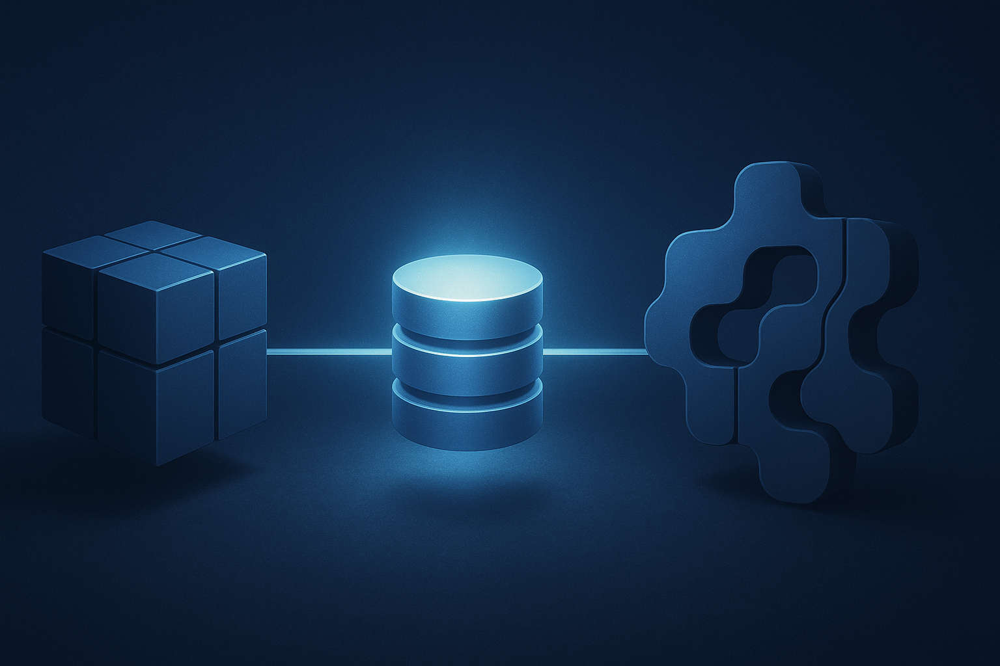

## 서론

오랜만의 글입니다. 그 사이에 많은 일이 있었고, 새 직장에 오게 됐습니다. 

새 회사의 신규 프로젝트의 메인 서버 개발이 한창인 가운데 첫 업무로 서비스 운영을 위한 백오피스(Back-office) 시스템 구축을 맡게 됐습니다. 이 백오피스는 메인 서비스의 데이터를 직접 조회하고 관리(CRUD)해야 하므로 두 서비스가 동일한 메인 DB를 공유하는 구조입니다.

초기 논의에서는 백오피스 시스템을 TypeScript 기반으로 별도 구축하는 안이 있었는데 이 경우 런타임과 패키지 생태계가 완전히 다르므로 레포지토리를 분리(멀티레포)하는 것이 필수적이었습니다.

하지만 최종적으로 백오피스 역시 메인 서버와 동일한 FastAPI(Python) 스택을 사용하기로 결정되면서 아키텍처에 새로운 선택지가 열렸습니다. 동일 스택이기에 레포 분리가 필수는 아니게 된 것입니다.

이에 따라 팀에서 처음 제안된 '멀티레포' 구조가 과연 최선인지, 혹은 '모노레포'라는 대안이 가져다줄 이점은 없는지 각 구조의 트레이드오프를 분석하게 되었습니다.

## 팀의 초기 제안: 레포지토리 분리 (멀티레포)

팀에서 초기에 제안한 구조는 다음과 같습니다.

- `main-server-repo` / `backoffice-repo` (레포지토리 분리)

- `main-server` / `backoffice-server` (서버 분리)

- 메인 DB 공동 사용

- 백오피스 서버에는 SQLModel 도입 후 추후 메인 서버 고도화

이 구조는 명확한 장점을 가집니다.

1. 배포 독립성: 백오피스 서버의 배포가 메인 서버에 영향을 주지 않으며 그 반대도 마찬가지입니다.

2. 기술 스택의 자유: 메인 서버(SQLAlchemy)와 관계없이 백오피스는 Pydantic V2와 호환성이 좋은 SQLModel 같은 현대적인 기술 스택을 자유롭게 도입할 수 있습니다.

3. 브랜치 관리 단순성: 레포지토리가 물리적으로 분리되어 메인 서버의 복잡한 브랜치(핫픽스, 기능 개발 등)와 백오피스 개발 브랜치가 충돌할 가능성이 원천적으로 차단됩니다. 팀은 이미 솔루션의 1.0의 핫픽스와 1.1버전의 브랜치 관리가 이슈였으므로 이는 무시할 수 없는 장점입니다. 

### 핵심 위험: '사실상의 분산 모놀리식' 안티패턴

여기까지만 보면 멀티레포는 깔끔하고 합리적인 선택처럼 보입니다. 하지만 '공유 DB'라는 제약 하에서 이 구조는 제가 과거에 경험했던 '사실상의 분산 모놀리식(Distributed Monolith)' 아키텍처의 실패 패턴을 그대로 재현할 위험이 있습니다.

분명 서비스는 분리되어 있지만 서로의 DB를 직접 읽어 들이면서 암묵적인 강결합이 발생하고 코드 수정을 놓치면 모델의 일관성이 깨지는 구조입니다.

이 구조의 치명적인 단점은 DB 모델 코드의 중복 관리입니다. 두 레포지토리는 동일한 DB를 바라보지만 각자의 서버에서 데이터를 다루기 위해 DB 스키마(모델) 코드를 별도로 가지고 있어야 합니다. 심지어 첫 제안에서는 메인 서버는 SQLAlchemy, 백오피스는 SQLModel로 코드마저 다릅니다.

이는 두 서비스 간의 가장 강력한 계약인 '데이터 스키마'의 동기화를 전적으로 개발자의 '기억'과 '꼼꼼함'에 의존하게 만듭니다.

이 구조에서는 다음의 장애 시나리오가 발생할 가능성이 아주 높습니다.

1. 기획 요구사항: `User` 테이블에 `nickname` 컬럼 추가.

2. 개발: 개발자가 `main-server-repo`의 `User` 모델(SQLAlchemy)에 `nickname`을 추가하고 배포합니다.

3. 장애 발생: 개발자가 `backoffice-repo`의 `User` 모델(SQLModel)에 `nickname` 추가하는 것을 잊었습니다.

4. 결과

- 메인 서버는 `nickname`이 포함된 `User`를 DB에 잘 저장합니다.

- 백오피스가 해당 `User`를 조회하는 순간 백오피스 모델에는 `nickname` 필드가 없으므로 추가적인 별도의 작업이 필요합니다. 

## 고려에서 제외된 대안들

이러한 문제를 해결하기 위해 다른 대안들도 검토했습니다.

### 1. 서버/레포 완전 통합 (Full Monolith)

DB 모델의 중복을 피하는 가장 간단한 방법은 백오피스를 별도 서버로 두지 않고 메인 서버 API의 일부(예: `/admin` 경로)로 통합하는 것입니다.

하지만 이 방안은 '배포 독립성의 완전한 상실'이라는 더 큰 문제를 야기하기에 기각했습니다.

백오피스의 사소한 문구 수정 배포가 민감한 메인 서버의 전체 빌드와 배포를 트리거하게 됩니다. 

안 그래도 현재 팀은 1.0 핫픽스와 1.1 신규 개발 브랜치를 동시에 관리하는 데 어려움을 겪고 있는데 여기에 백오피스 개발 브랜치까지 얹어져 배포 파이프라인을 공유하게 된다면 관리 부담이 감당할 수 없는 수준으로 커질 것이라 판단했습니다.

### 2. 모델 파일의 라이브러리화

'서버 분리'와 '모델 일관성'을 모두 잡기 위해 공통 모델 파일만 별도 레포지토리로 분리하여 '라이브러리'로 패키징하는 방안도 잠시 고려했습니다.

하지만 이는 현재 단계에서는 '오버 엔지니어링'이라고 판단했습니다.

- 공통 모델 라이브러리의 버전 관리 정책 수립

- Private PyPI 같은 패키지 저장소 운영 및 CI/CD 파이프라인 구축

- 메인 서버와 백오피스 서버의 라이브러리 의존성 업데이트 동기화

모델 일관성은 잡을 수 있지만 그 대가로 지불해야 하는 인프라 및 관리 비용이 너무 컸습니다.

## 실용적인 대안: 모노레포

이러한 고민 끝에 제가 제안하는 대안은 모노레포입니다. 이는 앞선 모든 방법의 단점(휴먼에러 위험, 배포 결합, 오버 엔지니어링)을 피하는 가장 실용적인 절충안입니다.

- 모노레포 내 `main_server/` 와 `backoffice/` 디렉토리로 코드 분리

- `main-server` / `backoffice-server` (서버 분리)

- 배포는 CI/CD 설정을 통해 디렉토리별로 분리

### 모노레포의 명확한 트레이드오프

이 구조는 명확한 이점과 비용을 동시에 가집니다.

#### 1. 이점: DB 모델의 단일 소스 (Single Source of Truth) 확보

shared/models/와 같은 공통 디렉토리에 DB 모델을 정의합니다. 메인 서버와 백오피스 서버는 이 공통 모델을 임포트(import)하여 사용합니다. 모델 코드의 중복 작성이 원천적으로 제거되며, 스키마 변경 시 공통 모델 파일 하나만 수정하면 됩니다. 

#### 2. 비용 1: SQLModel 도입 지연 (기술 스택 통일)

가장 큰 비용입니다. 공통 모델을 공유한다는 것은 백오피스 역시 메인 서버와 동일한 SQLAlchemy 기반 모델을 사용해야 함을 의미합니다. 백오피스에 SQLModel을 도입하려던 계획은 포기하거나 메인 서버 전체가 SQLModel로 마이그레이션될 때까지 무기한 연기해야 합니다.

#### 3. 비용 2: 초기 설정 복잡도

디렉토리별 CI/CD 분기, PYTHONPATH 설정, 공통 모듈 임포트 구조 확립 등은 '신규 레포 생성'과는 다른 종류의 복잡한 초기 설정 비용입니다.

## 트레이드오프 분석 및 결론: 일관성을 위한 선택

네 가지 방안의 트레이드오프는 명확합니다.

이 분석은 어느 한쪽이 '무조건 옳다'고 주장하려는 것이 아닙니다. 모노레포 역시 '최선'의 아키텍처라기보다, 우리가 피하고자 하는 명확한 위험(배포 결합, 휴먼 에러, 추가 유지보수 공수, 오버 엔지니어링)을 피하기 위한 현실적인 '절충안'이라고 생각할 뿐으로, 가장 중요한 것은 팀의 결정입니다. 

- 멀티레포(초기안): '기술 스택의 자유(SQLModel)'를 얻는 대신, '추가적인 휴먼에러 위험성'을 안고 가며 이를 해결할 자동화 방안(예: git submodule, 스크립트)을 반드시 마련한다.

- 모노레포(개선안): '모델 안정성'을 확보하는 대신, '기술 스택의 자유(SQLModel)'를 포기하고 'CI/CD 분기 처리'라는 엔지니어링 비용을 지불한다.

저는 '휴먼 에러 및 추가 유지보수 공수'라는 위험이 '신규 기술 스택 도입'이라는 이점보다 훨씬 더 크고 치명적이라고 생각합니다. 따라서 후자(모노레포)가 현재 우리 팀의 상황에서 더 예측 가능하고 제어하기 쉬운 비용이라고 판단하여 이 안을 트레이드 오프 분석 문서로 작성하여 팀에 제안하려고 합니다.

## 미래: 멀티모듈로의 진화

특히 모노레포를 선택할 경우, 이 구조는 향후 프로젝트가 더 복잡해졌을 때 자연스럽게 '멀티모듈' 아키텍처로 진화할 수 있는 좋은 기반이 됩니다.

현재는 `shared/` 디렉토리를 단순 임포트하여 사용하지만 추후에는 이 `shared` 모듈을 `poetry` 등을 통해 명시적인 내부 패키지로 분리하여 메인 서버와 백오피스가 이를 '설치'하도록 구성할 수 있습니다. 이는 서비스 간의 의존성을 더욱 명확하게 관리하는 데 도움이 될 것입니다.

