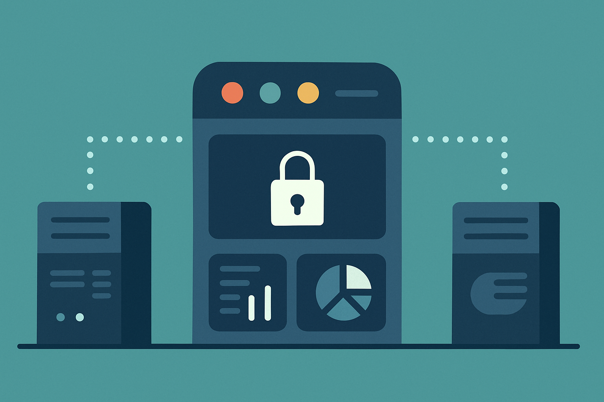

## 서론

지난 [안전한 레거시 탈출을 위한 Strangler Fig 패턴 설계기](https://sharknia.github.io/안전한-레거시-탈출을-위한-계획-설계)에서는, Django 1.11 기반의 레거시 시스템을 현대화하기 위한 전체적인 '점진적 교체' 전략을 소개했습니다. 그리고 글의 말미에, 보통이라면 가장 큰 장애물일 '인증' 문제는 기존 토큰 방식을 공유하면 간단히 해결될 것이라 낙관했습니다.

하지만, 이 낙관적인 가정은 설계가 깊어지면서 몇 가지 문제들에 마주쳤습니다.

이번 글에서는 그 '간단할 것이라 믿었던' 인증 문제가 왜 큰 걸림돌이 되었는지, 그리고 이를 해결하기 위해 어떤 아키텍처를 최종적으로 설계했는지 상세히 다루어보고자 합니다. 이 글에 담긴 내용은 실제 코드가 아닌, 본격적인 구현에 앞서 문제점을 예측하고 해결책을 찾아낸 과정입니다.

## 인증에서 발생할 문제

1부에서 세웠던 초기 계획, 즉 "v1과 v2가 동일한 토큰 테이블을 조회하여 인증을 처리한다"는 아이디어는 두 가지 치명적인 결함을 가지고 있었습니다.

### 1. 인증 방식의 충돌

V1에서는 이미 업데이트가 멈춘 `django-rest-auth` 구버전을 사용 중이었습니다. V2에서 이를 계승하는 `dj-rest-auth`를 설치할 경우, Token을 위한 DB 스키마가 정면으로 충돌하게 됩니다. 토큰 스키마를 V2에 맞게 수정한다면 V1 서비스는 즉시 마비될 것이므로, 이 방법은 선택할 수 없었습니다.

사실 이 문제는 이미 로컬에서 V1 프로젝트의 업그레이드를 시도하며 겪었던 문제였습니다. 하지만 3달 넘게 다른 업무를 하느라 이 중요한 사실을 까맣게 잊고 있었습니다. (머쓱)

### 2. '두 개의 문'이 야기하는 세션 불일치

더 근본적인 문제는, 라이브러리 사용 여부와 관계없이 발생했습니다. 1부의 계획대로 V1과 V2가 각자의 로그인 API를 유지한다면, 사용자가 어느 문으로 들어왔는지에 따라 인증 상태가 달라지는 '세션 상태 불일치'가 발생합니다.

- 예상 시나리오: 사용자가 V1 로그인 API로 로그인 -> 레거시 토큰만 발급됨 -> V2 서비스 접근 시 인증된 토큰이 없으므로 '미로그인' 상태가 됨.

결국 '기존 인증 방식을 공유'하는 것만으로는 SSO 달성이 불가능하며, 점진적 교체 전략 전체를 위협하는 심각한 블로커(Blocker)임을 설계 단계에서 인지하게 되었습니다.

## 해결책 구상

### 첫 번째 구상: Unmanaged 모델을 통한 레거시 인증 모방

가장 먼저 떠올린 방법은, V2에서도 V1의 인증 방식을 그대로 사용하는 것이었습니다. V1의 `authtoken_token` 테이블과 동일한 Unmanaged 모델(`class Meta: managed = False`)을 V2에 만들고, 커스텀 인증 클래스를 통해 레거시 토큰을 읽어오는 방식입니다.

이 방법은 기술적으로는 가능했지만, 치명적인 단점이 있었습니다. V2마저 낡은 인증 방식에 종속된다는 점입니다. 신규 서비스에 확장성 있는 현대적인 인증 체계를 도입하려던 원래의 목표를 전혀 달성할 수 없었습니다. 이것은 '현대화'가 아닌, '레거시의 확장'일 뿐이었습니다.

### 두 번째 구상: JWT 도입과 '두 개의 토큰' 전략

그래서 방향을 틀기로 했습니다. V2는 V2답게 현대적인 JWT를 사용하고, V1과의 호환성은 다른 방법으로 해결하는 것입니다. 여기서 'V2가 두 가지 토큰을 모두 발급하면 어떨까?'라는 생각을 해봤습니다. V2가 인증의 중심이 되어, 자신을 위한 JWT와 V1을 위한 레거시 토큰을 동시에 발급하고 관리하는 것입니다.

이 아이디어를 발전시켜 최종 설계를 완성했습니다.

## 최종 설계: '중앙 관제탑' 모델

        핵심 아이디어: 인증 권한을 신규 시스템(V2)으로 중앙집중화하여, V2가 레거시 시스템을 위한 인증까지 대행하는 '중앙 관제탑(Central Control Tower)' 모델을 설계하기로 했습니다.

### 대원칙: 인증 권한의 중앙 집중화

모든 문제의 근원인 '상태 불일치'를 해결하기 위해, 인증을 처리하는 권한과 책임을 반드시 한 곳으로 모아야 한다는 결론에 도달했습니다.

### 1단계: V2의 '중앙 관제탑' 구축

1. JWT 인증 시스템 도입: V2 내부 API 통신을 위해 `djangorestframework-simplejwt` 등을 사용하여 표준 JWT 인증 시스템을 구축하기로 했습니다. 또, V2 인증은 구버전 레거시 토큰, 새 버전 jwt에 대해 모두 정상 인증 작동하게 구현합니다. 

1. Unmanaged 모델 생성: (첫 번째 구상에서 사용했던) V1 `authtoken_token` 테이블과 동일한 Unmanaged 모델을 V2에 유지하여, 마이그레이션 없이 레거시 테이블을 읽고 쓸 수 있도록 설계했습니다.

1. 통합 로그인/로그아웃 API 구현: V2에 다음과 같이 동작하는 엔드포인트를 구현하기로 했습니다.

    - **로그인 시:** 사용자 인증 성공 후, ① V2를 위한 JWT를 생성하고, ② 동시에 Unmanaged 모델을 통해 V1을 위한 레거시 토큰을 DB에 생성/갱신합니다. 그리고 두 토큰을 모두 클라이언트에게 반환합니다.

    - **로그아웃 시:** JWT를 무효화하는 로직과 함께, DB에서 레거시 토큰을 삭제하는 로직을 수행합니다.

### 2단계: 클라이언트-서버 간 API Contract

- 프론트엔드: 로그인 성공 시 jwt, 레거시 토큰을 레거시 토큰만 사용해도 v1/v2 api에 대해 모두 인증이 가능합니다. 다만, 추후 jwt만 사용하기 위해 밑작업을 미리 진행해둘 수 있습니다. 이 또한 점진적 전환입니다. 

## 최종 검토: 더 나은 방법은 없었는가?

이 복잡한 설계를 마치고, '혹시 업계 표준으로 불리는 더 일반적인 방법이 있지 않았을까?'라는 마지막 고민을 했습니다. 결론적으로 API 게이트웨이나 별도의 인증 서버(IdP) 구축 같은 표준 패턴들은 'V1 코드 변경 최소화'라는 핵심 제약 조건에 위배되거나 단순히 문제의 책임을 이동시킬 뿐이었습니다.

이 검토를 통해 우리가 설계한 '중앙 관제탑' 모델이, 주어진 특수한 제약 조건 하에서는 가장 실용적이고 최적화된 해결책임을 확신할 수 있었습니다.

