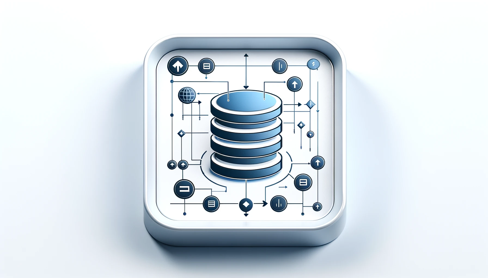

## 서론

새로 개발할 서비스의 DB 설계 작업이 시작되었습니다. DB를 설계하는 것은 많이 해본 일이어서 저도 모르게 무결성이나 관계성 등 중요한 내용을 챙기고 있지만, 이런것들은 말로 설명하라고 하면 어려울 때도 많습니다. 

그래서 이번 기회에 해당 개념들에 대해서 기회가 날때마다 정리하는 습관을 들이려고 합니다. 

### DB가 문서도 없고, 관계성도 정의되어 있지 않다면?

전에 있던 회사에서는 정규화는 고사하고 아예  테이블들의 관계를 설정하지 않았었고, 관계성의 정의에 대한 문서화도 되어있지않아 어느 테이블의 어느 컬럼이 다른 어느 테이블과의 관계를 가지는지를 확인하기 위해서는 “감”을 사용하거나 코드를 읽고 파악해야 해 그야말로 전쟁터를 방불케했습니다. 무언가 하나를 수정할 경우 데이터 무결성이 깨지고 오류가 발생하는 것을 막는 일은 전쟁터에서 많아도, 신경을 곤두세워도 피하기 쉽지 않았습니다. 

어떻게 생각하면 이렇게 문서도 없고 관계성도 정의되지 않은데다가 하나의 프로젝트를 여러 개발자가 손 댔을 경우 얼마나 유지보수가 어려워지는지, 개발 생산성이 얼마나 떨어지는지 깨닫게 되는 좋은 경험을 했구나, 하는 생각도 합니다. 그런 아비규환을 겪기 전에는 무결성이나 관계성 정의가 중요하다고 공부를 해도 와닿지 않았었거든요. ~~(역시 사람은 맞아봐야 깨닫습니다)~~  

특히 이번 프로젝트에서는 개인적으로 많은 목적을 담고 있기 때문에 저도 함께 등한시 했던 작업들에 더 주의를 기울이려고 합니다. 오늘은 체계적인 문서화를 위해 DB 설계를 [ERD-Cloud](https://www.erdcloud.com/)로 진행했고, 그 과정에서 새롭게 정리된 개념들에 대해 정리하고 넘어가겠습니다. 

## 관계 유형

먼저 관계 유형에 대해 간단하게 정리하고 넘어가겠습니다. 관계 유형은 테이블 간의 데이터가 어떻게 연결되는지를 정의합니다. 기본적으로 세 가지 관계 유형이 있습니다. 

### 1:1 관계

이 관계는 한 테이블의 레코드가 다른 테이블의 단 하나의 레코드와만 관련될 때 발생합니다. 예를 들어 사용자 테이블과 사용자 상세 정보 테이블 간의 관계를 생각하면 쉽습니다. 상세 정보는 한 유저 당 하나만 존재합니다. 

종종 데이터를 논리적으로 분리하거나, 특정 정보에 대한 보안 요구 사항이 다를 때 사용됩니다. 

### 1:N 관계

가장 흔한 관계유형입니다. 외래키를 사용하여 부모 테이블과 자식 테이블 간의 연결을 구현합니다. 한 테이블의 레코드가 다른 테이블의 여러 레코드와 관련될 수 있습니다. 예를 들면 사용자 테이블과 주문 리스트 테이블을 생각하면 쉽습니다. 한 사용자가 주문을 여러번 할 수 있기 때문에, 유저 테이블에는 레코드가 하나지만 주문 테이블에는 여러 레코드가 존재할 수 있습니다. 

### N:N 관계

두 테이블 간에 서로 다수의 레코드가 관련될 수 있습니다. 이 관계는 직접적으로 데이터베이스에 표현될 수 없으며, 일반적으로 두 테이블간의 다대다 관계를 1:N으로 분해하는 연결 테이블을 사용하여 구현됩니다. 예를 들어, 학생 테이블과 수업 간의 관계에서 한 학생이 여러 수업을 듣고 하나의 수업에 여러 학생이 등록될 수 있습니다. 

## 식별 관계와 비식별 관계

식별 관계와 비식별 관계는 데이터베이스 설계에서 테이블 간의 연결 방식을 정의하는 두 가지 방법입니다. 

### 식별 관계(Identifying Relationship)

이 관계에서는 자식 테이블의 기본키에 부모 테이블의 기본키가 포함됩니다. 이는 자식 테이블의 레코드가 부모 테이블의 레코드 없이는 존재할 수 없음을 의미합니다. 

이 관계는 강한 의존성이 있는 테이블 간에 사용됩니다. 예를 들어 자식 테이블이 부모 테이블의 생명주기에 밀접하게 결합되어 있을 때 적합합니다. 

### 비식별 관계 (Non-Identifying Relationship)

비식별 관계에서는 자식 테이블이 부모 테이블을 참조하는 외래키를 가지지만 이 외래키가 자식 테이블의 기본 키에는 속하지 않습니다. 자식 테이블의 레코드는 부모 테이블의 레코드와 독립적으로 존재할 수 있습니다. 예를 들어, 직원 테이블에서 부서 테이블을 참조하는 경우 직원은 부서에 속하지 않더라도 독립적으로 존재할 수 있습니다. 

즉 테이블간 서로 관련은 있지만, 서로의 존재에 필수적이지 않을 때 적합합니다. 

### 무조건 식별관계로 묶어두는게 정답일까?

식별 관계는 테이블간의 강한 연결과 무결성을 보장하는 데 유용합니다. 반면 비식별 관계는 데이터 모델의 확장성과 유연성을 높이는 데 도움이 됩니다. 

그냥 단순하게 생각하면 반드시 가능할때마다 식별관계로 묶어두는게 좋지 않을까? 라고 쉽게 생각이 들기도 합니다. 하지만 식별 관계를 과도하게 사용하면 여러가지 문제가 발생할 수 있습니다. 

#### 1. 유연성 감소

식별 관계는 자식 테이블이 부모 테이블의 존재에 종속되는 것이나 똑같습니다. 이렇게 만들어진 강한 결합도는 요구 사항이 변경될 때 테이블간의 관계를 수정하기 어렵게 만듭니다. 

만약 부모 테이블의 기본 키 구조가 변경되면 이를 참조하는 모든 자식 테이블의 구조가 함께 변경되어야 합니다. 이는 유지보수에 문제를 초래할 수 있습니다. 

#### 2. 확장성 문제

식별 관계는 데이터 모델을 특정 구조에 굳건히 묶어 놓음으로써 시스템의 확장성을 제한할 수 있습니다. 특히 대규모 시스템에서는 요구 사항이 시간에 따라 변할 수 있으므로 유연하게 대응할 수 있는 비식별 관계가 더 유리할 수 있습니다. 

#### 3. 데이터 모델의 복잡성 증가

과도하게 증가한 복잡성은 데이터 모델을 이해하고 관리하는 데 더 많은 노력이 필요함을 의미합니다. 

### 그렇다면 싹 다 비식별 관계로 묶으면 되지 않을까?

식별 관계를 사용했을 때 발생하는 문제점들은 유연함과 단순함이 너무 없어 어지럽기도 합니다. 그렇다면 비식별 관계만으로 정의를 하면 이 모든 문제들이 해결될까요? 물론 비식별 관계만을 고집하면 발생할 수 있는 문제점들도 있습니다. 

#### 1. 데이터 무결성의 약화, 데이터 관리의 어려움

비식별 관계는 자식 테이블이 부모 테이블에 느슨하게 연결되어 있으므로 데이터의 무결성을 유지하기 위한 추가적인 제약 조건이나 규칙을 구현해야 할 수 있습니다. 즉, 데이터의 일관성과 정확성을 보장하는 데 있어 추가적인 노력이 필요할 수도 있음을 의미합니다. 

이는 데이터 관리의 어려움으로 이어집니다. 예를 들어 부모 테이블이 삭제될 때 자식 테이블에 대한 처리를 비식별관계에서는 수동으로 관리해야 할 수 있습니다. 

#### 2. 관계의 명확성 감소

테이블간의 관계가 덜 명확해지면, 복잡한 데이터 모델에서 테이블간의 관계를 이해하고 추적하기 어렵게 만들 수 있습니다. 

#### 3. 과도한 유연성의 함정

과도한 유연성은 결국 모델의 명확성을 흐리게 하고 미래의 확장성에 대한 고려 없이 단기적인 해결에 치중하게 만들 수 있습니다. 대충 지어진 모래성이 무너지는 느낌이 이런게 아닐까요? 큰 집일수록 기초가 튼튼해야 함을 전 회사에서 느꼈습니다. 

### 결론

데이터베이스 설계에 있어서 식별 관계와 비식별 관계를 적절히 혼합하여 사용하는 것이 중요합니다. 각각의 관계 유형이 가진 장단점을 이해하고 프로젝트의 요구 사항과 목표에 따라 최적의 접근 방식을 선택해야 합니다. 따라서, 단일한 접근 방식에만 의존하기보다는 유연하게 접근하여, 각 상황에 가장 적합한 데이터 모델링 전략을 개발하는 것이 필요합니다.

## CASCADE

CASCADE는 데이터베이스 관리 시스템에서 외래 키 제약 조건의 일환으로 사용할 수 있는 옵션입니다. 이 옵션은 부모 테이블의 레코드가 업데이트 되거나 삭제될 때 관련된 자식 테이블의 레코드에 대해 자동으로 같은 작업을 수행하도록 설정합니다. 

### CASCADE의 주요 기능

#### CASCADE DELETE

부모 테이블의 레코드가 삭제될 경우 해당 레코드와 연결된 자식 테이블의 레코드도 자동으로 삭제됩니다. 이는 참조 무결성을 유지합니다. 

#### CASCADE UPDATE

부모 테이블의 기본 키 값이 변경될 경우 해당 변경이 자식 테이블의 관련 외래키 값에도 자동으로 반영됩니다. 

### 비식별 관계에서의 CASCADE 사용

CASCADE 설정은 식별/비식별 관련없이 모두 적용할 수 있습니다. 따라서 이 설정을 활용해 위에서 살펴봤던 비식별 관계의 약점을 보완할 수 있습니다. 

#### 비식별 관계의 약점 보완

비식별 관계에서 CASCADE를 사용하면 참조하는 부모 테이블이 변경될 때 자식 테이블의 데이터를 자동으로 갱신하여 데이터를 수동으로 관리하는 번거로움을 줄일 수 있으며, 일관성을 유지할 수 있습니다. 

#### 반드시 CASCADE + 비식별이 식별보다 유리하지 않을까? 

이 방법을 사용하면 유연성, 무결성 유지, 고아 레코드 방지 등에 있어서 비식별 관계의 약점을 모두 보완하는 것처럼 보이기도 합니다. 따라서 단순히 생각하면 식별 관계를 사용하는 것보다 우월하다고 생각될 수 있습니다. 하지만 데이터 모델의 명확성과 이해도를 유지하는 것 역시 중요한 고려 사항입니다. 따라서, 식별 관계와 비식별 관계의 선택은 각각의 상황에 따라 그 장단점을 잘 이해하고, 프로젝트의 목표와 요구 사항에 가장 잘 맞는 방식을 선택하는 것이 필요합니다.

### CASCADE 사용시 고려 사항

CASCADE도 만능은 아닙니다. 사용시 다음과 같은 점들을 고려해야 합니다. 

#### 데이터 수정/삭제에서 오는 부작용

CASCADE 옵션은 데이터베이스의 무결성을 유지하는 데 유용하지만 데이터를 삭제하거나 업데이트 할 때 예상치 못한 부작용이 발생할 수 있으므로 주의가 필요합니다. 

항상 데이터모델과 비즈니스 로직을 신중하게 고려해야 합니다. 무분별한 사용은 데이터의 실수를 일으킬 수 있습니다. 

#### 성능 영향

대량의 데이터가 관련되어 있는 경우 CASCADE 동작은 데이터베이스의 성능에 영향을 줄 수 있습니다.

## 개인적인 오늘의 결론

첫 번째 회사에 오래 있었고, 두 번째 회사에서 일한지는 얼마 되지 않았지만 첫번째 회사에서 “엉망으로 일할 때 발생하는 문제” 들을 몸으로 겪었다면, 두번쨰 회사에서는 그것들을 해결하는 방법들에 대해 고민하는 시간을 많이 가졌던 것 같습니다. 

오늘 살펴본 것도 몸으로는 아는 내용들이었고 자연스럽게 구현하고 중요하게 여기던 내용들입니다. 이런것들을 몰라도 된다고 무심결에 무시하던 때도 있었는데, 이런 내용들을 정리된 이론으로 머릿속에 다시 집어넣는게 중요하다고 요즘에 크게 느낍니다. 

남한테 설명할 때에도 그렇고 결국 내가 꺠달은 것들을 미리 깨달은 사람들이 잘 정리해 둔 것들을 굳이 피해가는 것도 멍청한 일이라는 생각이 듭니다.

다만, 아예 백지 상태에서 배우는 것보다는 (너무 많은 시간을 고생했지만) 잘못된 반례들을 겪고 공부하니 훨씬 더 잘 다가오는 감이 있습니다. 

앞으로도 여태까지와는 다른 방향으로 더 성장하는 개발자가 되려고 합니다. 

