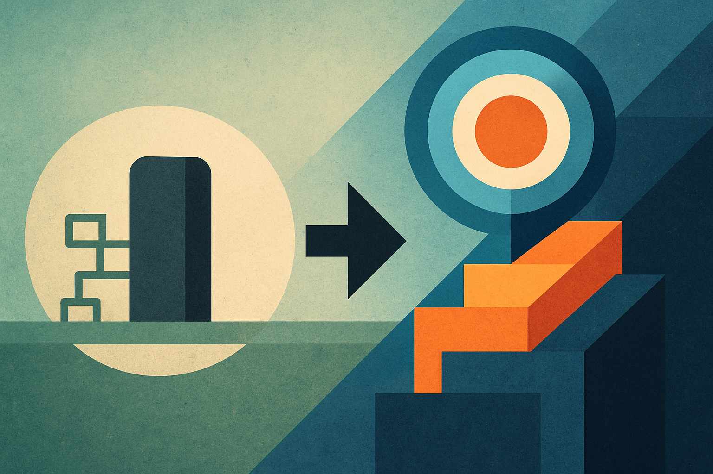

## 서론

지원이 종료된 레거시 프레임워크 위에서 운영되는 서비스, 어떻게 대처하고 계신가요? 전면적인 시스템 교체는 높은 리스크를 동반하기에 쉽게 결정하기 어렵습니다.

저는 현재 지원이 종료된 Django 1.11 버전으로 운영되고 있는 백엔드 시스템의 현대화 과제를 진행하게 되었습니다. 이 글에서는 본격적인 실행에 앞서 수립한 전략과 세부 계획을 정리하고 공유합니다.

## 문제 정의: 왜 변화가 필요한가?

현재 시스템은 Django 1.11 버전으로 운영되면서 다음과 같은 명백한 문제들을 안고 있었습니다.

- 유지보수의 어려움: 낡은 아키텍처로 인해 간단한 기능 수정에도 과도한 공수가 소요되었습니다.

- 보안 취약성: 지원이 종료된 프레임워크는 잠재적인 보안 위협에 그대로 노출됩니다.

- 확장성 부재: 최신 라이브러리 도입이 불가능하여, GraphQL 또는 GRPC 등 현대적인 서비스 요구사항에 대응하기 어려웠습니다. 

- 개발 생산성 저하: 낡은 개발 환경은 개발자의 피로도를 높이고 생산성을 저하시켰습니다.

## 목표: 무엇을 얻고자 하는가?

이번 계획의 목표는 명확합니다.

1. 안정성 확보: 운영 중인 핵심 서비스(v1)의 안정성을 최우선으로 보장한다.

1. 개발 속도 향상: 최신 기술을 도입하여 개발 생산성을 극대화한다.

## 업그레이드 방법은?

처음에는 Poetry를 활용해 Django 1.11→3.2로 업그레이드 하는 방식을 시도했습니다. 

코드도 수정할 부분이 꽤 많았고, DB 스키마의 변경도 일부 필요했지만 어쨌건 Docker를 사용한 로컬 환경에서는 서버를 띄우는데 성공을 했는데, 도저히 운영 서버에 적용할 수가 없었습니다. 

백수십개의 API가 존재하는데, 사용하는지 사용안하는지도 모를뿐더러 이 API들을 테스트 하기 위한 테스트 코드조차 짜여져있지 않았습니다. 

또 업그레이드 작업과 별개로 서버의 유지보수 작업도 끊임없이 이뤄지고 있던 상황이어서, 가능한한 main 브랜치를 pull 받아가며 진행했지만 이 또한 제 업무가 바빠지고 업그레이드 작업이 main job에서 멀어지면서 점차 요원한 일이 되고 말았습니다. 

전면 업그레이드가 현실적으로 불가능한 상황에서, 안정성을 확보하며 점진적으로 시스템을 현대화할 수 있는 대안이 시급했습니다.

## 핵심 전략: 점진적 업그레이드(Strangler Fig Pattern)

핵심 전략은 기존 시스템과 신규 시스템을 공존시키면서 점진적으로 전환하는 것입니다.

- v1 API (Legacy): 현재 운영 중인 Django 1.11 기반의 API를 `api/v1/`으로 유지하고, 긴급 버그 수정을 제외한 신규 개발을 동결합니다.

- v2 API (Modern): 최신 Django LTS 버전 기반의 신규 프로젝트를 생성하고, `api/v2/`로 정의합니다. 모든 신규 및 수정 기능은 v2 API에서 개발합니다.

- 라우팅: 웹 서버(Nginx 등) 단에서 URL 경로(`v1` 또는 `v2`)에 따라 요청을 각 서버로 자동 분기시킵니다.

이러한 구조를 통해 클라이언트는 동일한 도메인을 사용하면서도, 내부적으로는 점차 새로운 시스템으로 트래픽이 옮겨가게 됩니다.

## 세부 실행 계획

### 데이터베이스 (Database)

v1과 v2 서비스는 동일한 운영 데이터베이스를 공유합니다. 이를 통해 데이터 정합성을 유지하고, 두 시스템 간의 데이터 동기화 문제를 원천적으로 제거합니다. 계획 기간 내 스키마 변경이 필요할 경우, 양쪽 프로젝트에 수동으로 반영하여 일관성을 유지하기로 했습니다.

### 인증 (Authentication)

가장 큰 기술적 장애물로 예상되었던 인증 문제는, 비교적 간단하게 해결될 것이라 판단했습니다.

현재 사용 중인 DB 기반 토큰 인증 방식을 그대로 유지하고, v1과 v2 모두 동일한 DB의 토큰 테이블을 조회하여 인증을 처리하는 것으로 계획했습니다. 이를 통해 별도의 인증 시스템 구축이나 세션 공유를 위한 복잡한 과정 없이 SSO(Single Sign-On)를 달성할 수 있을 것이라 판단했습니다.

### 개발 및 배포

- 레포지토리: v2 프로젝트를 위한 신규 레포지토리를 생성합니다.

- 배포: v2 서비스를 위한 별도의 배포 파이프라인(CI/CD)을 구축합니다.

- 라우팅 규칙: 웹 서버에 `api/v1/*` 과 `api/v2/*` 경로에 대한 리버스 프록시(Reverse Proxy) 규칙을 추가합니다.

## 기대 효과 및 다음 단계

이 전략을 통해 우리는 다음과 같은 효과를 기대할 수 있습니다.

- 리스크 최소화: 운영 중인 핵심 서비스를 직접 수정하지 않아 장애 발생 가능성을 최소화합니다.

- 즉각적인 생산성 향상: 개발자들은 신규 기능 개발 시 최신 프레임워크의 장점을 즉시 활용할 수 있습니다.

- 명확한 미래: 낡은 시스템을 점진적으로 폐기하고 새로운 시스템으로 나아갈 수 있는 명확하고 안전한 경로를 확보합니다.

