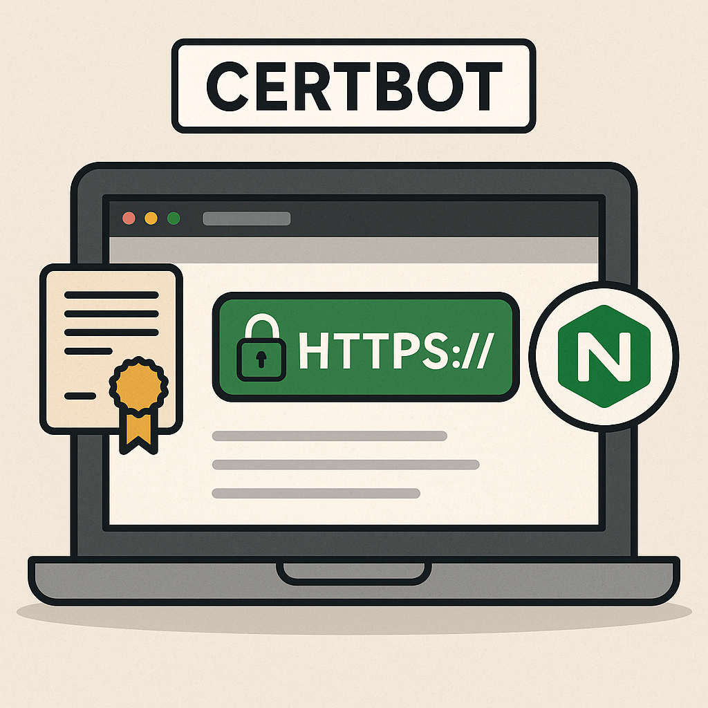
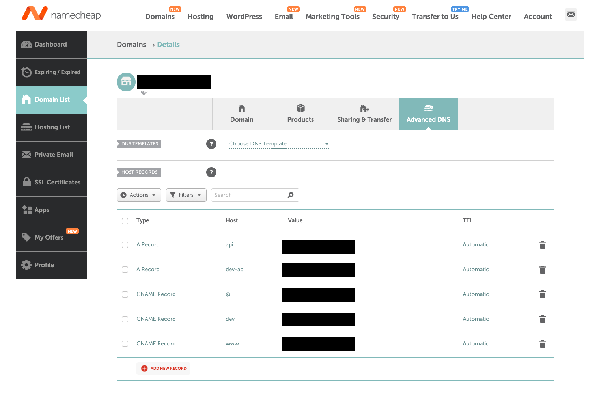

## 서론


        시작이 반이다. 

일단 아무거나 만들기 시작했습니다. 사둔 도메인도 있고.. 일단 서버를 올리기로 해서 올렸습니다(?

이번 글에서는 Namecheap에서 구매한 도메인에 대해, 오라클 클라우드 서버에서 무료 SSL/TLS 인증서를 발급받고, 이를 Nginx와 Certbot을 활용하여 설치 및 관리하는 과정을 기록합니다.

사전에 80번, 443번 포트는 열어둬야 합니다. Oracle Cloud의 경우에는 AWS와 설정 방법이 조금 달라서 헤맸습니다. 

[이 사이트](https://www.yougetsignal.com/tools/open-ports)에서 포트가 제대로 열려있는지 체크할 수 있습니다. 

## Certbot?

Certbot은 Let’s Encrypt에서 제공하는 무료 SSL/TLS 인증서를 쉽게 발급하고 설치할 수 있도록 도와주는 오픈소스 도구입니다.

간단히 요약하면,

- 목적: HTTPS(SSL/TLS) 인증서 자동 발급 및 갱신

- 주요 기능:

    - 인증서 자동 발급

    - 인증서 자동 설치 (웹 서버와 연동)

    - 인증서 자동 갱신

- 지원 서버: Nginx, Apache 등 주요 웹 서버와 연동 가능

- 장점: 무료, 자동화, 사용이 간편함

즉, 웹사이트를 HTTPS로 안전하게 운영하기 위한 인증서를 쉽고 자동으로 처리해주는 도구입니다.

## Certbot을 사용하여 Nginx에 Let's Encrypt 무료 인증서를 설치

### Certbot 및 Nginx 플러그인 설치

우분투 서버에 Certbot과 Certbot의 Nginx 플러그인을 설치해야 합니다. 터미널에서 다음 명령어를 실행합니다. 

```bash
sudo apt update
sudo apt install certbot python3-certbot-nginx -y
```

### Nginx 설정

Certbot을 실행하기 전에, Nginx 설정 파일(`/etc/nginx/sites-available/` 내의 설정 파일)에 인증서를 발급받으려는 도메인(예: `xxx.com` 및 `www.xxx.com`)에 대한 `server_name` 지시어가 올바르게 설정되어 있는지 확인해 주세요.

#### 예시 (`/etc/nginx/sites-available/xxx.com`)

```plain text
server {
    listen 80;
    server_name xxx.com www.xxx.com;

    # ... 나머지 설정 ...
}
```

지금 단계에서는 수동으로 443 (HTTPS) 설정을 추가할 필요가 없습니다. `Certbot --nginx` 플러그인의 가장 큰 장점 중 하나가 바로 이것입니다. Certbot을 실행하여 성공적으로 인증서를 발급받으면, Certbot이 자동으로 이 설정 파일을 수정하여 다음과 같은 작업을 수행합니다.

- `listen 443 ssl;` 지시어 추가

- 발급받은 SSL 인증서와 개인 키 파일 경로(`ssl_certificate`, `ssl_certificate_key`) 설정

- HTTP (80) 요청을 HTTPS (443)로 리디렉션하는 설정 추가

설정을 변경했다면 Nginx 설정을 테스트하고 다시 로드합니다. 

```bash
sudo nginx -t
sudo systemctl reload nginx
```

### Namecheap DNS 설정 변경

메인 관리 메뉴로 이동하여 Advanced DNS를 찾습니다.


A 레코드를 추가합니다. 

- 호스트(Host): `@` (또는 xxx.com)

- 값(Value/Points to): 서버의 공인 IP 주소

- TTL: 기본값 또는 적절한 시간(예: 300초 또는 Auto)

Namecheap의 파킹 페이지(Parking page) 관련 레코드나 다른 불필요한 레코드(특히 A 레코드나 CNAME 레코드)가 있다면 삭제하거나 수정해야 할 수도 있습니다.

### DNS 전파 확인

DNS 설정 변경 사항이 전 세계 인터넷에 퍼지는 데 시간이 걸릴 수 있습니다 (보통 몇 분에서 몇 시간 소요). 다음 명령어를 사용해 DNS 변경 반영 여부를 확인할 수 있습니다. 

```bash
dig xxx.com +short
```

### Certbot 실행하여 인증서 받기

Certbot을 실행하여 Let's Encrypt 인증서를 자동으로 받고 Nginx 설정을 구성합니다.

```bash
sudo certbot --nginx -d xxx.com -d www.xxx.com
```

- `d` 옵션 뒤에 인증서를 적용할 도메인 이름을 지정합니다. www가 붙은 도메인과 붙지 않은 도메인 모두를 포함하는 것이 좋습니다.

- 실행 과정에서 이메일 주소를 입력하고 서비스 약관에 동의하는 등의 몇 가지 질문이 나올 수 있습니다.

- HTTP 트래픽을 HTTPS로 자동으로 리디렉션할지 묻는 질문이 나오면, 일반적으로 '2' (Redirect)를 선택하는 것이 보안상 좋습니다.

### Nginx 설정 수정

8000번 포트에서 돌고 있는 서버를 위해 아래와 같이 [리버스 프록시](https://sharknia.github.io/Nginx를-활용한-Reverse-Proxy-구현1)를 설정해주고, http에서는 자동으로 https로 리다이렉트 되는 설정도 해주었습니다. 

```plain text
server {
    listen 80;
    server_name xxx.com;

    return 301 https://$host$request_uri;
}

server {
    listen 443 ssl http2;
    server_name xxx.com;

    ssl_certificate     /etc/letsencrypt/live/xxx.com/fullchain.pem;     # managed by Certbot
    ssl_certificate_key /etc/letsencrypt/live/xxx.com/privkey.pem;       # managed by Certbot
    include             /etc/letsencrypt/options-ssl-nginx.conf;             # managed by Certbot
    ssl_dhparam         /etc/letsencrypt/ssl-dhparams.pem;                   # managed by Certbot

    access_log  /var/log/nginx/xxx.com.access.log;
    error_log   /var/log/nginx/xxx.com.error.log;

    location / {
        proxy_pass         http://127.0.0.1:8000;
        proxy_set_header   Host              $host;
        proxy_set_header   X-Real-IP         $remote_addr;
        proxy_set_header   X-Forwarded-For   $proxy_add_x_forwarded_for;
        proxy_set_header   X-Forwarded-Proto $scheme;
    }
}
```

### 자동 갱신 확인

Certbot 패키지를 설치하면 대부분의 시스템에서 자동으로 갱신 작업이 설정됩니다 (보통 `cron` 작업이나 `systemd` 타이머를 통해). 다음 명령어로 자동 갱신이 제대로 작동하는지 테스트해 볼 수 있습니다 (실제로 갱신하지는 않습니다).

```bash
sudo certbot renew --dry-run
```

오류 없이 "Congratulations, all simulated renewals succeeded" 메시지가 나오면 자동 갱신 설정이 정상적으로 된 것입니다. Let's Encrypt 인증서는 90일마다 만료되므로 자동 갱신이 중요합니다.


