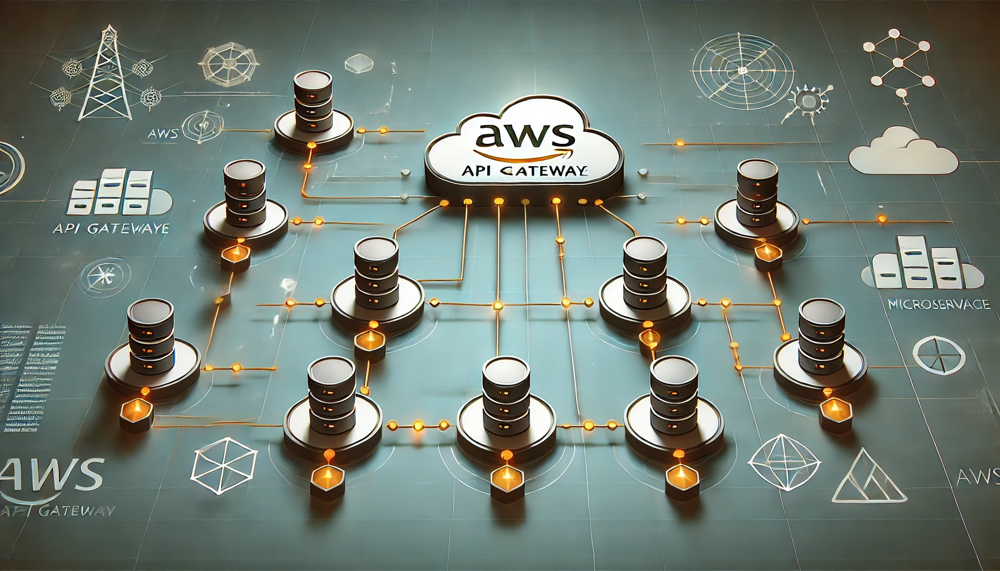

## 서론

현재 회사에서 MSA 형태의 백엔드 서비스를 운용중입니다. 다만 지금은 프론트에서 API Gateway 없이 각 마이크로서비스를 직접 호출하고 있습니다. 

엔드포인트 통합 작업을 위해 인프라를 고민중입니다. 유지보수가 편해야 하며, 작업공수가 가장 적게 들어가는 방법을 선택하려고 합니다. 

또한 비용의 추가는 가능한 한 줄이려고 합니다. 

## AWS API Gateway

### 소개

AWS API Gateway는 RESTful API, WebSocket API 및 HTTP API를 생성, 배포 및 관리할 수 있도록 지원하는 완전 관리형 서비스입니다.

#### API 라우팅 및 관리

- 클라이언트 요청을 AWS Lambda, EC2, ECS, EKS, DynamoDB, 다른 API 등으로 라우팅

- 요청 검증, 요청 변환, 응답 변환 등의 기능 제공.

- REST API, HTTP API, WebSocket API 지원.

#### 보안 및 인증

- AWS IAM, Cognito, Lambda Authorizer를 통한 인증 및 권한 관리 가능.

- JWT, OAuth 2.0 지원.

#### 트래픽 관리 및 스케일링

- 자동 스케일링 지원 (트래픽 증가 시 자동 확장).

#### 로깅 및 모니터링

- AWS CloudWatch, AWS X-Ray, OpenTelemetry 등을 활용한 API 성능 모니터링 가능.

- API 호출량, 응답 시간, 오류율 분석 가능.

### 비용

[https://aws.amazon.com/ko/api-gateway/pricing/](https://aws.amazon.com/ko/api-gateway/pricing/)

#### 비용 비교 (아시아 태평양 리전 기준)

- REST API

    - 백만 건당 $3.50

    - 캐싱(0.5GB 기준) 사용 시 월 $14.40 추가 비용 발생

- HTTP API

    - 백만 건당 $1.23 (REST API 대비 65% 저렴)

    - 캐싱 미지원 (CloudFront 활용 필요)

#### REST API와 HTTP API

HTTP API는 저렴하지만 (백만 건당 $1) 캐싱 기능을 지원하지 않고 VPC 연결이 불가능합니다. 또 JWT 기반 인증이 가능하지만 Cognito, Lambda Authorizer를 활용한 고급 인증기능은 불가능합니다. 

VPC 연결이 불가능하다는 점이 치명적으로, 보안을 위해 이상적인 아키텍쳐는 AWS API Gateway만 Public으로 유지한 채 다른 마이크로 서비스는 private 으로 설정하는 것인데, 이렇게 아키텍쳐를 꾸밀 경우 AWS PrivateLink 또는 VPC 링크를 지원하지 않는 HTTP API로는 대응이 불가능합니다. 

REST API는 VPC 링크(VPC Link)를 지원하므로, Private 네트워크 내의 ECS/EKS/EC2와 연결할 수 있습니다.

그럼에도 현재 아키텍쳐를 변경할 계획이 없어 Private 네트워크 접근이 필요 없거나, 인증 서버를 따로 구현해 단순히 API Gateway에서는 JWT 인증만 필요한 경우에는 훨씬 저렴한 HTTP API를 이용하는 것도 좋은 선택이 될 수 있습니다. 

다만 HTTP API에서 REST API로 변환하는 것은 자동 변환 기능이 없어 번거로운 작업이 될 수 있습니다. 

#### REST API vs HTTP API 선택 기준 정리

✅ REST API를 선택해야 하는 경우

- Private 네트워크(VPC)에 배포된 ECS/EKS/EC2와 연결해야 한다면

- Cognito, Lambda Authorizer 등 고급 인증 기능이 필요하다면

- API Gateway의 캐싱 기능을 사용해야 한다면

✅ HTTP API를 선택할 수 있는 경우

- 기존 아키텍처를 변경할 계획이 없고, Private 네트워크 접근이 필요 없다면

- JWT 기반 인증만 필요하고, Cognito 등 추가 인증이 필요 없다면

- 비용을 최대한 절감해야 한다면 (REST API 대비 65% 저렴)


❗ 주의: HTTP API에서 REST API로 변경하는 자동 변환 기능이 없으므로, 추후 변경이 필요할 경우 번거로운 작업이 될 수 있음.

### Response 응답 꼴의 가공

REST API에서 제공하는 Mapping Templates 기능을 사용하지 않으면 백엔드에서 내보내는 응답 꼴 그대로 리턴합니다. 

✔ HTTP API 사용 시 → 추가 설정 없이 기존 요청/응답 그대로 전달됨
✔ REST API 사용 시 → Mapping Templates 사용 금지
✔ API Gateway 오류 응답을 기존 백엔드 응답과 동일하게 설정

이 조건을 만족하면 프론트에서 엔드포인트만 바꾸면 문제없이 작동합니다. 

#### Mapping Templates

Mapping Templates은 API Gateway에서 요청과 응답을 변환하는 기능으로, REST API에서만 지원하며, HTTP API에서는 사용할 수 없습니다. 기존 API의 응답 구조를 변경하지 않고 통일된 형식으로 응답을 제공할 수 있는 고급 기능으로, 현재 저희 상황에서는 오히려 필요하지 않은 기능입니다. 

### Swagger

API Gateway의 OpenAPI Export 기능을 사용하면 Swagger 적용이 가능합니다. API Gateway에서 OpenAPI 3.0 형식으로 API 명세를 내보낼 수 있으며, 이를 Swagger UI에서 그대로 활용할 수 있습니다.

AWS S3 + CloudFront를 이용하여 Swagger UI를 정적 웹사이트로 배포할 수 있습니다. API Gateway 수정 이벤트를 감지해 CI/CD 파이프라인을 활용하면 API 변경 시 자동으로 Swagger 문서를 업데이트할 수 있습니다.

### 로깅

Elastic APM 적용은 쉽지 않습니다. Elastic APM 에이전트를 API Gateway 자체에 직접 설치하는 것은 불가능하므로, 만약 적용을 하려면 Lambda, OpenTelemetry, X-Amzn-Trace-Id 등을 활용해 우회적으로 API Gateway 트레이싱이 가능하긴 합니다. 

다만 API Gateway는 기본적으로 요청을 Lambda, ECS, EC2 등으로 라우팅하는 역할만 하며, 애플리케이션 로직을 처리하지 않고 성능 병목이나 오류는 보통 API Gateway 이후의 서비스에서 발생하기 때문에 APM을 적용할 필요성이 낮습니다.

그럼에도 API Gateway의 로그는 활용성이 높을 수 있지만 CloudWatch를 활용하면 API Gateway 호출량 및 응답 시간 분석이 가능하기 때문에 결국 API Gateway에 직접 APM을 적용할 필요는 거의 없다고 생각됩니다. 

### 구현 및 배포

terraform 또는 AWS CloudFormation을 사용하면 API Gateway 설정을 코드로 정의 가능하고, YAML 파일을 수정할 때에 CI/CD를 통해 자동으로 배포 가능합니다. 

추후 api가 수정된다면 yaml 파일만 수정해서 푸시하면 자동 배포 되도록 CI/CD 구성이 가능합니다. 

#### 예시 yaml

<details>
<summary>예제</summary>

```yaml
openapi: "3.0.1"
info:
  title: "API Gateway"
  version: "1.0"
paths:
  /api/users/:
    post:
      summary: "Create a new user"
      requestBody:
        required: true
        content:
          application/json:
            schema:
              type: object
              properties:
                name:
                  type: string
                email:
                  type: string
      responses:
        "200":
          description: "User created successfully"
          content:
            application/json:
              schema:
                type: object
                properties:
                  success:
                    type: boolean
                  message:
                    type: string
      x-amazon-apigateway-integration:
        type: "http_proxy"
        httpMethod: "POST"
        uri: "https://api.example.com/users/"
        passthroughBehavior: "when_no_match"

  /api/users/{user_id}/:
    put:
      summary: "Update user information"
      parameters:
        - name: user_id
          in: path
          required: true
          schema:
            type: integer
      requestBody:
        required: true
        content:
          application/json:
            schema:
              type: object
              properties:
                name:
                  type: string
                email:
                  type: string
      responses:
        "200":
          description: "User updated successfully"
          content:
            application/json:
              schema:
                type: object
                properties:
                  success:
                    type: boolean
                  message:
                    type: string
      x-amazon-apigateway-integration:
        type: "http_proxy"
        httpMethod: "PUT"
        uri: "https://api.example.com/users/{user_id}/"
        passthroughBehavior: "when_no_match"

    delete:
      summary: "Delete user"
      parameters:
        - name: user_id
          in: path
          required: true
          schema:
            type: integer
      responses:
        "200":
          description: "User deleted successfully"
          content:
            application/json:
              schema:
                type: object
                properties:
                  success:
                    type: boolean
                  message:
                    type: string
      x-amazon-apigateway-integration:
        type: "http_proxy"
        httpMethod: "DELETE"
        uri: "https://api.example.com/users/{user_id}/"
        passthroughBehavior: "when_no_match"

  /api/orders/:
    post:
      summary: "Create a new order"
      requestBody:
        required: true
        content:
          application/json:
            schema:
              type: object
              properties:
                user_id:
                  type: integer
                product:
                  type: string
                price:
                  type: number
      responses:
        "200":
          description: "Order created successfully"
          content:
            application/json:
              schema:
                type: object
                properties:
                  success:
                    type: boolean
                  message:
                    type: string
      x-amazon-apigateway-integration:
        type: "http_proxy"
        httpMethod: "POST"
        uri: "https://api.example.com/orders/"
        passthroughBehavior: "when_no_match"

  /api/orders/{order_id}/:
    put:
      summary: "Update order information"
      parameters:
        - name: order_id
          in: path
          required: true
          schema:
            type: integer
      requestBody:
        required: true
        content:
          application/json:
            schema:
              type: object
              properties:
                product:
                  type: string
                price:
                  type: number
      responses:
        "200":
          description: "Order updated successfully"
          content:
            application/json:
              schema:
                type: object
                properties:
                  success:
                    type: boolean
                  message:
                    type: string
      x-amazon-apigateway-integration:
        type: "http_proxy"
        httpMethod: "PUT"
        uri: "https://api.example.com/orders/{order_id}/"
        passthroughBehavior: "when_no_match"

    delete:
      summary: "Delete order"
      parameters:
        - name: order_id
          in: path
          required: true
          schema:
            type: integer
      responses:
        "200":
          description: "Order deleted successfully"
          content:
            application/json:
              schema:
                type: object
                properties:
                  success:
                    type: boolean
                  message:
                    type: string
      x-amazon-apigateway-integration:
        type: "http_proxy"
        httpMethod: "DELETE"
        uri: "https://api.example.com/orders/{order_id}/"
        passthroughBehavior: "when_no_match"

```


</details>

### AWS CDK(파이썬)를 사용한  API Gateway 관리

AWS CDK는 인프라(AWS 리소스)를 코드로 정의하고 배포할 수 있는 Infrastructure as Code(IaC) 도구입니다. AWS 리소스를 YAML/JSON 같은 설정 파일이 아니라, Python, TypeScript, Java 등 프로그래밍 언어로 정의 가능하게 해줍니다. AWS CloudFormation을 기반으로 동작하며, 코드만 작성하면 자동으로 AWS 리소스를 생성하고 관리가 가능합니다. 

<details>
<summary>REST API 생성 예시 코드 (요청 모델, 응답 모델 포함)</summary>

이 예시 코드는 문서화를 위해 요청/응답 모델을 완벽하게 포함한 것입니다. 

```python
from aws_cdk import core
import aws_cdk.aws_apigateway as apigateway

class ApiGatewayStack(core.Stack):
    def __init__(self, scope: core.Construct, id: str, **kwargs):
        super().__init__(scope, id, **kwargs)

        # API Gateway 생성
        api = apigateway.RestApi(
            self, "MyApi",
            rest_api_name="My API",
            description="API Gateway with Request & Response Models",
        )

        # 요청 모델 (Request Model)
        user_request_model = api.add_model(
            "UserRequestModel",
            content_type="application/json",
            schema=apigateway.JsonSchema(
                schema=apigateway.JsonSchemaVersion.DRAFT4,
                title="UserRequest",
                type=apigateway.JsonSchemaType.OBJECT,
                properties={
                    "name": apigateway.JsonSchema(type=apigateway.JsonSchemaType.STRING),
                    "email": apigateway.JsonSchema(type=apigateway.JsonSchemaType.STRING),
                },
                required=["name", "email"]
            ),
        )

        # 응답 모델 (Response Model)
        user_response_model = api.add_model(
            "UserResponseModel",
            content_type="application/json",
            schema=apigateway.JsonSchema(
                schema=apigateway.JsonSchemaVersion.DRAFT4,
                title="UserResponse",
                type=apigateway.JsonSchemaType.OBJECT,
                properties={
                    "success": apigateway.JsonSchema(type=apigateway.JsonSchemaType.BOOLEAN),
                    "message": apigateway.JsonSchema(type=apigateway.JsonSchemaType.STRING),
                }
            ),
        )

        # 요청 검증기 (Request Validator)
        request_validator = api.add_request_validator(
            "RequestValidator",
            validate_request_body=True,
            validate_request_parameters=False,
        )

        # Users 리소스 생성
        users_resource = api.root.add_resource("api").add_resource("users")

        # POST 요청 (Create User) + 요청/응답 스키마 추가
        users_resource.add_method(
            "POST",
            apigateway.Integration(
                type=apigateway.IntegrationType.HTTP_PROXY,
                integration_http_method="POST",
                uri="https://api.example.com/users/"
            ),
            request_validator=request_validator,  # 요청 검증기 추가
            request_models={"application/json": user_request_model},  # 요청 모델 추가
            method_responses=[
                apigateway.MethodResponse(
                    status_code="200",
                    response_models={"application/json": user_response_model}
                )
            ]
        )

        # API Gateway 엔드포인트 출력
        core.CfnOutput(self, "ApiEndpoint", value=api.url)

```


</details>

<details>
<summary>REST API 생성 예시 코드 (모델 정의 제외하고 단순화)</summary>

요청 모델, 응답 모델을 문서화를 위해 명확히 정의하면 유지보수 부담이 커질 수 있습니다. 아래처럼 정의하면 문서화를 조금 포기하고 대신 효율적인 유지보수가 가능합니다. 

```python
from aws_cdk import core
import aws_cdk.aws_apigateway as apigateway

class ApiGatewayStack(core.Stack):
    def __init__(self, scope: core.Construct, id: str, **kwargs):
        super().__init__(scope, id, **kwargs)

        # API Gateway 생성 (간단한 설정)
        api = apigateway.RestApi(
            self, "MyApi",
            rest_api_name="Simple API",
            description="Minimal API Gateway Configuration"
        )

        # ======================
        # Users API
        # ======================
        users_resource = api.root.add_resource("api").add_resource("users")

        # /api/users/ - POST (Create User)
        users_resource.add_method(
            "POST",
            apigateway.Integration(
                type=apigateway.IntegrationType.HTTP_PROXY,
                integration_http_method="POST",
                uri="https://api.example.com/users/"
            )
        )

        # ======================
        # Orders API 
        # ======================
        orders_resource = api.root.add_resource("api").add_resource("orders")

        # /api/orders/ - POST (Create Order)
        orders_resource.add_method(
            "POST",
            apigateway.Integration(
                type=apigateway.IntegrationType.HTTP_PROXY,
                integration_http_method="POST",
                uri="https://api.example.com/orders/"
            )
        )

        # API Gateway 엔드포인트 출력
        core.CfnOutput(self, "ApiEndpoint", value=api.url)

```


</details>

외부에 제공해야 하는 api의 경우라면 요청 모델, 응답 모델까지 명확하게 정의해야 합니다. 그런 경우가 아니라면 선택의 여지가 있습니다. 

현재 예시 코드는 REST API 배포를 위한 것으로 HTTP API의 경우에는 코드가 달라집니다. 

<details>
<summary>HTTP API 생성 예시 코드</summary>

```python
import aws_cdk.aws_apigatewayv2 as apigatewayv2
import aws_cdk.aws_apigatewayv2_integrations as integrations

class ApiGatewayStack(core.Stack):
    def __init__(self, scope: core.Construct, id: str, **kwargs):
        super().__init__(scope, id, **kwargs)

        # HTTP API 생성
        api = apigatewayv2.HttpApi(self, "MyHttpApi", api_name="Simple HTTP API")

        # Users 엔드포인트 추가
        api.add_routes(
            path="/api/users",
            methods=[apigatewayv2.HttpMethod.POST],
            integration=integrations.HttpUrlIntegration(
                "UsersService",
                integration_url="https://api.example.com/users/"
            )
        )

```


</details>

#### AWS CDK의 배포

AWS CLI를 활용해 수동으로 배포할 수 있습니다. 

```bash
cdk deploy
```

를 사용해 배포합니다.

`cdk synth` 명령어를 사용해 CloudFormation 템플릿을 미리 확인할 수 있습니다. 

#### 예상되는 어려움

위의 예시 코드를 래핑을 해서 최대한 유지보수가 쉽게 코드는 작성하겠지만, 결국 각 마이크로 서비스를 수정한 이후에 이 프로젝트를 수정하는 별도의 작업을 추가로 해줘야 합니다. 

### Django DRF + `drf-spectacular` + CI/CD를 활용한 API Gateway 관리

`drf-spectacular`는 Django DRF에서 OpenAPI 3.0 문서를 자동 생성해주는 라이브러리입니다. Swagger UI, Redoc, Postman 등에서 활용할 수 있는 API 문서를 제공하는데, 이 OpenAPI YAML 파일을 AWS API Gateway가 OpenAPI Import 기능을 지원하기 때문에 활용할 수 있습니다. 

#### S3를 활용한 OpenAPI 문서의 관리

각 마이크로서비스에서 `drf-spectacular` 를 사용해 YAML 파일을 생성합니다. 

```bash
python service1/manage.py spectacular --file service1_openapi.yaml
```

예를 들어 service1에서 api의 수정/삭제 등등이 일어나면 service1\_openapi.yaml을 생성합니다. 

S3 버킷(`my-api-docs`)에 각 서비스의 OpenAPI 문서를 저장합니다. 

```bash
aws s3 cp service1_openapi.yaml s3://my-api-docs/service1_openapi.yaml
```

각 마이크로서비스의 문서를 병합해 최종 문서를 완성합니다. 

```bash
openapi-merge-cli -i s3://my-api-docs/service1_openapi.yaml s3://my-api-docs/service2_openapi.yaml -o merged_openapi.yaml
```

병합된 문서로 API Gateway를 업데이트 합니다. 

```bash
aws apigateway import-rest-api --body file://merged_openapi.yaml --rest-api-id ${{ secrets.API_GATEWAY_ID }}
```

#### 예상되는 어려움

1. 문서 병합의 까다로움

    엔드포인트가 같을 경우 병합에서 반드시 문제가 발생하여 특별히 신경써야 합니다. 또 각 API의 인증 방법이 다를 경우 해당 방법은 적용이 불가능하며, 이 외에도 응답 스키마, 공통 컴포넌트 등에서도 병합시 문제가 발생할 가능성이 있습니다. 

1. 각 서비스에서 추가 작업이 필요할 수 있음

    혹시 swagger 생성을 위한 밑작업이 잘 안되어있다면 해당 작업을 위해 추가 작업이 필요할 수 있습니다. 또 엔드포인트가 현재 것을 유지하면서 추가 또는 수정 되는 것이 아니라 AWS API Gateway로 결국 엔드포인트가 변경이 되는 것으로 이로 인한 추가 공수가 다시 발생할 수 있습니다. 

위의 문제로 인해 실제 작업시에는 AWS CDK를 사용하는 것보다 예상하지 못한 문제가 발생할 가능성이 커보입니다. 

## AWS API Gateway 구현 및 배포 결론

마이크로 서비스 수정 후 추가적으로 코드 작업이 필요하다는 단점이 있지만, 그럼에도 불구하고 `drf-spectacular`을 활용한 OpenAPI 병합 방식은 가능하지만, 유지보수성과 API 변경 관리를 고려할 때 AWS CDK가 더 적합한 선택이라고 생각합니다. 

## 직접 구현과의 비교

| 비교 항목 | **직접 구현 (Django + DRF)** | **AWS API Gateway** |
| --- | --- | --- |
| **트래픽 처리** | uWSGI/Gunicorn 조정 필요 | 자동 확장(Auto Scaling) |
| **성능 최적화** | Keep-Alive, Connection Pooling 직접 설정 필요 | AWS에서 자동 최적화 |
| **로깅 & 모니터링** | Elastic APM 활용 | CloudWatch, X-Ray |

## Kong API Gateway과의 비교

### Kong API Gateway 소개

Kong은 오픈소스로 제공되는 고성능 API Gateway 및 마이크로서비스 관리 플랫폼입니다. 분산된 API 트래픽을 제어하고, 로드 밸런싱, 인증, 모니터링, 캐싱 등의 기능을 제공합니다.

### **Kong을 사용하면 좋은 경우**

- 온프레미스 환경에서 API Gateway가 필요할 때

- AWS 이외의 멀티 클라우드 환경을 고려할 때

