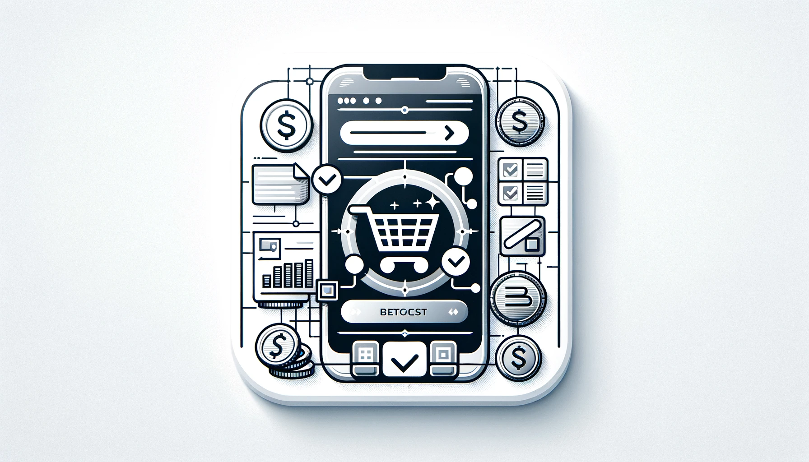

## 서론

현재 개발을 준비중인 서비스에는 인앱결제가 포함되어있습니다. 여태까지 운이 좋았던 것인지, 운이 나빴던 것인지 아무튼 인앱결제를 구현한 적이 없어서 구현 전에 역시 미리 서치해두려고 합니다. 

이 과정은 크게 각 플랫폼별 인앱 결제 API 연동, 결제 요청 및 검증, 결제 성공 시 내부 재화 충전, 그리고 결제 실패 및 취소 처리로 나눌 수 있습니다.

개발 예정 서비스에서는 내부 재화를 인앱결제로 구매하고 기타 아이템들은 내부 재화로 구매할 수 있게 만들 예정입니다.

## 내부 재화 구매 프로세스

구매는 결국 어떻게 이뤄질까? 앱 사용자가 상품 구매를 한다고 하고 어떤 흐름으로 결제가 이뤄져 어떻게 사용자가 내부 재화를 가지게 되는지를 먼저 그려보겠습니다. 

### 1. 사용자가 앱에서 내부 재화 구매를 선택

#### FE

사용자가 앱을 열고, 상점 페이지로 이동해 내부 재화를 구매하고자 하는 상품을 선택합니다. 

앱은 사용자가 선택한 상품의 정보를 보여주고 구매 버튼을 노출합니다. 

#### BE

백엔드는 상품 정보를 제공합니다. 

### 2. 사용자가 구매 버튼을 누름

#### FE

구매 버튼이 눌러지면 앱은 해당 플랫폼의 인앱 결제 프로세스를 시작합니다. (iOS : StoreKit, Android : Google Play Billing Libarary)

사용자는 구매 확인, 결제 방법 선택(등록된 결제 수단 사용 등) 등의 단계를 수행합니다. 

### 3. 결제 프로세스 진행

#### FE

사용자는 결제 과정을 진행하며 이 과정은 앱스토어세서 직접 관리됩니다. 

과정이 종료된 후, 결제 성공/실패/취소 등의 결과가 어플리케이션으로 전달됩니다.

#### BE

결제가 성공한 경우, 어플리케이션에서 결제 성공 정보와 결제 영수증을 백엔드로 전송합니다. 

백엔드는 영수증 정보를 플랫폼의 서버(애플 혹은 구글)에 검증 요청을 합니다. 

검증이 통과하면 백엔드는 사용자의 계정에 해당하는 내부 재화를 충전하고 충전 결과를 앱에 알립니다. 

### 4 구매 완료 및 내부 재화 충전

#### FE

백엔드로부터 내부 재화 충전 성공 응답을 받으면 앱은 사용자 인터페이스를 업데이트하여 새로운 재화 잔액을 표시합니다. 

사용자에게 구매 성공 알림을 제공할수도 있습니다. 

#### BE

내부 재화 충전과 관련된 모든 정보를 데이터베이스에 기록합니다. 

구매 내역을 로깅하여 추후 문제 해결이나 사용자 문의에 대응하도록 할 수도 있습니다. 

## 어플리케이션 안에서의 환불 요청 프로세스

환불에도 대응을 해야 할 것이므로, 환불에 관해서도 프로세스를 미리 서치했습니다. 

### 1. 사용자가 환불을 요청

#### FE

사용자는 앱 내에서 환불을 요청할 수 있는 UI를 통해 환불을 신청합니다. 앱은 사용자의 환불 요청 정보를 백엔드로 전송합니다. 

### 2. 환불 요청 검증

#### BE

사용자의 구매 내역과 환불 요청을 검증합니다. 구매 영수증, 환불 정책 준수 등을 검증합니다. 

환불 가능 여부를 결정합니다. 

### 3.  환불 처리

#### BE

환불이 가능할 경우, 백엔드는 환불 처리를 진행합니다. 내부 재화를 차감합니다. 

이후 실제 결제가 이루어진 플랫폼(애플, 구글 등)을 통해 환불을 진행해야 합니다. 결제 플랫폼에 환불 요청을 전송합니다. 

### 4. 환불 결과 통지

#### FE

백엔드로부터 환불 처리 결과를 전송받습니다. 사용자에게 이를 통지합니다. 

## 앱스토어에서 직접 환불 처리 시 프로세스

환불에는 앱 내에서 진행하는 경우와 플랫폼을 통해 환불이 진행되는 경우 두 가지가 있습니다. 위에서 알아본 방법은 첫번째 방법이며, 여기서 알아볼 방법은 두 번째 방법입니다. 두 번째 방법의 경우에는 앱 개발자의 개입이 불가능하게 진행이 됩니다.

### 1. 앱스토어에서 환불 처리

사용자가 앱스토어의 고객 지원을 통해 환불을 요청합니다. 앱스토어는 이를 진행합니다. 

### 2. 환불 통지 수신

#### BE

앱스토어는 환불 처리 결과를 앱의 백엔드에 통지합니다. 이는 대부분 웹훅 형태로 제공됩니다. 

백엔드는 앱스토어로부터 환불 통지를 받고 해당 정보를 검증합니다. 검증 과정에는 통지의 유효성 확인, 환불된 결제와 연관된 사용자 및 내부 재화 찾기 등이 포함됩니다. 

### 3. 내부 재화 상태 업데이트

#### BE

환불 통지가 검증된다면, 사용자의 내부 재화 상태를 업데이트합니다. 

## 결론

길게 적게 되었지만 사실 제가 궁금했던 부분을 “실제 결제 과정을 어디에서 담당하냐” 였습니다. 결제 과정은 앱스토어에서 직접 담당하므로 결국 인앱결제에 있어서 백엔드가 해야 할 가장 핵심 프로세스는 영수증 검증인것으로 보입니다.

물론, 금전을 직접 다루는 중요한 과정이므로 보안 등의 사항에 특별히 유념해서 더 신경써야 하겟습니다. 

오늘은 이론적인 부분만 미리 살펴봤습니다. 언제나 그렇지만 실재 구현에 들어가면 항상 예외적인 상황이 발생합니다. 나중에 구현을 할 경우에 그 부분에 대해서도 자새히 기록을 해보려고 합니다. 

